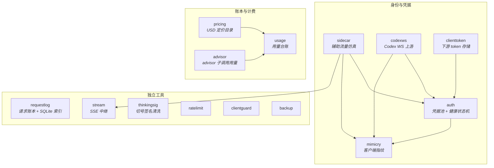
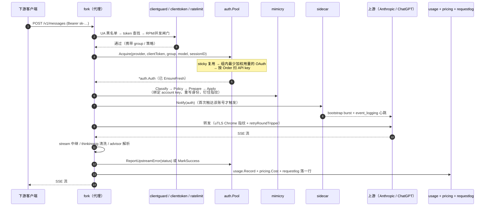

# 架构总览

> [← Wiki 首页](Home)

## 它是什么

`cc-core` 是一个**纯 Go 库**（`go 1.25`），没有 `main`、没有 Makefile、没有仓内 CI。它被两个反向代理分叉消费：

| 分叉 | 本地路径 | 定位 |
|---|---|---|
| **CPA-Claude** | `/home/wjs/Documents/project/Go/CPA-Claude` | 更精简的那个 |
| **hypitoken** | `/home/wjs/Documents/project/Go/hypitoken` | 多一层 SaaS / shop 商品体系 |

> 两个 Go module 名字**都**叫 `CPA-Claude`（历史遗留），容易混淆；它们都 `import github.com/wjsoj/cc-core`。

**放进 cc-core 的判据**：凡是承载**身份、凭据、计费、指纹**的逻辑，都必须放在这里 —— 这些是"必须与真实客户端字节一致"的部分，一旦让两个分叉各自维护就会漂移，而漂移的代价是账号被判定为非官方客户端。反过来，admin UI、代理接线、业务逻辑留在各自分叉里，允许分歧。

详见 [发布流程与下游集成](Release)。

---

## 包依赖图

**无循环依赖，每个包可独立测试。** 所有包都避免 HTTP 框架锁定（只用 `net/http`，不引入 gin/echo）。

> ⚠️ `README.md` 里的分层图是早期版本，没有画出 `auth → mimicry`、`sidecar → auth/mimicry/stream`、`codexws → auth/mimicry` 这几条边，也没标 `requestlog` 现在依赖 `modernc.org/sqlite`。以本页为准。

---

## 包一览

行数统计（非测试 / 测试，`wc -l`，2026-08-07）：

| 包 | 源码 | 测试 | 职责 | 页面 |
|---|---:|---:|---|---|
| `auth` | 6373 | 2284 | 凭据调度、健康状态机、OAuth 登录与刷新、uTLS 传输、上游探针 | [调度与健康](Auth-Pool) · [登录与探针](Auth-Login-Codex) |
| `requestlog` | 2774 | 1320 | 每请求一行 JSONL + 派生 SQLite 索引与预汇总立方体 | [Requestlog](Requestlog) |
| `mimicry` | 2479 | 1628 | Claude Code / Codex 客户端指纹（头 + 体 + 身份派生） | [Mimicry](Mimicry) |
| `sidecar` | 1375 | 725 | 真实客户端启动时的 bootstrap burst 与心跳复刻 | [Sidecar](Sidecar) |
| `usage` | 1084 | 616 | 每凭据 / 每 client token 的用量台账、计费幂等 | [Billing](Billing) |
| `pricing` | 465 | 281 | `(provider, model) → USD`，四级 fallback | [Billing](Billing) |
| `thinkingsig` | 463 | 359 | 中途切号检测 + `thinking` 签名清洗与恢复 | [Transports](Transports) |
| `clienttoken` | 444 | 299 | 下游客户端 token 与其策略（并发、RPM、周额度、组） | [Billing](Billing) |
| `backup` | 520 | 140 | 关键 SQLite / 状态的异地 NaCl 加密快照 | [Transports](Transports) |
| `stream` | 297 | 298 | 与框架无关的 SSE 中继（keepalive / 懒提交 / 终止检测） | [Transports](Transports) |
| `codexws` | 202 | 77 | Codex over WebSocket 上游传输 | [Transports](Transports) |
| `clientguard` | 144 | 90 | 入口 User-Agent 黑名单 | [Billing](Billing) |
| `ratelimit` | 135 | 101 | 按 key 的 RPM + 并发计数器（策略留给调用方） | [Billing](Billing) |
| `advisor` | 126 | 93 | 解析 `message_delta.usage.iterations[]`（advisor 子调用计费） | [Billing](Billing) |
| `crack/` | — | — | 抓包档案：所有指纹常量的事实来源（非 Go 包） | [Crack](Crack) |

外部依赖（直接）：

| 包 | 依赖 |
|---|---|
| `auth` | `refraction-networking/utls`、`andybalholm/brotli`、`sirupsen/logrus` |
| `mimicry` | `cespare/xxhash/v2` |
| `requestlog` | `modernc.org/sqlite`（纯 Go，无 cgo）、`logrus` |
| `backup` | `minio/minio-go/v7`、`modernc.org/sqlite`、`golang.org/x/crypto`（NaCl） |
| `codexws` | `gorilla/websocket` |
| `stream` | `andybalholm/brotli` |

---

## 一次请求的生命周期

下面是分叉侧代理转发一次 Claude Code 请求时，各个包的介入顺序。cc-core 只提供其中的机制，编排在分叉里。

**几个容易忽略的耦合点**：

- **第 4 步的 `sessionID`** 决定粘性槽位的粒度：同一用户多开窗口会被分散到不同凭据上。见 [Auth-Pool](Auth-Pool)。
- **第 7 步（prepare/apply）失败绝不能触发凭据 failover** —— 那是本地准备错误，跟凭据无关。见 [Mimicry](Mimicry)。
- **第 8 步只对 OAuth 触发**，API-key 凭据永远不发 sidecar 流量。见 [Sidecar](Sidecar)。
- **第 12 步的错误分类**是整个系统最脆的一环：把 h2 连接死亡误判成凭据失败，会在一秒内把整个池打黑。见 [Auth-Pool](Auth-Pool) → 瞬时错误 vs 凭据错误。
- **第 13 步的模型名如果不在 `pricing` 目录里，会按 0 美元计费**，而且不会报错。见 [Billing](Billing)。

---

## 稳定性矩阵

| 包 | API 稳定性 | 备注 |
|---|---|---|
| `auth` | **stable** | 两个生产分叉长期验证；行为常量的改动需配测试 |
| `thinkingsig` | **stable** | 每轮对话都走，长期未变 |
| `usage` | **stable** | `state.json` 线格式自 cc-core 之前就没变过 |
| `pricing` | **stable** | 内置目录会增长，签名不变 |
| `requestlog` | **stable** | Record 线格式是跨分叉的统一超集；索引 schema 只追加迁移，`OpenStoreForRead` 会拒绝版本不匹配的库 |
| `clienttoken` | **stable** | `Lookup` 返回 `(Token, bool)`，新增字段不破坏调用方 |
| `ratelimit` | **stable** | 纯值类型，零值可用 |
| `advisor` | **stable** | 只做解析，计费决策留在分叉 |
| `stream` | **stable** | `net/http` + `bufio` 的薄封装 |
| `mimicry` | **可能演进** | CC 版本目标 bump 会成套改动固定常量；函数签名稳定 |
| `sidecar` | **可能演进** | 同上，bump 版本可能新增 bootstrap 步骤 |

Semver。v1.0.0 将在两个分叉都端到端消费 mimicry + sidecar 之后打出。

---

## 相关页面

[Auth-Pool](Auth-Pool) · [Auth-Login-Codex](Auth-Login-Codex) · [Mimicry](Mimicry) · [Sidecar](Sidecar) · [Crack](Crack) · [Requestlog](Requestlog) · [Billing](Billing) · [Transports](Transports) · [Release](Release) · [Conventions](Conventions)
