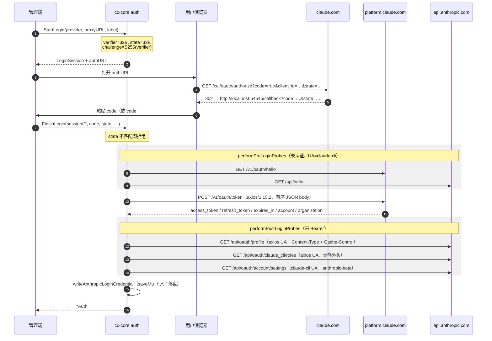

# auth —— 登录、OAuth 与上游探针

> [← Wiki 首页](Home) · [架构总览](Architecture)

> 本页覆盖 `auth/` 包中与**登录 / OAuth / 上游探针 / 传输层**相关的部分。
> 调度器与健康状态机（`pool.go` / `types.go` / `retry.go`）不在本页范围内。
> 所有行号对应仓库 `main` 分支（`74aa66c`）当时的源码。

---

## 概览

`auth` 包同时承担四件事，本页讲后三件：

| 子系统 | 入口 | 说明 |
|---|---|---|
| Anthropic 登录 | `StartLogin` / `FinishLogin` / `LoginWithSessionCookie` | PKCE 浏览器流程 + 服务端 session-cookie 流程 |
| 凭据文件 | `parseFile` / `saveAuth` / `InstallCredentialFile` | append-only JSON 格式，两种 kind × 两个 provider |
| Codex / ChatGPT | `finishCodexLogin` / `refreshCodexLocked` / `Fetch*` | OAuth + JWT claims + 三类上游探针 |
| 传输 / 指纹 | `ClientFor` / `DialTLSConn` / `ProfileFor` | uTLS Chrome 指纹、代理、每账号合成主机 |

两条贯穿全局的规则：

1. **所有探针失败都不得影响凭据健康。** `FetchCodexUsage` / `FetchCodexSubscription` /
   `FetchCodexResetCredits` 出错时只返回 error，绝不 `MarkFailure`、不设 cooldown。
   唯一例外是 usage 探针读到 `rate_limit.limit_reached == true` 时会调用
   `MarkUsageLimitReached`（`auth/codex_usage.go:283`）——那是**上游明确的配额信号**，不是失败。
2. **User-Agent 不设 ≠ 不发。** Go 会自动填 `Go-http-client/1.1`，这是本项目最不该出现的第三方标识。
   所以每一条出站请求都显式 `Set("User-Agent", …)`。

---

## Anthropic 登录

### 常量

| 常量 | 值 | 位置 |
|---|---|---|
| `anthropicAuthURL` | `https://claude.com/cai/oauth/authorize` | `auth/login.go:34` |
| `anthropicRedirectURI` | `http://localhost:54545/callback` | `auth/login.go:35` |
| `anthropicScopes` | `org:create_api_key user:profile user:inference user:sessions:claude_code user:mcp_servers user:file_upload`（6 项，逐字节对齐真实 CC） | `auth/login.go:36` |
| `anthropicTokenURL` | `https://platform.claude.com/v1/oauth/token`（交换与刷新共用） | `auth/oauth.go:24` |
| `anthropicClientID` | `9d1c250a-e61b-44d9-88ed-5944d1962f5e` | `auth/oauth.go:25` |
| `anthropicOAuthUA` | `axios/1.15.2` | `auth/oauth.go:32` |

### 公开函数签名

```go
func StartLogin(provider, proxyURL, label string) (*LoginSession, string, error)   // auth/login.go:106
func RedirectURIFor(provider string) string                                        // auth/login.go:189
func ParseCallback(input string) (code, state string, err error)                   // auth/login.go:201
func FinishLogin(ctx context.Context, sessionID, code, state, authDir string,
	maxConcurrent int, useUTLS bool, group string) (*Auth, error)                  // auth/login.go:254
func LoginWithSessionCookie(ctx context.Context,
	sessionCookie, proxyURL, label, group string,
	maxConcurrent int, authDir string) (*Auth, error)                              // auth/login_session.go:46
```

`LoginSession` 结构体在 `auth/login.go:44`（`ID / Provider / State / CodeVerifier / ProxyURL / Label / CreatedAt`），
由进程内 `globalLoginStore` 持有，30 分钟过期（`auth/login.go:63`），`take` 取出即删除（一次性）。

### PKCE 时序

PKCE 参数长度是**指纹的一部分**：Anthropic 走 32 字节 verifier + 32 字节 state（均输出 43 字符
base64url-no-padding，对齐真实 CC 2.1.167）；OpenAI 走 96 / 24（`auth/login.go:117-123`）。
`code_challenge = base64url(sha256(verifier))`，`method=S256`（`auth/login.go:97`）。



**authorize query 是手工拼接的**（`buildAnthropicAuthURL`，`auth/login.go:157`），
因为 `url.Values.Encode()` 会按字母序排序，而真实 CC（axios 序列化器保留 JS 对象插入顺序）发的是：
`code, client_id, response_type, redirect_uri, scope, code_challenge, code_challenge_method, state`。

**token 交换的 body 用 struct 而非 map**（`auth/login.go:295-309`），固定字段序为
`grant_type, code, redirect_uri, client_id, code_verifier, state` —— `map[string]any` 会被 `json.Marshal` 字母序化。

`ParseCallback` 接受四种输入：完整 URL / `code#state` / `code=…&state=…` / 裸 code（`auth/login.go:201-233`）。

### 登录期辅助探针（login_probes.go）

只做裸 token 交换会留下"一条孤立 POST、周围没有任何伴随请求"的特征，本身就是"非官方客户端"信号。

| 阶段 | 端点 | UA | Bearer | 额外头 |
|---|---|---|---|---|
| pre | `https://platform.claude.com/v1/oauth/hello` | `mimicry.ClaudeCLIUserAgent` | 无 | — |
| pre | `https://api.anthropic.com/api/hello` | `mimicry.ClaudeCLIUserAgent` | 无 | — |
| post | `https://api.anthropic.com/api/oauth/profile` | `axios/1.15.2` | 有 | `Content-Type: application/json`、`Cache-Control: no-cache` |
| post | `https://api.anthropic.com/api/oauth/claude_cli/roles` | `axios/1.15.2` | 有 | 无 |
| post | `https://api.anthropic.com/api/oauth/account/settings` | `mimicry.ClaudeCLIUserAgent` | 有 | `anthropic-beta: oauth-2025-04-20` |

常量见 `auth/login_probes.go:20-27`，探针表见 `auth/login_probes.go:89-96`。
公共头（每条都发）：`Accept: application/json, text/plain, */*`、`Accept-Encoding: gzip, br`、
`Connection: close`（`auth/login_probes.go:40-43`）。

> **陷阱**：profile 和 roles **不是**同一套头。给两者发统一头集本身就是一个 tell
> （`crack/cc2220/SPEC.md §2`，回归测试 `TestLoginProbeHeadersPerEndpoint`）。

全部 best-effort：失败只 `log.Debugf`，绝不中断登录（`auth/login_probes.go:69,98`）。
所有探针复用同一个 `ClientFor(sess.ProxyURL, useUTLS)` 客户端，保证它们和后续流量从同一出口 IP 出去。

### session-cookie 流程

`LoginWithSessionCookie`（`auth/login_session.go:46`）让服务端自己驱动 authorize 页面，
输入是用户从浏览器复制的 `sessionKey=sk-ant-sid02-…`。

强制约束：

- cookie 必须以 `sk-ant-sid` 开头（`auth/login_session.go:57`）；
- **`proxy_url` 必填**（`auth/login_session.go:60`）—— 从机房 IP 直接打 claude.com authorize 太显眼；
- **uTLS 强制开启**，`ClientFor(proxyURL, true)` 硬编码 `true`（`auth/login_session.go:79`）；
- **不跟随重定向**：克隆 client 并设 `CheckRedirect → http.ErrUseLastResponse`（`auth/login_session.go:80-83`）。

`authorizeWithSession`（`auth/login_session.go:122`）发的是一个**顶层导航**形态的 GET：

```
User-Agent: Mozilla/5.0 (X11; Linux x86_64) AppleWebKit/537.36 (KHTML, like Gecko) Chrome/131.0.0.0 Safari/537.36
Accept: text/html,application/xhtml+xml,application/xml;q=0.9,image/avif,image/webp,image/apng,*/*;q=0.8
Accept-Language: en-US,en;q=0.9
Accept-Encoding: gzip, deflate, br
Sec-Ch-Ua: "Chromium";v="131", "Not_A Brand";v="24", "Google Chrome";v="131"
Sec-Ch-Ua-Mobile: ?0
Sec-Ch-Ua-Platform: "Linux"
Sec-Fetch-Dest: document
Sec-Fetch-Mode: navigate
Sec-Fetch-Site: none
Sec-Fetch-User: ?1
Upgrade-Insecure-Requests: 1
Cookie: sessionKey=<sid02>
```

（`browser*` 常量定义在 `auth/login_session.go:21-27`，与 `HelloChrome_Auto` 的 JA3/JA4 配套。）

结果分支（`auth/login_session.go:155-193`）：

- `3xx` + `Location` → 解析出 `code` / `state`（含 `error` / `error_description` envelope）；
- `200` → 是同意页，说明该账号还没在浏览器里批准过 Claude Code；
- `401/403` → cookie 过期或撞上 Cloudflare 挑战；
- 其他 → 原样报出，并附 240 字符 body 片段。

拿到 code 后合成一个 `LoginSession` 复用 `finishAnthropicLogin`（`auth/login_session.go:101-110`），
所以落盘路径、探针、文件格式与浏览器登录完全一致。

### axios 传输层（oauth_axios.go）

`applyAxiosOAuthHeaders`（`auth/oauth_axios.go:27`）复刻真实 CC 的 token 交换 / 刷新头：
`Content-Type: application/json`（有 body 时）、`Accept: application/json, text/plain, */*`、
`Accept-Encoding: gzip, br`、`User-Agent: axios/1.15.2`、`Connection: close`。

因为手工设了 `Accept-Encoding`，Go 的 `http.Transport` 会关闭自动解压，
所以 `readAxiosOAuthBody`（`auth/oauth_axios.go:41`）自己处理 `gzip` / `br` / `identity`，
遇到未知编码直接报错而不是返回乱码。
`doAxiosOAuthRequest`（`auth/oauth_axios.go:69`）把两者合成一次调用，返回 `(resp, decodedBody, err)`。

### 凭据落盘的账号防误写

`writeAnthropicLoginCredential`（`auth/login.go:380`）在 `saveMu` 下完成"解析候选 → 读现有文件 → 比对账号 → 落盘 → 重解析"，
如果目标路径上已有**另一个账号**的凭据，直接返回 `ErrCredentialFileAccountMismatch`
（`auth/login.go:396`，判定逻辑 `sameAnthropicOAuthAccount` 在 `auth/pool.go:969`：优先比 `account_uuid`，都为空时比 email）。
`LoadAuthDir` 还会拒绝整目录内 `account_uuid` 重复的 Anthropic OAuth 凭据
（`ErrDuplicateClaudeAccountUUID`，`auth/oauth.go:410-423`）。

---

## 凭据文件格式

`parseFile(path, data)`（`auth/oauth.go:93`，导出别名 `ParseFile` 在 `auth/oauth.go:701`）
先读 `type` 分派，再读独立的 `provider` 字段（存在时优先）：

| `type` 取值 | kind | 默认 provider | 解析函数 |
|---|---|---|---|
| `claude` | `KindOAuth` | `anthropic` | `parseFile` 主体（`auth/oauth.go:108`）|
| `codex` / `openai` / `chatgpt` | `KindOAuth` | `openai` | `parseCodexOAuthFile`（`auth/oauth.go:283`）|
| `apikey` / `api_key` / `anthropic_api_key` | `KindAPIKey` | `anthropic` | `parseAPIKeyFile`（`auth/oauth.go:226`）|
| `openai_api_key` / `codex_api_key` | `KindAPIKey` | `openai` | `parseAPIKeyFile` |

其他值 → `unsupported type %q`（`auth/oauth.go:106`）。

### append-only 兼容写法

包内**不用 struct 反序列化**，而是 `json.Unmarshal` 进 `map[string]any` 后逐字段
`x, _ := raw["k"].(T)` 取值：类型不符或键缺失都退化成零值，老文件永远能加载。
`fileFormat`（`auth/oauth.go:37`）只是格式说明，实际解析路径**不使用它**。
`saveAuth`（`auth/oauth.go:432`）也是"读回原 map → 覆盖已知键 → 整体写回"，
所以任何未知的额外键都会被原样保留。

### 字段全清单

数值字段来自 JSON 的 `float64`，所以 `max_concurrent` / `order` 用 `raw[k].(float64)` 再转 `int`。

#### 通用字段

| 字段 | 类型 | 含义 | 备注 |
|---|---|---|---|
| `type` | string | 凭据种类 + 遗留 provider 提示 | 必填 |
| `provider` | string | `anthropic` / `openai`，经 `NormalizeProvider` | 可选；缺失时从 `type` 推断。`saveAuth` 总是写回 |
| `label` | string | 显示名 | 可选；空则回落 `email` → 文件名 |
| `disabled` | bool | 手动停用 | 可选，默认 `false` |
| `proxy_url` | string | 每凭据代理 | 可选；非法值**导致整个文件解析失败**（`auth/oauth.go:341`）|
| `group` | string | 分组，经 `NormalizeGroup` | 可选 |
| `model_map` | object(string→string) | 纯重写表 | 可选；见下方"默认注入"陷阱 |
| `strip_thinking` | bool | 转发前主动清洗 thinking 签名 | 可选；仅在 `true` 时写盘 |

#### OAuth 专有（`type: claude` / `codex`）

| 字段 | 类型 | 含义 | 备注 |
|---|---|---|---|
| `access_token` | string | 访问令牌 | 与 `refresh_token` 至少有一个 |
| `refresh_token` | string | 刷新令牌（会轮换） | 同上 |
| `email` | string | 账号邮箱 | 可选 |
| `expired` | string(RFC3339) | 过期时刻 | 可选；首选 |
| `expires_at` | number(unix 秒) | 过期时刻 | 可选；仅当 `expired` 缺失/不可解析时使用 |
| `max_concurrent` | number | 并发上限 | 可选，0 = 不限（由调度器解释）|
| `last_refresh` | string(RFC3339) | 上次刷新时间 | 登录时写入；`parseFile` **不读**，纯人类可读 |

#### Anthropic OAuth 额外字段

| 字段 | 类型 | 含义 | 备注 |
|---|---|---|---|
| `account_uuid` | string | OAuth 返回的账号 UUID | 可选；`AccountKey()` 的首选锚点，全目录唯一性检查也用它 |
| `organization_uuid` | string | 组织 UUID | 可选；登录时写入，`parseFile` 在 `auth/oauth.go:145` 读取并填入 `Auth.OrganizationUUID` |
| `organization_type` | string | 如 `claude_max` / `claude_pro` / `claude_team` | 可选；由 `UpdateSubscriptionInfo` 从 bootstrap 响应回填 |
| `organization_rate_limit_tier` | string | 如 `default_claude_max_20x` | 同上 |
| `host_profile` | object | `{distro_id, kernel, terminal, shell}` | 可选；`EnsureHostProfile` 首次触碰时钉住 |

#### Codex OAuth 额外字段

| 字段 | 类型 | 含义 |
|---|---|---|
| `id_token` | string | OpenAI ID Token（JWT）|
| `account_id` | string | `chatgpt_account_id`，用于 `Chatgpt-Account-Id` 头 |
| `plan_type` | string | `free`/`plus`/`pro`/`team`/`business`/`go`，决定模型可见性 |

#### API-key 专有

| 字段 | 类型 | 含义 | 备注 |
|---|---|---|---|
| `api_key` | string | 密钥 | 必填；兼容 `key` / `access_token` 两种旧拼写（`auth/oauth.go:230-234`）|
| `base_url` | string | 每凭据上游 base URL 覆盖 | 可选 |
| `order` | number | 选择优先级，0 = 未排序 | 可选；仅非 0 时写盘 |
| `price_multiplier` | number | 计费倍率覆盖，>0 生效 | 可选；仅 >0 时写盘 |

#### 已退役 / 被主动删除的键

| 字段 | 处置 |
|---|---|
| `claude_identity_mode` | 加载时忽略；`saveAuth` / `InstallCredentialFile` / `writeAnthropicLoginCredential` 都 `delete`（`auth/oauth.go:469,520,602`；`auth/login.go:402`）|
| `billing_rate` | `saveAuth` 无条件删除（`auth/oauth.go:572`），用于跨 fork 归一化 |

### 两个易踩的写盘规则

1. **`model_map` 永远写盘，空也写成 `{}`**（`auth/oauth.go:528-539`）。
   因为**"键完全缺失"才会触发** `DefaultClaudeOAuthModelMap`（`opus-4-6`/`opus-4-7` → `opus-4-8`，`auth/oauth.go:58`）
   的注入，且仅对 Anthropic OAuth 生效（`auth/oauth.go:154-157`）。
   写一个显式空对象，就是运营者清掉默认值的唯一手段。
2. **API-key 与 OAuth 互转时会清键。** `saveAuth` 在 `KindAPIKey` 分支里删掉
   `refresh_token / access_token / expired / id_token / account_id / plan_type / last_refresh / max_concurrent`
   （`auth/oauth.go:461-469`）。

### 刷新

```go
func (a *Auth) EnsureFresh(ctx context.Context, leeway time.Duration, useUTLS bool) error // auth/oauth.go:733
func (a *Auth) MinRefreshLeeway() time.Duration                                          // auth/oauth.go:753
```

有效 leeway = `max(传入值, MinRefreshLeeway())`。Anthropic 5 分钟；OpenAI **5 天**
（Codex access token 约 30 天寿命，提前 5 天刷新留出恢复窗口）。
并发调用由每凭据的 `refreshMu` + double-check 去重（`auth/oauth.go:740-745`），
避免轮换型 refresh_token 被并行交换烧掉。

Anthropic 刷新（`refreshAnthropicLocked`，`auth/oauth.go:776`）复用同一个
`platform.claude.com/v1/oauth/token`，body 字段序 `grant_type, refresh_token, client_id`。
状态码映射：

| 上游响应 | 处置 |
|---|---|
| `400 invalid_grant` | `MarkHardFailure`（refresh_token 已吊销，需人工重登）|
| `401` | `MarkHardFailure` |
| 其他非 200 | `MarkFailure` |
| 传输错误 | `MarkFailure` |
| `200` | 更新 token / 过期时间 / email，`MarkSuccess` 后落盘 |

---

## Codex / ChatGPT OAuth 与 JWT claims

### 常量

| 常量 | 值 | 位置 |
|---|---|---|
| `openaiAuthURL` | `https://auth.openai.com/oauth/authorize` | `auth/codex_login.go:24` |
| `openaiRedirectURI` | `http://localhost:1455/auth/callback` | `auth/codex_login.go:25` |
| `openaiScopes` | `openid email profile offline_access` | `auth/codex_login.go:26` |
| `openaiTokenURL` | `https://auth.openai.com/oauth/token` | `auth/codex_refresh.go:19` |
| `openaiClientID` | `app_EMoamEEZ73f0CkXaXp7hrann` | `auth/codex_refresh.go:20` |

`buildCodexAuthURL`（`auth/codex_login.go:32`）用的是 `url.Values.Encode()`（字母序），
额外带三个厂商标志：`prompt=login`、`id_token_add_organizations=true`、`codex_cli_simplified_flow=true`。

### 与 Anthropic 侧的关键差异

| | Anthropic | Codex |
|---|---|---|
| PKCE verifier / state 长度 | 32 / 32 字节 | 96 / 24 字节 |
| 授权 URL query 序 | 手工拼接，保留插入序 | `url.Values.Encode()`，字母序 |
| token 交换 body | 有序 JSON | `application/x-www-form-urlencoded` |
| 交换请求头 | axios 全套 | 仅 `Content-Type` + `Accept: application/json` |
| 交换响应 | `account` / `organization` 对象 | `id_token`（JWT）|
| 登录期辅助探针 | 有（5 条）| 无 |
| 落盘并发保护 | `writeAnthropicLoginCredential`：`saveMu` + 账号比对 + temp/rename | `writeCodexLoginCredential`：同一套（account_id 优先、email 兜底）|

> 这一行曾是一处真实的不对称 —— Codex 侧直接 `os.WriteFile`，既不串行化也不比对账号。
> 现已对齐（`auth/codex_login.go`，回归测试 `auth/codex_login_write_test.go`）：`saveMu` 下
> 解析候选 → 读现有文件 → 账号不同则返回 `ErrCredentialFileAccountMismatch` → temp+rename 原子替换。
> 文件名由 email+plan+account 派生，正常不会撞车，但 `WriteFile` 先截断，中途失败会把一个可用凭据变成 0 字节文件。

### 凭据文件名约定

`buildCodexCredentialFilename`（`auth/codex_login.go:163`）：

```
codex-{email}.json                    # 无 plan
codex-{email}-{plan}.json             # 非 team
codex-{acctHash8}-{email}-team.json   # team（sha256(accountID) 前 8 位十六进制去歧义）
```

Anthropic 侧则是 `sanitizeLoginFilename`（`auth/login.go:425`）：`{email}.json`，
email 为空时 `claude-{sessionID}.json`。

### ID Token claims

`ParseCodexIDToken(token string) (*CodexIDTokenClaims, error)`（`auth/codex_jwt.go:37`）
**不验签**：token 刚从 `auth.openai.com` 经 TLS 取回，签名已由签发方保证——与 Codex CLI 自身行为一致。
按 `.` 切三段、取 payload、补齐 base64 padding（`auth/codex_jwt.go:53`）后解 JSON。

解析出的字段（`CodexIDTokenClaims`，`auth/codex_jwt.go:13`）：

| claim | Go 字段 | 用途 |
|---|---|---|
| `email` | `Email` | 凭据 email / label / 文件名 |
| `email_verified` | `EmailVerified` | 仅解析，当前无消费点 |
| `sub` | `Sub` | 仅解析，当前无消费点 |
| `https://api.openai.com/auth` → `chatgpt_account_id` | `CodexAuthInfo.ChatgptAccountID`，访问器 `AccountID()`（`auth/codex_jwt.go:26`）| `Chatgpt-Account-Id` 请求头、`/subscriptions?account_id=` |
| `https://api.openai.com/auth` → `chatgpt_plan_type` | `CodexAuthInfo.ChatgptPlanType`，访问器 `PlanType()`（`auth/codex_jwt.go:31`）| 模型可见性 |
| `https://api.openai.com/auth` → `chatgpt_user_id` | `CodexAuthInfo.ChatgptUserID` | 仅解析，当前无消费点 |

`NormalizeCodexPlan`（`auth/codex_jwt.go:76`）把上游标签收敛成四档：
`free` / `plus` / `pro` / `team`（`team`、`business`、`go` 都归 `team`；**空串和未知值都归 `pro`**，
即宁可放开也不误限制）。模型清单 `CodexModelCatalog`（`auth/codex_models.go:22`）+
`CodexModelsForPlan(planType string) []string`（`auth/codex_models.go:67`）。
当前 free 档 4 个模型、plus/pro 9 个、team 8 个（team 无 `gpt-5.3-codex-spark`）。

### Codex 刷新

`refreshCodexLocked`（`auth/codex_refresh.go:27`）：form body
`client_id, grant_type=refresh_token, refresh_token, scope="openid profile email"`。

- **每次重试重建 request**（`buildReq` 工厂，`auth/codex_refresh.go:45`）——`strings.Reader` 消费后不可重放。
- 3 次尝试，退避 `attempt × 300ms`，只在 `IsTransientNetErr` 时重试。
- **传输层瞬时错误即使耗尽重试也不 `MarkFailure`**（`auth/codex_refresh.go:87-92`）。
  历史教训：后台刷新器每分钟一跳，几分钟的代理天气就能累积到 `hardFailureThreshold`，
  把一个完好的 Codex 凭据永久打成 "session expired"。
- 状态码映射（`auth/codex_refresh.go:98-118`）：

| 上游响应 | 处置 |
|---|---|
| body 含 `refresh_token_reused` / `refresh_token_invalidated` | `MarkHardFailure`（终局，需重登）|
| `401`，或 `400` 且含 `invalid_grant` | `MarkHardFailure` |
| `429` 或 `>=500` | **不做任何标记**，只 `log.Warnf` |
| 其他非 200 | `MarkFailure` |

成功后会**重新解析 id_token**，把 `plan_type` / `account_id` / `email` 同步过来
——订阅档位可能在两次刷新之间变化（`auth/codex_refresh.go:130-158`）。

---

## 三类 ChatGPT 上游探针

三者互补而非互替：usage 说"现在还剩多少"，subscription 说"买了什么、什么时候到期、会不会续"，
reset-credit 说"手上还有几张立即重置配额的卡"。

| | wham/usage | subscriptions + accounts/check | rate-limit-reset-credits |
|---|---|---|---|
| 入口 | `FetchCodexUsage`（`auth/codex_usage.go:135`）| `FetchCodexSubscription`（`auth/codex_subscription.go:201`）| `FetchCodexResetCredits`（`auth/codex_reset.go:89`）/ `ResetCodexCredit`（`auth/codex_reset.go:126`）|
| 用途 | 滚动窗口配额、余额、spend control、plan | 计费视图：term 起止、续订、折扣、拖欠 | 一次性配额重置卡余量 / 兑换 |
| 端点 | `GET https://chatgpt.com/backend-api/wham/usage` | `GET .../backend-api/subscriptions?account_id=<id>`<br>`GET .../backend-api/accounts/check/v4-2023-04-27` | `GET .../backend-api/wham/rate-limit-reset-credits`<br>`POST .../consume` |
| 冒充的客户端 | **codex-tui CLI**（CLI 自己会调它）| **浏览器 XHR**（只有网页门户会调）| **Codex Desktop**（真正兑换重置卡的客户端）|
| User-Agent | `mimicry.CodexUsageUserAgent`（== `CodexCLIUserAgent`，`codex-tui/0.147.0 …`）| `browserUA`（Chrome 131 on Linux）| `browserUA` |
| 头集构造 | 内联于 `FetchCodexUsage`（`auth/codex_usage.go:170-183`）| `codexBillingGET`（`auth/codex_subscription.go:387`）| `applyCodexWhamHeaders`（`auth/codex_reset.go:197`）|
| 失败语义 | 返回 error，**不动健康**；`limit_reached` 时 `MarkUsageLimitReached` | 返回 error，**不动健康**；两个端点**都**失败才算失败 | 返回 error，**不动健康** |
| 建议轮询频率 | 高（配额随时变）| 低（计费一月一变；文档建议手动按钮 + 每日一次）| 按需 |

### 三套 header 逐条对照

| 头 | wham/usage | subscriptions / accounts-check | reset-credits |
|---|---|---|---|
| `Authorization` | `Bearer <token>` | `Bearer <token>` | `Bearer <token>` |
| `Accept` | `*/*` | `application/json` | `application/json` |
| `Accept-Encoding` | `identity` | `identity` | `identity` |
| `Accept-Language` | — | `en-US,en;q=0.9`（`browserAcceptLanguage`）| — |
| `User-Agent` | `codex-tui/0.147.0 …` | `browserUA` | `browserUA` |
| `Chatgpt-Account-Id` | 有 id 时设 | 有 id 时设 | 有 id 时设 |
| `Sec-Ch-Ua` / `-Mobile` / `-Platform` | — | `browserSecChUA` / `?0` / `"Linux"` | — |
| `Sec-Fetch-Site` | — | `same-origin` | `none` |
| `Sec-Fetch-Mode` | — | `cors` | `no-cors` |
| `Sec-Fetch-Dest` | — | `empty` | `empty` |
| `Referer` | — | `https://chatgpt.com/` | — |
| `Origin` | — | **刻意不发** | — |
| `Originator` | — | — | `Codex Desktop` |
| `OpenAI-Beta` | — | — | `codex-1` |
| `Oai-Language` | — | — | `en-US` |
| `Priority` | — | — | `u=4, i` |
| `Content-Type` | — | — | 仅 `consume` POST 设 `application/json` |

**为什么 `Origin` 缺席**：浏览器在同源 GET 上本来就不发 `Origin`，而这两个端点从 chatgpt.com
看正是同源。发了反而是"没有任何真实客户端会产生的组合"。
（`auth/codex_subscription.go:382-386`；回归测试 `TestCodexBillingRequestIdentity` 显式断言 `Origin` 为空。）

**为什么不能"统一"这三套**：wham/usage 有 codex-tui 的真实抓包（`crack/codex/SPEC.md` rows/02），
billing 两个端点**只有响应抓包、没有请求头抓包**，现有头集是按浏览器行为推演的；
reset-credits 沿用 sub2api 已验证的 Desktop 头集。没有新抓包就不要合并。

### 共同的传输纪律

三者都用 `ClientFor`（**池化 keep-alive**）而非 `NewPlainHTTPClient`：
项目常走的 SOCKS5 代理在连续 TLS 握手上会 RST 第 2/3 次连接，复用连接可绕开
（`auth/codex_usage.go:154-160`）。
重试策略一致：3 次，退避 `attempt × 250ms`，**只重试传输错误，绝不重试非 2xx**
（401/403/429 是调用方必须原样看到的上游信号）。
可重试判定 `isRetryableCodexUsageErr`（`auth/codex_usage.go:295`）：
`connection reset by peer`、`broken pipe`、`unexpected EOF`、`http2: server sent GOAWAY`。

### wham/usage 数据形状

`CodexUsageInfo`（`auth/codex_usage.go:35`）。三个字段是 `json.RawMessage`，
因为上游形状会变或未抓到：

- `rate_limit_reached_type` —— 曾是裸字符串，后来上游开始返回**对象**，
  导致整个快照解码失败（`cannot unmarshal object into … string`）。
  改成 `RawMessage` 后 string / null / object 三种形状都能过，回归测试
  `TestCodexUsageDecodeRateLimitReachedTypeShapes`（`auth/codex_usage_test.go:17`）钉死这四个 case。
- `code_review_rate_limit`、`promo`、`referral_beacon` —— 通常为 null，非空形状未抓到。

窗口语义：历史上 primary=5h（`limit_window_seconds: 18000`）、secondary=weekly（604800）。
2026-07 ChatGPT 配额政策变更后 5h 窗口退役，后端通常只返回 weekly，
5h 槽位解码成 nil `*CodexUsageRateWindow`。限流判定是**窗口无关**的——
取所有非 nil 窗口中最早的 `reset_at`（`auth/codex_usage.go:269-284`），nil 自然从 min() 中掉出。

副作用（`auth/codex_usage.go:232-284`）：写 `a.CodexUsage` / `a.CodexUsageAt`；
把两个窗口投影成 `x-codex-*` 伪响应头存进 `a.CodexRateLimits`，
让旧的管理面板面板无需另开代码路径；`limit_reached` 时推 cooldown。

### 计费探针数据形状与派生

`CodexSubscriptionInfo`（`auth/codex_subscription.go:38`）由四块组成：
`Portal`（/subscriptions）、`Entitlement` / `Account` / `LastActive`（accounts/check）。

**部分成功即成功**（`auth/codex_subscription.go:242-244`）：两个端点独立失败，任一成功都值得展示；
只有两个都失败才返回 error（并包住两个原因）。
`/subscriptions` 需要 `account_id`，无 id 时**跳过而不是浪费一次必败请求**（`auth/codex_subscription.go:235`）。
若 JWT 里的 account_id 过期，`accounts/check` 会报出真实 id，此时用它**重试一次** portal 调用
（`auth/codex_subscription.go:249-253`）。

`accounts/check` 的账号选择顺序（`parseCodexAccountsCheck`，`auth/codex_subscription.go:308`）：
① 凭据里的精确 account id → ② `"default"` 别名 → ③ 任一已付费且未停用 → ④ 任一未停用。
个人账号下同一对象会同时挂在 id 和 `"default"` 两个键上，无所谓；
但一个能看到多个账号（个人 + 团队）的 token，选错就会报出别人的套餐。

派生 helper（存在的意义是让两个 fork 对同一问题给出同一答案）：

```go
func (s *CodexSubscriptionInfo) PurchasedAt() time.Time                          // :471
func (s *CodexSubscriptionInfo) ExpiresAt() time.Time                            // :484
func (s *CodexSubscriptionInfo) Plan() string                                    // :499
func (s *CodexSubscriptionInfo) IsFree() (free bool, reason string)              // :517
func (s *CodexSubscriptionInfo) AtRisk() (atRisk bool, reason string, deadline time.Time) // :538
```

- `IsFree` 有**两个独立来源**：`is_active_subscription_gratis`（整单赠送）
  或 `discount.discount_type == "percentage" && amount >= 100`（100% 折扣）。
  抓到的真实账号就是 `gratis: false` 但实付 $0——只读 gratis 会把它误报成付费账号。
  reason 分别是 `"gratis"` / `"promo:<campaign>"` / `"discount:100%"`。
- `AtRisk` 两条保命规则：`will_renew` 从 `/subscriptions` **或** `last_active_subscription` 任一读到
  false 即算（无 account_id 的凭据只有后者）；但**只有 term 结束时间已知、且 entitlement 仍 active**
  时才报警——否则每个从未付费的 free 凭据都会报"即将到期，日期 0001-01-01"。
- `PurchasedAt` 拿不到 `active_start` 时返回零值，**不**从 `renews_at` 倒推：
  跨套餐变更时倒推是错的，而错的购买日期比没有更糟。

### reset-credit 兑换

`ResetCodexCredit` 生成一个 UUID-v4 形状的 `redeem_request_id`（`generateRedeemRequestID`，`auth/codex_reset.go:261`，
手写而非引入新依赖），上游用它当幂等键，误双击不会烧掉两张卡。
`CodexResetCreditDetail`（`auth/codex_reset.go:50`）**只暴露 `expires_at`**——
注释明确要求不要往里加上游 id/token，因为这个结构会进管理面板的 payload。

---

## uTLS 与 HostProfile

### ClientFor 的缓存键与配置

```go
func ClientFor(proxyURL string, useUTLS bool) *http.Client        // auth/utls.go:73
func NewPlainHTTPClient(proxyURL string, useUTLS bool) *http.Client // auth/utls.go:112
func DialTLSConn(ctx context.Context, host, addr, proxyURL string,
	useUTLS bool, nextProtos []string) (net.Conn, error)           // auth/utls.go:332
func ValidateProxyURL(proxyURL string) error                       // auth/utls.go:33
```

**缓存键**（`auth/utls.go:79-82`）：uTLS 开启时是 `proxyURL` 本身；关闭时是 `"plain::" + proxyURL`。
缓存的是 `http.RoundTripper`（`globalPool`，`auth/utls.go:28`），每次调用返回一个新的
`&http.Client{Transport: rt, Timeout: 0}` —— 即 **client 无超时**，超时由调用方的 ctx 控制。
RoundTripper 外面统一包一层 `retryRoundTripper`（`auth/utls.go:98`），
在同一凭据上重放瞬时故障，免得调用方为一次 CF 边缘 RST 就切换凭据。

**代理失败必须闭合**：`ValidateProxyURL` 不通过时返回一个恒定报错的
`invalidProxyRoundTripper`（`auth/utls.go:64,75`），而不是静默构造直连传输。
校验规则：scheme 限 `http/https/socks5/socks5h`；不得有前后空白、path、query、fragment；
必须有 host；username 不得为空串；SOCKS 必须带端口。
回归测试 `TestInvalidConfiguredProxyNeverDialsDirect` 等在 `auth/proxy_validation_test.go`。

**两种 transport**：

- `newStdTransport`（`auth/utls.go:142`）：`ForceAttemptHTTP2`、`IdleConnTimeout 30s`、
  `TLSHandshakeTimeout 30s`、`ExpectContinueTimeout 1s`；
  再通过 `http2.ConfigureTransports` 打开 h2 PING 健康检查（`ReadIdleTimeout 30s` / `PingTimeout 15s`）。
  SOCKS 不能走 `Transport.Proxy`，改用 `socks5DialContext`（`auth/utls.go:189`，
  用 goroutine 包一层让 ctx 取消至少能中断等待）。
- `utlsTransport`（`auth/utls.go:236`）：自管 h2 连接池（按 `host:port`），
  h2 用 `http2.Transport{ReadIdleTimeout:30s, PingTimeout:15s}`；
  ALPN 谈成 `http/1.1` 时走一次性的 `roundTripHTTP1`（`auth/utls.go:387`，强制 `Connection: close`，
  conn 生命周期绑在 response body 上，见 `connBoundBody`）。

**uTLS 指纹与 ALPN 覆写**（`auth/utls.go:347-368`）：使用 `utls.HelloChrome_Auto`。
预设 Chrome 指纹在 spec 里**硬编码** ALPN=[h2, http/1.1] 并**忽略** `utls.Config.NextProtos`，
所以代码先 `BuildHandshakeState()`，再遍历 `uc.Extensions` 就地改写 `ALPNExtension.AlpnProtocols`。
这是 Codex WebSocket 拨号必需的：WS Upgrade 不能跑在 h2 上，
否则服务端选 h2 并回一个 SETTINGS 帧，WS 客户端只看到 "malformed HTTP response"。
普通 HTTP 调用传 `["h2","http/1.1"]`（正是 Chrome 自己的列表与顺序），对指纹是 no-op。
回归测试 `TestUTLSALPNOverride`（`auth/utls_alpn_test.go:85`）两个方向都断言。

`DialTLSConn` 是 HTTP 传输和 `cc-core/codexws` 共用的拨号原语，
保证 HTTP 与 WS 两条路径上的 Chrome 指纹逐字节一致。
代理拨号 `dialViaProxy`（`auth/utls.go:427`）支持 http/https CONNECT（含 Basic 代理认证）与 socks5。

### HostProfile

```go
type HostProfile struct { DistroID, Kernel, Terminal, Shell string } // auth/hostprofile.go:32
func ProfileFor(accountKey string) HostProfile                       // auth/hostprofile.go:94
func (a *Auth) HostProfileOrDefault() HostProfile                    // auth/hostprofile.go:113
func (a *Auth) EnsureHostProfile() error                             // auth/hostprofile.go:128
func (p HostProfile) IsZero() bool                                   // auth/hostprofile.go:40
```

**派生方式**：`sha256("cpa-claude-hostprofile/" + accountKey)` 取前 8 字节大端解成 uint64，
对 `hostProfileTotalWeight` 取模，再在加权池上线性扫描（`auth/hostprofile.go:95-106`）。
同一 `accountKey` 永远得到同一 profile —— 一个账号即使被 N 个 client token 复用，
对外也只表现为一台机器。`AccountKey()` 的优先级是 `account_uuid` → `email` → 文件名（`auth/oauth.go:229`）。

**只有四个字段会变**（`auth/hostprofile.go:24-31`）：`distro_id` / `kernel` / `terminal` / `shell`。
`platform`、`arch`、`node_version`、`is_running_with_bun` 等**固定不变**——
只有一份 ground-truth 抓包（Arch / x64 / node v26.3.0 / Bun 1.4.0），
而 macOS/Windows 的 env block **结构**不同（mac 没有 `linux_kernel` 等），
凭空编造结构比统一还糟。
`terminal` 只取真的会设置 `TERM_PROGRAM` 的值（vscode/tmux/konsole/ghostty/WezTerm）；
gnome-terminal/xterm/alacritty/kitty 不设，列进去反而不可信。

**池子按真实占比加权**（`auth/hostprofile.go:67-80`，共 12 项、总权重 31）：
ubuntu 14、debian 5、fedora 5、linuxmint 2、pop 2、arch 2、opensuse-tumbleweed 1。
kernel 串严格按各发行版 `uname -r` 的真实格式（`6.8.0-51-generic` / `6.12.48-amd64` /
`6.15.10-200.fc42.x86_64` / `6.12.10-76061203-generic` / `7.0.11-arch1-1` / `6.16.3-1-default`）——
一个与所声称发行版不匹配的 kernel 串，比"大家都一样"是**更强**的伪造信号。

**扩池规则：只能 append。** 重新加权或重排会一次性把大量账号重映射到别的 profile
（"所有机器一夜之间换了发行版"），本身就是信号。
`EnsureHostProfile` 首次触碰即把 profile 钉进凭据文件，正是为了让已有账号在池子增长后保持不变。

**锁序陷阱**（`auth/hostprofile.go:129-138`）：`EnsureHostProfile` 必须在
`a.mu.Lock()` **之前**求出 `AccountKey()` —— `AccountKey()` 自己要拿 `a.mu.RLock()`，
Go 的 `sync.RWMutex` 不可重入，在写锁内调用会死锁并冻结所有读者。

---

## 陷阱清单

1. **探针失败绝不可影响凭据健康。** wham/usage、billing、reset-credit 三类探针，
   失败一律只返回 error。门户抖动说明不了 `/responses` 是否可用。
   拖欠（delinquent）也只上报给人看，不自动停用——宽限期内账号仍能正常服务。
2. **User-Agent 不设会暴露 `Go-http-client/1.1`。** 而且它和浏览器 `Referer`/`Sec-Fetch-*`
   同时出现，比单独任一个都更反常。`TestCodexBillingRequestIdentity` 钉死这条。
3. **`Origin` 在同源 GET 上刻意不发**，发了才是异常组合。
4. **三套 ChatGPT 探针头集不可合并**：一套是 CLI 抓包、一套是浏览器推演、一套是 Desktop 头集。
   没有新抓包就不要"统一"。
5. **authorize query 与 token body 的字段顺序是指纹**。用 `map` 或 `url.Values.Encode()`
   会字母序化，与真实 CC 不符（Anthropic 侧；Codex 侧本来就是 `Encode()`）。
6. **PKCE verifier/state 长度也是指纹**：Anthropic 32/32，Codex 96/24，别"统一成一个常量"。
7. **post-login 三条探针的头不一致**：profile 带 `Content-Type` + `Cache-Control: no-cache`，
   roles 都不带，settings 换 UA 且带 beta。发统一头集就是 tell。
8. **`model_map` 必须写成 `{}` 而不是省略**，否则下次加载会重新注入
   `DefaultClaudeOAuthModelMap`，运营者永远清不掉默认值。
9. **凭据文件字段是 append-only**：一律用 `x, _ := raw["k"].(T)`，
   不要改成 struct 反序列化，否则老文件加载即失败。
10. **`proxy_url` 非法会让整个凭据文件解析失败**（`validatedProxyValue`），这是有意的 fail-closed。
11. **Codex 刷新的瞬时传输错误绝不能 `MarkFailure`**：后台刷新器每分钟一跳，
    几分钟代理天气就能累积过 `hardFailureThreshold`，把好凭据永久打死。
12. **`refresh_token` 会轮换**，并发刷新会互相烧号——靠 `refreshMu` + double-check 去重。
    Codex 侧 `refresh_token_reused` 是终局错误。
13. **重试请求必须用工厂重建**，`strings.Reader` / `bytes.Reader` body 消费后无法重放。
14. **`rate_limit_reached_type` 形状不稳定**（string / null / object），
    必须保持 `json.RawMessage`，否则整个 usage 快照解码失败。
15. **`EnsureHostProfile` 的锁序**：`AccountKey()` 要在写锁外求值，否则死锁。
16. **HostProfile 池只能 append**，重排会导致大规模 profile 重映射。
17. **uTLS 预设指纹忽略 `Config.NextProtos`**，必须 `BuildHandshakeState()` 后就地改写
    `ALPNExtension`，否则 WS 拨号会被服务端选成 h2。
18. **session-cookie 登录强制要求 proxy 且强制 uTLS**，改动前先读函数注释
    （`auth/login_session.go:42-45`）。
19. **`ClientFor` 返回的 client 无 Timeout**，超时完全由 ctx 决定；忘了带 ctx deadline 就会挂死。
20. **`accounts/check` 会把同一账号返回两次**（id 键 + `"default"` 别名）；
    多账号 token 下选择顺序错了就报别人的套餐。

---

## 相关测试索引

| 测试 | 位置 | 钉住的行为 |
|---|---|---|
| `TestLoginProbeHeadersPerEndpoint` | `auth/login_probes_test.go:61` | 三条 post-login 探针的**逐端点**头集差异 |
| `TestLoginPreProbeSendsNoBearer` | `auth/login_probes_test.go:137` | pre-login 探针不得带 Authorization |
| `TestCodexUsageDecodeRateLimitReachedTypeShapes` | `auth/codex_usage_test.go:17` | `rate_limit_reached_type` 的 null/string/object/absent 四形状 |
| `TestCodexPortalDecodeCapture` | `auth/codex_subscription_test.go:122` | `/subscriptions` 抓包 payload 解码 |
| `TestCodexEntitlementDecodeCapture` | `auth/codex_subscription_test.go:154` | `accounts/check` entitlement 抓包解码 |
| `TestCodexSubscriptionIsFree` | `auth/codex_subscription_test.go:191` | gratis vs 100% 折扣两条独立来源 |
| `TestCodexSubscriptionAtRisk` | `auth/codex_subscription_test.go:232` | 拖欠 / 不续订 / free 账号不误报 |
| `TestCodexBillingRequestIdentity` | `auth/codex_subscription_test.go:321` | `browserUA`、无 `Go-http-client`、无 `Origin`、`Sec-Fetch-*` |
| `TestCodexSubscriptionPurchasedAt` | `auth/codex_subscription_test.go:358` | `active_start` 缺失时返回零值而非倒推 |
| `TestCodexAccountsCheckSelectsPaidAccount` | `auth/codex_subscription_test.go:383` | 多账号下的选择顺序 |
| `TestProfileForDeterministic` | `auth/hostprofile_test.go:12` | 同 accountKey → 同 profile |
| `TestProfileForSpread` | `auth/hostprofile_test.go:27` | 分布不塌缩到单一 profile |
| `TestHostProfilePoolPlausible` | `auth/hostprofile_test.go:40` | kernel 串格式与所声称发行版匹配 |
| `TestEnsureHostProfilePersistRoundTrip` | `auth/hostprofile_test.go:59` | 钉住的 profile 经落盘/重载不变 |
| `TestUTLSALPNOverride` | `auth/utls_alpn_test.go:85` | 钉 `http/1.1` 时真的谈成 h1；全列表时谈成 h2 |
| `TestValidateProxyURL` | `auth/proxy_validation_test.go:14` | 代理 URL 校验规则 |
| `TestInvalidConfiguredProxyNeverDialsDirect` | `auth/proxy_validation_test.go:37` | 非法代理 fail-closed，绝不直连 |
| `TestConfiguredProxyConnectionFailureNeverDialsTarget` | `auth/proxy_validation_test.go:61` | 代理连不上时不回退直连 |
| `TestConfiguredProxyAuthenticationFailureNeverDialsTarget` | `auth/proxy_validation_test.go:86` | 代理认证失败时不回退直连 |
| `TestRetiredClaudeIdentityModeIsIgnoredAndRemovedOnInstall` | `auth/claude_account_policy_test.go:12` | `claude_identity_mode` 被忽略并删除 |
| `TestAnthropicReloginRemovesRetiredIdentityMode` | `auth/claude_account_policy_test.go:39` | 重登也清掉退役键 |
| `TestAnthropicReloginRejectsDifferentAccountOverwrite` | `auth/claude_account_policy_test.go:76` | `ErrCredentialFileAccountMismatch` |
| `TestDuplicateClaudeAccountUUIDRejectedOnLoadAndAdd` | `auth/claude_account_policy_test.go:108` | `ErrDuplicateClaudeAccountUUID` |

运行：

```bash
go test ./auth/                                   # 全部
go test ./auth/ -run TestCodexBillingRequestIdentity -v
```

---

## 文件清单

### Anthropic 登录

| 路径:行号 | 内容 |
|---|---|
| `auth/login.go:33` | authorize URL / redirect URI / scopes 常量 |
| `auth/login.go:44` | `LoginSession` |
| `auth/login.go:55` | `loginStore`（30 分钟 GC，`take` 即删）|
| `auth/login.go:89` | `randomURLSafe` |
| `auth/login.go:97` | `pkceChallenge`（S256）|
| `auth/login.go:106` | `StartLogin` |
| `auth/login.go:157` | `buildAnthropicAuthURL`（手工拼 query 保序）|
| `auth/login.go:189` | `RedirectURIFor` |
| `auth/login.go:201` | `ParseCallback`（四种输入形态）|
| `auth/login.go:235` | `exchangeResponse` |
| `auth/login.go:254` | `FinishLogin`（按 provider 分派）|
| `auth/login.go:283` | `finishAnthropicLogin` |
| `auth/login.go:380` | `writeAnthropicLoginCredential`（saveMu + 账号比对）|
| `auth/login.go:425` | `sanitizeLoginFilename` |
| `auth/login_session.go:21` | `browserUA` / `browserAccept` / `browserSecChUA` 等 |
| `auth/login_session.go:46` | `LoginWithSessionCookie` |
| `auth/login_session.go:122` | `authorizeWithSession`（导航态头集 + 状态分支）|
| `auth/login_probes.go:20` | 五个辅助端点 URL + `anthropicOAuthBeta` |
| `auth/login_probes.go:35` | `doLoginProbe` |
| `auth/login_probes.go:66` | `performPreLoginProbes` |
| `auth/login_probes.go:80` | `performPostLoginProbes` |
| `auth/oauth_axios.go:27` | `applyAxiosOAuthHeaders` |
| `auth/oauth_axios.go:41` | `readAxiosOAuthBody`（gzip/br 手工解压）|
| `auth/oauth_axios.go:69` | `doAxiosOAuthRequest` |

### 凭据文件

| 路径:行号 | 内容 |
|---|---|
| `auth/oauth.go:23` | token URL / client id / axios UA |
| `auth/oauth.go:37` | `fileFormat`（仅文档作用）|
| `auth/oauth.go:58` | `DefaultClaudeOAuthModelMap` |
| `auth/oauth.go:93` | `parseFile`（type 分派 + append-only 取值）|
| `auth/oauth.go:187` | `parseHostProfile` |
| `auth/oauth.go:229` | `AccountKey` |
| `auth/oauth.go:242` | `AccountUUIDValue` |
| `auth/oauth.go:226` | `parseAPIKeyFile` |
| `auth/oauth.go:283` | `parseCodexOAuthFile` |
| `auth/oauth.go:341` | `validatedProxyValue`（fail-closed）|
| `auth/oauth.go:359` | `parseModelMap` |
| `auth/oauth.go:381` | `LoadAuthDir`（含 account_uuid 唯一性检查）|
| `auth/oauth.go:427` | `saveMu` |
| `auth/oauth.go:432` | `saveAuth`（保留未知键、清退役键）|
| `auth/oauth.go:615` | `Persist` |
| `auth/oauth.go:590` | `InstallCredentialFile` |
| `auth/oauth.go:628` | `UpdateSubscriptionInfo` |
| `auth/oauth.go:660` | `MarkStripThinking` |
| `auth/oauth.go:701` | `ParseFile`（导出别名）|
| `auth/oauth.go:686` | `needsRefresh` |
| `auth/oauth.go:733` | `EnsureFresh` |
| `auth/oauth.go:753` | `MinRefreshLeeway`（Anthropic 5min / OpenAI 5d）|
| `auth/oauth.go:737` | `doRefreshLocked` |
| `auth/oauth.go:776` | `refreshAnthropicLocked` |
| `auth/pool.go:16` | `ErrDuplicateClaudeAccountUUID` / `ErrCredentialFileAccountMismatch` |
| `auth/pool.go:969` | `sameAnthropicOAuthAccount` |
| `auth/types.go:59` | `IDToken` / `AccountID` / `PlanType` 字段 |
| `auth/types.go:196` | `CodexUsage` / `CodexUsageAt` |
| `auth/types.go:205` | `CodexSubscription` / `CodexSubscriptionAt` |
| `auth/types.go:858` | `Credentials()` |
| `auth/types.go:867` | `CodexIdentity()` |

### Codex / ChatGPT

| 路径:行号 | 内容 |
|---|---|
| `auth/codex_login.go:23` | OpenAI authorize URL / redirect / scopes |
| `auth/codex_login.go:32` | `buildCodexAuthURL` |
| `auth/codex_login.go:52` | `finishCodexLogin` |
| `auth/codex_login.go:163` | `buildCodexCredentialFilename` |
| `auth/codex_jwt.go:13` | `CodexIDTokenClaims` |
| `auth/codex_jwt.go:26` | `AccountID()` |
| `auth/codex_jwt.go:31` | `PlanType()` |
| `auth/codex_jwt.go:37` | `ParseCodexIDToken`（不验签）|
| `auth/codex_jwt.go:53` | `base64URLDecode`（补 padding）|
| `auth/codex_jwt.go:65` | `CodexPlanFree/Plus/Pro/Team` |
| `auth/codex_jwt.go:76` | `NormalizeCodexPlan`（未知 → pro）|
| `auth/codex_refresh.go:18` | `openaiTokenURL` / `openaiClientID` |
| `auth/codex_refresh.go:27` | `refreshCodexLocked`（重试 + 状态码映射）|
| `auth/codex_models.go:22` | `CodexModelCatalog` |
| `auth/codex_models.go:67` | `CodexModelsForPlan` |
| `auth/codex_usage.go:35` | `CodexUsageInfo` |
| `auth/codex_usage.go:112` | `codexWhamUsageURL` |
| `auth/codex_usage.go:135` | `FetchCodexUsage` |
| `auth/codex_usage.go:170` | wham/usage 的 CLI 头集 |
| `auth/codex_usage.go:295` | `isRetryableCodexUsageErr` |
| `auth/codex_subscription.go:38` | `CodexSubscriptionInfo` |
| `auth/codex_subscription.go:60` | `CodexSubscriptionPortal` |
| `auth/codex_subscription.go:95` | `CodexEntitlement` |
| `auth/codex_subscription.go:128` | `CodexDiscount` |
| `auth/codex_subscription.go:142` | `CodexBillingAccount` |
| `auth/codex_subscription.go:162` | `CodexLastActiveSubscription` |
| `auth/codex_subscription.go:175` | 两个 billing 端点 URL |
| `auth/codex_subscription.go:201` | `FetchCodexSubscription` |
| `auth/codex_subscription.go:273` | `fetchCodexPortal` |
| `auth/codex_subscription.go:308` | `parseCodexAccountsCheck`（账号选择顺序）|
| `auth/codex_subscription.go:387` | `codexBillingGET`（浏览器 XHR 头集）|
| `auth/codex_subscription.go:471` | `PurchasedAt` / `ExpiresAt` / `Plan` / `IsFree` / `AtRisk` |
| `auth/codex_reset.go:31` | reset-credit 端点 + Desktop 标识常量 |
| `auth/codex_reset.go:89` | `FetchCodexResetCredits` |
| `auth/codex_reset.go:126` | `ResetCodexCredit` |
| `auth/codex_reset.go:165` | `prepareCodexWhamCall` |
| `auth/codex_reset.go:197` | `applyCodexWhamHeaders`（Codex Desktop 头集）|
| `auth/codex_reset.go:219` | `doCodexWhamRequest` |
| `auth/codex_reset.go:261` | `generateRedeemRequestID` |
| `mimicry/codex.go:35` | `CodexCLIVersion` = `0.144.4`、`CodexCLIUserAgent` |
| `mimicry/codex.go:82` | `CodexUsageUserAgent`（== `CodexCLIUserAgent`）|
| `mimicry/fingerprint.go:41` | `ClaudeCLIUserAgent` = `claude-cli/2.1.220 (external, cli)` |

### 传输 / 指纹

| 路径:行号 | 内容 |
|---|---|
| `auth/utls.go:23` | `transportPool` |
| `auth/utls.go:33` | `ValidateProxyURL` |
| `auth/utls.go:64` | `invalidProxyRoundTripper`（fail-closed）|
| `auth/utls.go:73` | `ClientFor`（缓存键 + retryRoundTripper 包装）|
| `auth/utls.go:112` | `NewPlainHTTPClient`（不复用连接）|
| `auth/utls.go:142` | `newStdTransport`（h2 PING 健康检查）|
| `auth/utls.go:189` | `socks5DialContext` |
| `auth/utls.go:236` | `utlsTransport`（自管 h2 池）|
| `auth/utls.go:332` | `DialTLSConn`（HTTP + WS 共用拨号原语）|
| `auth/utls.go:347` | `HelloChrome_Auto` + ALPN 就地覆写 |
| `auth/utls.go:387` | `roundTripHTTP1`（一次性 h1 回退）|
| `auth/utls.go:427` | `dialViaProxy`（CONNECT / socks5）|
| `auth/hostprofile.go:32` | `HostProfile` |
| `auth/hostprofile.go:67` | `hostProfilePool`（加权，只可 append）|
| `auth/hostprofile.go:94` | `ProfileFor`（sha256 加权确定性映射）|
| `auth/hostprofile.go:113` | `HostProfileOrDefault` |
| `auth/hostprofile.go:128` | `EnsureHostProfile`（锁序陷阱）|

### 文档

| 路径 | 内容 |
|---|---|
| `docs/codex-subscription.md` | 计费探针专题（抓包 payload、helper 语义、fork 侧 admin 端点样例、陷阱）|
| `crack/codex/SPEC.md` | codex-tui 抓包 ground truth（wham/usage 头集来源）|
| `crack/cc2220/SPEC.md` | Claude Code 2.1.220 抓包（§2 覆盖 login 探针头集差异）|

---

## 相关页面

[Auth-Pool](Auth-Pool) · [Mimicry](Mimicry) · [Crack](Crack)
