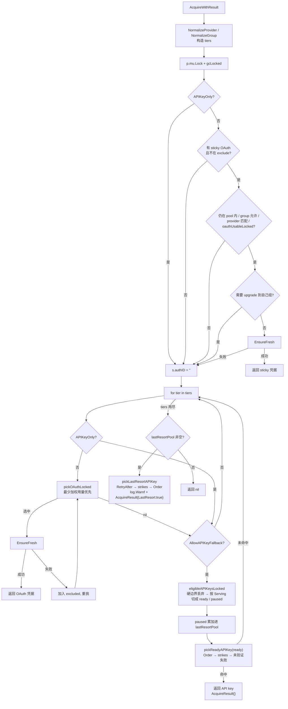
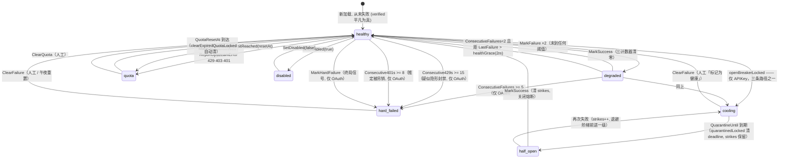

# auth —— 凭据调度与健康状态机

> [← Wiki 首页](Home) · [架构总览](Architecture)

> 本页基于 cc-core 仓库 `auth/` 包的真实源码整理（`pool.go` / `types.go` / `health_state.go` / `schedule.go` / `provider.go` / `retry.go` 及相关测试）。所有行号均对应当前 `main` 分支的实际代码。

---

## 概览

`auth` 包是 cc-core 中最"承重"的子系统：它同时负责

1. **凭据调度**——把一次客户端请求分配到某个上游凭据（Anthropic / OpenAI 的 OAuth 订阅账号，或 API key 渠道）；
2. **健康状态机**——记录每个凭据的成功/失败/限流/封禁信号，决定它何时该退出轮转、何时该被重新探测、何时该被永久拉黑等待人工介入；
3. **瞬时错误分类**——区分"网线抖了一下"和"这个凭据坏了"，前者在**同一凭据**上原地重放，后者才允许触发 failover。

三者耦合极紧：一次错误分类失误（把 h2 连接死亡当成凭据失败）就会在一秒内打出一串 `MarkFailure`，把整个 provider 的凭据池打黑。本页把每条规则连同它的**回归测试**一起列出，作为规范而非启发式来对待。

贯穿全页的两条主线原则：

- **路由层与展示层是两个口径。** 路由问的是"这次请求还能不能发出去"，展示层问的是"运维该不该被叫醒"。把展示口径当路由过滤器用过一次（2026-07-14），代价是整池 503；把路由口径当展示用，代价是面板对一个已经死掉的池显示绿色。两者各自有函数：`oauthUsableLocked` / `eligibleAPIKeysLocked` 是路由，`HealthState` / `PoolHealth` 是展示。
- **退避应当降低优先级，而不是移出候选集。** 一个渠道被熔断器暂停不等于它该被跳过——当它是唯一渠道时，跳过它等于自断服务。见下文的 **last-resort 放行**。

核心对象关系：

```
Pool  (auth/pool.go:36)
 ├── oauths  []*Auth      并发受限（MaxConcurrent），按加权用量最少优先
 ├── apikeys []*Auth      不限并发，按 Order 优先级顺序扫描（同 Order 内按健康轮转）
 └── sessions map[slotKey]*session   粘性会话槽位
       slotKey = provider + "|" + clientToken + "|" + sessionID   (auth/pool.go:73)

Auth  (auth/types.go:44)  单个上游凭据 + 它自己的健康状态机
 └── HealthState() → HealthReport   (auth/health_state.go:127)   七态分类 + Serving 判定

PoolHealth (auth/health_state.go:239)  按 provider 聚合，由 Pool.Health(provider) 产出
```

---

## 核心类型

### `Kind`（auth/types.go:34-39）

| 值 | 含义 |
|---|---|
| `KindOAuth`（iota = 0） | OAuth 订阅凭据，受 `MaxConcurrent` 槽位约束，会自动 hard-fail |
| `KindAPIKey`（= 1） | API key / BYOK / 中转渠道，不限并发，**永不**被自动 sticky 拉黑，改用熔断器 |

### `Provider`（auth/provider.go:10-13）

| 常量 | 值 | 别名（`NormalizeProvider`，auth/provider.go:20） |
|---|---|---|
| `ProviderAnthropic` | `"anthropic"` | `""`（legacy 空值）、`"claude"` |
| `ProviderOpenAI` | `"openai"` | `"codex"`、`"chatgpt"` |

`IsKnownProvider`（auth/provider.go:33）判定是否是这两个规范值之一；未知非空值被 case-fold 后保留，但系统其余部分不认识。

### `Group`（auth/types.go:18 `NormalizeGroup`）

- `""` 与 `"public"`（不区分大小写）→ 规范化为 `""`，即公共池；
- `"new"`（不区分大小写）→ 规范化为小写 `"new"`，是内置保留组（有定时休眠，见下）；
- 其余值 trim 后**区分大小写**保留。

### `Auth` 字段全表（auth/types.go:44-221）

| 字段 | 行 | 说明 |
|---|---|---|
| `mu sync.RWMutex` | 45 | 保护所有可变字段 |
| `refreshMu sync.Mutex` | 46 | 串行化 OAuth refresh，防止并发烧掉轮转的 refresh_token |
| `ID string` | 48 | 稳定标识（OAuth: 文件 basename；APIKey: `apikey:<label-or-prefix>`） |
| `Kind Kind` | 49 | 见上 |
| `Provider string` | 50 | 路由 + per-provider token endpoint |
| `Label`, `Email` | 51-52 | 展示用 |
| `AccessToken` | 55 | OAuth: 访问令牌；APIKey: 字面 key |
| `RefreshToken` | 56 | 仅 OAuth |
| `ExpiresAt time.Time` | 57 | 访问令牌过期时间 |
| `IDToken` | 62 | Codex：携带 ChatGPT 账号 claims |
| `AccountID` | 63 | Codex：驱动上游请求头 |
| `PlanType` | 64 | Codex：per-plan 模型可见性 |
| `AccountUUID` | 72 | Anthropic OAuth token-exchange 返回；body mimicry 用于 `metadata.user_id.account_uuid` |
| `OrganizationUUID` | 73 | 同上，来自 token-exchange |
| `OrganizationType` | 85 | 来自 `/api/claude_cli/bootstrap`，如 `claude_max` / `claude_pro` / `claude_team` |
| `OrganizationRateLimitTier` | 86 | 如 `default_claude_max_20x`；GrowthBook sidecar 用 |
| `HostProfile HostProfile` | 95 | per-account 合成 Linux 主机画像（hostprofile.go） |
| `ProxyURL` | 98 | per-credential 上游代理（空 = 直连/用默认） |
| `BaseURL` | 99 | per-credential base URL 覆盖（**仅 API-key**） |
| `MaxConcurrent int` | 100 | OAuth: 最大并发客户端会话数，`0 = 不限`；APIKey: **忽略** |
| `Group string` | 106 | 组门控，`"" = public` |
| `ModelMap map[string]string` | 116 | **仅 API-key**，纯**改写表**，**不是白名单**（见 `ResolveUpstreamModel` / `AcceptsModel`） |
| `StripThinking bool` | 126 | 前置清洗历史 `thinking` 签名；首次签名错误恢复成功后自动置位并持久化 |
| `Order int` | 135 | **仅 API-key** 的选择优先级，越小越先；0 = 未排名 |
| `PriceMultiplier float64` | 144 | **仅 API-key** 计费覆盖；`>0` 时按 `official_price × PriceMultiplier` 计费，绕过 pricing-group 倍率 |
| `RelayPeer bool` | 152 | 该上游是受信任的中转对端（跨一跳携带下游调用方身份） |
| `FilePath` | 155 | 凭据文件来源 |
| **健康相关** | | |
| `Disabled bool` | 158 | 人工禁用；`IsHealthy` / `HealthState` 独立尊重此位 |
| `QuotaExceededAt time.Time` | 159 | 非零 = 处于配额/冷却状态 |
| `QuotaResetAt time.Time` | 160 | 冷却到期时间；零值 = 只能人工清除（但 `clearExpiredQuotaLocked` 会在 1h 后兜底清除） |
| `ModelRateLimits map[string]time.Time` | 171 | **按模型族**限流，key 如 `"anthropic:fable"`。**永不**让凭据全局不可调度 |
| `LastFailure time.Time` | 172 | 最近一次失败。API-key 的 429/401 也会写它（见下文"三计数器熔断器"） |
| `LastFailureReason string` | 173 | |
| `LastSuccess time.Time` | 174 | 每次 `<400` 上游响应时设置。`LastSuccess.After(LastFailure)` 即"已验证" |
| `ConsecutiveFailures int` | 175 | 成功即清零；驱动 OAuth 自动 hard-fail 与 API-key 熔断（阈值 3） |
| `Consecutive429s int` | 176 | 成功即清零；驱动 429 专属 hard-fail（OAuth，15）与 API-key 熔断（6） |
| `Consecutive401s int` | 177 | 成功即清零；驱动 401 专属 hard-fail（OAuth，8）与 API-key 熔断（2） |
| `HardFailureAt time.Time` | 178 | **粘性**不健康，只有 `ClearFailure` 能清 |
| `HardFailureReason string` | 179 | |
| `QuarantineUntil time.Time` | 186 | **API-key 熔断器**的暂停截止时间（是 deadline，不是粘性标志） |
| `QuarantineStrikes int` | 187 | 连续熔断轮数，驱动指数退避；也是 half-open 的判据（非零且未验证 = half-open） |
| `LastClientCancel time.Time` | 192 | 客户端主动断开；**仅**管理面可见，绝不影响健康 |
| `LastClientCancelReason string` | 193 | |
| `CodexRateLimits map[string]string` | 201 | 从 `/responses` 响应头逐字捕获的 `x-codex-*` |
| `CodexRateLimitsAt time.Time` | 202 | |
| `CodexUsage *CodexUsageInfo` | 210 | wham/usage 主动探测快照（"还剩多少额度"） |
| `CodexUsageAt time.Time` | 211 | |
| `CodexSubscription *CodexSubscriptionInfo` | 219 | 订阅/账单探测（"买了什么、何时续期、是否欠费"） |
| `CodexSubscriptionAt time.Time` | 220 | |

### `AuthInfo`（auth/types.go:444-497）

`Auth.Snapshot()`（auth/types.go:382）返回的只读快照。

快照现在**内含健康分类与失败计数器**：`State HealthState`、`ConsecutiveFailures` / `Consecutive429s` / `Consecutive401s`、`LastFailure` / `LastFailureReason` / `LastSuccess` / `HardFailureAt`（auth/types.go:475-482）。理由写在字段注释里：在熔断阈值以下，一个正在劣化的 API key 对外**没有任何其他可见迹象**；而暂停一旦到期，`QuarantineUntil` 被清空，只有 `ConsecutiveFailures` 还留着历史。`State` 一并带上，是为了让把 `AuthInfo` 直接投成 JSON 的调用方不必自己再推一遍分类——历史上三个调用点推出了三套不同的判定阶梯。

`Snapshot` 内部不再各自调 `clearExpiredQuotaLocked` + `quarantinedLocked`，而是直接调 `healthStateLocked(now)`（auth/types.go:386-391），后者**包含**这两个过期副作用，所以管理面依然永远看不到过期的 quota badge 或过期的 pause。

### `Pool` 与 `session`（auth/pool.go:36-71）

- `Pool.sessions` 的 key 是 `slotKey(provider, clientToken, sessionID)`（auth/pool.go:73）。
- `sessionID` 非空 → 每个客户端窗口（一个 Claude Code CLI session）是**独立槽位**，同一用户多开窗口会被分散到不同凭据上；
- `sessionID` 为空 → 退化为"每 (provider, clientToken) 一个槽位"，供不发送窗口标识的裸 API 调用方使用。

`Status`（auth/pool.go:771）、`AuthLabelInfo`（auth/pool.go:811）、`AcquireOptions`（auth/pool.go:148）、`AcquireResult`（auth/pool.go:174）是配套的导出结构。

### `HealthState` / `HealthReport` / `PoolHealth`（auth/health_state.go）

新增于 `auth/health_state.go`，是**展示与告警口径**的唯一数据源。详见下文 [七态健康枚举](#七态健康枚举)。

---

## 公开 API 速查表

### `Pool` 方法

| 签名 | 位置 | 一句话 |
|---|---|---|
| `NewPool(oauths, apikeys []*Auth, activeWindow time.Duration, useUTLS bool, defaultProxy string) *Pool` | pool.go:77 | 构造池；给未设代理的 OAuth 套默认代理，并按 `Order` 稳定排序 API keys |
| `(p *Pool) UseUTLS() bool` | pool.go:109 | 是否使用 uTLS Chrome 指纹传输 |
| `(p *Pool) ActiveWindow() time.Duration` | pool.go:110 | 会话活跃窗口时长 |
| `(p *Pool) SetUsageLoadFunc(fn func(authID string) int64)` | pool.go:117 | 装载负载均衡回调（返回滚动窗口内的加权 token 用量） |
| `(p *Pool) Acquire(ctx, provider, clientToken, clientGroup, clientModel, sessionID string, excludeIDs ...string) *Auth` | pool.go:190 | 向后兼容入口：等价于 `AcquireWithOptions` 且 `AllowAPIKeyFallback: true` |
| `(p *Pool) AcquireWithOptions(ctx, ..., opts AcquireOptions) *Auth` | pool.go:219 | 委托给 `AcquireWithResult` 并丢弃第二个返回值。**签名刻意不变**（两个 fork 按位置调用） |
| `(p *Pool) AcquireWithResult(ctx, ..., opts AcquireOptions) (*Auth, AcquireResult)` | pool.go:232 | 真正的调度实现（sticky → 分层 OAuth → 分层 API key 两轮 → last-resort） |
| `(p *Pool) AcquireMulti(ctx, provider, clientToken string, clientGroups []string, clientModel, sessionID string, excludeIDs ...string) (string, *Auth)` | pool.go:553 | 按优先级遍历多个 group，返回**实际服务的 group** + 凭据 |
| `(p *Pool) AcquireMultiWithOptions(ctx, ..., opts AcquireOptions) (string, *Auth)` | pool.go:569 | 同上，带 `AcquireOptions` 门控 |
| `(p *Pool) Release(provider, clientToken, sessionID string)` | pool.go:594 | 把会话的 `lastSeen` 打成"现在"，延长活跃窗口（请求结束时调用） |
| `(p *Pool) SessionsHeld(provider, clientToken, sessionID string) (held int, already bool)` | pool.go:620 | 该 client token 在此 provider 上占了多少活跃槽位；`already` 区分"新槽位"与"已持有" |
| `(p *Pool) Unstick(provider, clientToken, sessionID string)` | pool.go:644 | 清除粘性绑定，让下次 `Acquire` 重新选凭据 |
| `(p *Pool) Status() []Status` | pool.go:777 | 全量快照：每个凭据 + 当前活跃会话数 + 原始 client token 列表 |
| `(p *Pool) LabelIndex() map[string]AuthLabelInfo` | pool.go:819 | authID → 当前 (Label, Kind)，供请求日志回填改名 |
| `(p *Pool) HasAPIKeyFor(provider, clientGroup, model string) bool` | pool.go:861 | 是否存在**能服务**该 (provider, group, model) 的 API key——**含 last-resort 口径**，与 `AcquireWithResult` 严格对齐 |
| `(p *Pool) Health(provider string) PoolHealth` | pool.go:895 | **新增**。按 provider 聚合 OAuth + API key 的 `HealthState`，是 fork 状态页判断"整池是否可用"的唯一数据源 |
| `(p *Pool) FindByID(id string) *Auth` | pool.go:920 | 按 ID 查找（OAuth 或 API key） |
| `(p *Pool) AddOAuth(a *Auth) error` | pool.go:938 | 注册 OAuth；校验代理、拒绝重复 Anthropic account_uuid、同 ID 替换 |
| `(p *Pool) AddAPIKey(a *Auth)` | pool.go:986 | 注册 API key，同 ID 替换并重排序 |
| `(p *Pool) ReorderAPIKeys(orderedIDs []string) error` | pool.go:1013 | 按给定 ID 序列重排优先级并持久化；未列出的 key 保持相对顺序排在后面 |
| `(p *Pool) RemoveOAuth(id string) *Auth` | pool.go:1052 | 摘除 OAuth 并删除指向它的粘性会话 |
| `(p *Pool) RemoveAuth(id string) *Auth` | pool.go:1070 | 按 ID 摘除任意凭据（先查 API key，再回落到 `RemoveOAuth`） |
| `(p *Pool) RefreshExpiring(ctx, leeway time.Duration)` | pool.go:1092 | 主动刷新 `leeway` 内将过期的 OAuth；跳过 disabled / hard-failed |
| `(p *Pool) RunRefresher(ctx, interval, leeway time.Duration)` | pool.go:1111 | 定时器循环调用上者；启动时先立刻跑一次 |
| `(p *Pool) ResetUnhealthyAnthropicAPIKeys() int` | pool.go:1142 | 清除所有**不健康的 Anthropic API key**的失败/配额状态（跳过人工 disabled），返回条数 |
| `(p *Pool) RunDailyAnthropicAPIKeyReset(ctx)` | pool.go:1174 | 每本地午夜跑一次上者 |
| `(p *Pool) ReportUpstreamError(a *Auth, status int, resetAt time.Time)` | pool.go:1204 | 把上游 HTTP 状态码映射成健康状态迁移（见下表） |

包内选择辅助（非导出，但语义是规范的一部分）：

| 函数 | 位置 | 职责 |
|---|---|---|
| `apiKeyCandidate` | pool.go:410 | `(key, HealthReport, 池内下标)` 三元组，排序的输入 |
| `(p *Pool) eligibleAPIKeysLocked(...) (ready, paused []apiKeyCandidate)` | pool.go:424 | 一个 tier 内把 API key 切成"现在可服务"与"仅被自愈冷却挡住"两堆；硬边界直接丢弃 |
| `pickReadyAPIKey(cands) *Auth` | pool.go:473 | 第一轮：`(Order, QuarantineStrikes, 未验证的 LastFailure, 下标)` |
| `unverifiedFailureAt(r HealthReport) time.Time` | pool.go:500 | "上次看起来坏、且此后没有任何成功来翻案"的时间戳；已被成功覆盖的失败归零 |
| `pickLastResortAPIKey(cands) (*Auth, HealthReport)` | pool.go:517 | 第二轮：`(RetryAfter, QuarantineStrikes, Order, 下标)`——挑最接近恢复的那把 |

包级辅助：`MaskToken(t string) string`（pool.go:834）——`前4...后4`，长度 ≤8 时返回 `"***"`。

导出错误：`ErrDuplicateClaudeAccountUUID`、`ErrCredentialFileAccountMismatch`（pool.go:16-17）。

### `AcquireOptions`（auth/pool.go:148-166）

| 字段 | 行 | 语义 |
|---|---|---|
| `AllowAPIKeyFallback bool` | 157 | 是否允许在某 tier 内回落到 API key。**也门控 API-key-only 模型**（如 fable）：为 false 时这些模型直接返回 nil，而不是违反调用方的计费 opt-in。**last-resort 同样受它门控**——它是计费 opt-in，不是健康判定 |
| `APIKeyOnly bool` | 162 | 完全跳过 OAuth 选择（用于本地请求准备失败后、用原始 body 重放）。**仍然要求** `AllowAPIKeyFallback`，调用方不能借此绕过计费 opt-in |
| `ExcludeIDs []string` | 165 | 本次请求已试过并失败的凭据 ID |

### `AcquireResult`（auth/pool.go:174-188）

只由 `AcquireWithResult` 返回。`Acquire` / `AcquireWithOptions` 保持历史签名不变，因为两个 fork 都按位置调用它们。

| 字段 | 行 | 语义 |
|---|---|---|
| `LastResort bool` | 181 | 这把凭据是**第二轮放行**出来的：其余候选全部耗尽，而它仍处在一个会自行到期的冷却里（quota 或熔断暂停）。这次请求的成功率会明显更差，调用方**应当暴露**它（状态页 / 日志 / 响应头），但**绝不能**当成错误——它的替代方案是 503 |
| `Reason string` | 187 | 放行说明（含 provider、被放行的 key ID、当前 `HealthState`、提前多久放行）。`LastResort == false` 时为空 |

### `Auth` 健康与调度相关方法

| 签名 | 位置 | 一句话 |
|---|---|---|
| `Snapshot() AuthInfo` | types.go:382 | 只读快照，内部走 `healthStateLocked`，顺带清除过期 quota / quarantine 并带出 `State` |
| `HealthState() HealthReport` | health_state.go:127 | **新增**。七态分类 + `Serving` + `Reason` + `RetryAfter` + 全部计数器 |
| `healthStateLocked(now) HealthReport` | health_state.go:136 | 上者的裸体，供已持锁的调用方（`Snapshot`）复用 |
| `IsQuotaExceeded(now) bool` | types.go:499 | 是否处于账号级冷却；顺带自动清除已过期状态 |
| `MarkQuotaExceeded(resetAt)` | types.go:514 | 打上账号级冷却。**不碰任何失败计数器、不碰熔断器**——冷却是排期，不是对凭据的判决 |
| `IsQuarantined(now) bool` | types.go:529 | API-key 熔断器是否打开（过期自动清除 deadline，但**不清 strikes**） |
| `QuarantineSnapshot() (until time.Time, strikes int)` | types.go:601 | 管理面用的熔断快照 |
| `MarkFailure(reason string)` | types.go:608 | 通用失败：`ConsecutiveFailures++`；OAuth 达 5 → sticky hard-fail；API key → `openBreakerLocked`（阈值 3） |
| `MarkRateLimited(reason string) int` | types.go:647 | 等价于 `MarkRateLimitedRetryAfter(reason, 零值)`，即**悲观读法** |
| `MarkRateLimitedRetryAfter(reason string, retryAfter time.Time) int` | types.go:679 | **新增**。429：`Consecutive429s++`；API-key 另记 `LastFailure`，且**仅在 `retryAfter` 为零时**走熔断（阈值 6）。返回新计数供调用方算退避 |
| `MarkAuthRejection(reason string) int` | types.go:735 | 明确的 401：`Consecutive401s++`，**不动** `ConsecutiveFailures`；OAuth 达 8 → hard-fail；API key → 记 `LastFailure` 并走熔断（阈值 **2**） |
| `MarkUsageLimitReached(resetAt)` | types.go:767 | Claude 订阅 5h/周额度 429：设真实冷却，**显式不动** `Consecutive429s` |
| `MarkModelRateLimited(scope string, resetAt)` | types.go:810 | 按模型族打冷却，**不影响账号级健康**，也不动 `Consecutive429s` |
| `IsModelRateLimited(scope string, now) bool` | types.go:825 | 该模型族是否在冷却；过期条目顺带删除 |
| `MarkClientCancel(reason string)` | types.go:847 | **只记时间戳和原因**，绝不触碰任何健康字段 |
| `ClientCancelSnapshot() (time.Time, string)` | types.go:859 | 管理面读取 |
| `MarkHardFailure(reason string)` | types.go:883 | 终局信号：OAuth → 直接 sticky hard-fail；API key → `ConsecutiveFailures++` 且 **threshold=1** 立即熔断 |
| `MarkSuccess()` | types.go:899 | 三个连续计数器全部清零，并**关闭熔断器**（清 `QuarantineUntil` 与 `QuarantineStrikes`）。这是唯一能把 half-open 变绿的动作 |
| `ClearFailure()` | types.go:936 | 管理面「标记为健康」：清空全部失败/硬失败/**熔断**状态，并把 `LastSuccess` 设为现在。**不清 quota** |
| `IsHealthy() bool` | types.go:955 | 遗留的二元判定；池内只被 `ResetUnhealthyAnthropicAPIKeys`（pool.go:1160）使用 |
| `HealthSnapshot() (healthy, hardFailure bool, reason string, consecutive int)` | types.go:1005 | 遗留四元组，**签名与行为刻意保持不变**（两个 fork 都按位置解构）。新代码用 `HealthState()` |
| `IsHardFailed() bool` | types.go:1097 | 是否已 sticky 拉黑 |
| `ClearQuota()` | types.go:1115 | 清账号级冷却 **并把 `ModelRateLimits` 整个置 nil**。**刻意不清熔断器**（见下） |
| `Credentials() (accessToken string, kind Kind)` | types.go:1051 | 取鉴权所需字段 |
| `CodexIdentity() (accountID, planType string)` | types.go:1060 | Codex 身份字段 |
| `CaptureCodexRateLimits(h map[string][]string)` | types.go:1072 | 逐字捕获 `x-codex-*` 响应头（任何状态码都捕获） |
| `SetDisabled(v bool)` | types.go:1124 | 人工启停 |
| `SetMaxConcurrent(n int)` | types.go:1131 | 负数归零 |
| `SetProxyURL / SetBaseURL / SetOrder / SetPriceMultiplier / SetGroup / SetModelMap` | types.go:1141 / 1149 / 1158 / 1174 / 1193 / 1209 | 各字段写入器 |
| `OrderValue() / PriceMultiplierValue() / GroupName()` | types.go:1165 / 1185 / 1200 | 加锁读取器 |
| `ResolveUpstreamModel(clientModel string) (upstream string, ok bool)` | types.go:1251 | 按 `ModelMap` 改写模型名；**`ok` 恒为 true**（保留只为调用点对称） |
| `AcceptsModel(clientModel string) bool` | types.go:1298 | **恒返回 true**——`ModelMap` 是改写表不是白名单 |
| `EnsureFresh(ctx, leeway, useUTLS) error` | oauth.go:733 | 必要时刷新 access token；有效 leeway = `max(leeway, MinRefreshLeeway())` |
| `MinRefreshLeeway() time.Duration` | oauth.go:753 | per-provider 最小刷新提前量 |
| `Persist() error` | oauth.go:615 | 写回凭据文件 |
| `AccountKey() / AccountUUIDValue()` | oauth.go:229 / 242 | 身份锚点（供 mimicry 派生内容寻址标识） |

内部熔断入口（非导出，但是本轮改造的核心）：

| 函数 | 位置 | 职责 |
|---|---|---|
| `openBreakerLocked(now, reason, counterName string, count, threshold int)` | types.go:580 | **熔断器的唯一入口**。由调用方指定"判哪个计数器、用哪个阈值"，退避阶梯（`QuarantineStrikes`）三条路径共享 |
| `tripQuarantineLocked(now, reason string, threshold int)` | types.go:560 | 旧签名保留，委托给 `openBreakerLocked(..., "consecutive failures", a.ConsecutiveFailures, threshold)` |
| `quarantinedLocked(now) bool` | types.go:535 | 判定并**清除已到期的 deadline**（strikes 保留）——这一步正是把熔断器推进 half-open 的动作 |

包级模型辅助（types.go）：

| 标识 | 位置 | 值/语义 |
|---|---|---|
| `ModelScopeAnthropicFable` | types.go:779 | 常量，`"anthropic:fable"` |
| `AnthropicModelScope(model string) string` | types.go:786 | 归一化后匹配 `claude-fable-5` / `claude-fable-5-*` / `claude-fable-5[*`（先剥 `anthropic/` 前缀、转小写），命中返回 fable scope，否则 `""` |
| `AnthropicModelRequiresAPIKey(model string) bool` | types.go:800 | `AnthropicModelScope(model) == ModelScopeAnthropicFable` |

---

## 调度算法

### `AcquireWithResult` 的真实分支（auth/pool.go:232-406）

> `Acquire`（pool.go:190）与 `AcquireWithOptions`（pool.go:219）都只是这个函数的薄壳：前者补上 `AllowAPIKeyFallback: true`，后者丢弃第二个返回值。**三个入口共享同一份实现**，行为完全一致。

**第 0 步：归一化与分层（pool.go:233-259）**

```
provider    = NormalizeProvider(provider)
clientGroup = NormalizeGroup(clientGroup)
sessionKey  = slotKey(provider, clientToken, sessionID)
```

tiers 按优先级构造：

1. 若 `clientGroup != "" && clientGroup != "new"` → 第一层 = `{clientGroup}`；
2. **总是**追加共享层 = `{"new", ""}`（NEW 与 public **同优先级**，由负载均衡器在两者之间统一挑最轻的）。

也就是说：已经在 `"new"` 或 public 的客户端**只有一层**。

**第 1 步：sticky 复用（pool.go:261-317）**

在 `p.mu` 下先 `gcLocked(now)` 淘汰 `lastSeen` 早于 `now - activeWindow` 的会话（pool.go:125）。

sticky 复用需要**同时**满足：

- `!opts.APIKeyOnly`
- `s.authID != ""` 且 `s.kind == KindOAuth`
- `!excluded[s.authID]`
- `findOAuthLocked(s.authID) != nil`
- `allowed(a.Group)`（属于任一 tier）
- `NormalizeProvider(a.Provider) == provider`
- `p.oauthUsableLocked(a, now, clientModel)`
- **且不需要 upgrade**：当客户端是具名非共享组、当前 sticky 落在别的组、且 `pickOAuthLocked` 在自己组里能挑到人时，`upgrade = true`，强制解绑重选。这条是为了避免"组客户端被钉死在 public 一整个活跃窗口"。

复用成功后先 `s.lastSeen = now`，**解锁再** `EnsureFresh(ctx, 5*time.Minute, p.useUTLS)`；刷新失败则把该 ID 加入 `excluded`、清 `s.authID`、重新加锁落入挑选循环。

三个"清 stickiness"的旁路分支：

- `opts.APIKeyOnly` → 清 `s.authID`，直奔 API key（pool.go:308-312）；
- `excluded[s.authID]` → 清（pool.go:313-317）；
- sticky 凭据不健康/消失/组不允许 → 清（pool.go:304-307）。

**第 2 步：逐 tier 挑选，第一轮（pool.go:328-366）**

对每个 tier：

1. 若非 `APIKeyOnly`，循环调用 `pickOAuthLocked`：选中 → 写 `s.authID/s.kind/s.lastSeen` → 解锁 → `EnsureFresh`；失败则加入 `excluded`、清 `s.authID`、`continue` 继续在同一 tier 内挑下一个。`pickOAuthLocked` 返回 nil 时 `break`。
2. 若 `!opts.AllowAPIKeyFallback` → **`continue` 到下一 tier**（注意不是 `break`：下一 tier 的 OAuth 仍会被尝试，但 API key 门控在那里同样生效）。
3. 调 `eligibleAPIKeysLocked`（pool.go:424）把该 tier 的 API key 切成两堆：
   - **硬边界，直接丢弃**（连 last-resort 都不放行）：provider 不匹配、`!tier[k.Group]`、`excluded[k.ID]`、`k.Disabled`、`k.IsHardFailed()`、`isGroupIdleNow(k.Group, now)`、`!k.AcceptsModel(clientModel)`（恒 true，保留占位）。
   - 剩下的按 `k.HealthState()` 的 `Serving` 分堆：`Serving == true` → `ready`；`Serving == false`（即 quota 或熔断暂停中） → `paused`，并累加进跨 tier 的 `lastResortPool`（pool.go:328、362）。
4. `pickReadyAPIKey(ready)`（pool.go:473）命中即返回，`AcquireResult{}` 为零值。

> **为什么用 `HealthState()` 而不是 `IsQuotaExceeded` + `IsQuarantined` 两个判定？** 因为它同时是过期清理的入口，两轮之间对"可用"的定义从此不可能分歧。注释在 pool.go:456-458。

**第 3 步：第二轮 —— last-resort 放行（pool.go:368-402）**

走到这里的前提是：**没有任何 OAuth 凭据、也没有任何完全可用的 API key**。旧实现在这里返回 `nil`，客户端拿到 503。

现在改为：从 `lastResortPool` 里 `pickLastResortAPIKey`（pool.go:517）挑**最接近自行恢复**的一把放行，排序键依次为

```
RetryAfter 升序          ← 直接度量"还有多久回来"；零值（只有 quota 标记没有 reset 时间）排最前
QuarantineStrikes 升序
Order 升序
池内下标                  ← 稳定排序兜底
```

tier 偏好已经编码在候选列表的 append 顺序里（调用方按优先级遍历 tier），而 `sort.SliceStable` 不会打乱它，所以**恢复距离相同时，客户端自己的组仍然优先于共享池**。

放行时写一条 `log.Warnf`，并返回 `AcquireResult{LastResort: true, Reason: ...}`。

> ⚠️ **理由（这是本轮改造的核心判断）**：跳过唯一渠道等于自断服务。只配了一把 key 时，熔断器的退避上限（15m）会直接变成整个部署的故障时长——哪怕上游在暂停开始后一秒就恢复了，客户端仍会在整整 15 分钟里收到硬错误。**退避的正确语义是降低候选优先级，而不是把候选移出集合。**
>
> 路由层放行，**健康层照旧把它标红**（`HealthState` / `PoolHealth` 完全不受影响），`AcquireResult.LastResort` 负责告诉调用方这次是哪种取法。这三件事是分开的，不能互相顶替。
>
> **硬边界一条都不放松**（pool.go:381-386）：`Disabled` 是明确的运维动作；hard-failed 是粘性退休；`excluded` 是**本次请求**已经试过并失败的——放松它会让 fork 的重试循环反复捶同一把死 key；provider / tier / 组休眠是**正确性**边界，不是健康边界。

全部走完仍无 → 返回 `(nil, AcquireResult{})`。

### `oauthUsableLocked`（auth/pool.go:680-712）

按顺序：

1. **fable 强制走 API key**：`NormalizeProvider(a.Provider) == ProviderAnthropic && AnthropicModelRequiresAPIKey(clientModel)` → false（pool.go:685）。这是 fable 绕开订阅 OAuth 的**唯一**落点。
2. `a.Disabled` → false
3. `a.IsHardFailed()` → false
4. `a.IsQuotaExceeded(now)` → false
5. `scope := AnthropicModelScope(clientModel); scope != "" && a.IsModelRateLimited(scope, now)` → false（**只**屏蔽该模型族，账号继续服务其他模型）
6. `isGroupIdleNow(a.Group, now)` → false

> ⚠️ **`oauthUsableLocked` 刻意不是 `IsHealthy()`。** 它只排除"这次请求必然失败或不许发"的状态（disabled / hard-failed / 冷却中 / 该模型族限流 / 组休眠），而放行**仅仅 degraded**（`ConsecutiveFailures ≥ 2` 但未到 hard-fail 阈值）的凭据。
>
> 这个不对称是有意的：degraded 窗口是**管理面口径**，把它变成路由过滤器正是 2026-07-14 事故的成因 —— 一次上游抖动在同一分钟内把整池打成 degraded，`Acquire` 无人可返，所有客户端拿到 503。跳过一个 degraded 凭据只有在"还有别人可用"时才安全，而调度器在这一层无从判断；在 degraded 凭据上失败一次的代价是一次重试，返回 nil 的代价是客户端 503。
>
> degraded 状态并没有失效：它喂给 `HealthState()`（`HealthDegraded`）与 `HealthSnapshot`，并且持续失败会把 `ConsecutiveFailures` 推到 `hardFailureThreshold` —— 那个状态本函数是**认**的。`IsHealthy()` 在池内只被 `ResetUnhealthyAnthropicAPIKeys`（pool.go:1160）使用。理由已写进 `auth/pool.go` 的函数注释（pool.go:663-679）。
>
> **API-key 侧的同构结论就是 last-resort 放行**：`HealthCooling` / `HealthQuota` 对应的暂停，同样只有在"还有别人可用"时跳过才安全，所以第二轮把它们放回候选集。两条规则是同一条原则的两个投影 —— **路由的判据是"这次能不能发出去"，不是"它健不健康"。**

### `pickOAuthLocked`（auth/pool.go:726-769）

候选筛选（对每个 `p.oauths` 元素）：

```
allowedGroups[a.Group]                        // 精确匹配 tier 集合
NormalizeProvider(a.Provider) == provider
!excluded[a.ID]
p.oauthUsableLocked(a, now, clientModel)
capN := a.MaxConcurrent; !(capN > 0 && activeCountLocked(a.ID, now) >= capN)   // capN == 0 = 无限
```

排序（`sort.SliceStable`，pool.go:759）：

1. `usageLoad(a.ID)` **升序**——即"最近加权 token 用量最少者优先"；`usageLoad == nil` 时全为 0；
2. 平手时按 `a.ID` 字典序，保证确定性。

> 关键：**不是 spare-slot-first**。只要还有空位就是合法候选，排序键是加权用量（input 1× / cache_create 1.25× / cache_read 0.1× / output 5×），这样 cache 重的客户端不会靠近乎免费的 cache_read 把某个凭据饿死。

### API-key 的两级排序（auth/pool.go:473-536）

OAuth 靠加权用量做负载均衡，API key 没有并发槽位、也不进 usage 负载回调，所以它的"轮转"完全由排序决定。

**第一轮 `pickReadyAPIKey`（pool.go:473）**：

| 优先级 | 键 | 说明 |
|---|---|---|
| 1 | `OrderValue()` 升序 | **运维的显式意图，永不交易**。低 Order 永远赢 |
| 2 | `QuarantineStrikes` 升序 | 同 Order 内，刚熔断过的沉底 |
| 3 | `unverifiedFailureAt` 升序（pool.go:500） | 零值（无未结失败）最优 → 陈旧的未验证失败 → 刚刚发生的最差 |
| 4 | 池内下标 | 稳定兜底 |

> 键 2、3 是本轮新增。此前同 Order 的 key 之间返回的永远是切片里的第一个——API key 没有粘性会话，**每次请求都重跑同一次扫描、重选同一把 key**，于是"同优先级的几把 key"实际上等于"一把 key 加几个备胎"。加上这两级之后轮转才真的发生，而且是自纠正的：刚失败的那把沉到自己那一档的末尾，直到它恢复、或者别人也开始失败。
>
> **`unverifiedFailureAt` 会把已被成功覆盖的失败归零**（pool.go:500-506）。否则一把已经恢复的 key 会永远排在一把从没被试过的 key 后面——那恰好是这套排序想要避免的反面。

**第二轮 `pickLastResortAPIKey`（pool.go:517）** 用的是另一组键（`RetryAfter` → `QuarantineStrikes` → `Order` → 下标）：这一轮问的不是"谁最该优先"，而是"谁最快回来"，所以 `Order` 退到第三位。

### `activeCountLocked`（auth/pool.go:136-145）

只统计 `s.authID == authID && s.kind == KindOAuth && !s.lastSeen.Before(now - activeWindow)` 的**不同会话**。因此 sticky 复用不会把自己重复计数。

### 流程图



### 组定时休眠（auth/schedule.go）

- 仅 `"new"` 组有排班（schedule.go:35）。
- `groupNewIdleHoursPerDay = 10`（schedule.go:24）：每个本地日随机抽 **10 个整点小时**停止路由。
- 种子由**日期 + 组名**决定（schedule.go:46-51），因此同一天所有服务实例算出同一组小时，无需共享状态。
- 缓存 key = `"group|YYYY-MM-DD"`，超过 32 条时清空其他项（schedule.go:60-66）。
- `isGroupIdleNow(group, now)`（schedule.go:73）：`group == ""` 恒 false。
- 强制点：`oauthUsableLocked`（pool.go:707）、`eligibleAPIKeysLocked`（pool.go:441，两轮与 `HasAPIKeyFor` 共用同一处）。

> 组休眠是**正确性边界**，不是健康边界：last-resort 第二轮**不放行**休眠中的组。

### `HasAPIKeyFor` 与调度器的对齐（auth/pool.go:861-887）

`HasAPIKeyFor` 是 fork 用来 fail-fast 的预检（例如 `chat/completions` 这类 OAuth 根本服务不了的路由，直接给出明确错误而不是让重试循环转出一个误导性的 503）。

它现在**复用同一个 `eligibleAPIKeysLocked`**（pool.go:877，`excluded` 传 nil——这是关于池的预检问题，与某一次在飞请求已试过谁无关），并且 `len(ready) > 0 || len(paused) > 0` 即返回 true —— 与 `AcquireWithResult` 的两轮语义逐字对应：

| key 状态 | `HasAPIKeyFor` | `Acquire` |
|---|---|---|
| 健康 | true | 第一轮返回 |
| 熔断暂停中 | true | 第二轮 last-resort 返回 |
| quota 冷却中 | true | 第二轮 last-resort 返回 |
| 同时 quota + 熔断 | true | 第二轮 last-resort 返回 |
| `Disabled` | false | nil |
| hard-failed | false | nil |
| disabled 且熔断 | false | nil |

> ⚠️ **这是两个 fork 都会看到的行为变更。** 旧实现检查了 quota 却**漏检 `IsQuarantined`**：一把被熔断的 key 会让 `HasAPIKeyFor` 返回 true，而 `Acquire` 返回 nil —— 预检承诺了一条它无法提供的路由。让两者共用同一个函数就是这条规则的全部意义。回归测试 `TestHasAPIKeyForMatchesAcquire` 逐格覆盖上表。

### `AcquireMulti` 的 exclude 传播（auth/pool.go:553-）

`excludeIDs` **原样**传给每个 group 的 `Acquire`，逐个 group 尝试，第一个拿到凭据的 group 即返回。

早期版本用一个 `tried` map 包装它，注释声称"边走边收集失败的凭据"，但循环体内从不往里加元素 —— `Acquire` 返回 nil 时确实无从得知它考虑过谁。该 map 已删除，注释同步为实际语义。

`AcquireMultiWithOptions` 曾在扇出时重建 `AcquireOptions` 而**漏传 `APIKeyOnly`**：调用方在身份改写失败后想用原始 body 只走 API key，却拿回一个 OAuth 凭据。已修复，回归测试 `TestAcquireMultiWithOptionsPropagatesAPIKeyOnly`。

---

## 健康状态机

### 阈值常量表

| 常量 | 值 | 位置 | 作用 |
|---|---|---|---|
| `healthGrace` | `2 * time.Minute` | types.go:226 | 孤立失败的乐观恢复窗口：`ConsecutiveFailures < 2` 且距 `LastFailure` 超过它 → 判健康 |
| `degradedProbeAfter` | `5 * time.Minute` | types.go:241 | degraded 自恢复探测间隔：连续失败被隔离的凭据每隔它放一个请求进去重新探测 |
| `hardFailureThreshold` | `5` | types.go:246 | 连续非冷却失败达此数 → OAuth 自动 sticky hard-fail |
| `rateLimit429HardFailureThreshold` | `15` | types.go:252 | 连续 429 达此数 → 推定隐形封禁，OAuth sticky hard-fail |
| `auth401HardFailureThreshold` | `8` | types.go:360 | 连续明确 401（且 refresh 仍成功）达此数 → 推定 entitlement 被剥夺，OAuth sticky hard-fail |
| `apiKeyQuarantineThreshold` | `3` | types.go:269 | API-key **连续失败**（5xx 等）达此数 → 打开熔断（暂停，非退休） |
| `apiKey429QuarantineThreshold` | **`6`** | types.go:294 | API-key **连续 429 且上游未给 Retry-After** 达此数 → 打开熔断 |
| `apiKey401QuarantineThreshold` | **`2`** | types.go:314 | API-key **连续 401** 达此数 → 打开熔断 |
| `apiKeyQuarantineBackoff(n)` | `10s / 30s / 2m / 5m / 15m` | types.go:325-339 | 第 n 轮熔断的暂停时长（n≤1→10s，2→30s，3→2m，4→5m，≥5→15m），实际再叠 ±20% jitter（types.go:592） |
| `rateLimit429Cooldown(n)` | `30s / 1m / 2m / 5m / 10m` | pool.go:1270-1283 | 第 n 次连续 429 的冷却时长，上限 10 分钟；**仅在上游未给 Retry-After 时使用** |
| `transientRetryBackoffs` | `300ms, 700ms, 1400ms, 2500ms` | retry.go:22-27 | 瞬时错误在**同一凭据**上的重放退避基值；`len()` 即最大重试次数（4），总额外延迟 ≈5s |
| `groupNewIdleHoursPerDay` | `10` | schedule.go:24 | `"new"` 组每日随机休眠整点数 |
| quota 未知 reset 的兜底 | `1 * time.Hour` | types.go:372 | `QuotaResetAt` 为零时，`QuotaExceededAt + 1h` 后自动清除 |
| `EnsureFresh` 的 leeway（调度路径） | `5 * time.Minute` | pool.go:292, pool.go:340 | `Acquire` 内刷新 token 的提前量 |

### 三计数器熔断器（API-key 专属）

`Auth` 上有三个连续计数器，它们**互不相干**，成功即全部清零。此前**只有第一个能打开熔断器**——而 429 与 401 恰恰是中转渠道最典型的两种死法。结果就是一把 key 永远在"试 → 冷却 → 试"里空转，退避与轮转全部形同虚设。

现在三条路径共用一个入口 `openBreakerLocked`（types.go:580），各带自己的计数器与阈值，但**共享同一条退避阶梯**（`QuarantineStrikes`）——一个渠道用三种方式坏掉，不等于三个各自健康的渠道。

| 信号 | 计数器 | API-key 熔断阈值 | OAuth hard-fail 阈值 | 入口 |
|---|---|---:|---:|---|
| 通用失败（5xx / 网络） | `ConsecutiveFailures` | **3** | **5** | `MarkFailure` → `tripQuarantineLocked` → `openBreakerLocked` |
| 429（**上游未给 Retry-After**） | `Consecutive429s` | **6** | **15** | `MarkRateLimitedRetryAfter` |
| 429（上游给了 Retry-After） | `Consecutive429s` | — **不记 strike** | **15**（照记） | `MarkRateLimitedRetryAfter` |
| 401 | `Consecutive401s` | **2** | **8** | `MarkAuthRejection` |
| 明确的凭据拒绝 | `ConsecutiveFailures` | **1**（立即） | 立即 hard-fail | `MarkHardFailure` |

三个阈值为什么是 3 / 6 / 2（理由写在常量注释里，types.go:271-314）：

- **429 = 6**，比通用失败宽一倍。502 说"中转坏了"，429 说"中转好着呢，只是忙"——两者含义相反，塞进同一个计数器会把一个只是被限流的渠道推上和死渠道一样的退避阶梯，那是把一次流量高峰变成自造故障的最快路径。但它也远不是 OAuth 的 15：那个阈值守的是一次**粘性退休**，误判要人工重新登录；这里误判的代价只是一次 10 秒、会自己到期的暂停，接近于零。
- **401 = 2**，远低于 OAuth 的 8。这个不对称不是口味问题：OAuth 的 8 之所以宽松，唯一原因是 access token 会轮转，Anthropic 在 refresh 完成的瞬间作废旧 token，于是繁忙账号每次主动刷新都会孤儿化几个在飞请求成 401。**API key 不轮转**——不存在"一把有效的 key 产生 401"的窗口。API-key 的 401 意味着 key 错了、被吊销了、或中转配置错了，而这三件事对**下一个**请求同样成立。取 2 而不是 1，只是给"把无关后端错误误翻译成 401"的中转留一次佐证的机会。

**429 的"礼貌豁免"**（`MarkRateLimitedRetryAfter`，types.go:679-733）是本轮另一条新规则：

两套限速机制的分工是——
- **quota 冷却**（`MarkQuotaExceeded` → `QuotaResetAt`）是我们**收到的指令**：精确，是上游自己的数字，上游说什么时候结束就什么时候结束；
- **熔断暂停**（`QuarantineUntil`）是我们**做出的推断**：它存在的场景恰恰是没人告诉我们任何事、只能从一串拒绝里猜这个渠道不值得再试。

所以上游给了 reset 时间，就按它的话办，**不加 strike**：一个规规矩矩答"429, retry in 12s"的中转是在正常工作，在它的 12 秒窗口上再叠一个 15 分钟的熔断暂停，等于因为它诚实而把一个健康渠道退休掉。只有**沉默的 429** 才喂熔断器。

两者都是同一凭据上的 deadline，**是重叠而非相加**：同时存在时凭据在两者中较晚的那个时刻回来，谁也不能延长谁（types.go:508-513、706-710）。

而 429 计数器本身**两种情况都递增**，所以 OAuth 的隐形封禁检测（15）完全不变：一个配合的 `Retry-After` 是关于**这一次请求时机**的证据，不是关于账号有没有被悄悄封禁的证据。

**两个管理面按钮的边界**（这条分工三处都要一致）：

| 按钮 | 方法 | 清什么 | 不清什么 |
|---|---|---|---|
| 标记为健康 | `ClearFailure`（types.go:936） | 三个计数器、`HardFailureAt`、**`QuarantineUntil` + `QuarantineStrikes`**、并把 `LastSuccess` 打成现在（读作"已验证"而非 half-open） | quota 冷却 |
| 清除配额 | `ClearQuota`（types.go:1115） | `QuotaExceededAt` / `QuotaResetAt` / 整个 `ModelRateLimits` | **熔断器** |

> `ClearFailure` 必须清熔断器：熔断器现在有三条触发路径，一个只重置计数器却留着 `QuarantineUntil` 的按钮，会报告渠道健康而它其实还在暂停中，并且残留的 strike 会让下一次熔断直接跳到退避阶梯的后段。
>
> `ClearQuota` 必须**不**清熔断器：quota 记的是上游强加的等待，运维覆盖它等于说"我不认为那个窗口还适用"；熔断记的是我们自己在一串拒绝之后失去的信心，用一个字面意思完全不是这个的按钮把它悄悄丢掉是不对的。想要那个效果的按钮叫"标记为健康"，而且它名副其实。

### 七态健康枚举

`HealthState`（auth/health_state.go:26-53）取代了 `HealthSnapshot` 的 `(healthy, hardFailure)` 布尔对——后者无法区分四种需要四种不同运维反应的情形：熔断暂停中且 30 秒后回来 / 暂停刚到期但**还没验证过**恢复 / 正在失败但仍在接流量 / 真的没事。

| 状态 | 值 | `Severity()` | `Serving` | 含义 |
|---|---|---:|:---:|---|
| `HealthHealthy` | `healthy` | 0 | ✅ | 从未失败，或最后一次失败之后有过成功，或一次孤立的陈旧失败已过 grace 窗口 |
| `HealthHalfOpen` | `half_open` | 1 | ✅ | **暂停已到期但尚无成功验证**。它是候选，不是恢复。**绝不能画成绿色** |
| `HealthDegraded` | `degraded` | 2 | ✅ | 近期在失败且此后未验证，但仍低于所有出轮转阈值。路由**刻意**继续给它流量；这个状态存在只是为了让面板在它变成故障之前就看见劣化 |
| `HealthQuota` | `quota` | 3 | ❌ | 来自 429/403/额度信号的账号级冷却，`QuotaResetAt` 自动到期 |
| `HealthCooling` | `cooling` | 4 | ❌ | API-key 熔断器打开中，`QuarantineUntil` 时重新进入候选 |
| `HealthHardFailed` | `hard_failed` | 5 | ❌ | 粘性自动退休（仅 OAuth；API key 永不被粘性退休），需 `ClearFailure` |
| `HealthDisabled` | `disabled` | 6 | ❌ | 运维手动关闭，终态直到人工打开 |

判定顺序**严格且按运维分诊的顺序**（health_state.go:160-219）：

```
disabled → hard_failed → quota → cooling → half_open → degraded → healthy
```

其中：

- `verified := LastFailure.IsZero() || LastSuccess.After(LastFailure)`（health_state.go:158）——从未失败过的凭据平凡地算已验证。
- **half-open 的判据是 `QuarantineStrikes > 0 && !verified`**（health_state.go:198）：熔断器至少跳闸过一次、暂停此后已经到期（否则会落进上一条 `cooling`）、而打开它的那次失败之后没有任何成功。
- `healthStateLocked` 会顺带执行 `clearExpiredQuotaLocked` 与 `quarantinedLocked` 两个**过期副作用**（health_state.go:137-141），所以调用方永远看不到陈旧的冷却。因此它要求**写锁**。

> ⚠️ **`Serving` 刻意不镜像 `State`**（health_state.go:83-93）：`degraded` 与 `half_open` 都是 `Serving`，因为路由就是故意在用它们。**"整池还能不能服务"读 `Serving`，"徽章该显示什么"读 `State`**——把两者混为一谈，正是那块画在死池之上的绿色面板的成因。
>
> 注意 `Serving` 只是**凭据本地**判定：组休眠窗口、per-model 限流、OAuth 并发空位这些**池级闸门**在这里看不见，`Pool.Status` 的调用方要自己叠加。

**`HealthSnapshot()` 的 4 元组签名与行为刻意保持不变**（health_state.go:23-25、types.go:1005）——两个 fork 都按位置解构它。新代码一律用 `HealthState()`；`HealthReport.Healthy()`（health_state.go:119）为迁移中的调用方提供一个直接替代，但更推荐直接 `switch r.State`，因为"不 healthy"横跨五种截然不同的状态。

### `PoolHealth`（auth/health_state.go:239-272）与 `Pool.Health`（auth/pool.go:895）

`Pool.Health(provider)` 把该 provider 下**OAuth 与 API key 一起**聚合——状态页问的是"这个 provider 还能不能服务"，而答案经常只取决于 API key（fable 类模型根本不碰 OAuth）或者只取决于 OAuth（没配 key）。

| 字段/方法 | 位置 | 语义 |
|---|---|---|
| `Provider string` | 240 | 归一化后的 provider |
| `Total int` | 241 | 该 provider 下的凭据总数 |
| `Serving int` | 242 | 其中 `HealthReport.Serving` 为真的条数 |
| `ByState map[HealthState]int` | 243 | 各状态计数，直接喂给渲染 |
| `Worst HealthState` | 246 | 出现过的最高 `Severity()`，池内无问题时为 `healthy` |
| `Available() bool` | 252 | `Serving > 0`。**"服务是否还活着"的诚实答案** |
| `NewPoolHealth(provider, reports)` | 255 | 纯聚合函数，可独立测试 |

> **必须同时展示 `Serving` 与 `Healthy`。** 十个凭据里九个 hard-failed、一个 half-open 的池，`Serving == 1` 而 `ByState[healthy] == 0`：只报 healthy 会掩盖"流量其实还在流"，只报 Serving 会掩盖"其实还没有任何东西成功过"。
>
> `Available()` 为真而 `ByState` 全是 half-open 并不矛盾——那正是 last-resort `Acquire` 服务时所处的状态。
>
> 实现细节：候选先在 `p.mu` 下收集，`HealthState()` 在**释放 `p.mu` 之后**逐个取（pool.go:912-918），因为它要拿凭据自己的锁，而这里不需要两把锁同时持有。

### 状态迁移图（`HealthState` 七态）

下图的节点就是 `HealthState` 的七个值，边上标的是**导致迁移的事件**。判定是每次读取时**重新计算**的（`healthStateLocked`），不是存起来的字段——所以"到期"这类迁移不需要任何后台任务，下一次读取自然就落到新状态。



**三条通往 `cooling` 的路径**（均仅对 `KindAPIKey` 生效，`openBreakerLocked` 第一行就短路了 OAuth，types.go:581-583）：

| 事件 | 计数器 | 阈值 |
|---|---|---:|
| `MarkFailure`（5xx / 网络失败）累计 | `ConsecutiveFailures` | 3 |
| `MarkRateLimitedRetryAfter(reason, 零值)`——**沉默的** 429 | `Consecutive429s` | 6 |
| `MarkAuthRejection`——401 | `Consecutive401s` | 2 |
| `MarkHardFailure`——明确的凭据拒绝 | `ConsecutiveFailures` | **1**（立即） |

**不会**通往 `cooling` 的：带 `Retry-After` 的 429（走 `quota`，不记 strike）、`MarkUsageLimitReached`、`MarkModelRateLimited`、`MarkClientCancel`。

> **`cooling → half_open` 这条边是整套改造的落点。** 它不是"变好了"，只是"暂停到期了"。旧的布尔判定在 `QuarantineUntil` 一过期就把渠道判绿——在任何请求验证过它之前。`half_open` 存在的唯一目的就是让这一格**可见且不绿**。唯一能离开它去往 `healthy` 的事件是 `MarkSuccess`（或人工 `ClearFailure`）。
>
> **`ModelRateLimits` 不进这张图**：按模型族的限流**从不**改变账号级的 `HealthState`，账号对其他模型全程可用。这是 `MarkModelRateLimited` 与 `MarkQuotaExceeded` 的根本区别。

### `IsHealthy` 的判定顺序（auth/types.go:955-1000）

> 这是**遗留的二元判定**，保留是因为它还有一个调用点（`ResetUnhealthyAnthropicAPIKeys`，pool.go:1160）。新代码用 `HealthState()`：它的分类比这里细七倍，并且它的 `Serving` 字段才是"这个凭据现在能不能接请求"的答案。下面这段仍然是规范，因为 `HealthState` 的 `healthy` / `degraded` 两支就是从它演化来的。

```
clearExpiredQuotaLocked(now)
1. Disabled                        → false
2. HardFailureAt 非零              → false
3. QuotaExceededAt 非零            → false
4. Kind == KindAPIKey              → return !quarantinedLocked(now)   ← 提前返回，下面全部不适用
5. LastFailure 为零                → true
6. LastSuccess.After(LastFailure)  → true
7. ConsecutiveFailures < 2 && since(LastFailure) > healthGrace(2m)  → true
8. since(LastFailure) > degradedProbeAfter(5m)                      → true   ← degraded 自恢复探测
9. 否则                             → false
```

**第 4 条是关键**：API-key 渠道**不参与** OAuth 那套开放式 degraded 启发式，只受**有界的**熔断器管辖。理由写在 types.go:966-976：一个中转渠道跑出一串 500，如果按 OAuth 规则会在跨过阈值后掉出轮转且**再也回不来**（若它是该模型唯一渠道）。

**第 8 条是另一个关键**：没有它，`ConsecutiveFailures >= 2` 就是**终态**——不健康 → 永不被 Acquire → 永远没有成功来清零计数器 → 永久变黑。一次让某 provider 每个凭据都吃到两次失败的上游抖动，会把整个池打黑直到人工清理。探测闭环要么成功（`MarkSuccess` 清零，完全恢复），要么失败（`LastFailure` 前移，再隔离一轮，计数向 `hardFailureThreshold` 爬——那才是真正死掉的凭据该去的终态）。

> 注意 `HealthState` 里**没有**第 8 条对应的分支：`degraded` 就是 `degraded`，不会因为过了 5 分钟就自己变绿。那条乐观放行是**路由**口径（"再放一个请求进去探一探"），不是展示口径。这正是两套判定分开存在的意义。

### `HealthSnapshot` 的双份逻辑（auth/types.go:1005-1045）

`HealthSnapshot` 面向管理面，**不重新加锁**，因此把 `IsHealthy` 的判定**逐条复刻**了一遍（types.go:1024-1045）：

| `IsHealthy` 分支 | `HealthSnapshot` 对应行 |
|---|---|
| `Disabled` | types.go:1025 |
| `hardFailure` | types.go:1027 |
| `QuotaExceededAt` 非零 | types.go:1029 |
| `Kind == KindAPIKey` → `!quarantined` | types.go:1035-1036 |
| `LastFailure` 零 或 `LastSuccess.After(LastFailure)` | types.go:1037-1038 |
| `ConsecutiveFailures < 2 && since > healthGrace` | types.go:1039-1040 |
| `since > degradedProbeAfter` | types.go:1041-1042 |
| default | types.go:1043-1044 |

它额外返回 `reason`（types.go:1013-1021）：hard-fail → `HardFailureReason`；quarantined → `"paused until <RFC3339> (strike N): <LastFailureReason>"`；否则若有未被成功覆盖的失败 → `LastFailureReason`。

> **这两份仍然必须同步改。** 历史上 API-key 那条 case（types.go:1035）就是因为漏在管理面这一份里，导致一个正在正常服务流量的 key 在面板上显示红色（注释见 types.go:1031-1034）。
>
> **但新代码不要往这里加分支——去用 `HealthState()`。** `HealthSnapshot` 的四元组签名是**冻结的**（两个 fork 都按位置解构它），它继续存在是为了兼容，不是为了扩展。`healthStateLocked` 是这套判定的第三份实现，也是唯一一份还在长的：它是 `Snapshot()` 的内部实现（types.go:391），因此每个读快照的调用方都自动拿到一致的 `State`——这正是为了终结"三个调用点三套阶梯"的局面。

### `ReportUpstreamError` 的状态码映射（auth/pool.go:1204-1256）

| 状态 | 行 | 行为 |
|---|---|---|
| `429` | 1218-1242 | `MarkRateLimitedRetryAfter(..., resetAt)` → 取返回计数 n → `setCooldown(rateLimit429Cooldown(n))`（30s→1m→2m→5m→10m 封顶）。若 `resetAt` 非零则**优先用 Retry-After**，**且 API-key 不记 strike** |
| `403` | 1243-1244 | `setCooldown(1m)`，尊重传入的 `resetAt` |
| `401` | 1245-1249 | **显式丢弃 `resetAt`**（`resetAt = time.Time{}`），再 `setCooldown(1m)`。理由：401 的 Retry-After 通常是与凭据无关的限流提示 |
| `529` | 1250-1253 | 仅 `MarkFailure("upstream 529 (overloaded)")`，**不设冷却** |
| `>= 500` | 1254-1255 | 仅 `MarkFailure("upstream N")`，**不设冷却** |
| 其他 | — | 无动作 |

注意 `setCooldown` 走的是 `MarkQuotaExceeded`（pool.go:1214），因此 401/403/429 **不会**递增 `ConsecutiveFailures`。

> **429 分支现在把 `resetAt` 透传给 `MarkRateLimitedRetryAfter`**（pool.go:1229）。这是"礼貌豁免"在调度层的落点：一个答"429, retry in 12s"的中转是在按设计工作，不该为此攒 strike；只有**无解释的拒绝**才是"该停止信任这个渠道"的证据。**OAuth 两种情况都不受影响**——它的隐形封禁计数器照记。
>
> 注意 401 分支丢弃 `resetAt` 的行为**只影响 quota 冷却**，与 `MarkAuthRejection` 无关（后者由调用方在识别出 `authentication_error` 时单独调用，走的是 401 熔断阈值 2 那条路）。

---

## 瞬时错误 vs 凭据错误

### `IsTransientNetErr`（auth/retry.go:76-91）

先查 sentinel（retry.go:80）：

- `errors.Is(err, syscall.ECONNRESET)`
- `errors.Is(err, syscall.EPIPE)`
- `errors.Is(err, io.EOF)`

再对 `err.Error()` 做**纯子串**匹配（retry.go:83-90）。之所以是子串而非类型断言：h2 栈会把这些包好几层（`"stream error: stream ID 23; PROTOCOL_ERROR; received from peer"`），而握手层的 RST 会以 `"utls handshake chatgpt.com: read tcp ...: read: connection reset by peer"` 的形式到达。

### `transientErrFragments` 完整清单（auth/retry.go:35-67）

| # | 字符串 | 行 | 出处 / 语义 |
|---|---|---|---|
| 1 | `connection reset by peer` | 36 | TCP RST；CF edge 对 VPS/代理 IP 的新连接限速，常在 TLS 握手中途 |
| 2 | `broken pipe` | 37 | 写侧对端已关 |
| 3 | `unexpected EOF` | 38 | 连接在响应完成前被截断 |
| 4 | `http2: server sent GOAWAY` | 39 | 服务端主动收摊 |
| 5 | `PROTOCOL_ERROR` | 44 | CF 拆流时返回的 h2 stream error；**服务端未处理请求**，重放安全 |
| 6 | `REFUSED_STREAM` | 45 | h2 明确的"没开始处理"码 |
| 7 | `http2: client conn not usable` | 56 | 池化 ClientConn 的底层 SOCKS5 隧道静默死亡；在 h2 **保留连接阶段**返回，请求字节尚未上线 |
| 8 | `http2: no cached connection` | 57 | 同上，同一竞态的另一面 |
| 9 | `http2: client connection lost` | 66 | ClientConn 已发出、请求已写、隧道随后死亡；h2 用它**一次性失败该连接上所有 in-flight stream** |

> **第 9 条是最贵的一课**（注释见 retry.go:58-66；测试注释标注了生产日期 2026-07-14，见 retry_test.go:27-30）：一条死掉的池化连接会在同一瞬间让所有骑在它上面的请求失败。若不归类为瞬时错误，就是同一秒内一串 `MarkFailure`——这正是把一个本来健康的账号推过 degraded 阈值、进而把整个 Codex 池打黑的机制。**新增字符串时必须把逐字错误串加进 `retry_test.go` 的回归用例。**

### `retryRoundTripper`（auth/retry.go:104-138）

安装位置：`ClientFor`（utls.go:73）在构造完 uTLS/标准 transport 后统一包一层（auth/utls.go:98），并按 `(proxyURL, useUTLS)` 缓存。注意 `NewPlainHTTPClient`（utls.go:112）**不包**这一层。

重试条件（刻意保守）：

1. **只在拿到响应之前**：一旦 base `RoundTrip` 返回了 `*http.Response`（哪怕是流式的），原样交给调用方，**绝不中途重试**（retry.go:109-112）；
2. **只在请求可重放时**：`replayableRequest`（retry.go:143）= `Body == nil || Body == http.NoBody || GetBody != nil`。`http.NewRequest*` 对 `bytes.Reader` / `strings.Reader` / `bytes.Buffer` 自动设置 `GetBody`；裸流式 body（`GetBody == nil`）永不重试；
3. **只在 `IsTransientNetErr(err)` 为真时**（retry.go:114）；
4. **ctx 一取消立刻结束**（retry.go:114 与 retry.go:121-126）。

退避：`base ± 25%` jitter，`delay = base - base/4 + rand.Int64N(base/2 + 1)`（retry.go:119）。每次重放前用 `req.GetBody()` 回卷 body（retry.go:129-136）。

---

## 常见陷阱与生产事故教训

1. **h2 连接死亡级联**（retry.go:58-66）。一条池化 h2 连接死亡 → 所有 in-flight stream 同时失败 → 一串 `MarkFailure` → 跨过 `hardFailureThreshold` → 整个 Codex 池变黑。修复方式是把逐字错误串加进 `transientErrFragments`，而非调高阈值。

2. **degraded 死锁**（types.go:228-240）。缺少 `degradedProbeAfter` 时，`ConsecutiveFailures >= 2` 是终态：不健康 → 不被选中 → 没有成功 → 永远不健康。任何"跳过不健康凭据"的新增判定都必须配套一条自恢复路径。**last-resort 放行是同一条教训在 API-key 侧的应用**：熔断暂停是有界的，但当它是唯一渠道时，"有界"就等于"部署的故障时长"。

3. **`IsHealthy` 与 `HealthSnapshot` 漂移**（types.go:1028-1031）。两份逻辑分别服务路由与面板；漏同步的直接后果是面板对正在服务流量的凭据显示红色（API-key case 就出过这个问题）。**改一处必改另一处**——但新逻辑应该加在 `healthStateLocked` 里，那是唯一一份还在长的实现。

4. **半开不是恢复**（health_state.go:8-25、194-203）。`QuarantineUntil` 一到期，`quarantinedLocked` 就把 deadline 清掉，渠道重新进入候选集——但**没有任何请求验证过它**。旧的布尔判定在这一刻把它判绿，于是面板会在一个持续失败的渠道上显示健康。`HealthHalfOpen` 存在的唯一目的就是让这一格可见且不绿；唯一能离开它的事件是 `MarkSuccess`。

5. **API key 绝不能被自动 sticky 退休**（types.go:614-625、886-895）。它们是运维自管的 BYOK/中转渠道，被钉死离线只能等人工。取而代之的是**有界**熔断器 —— 现在由**三个计数器三个阈值**驱动（失败 3 / 沉默 429 6 / 401 2），统一入口 `openBreakerLocked`；`MarkHardFailure`（明确的凭据拒绝）用 **threshold=1** 立即暂停——重复出示一把已吊销的 key 只会白白多买一次上游往返。

6. **熔断器此前只看 `ConsecutiveFailures`**（types.go:582-597）。而 `MarkRateLimited` 与 `MarkAuthRejection` **刻意不碰**那个计数器（碰了的话，一个只是用满 5h 窗口的 OAuth 账号会径直走向 hard-fail）。两条规则叠在一起的后果是：429 和 401——中转渠道最典型的两种死法——**永远打不开熔断器**，key 在"试 → 冷却 → 试"里无限空转，从不轮转。修复是让每种信号自带计数器与阈值走同一个入口，**共享同一条退避阶梯**（一个渠道用三种方式坏掉不等于三个健康渠道）。

7. **礼貌的 429 不该被惩罚**（types.go:694-712）。上游给了 `Retry-After` → 按它冷却、**不记 strike**；上游只是沉默地拒绝 → 走自己的递增冷却并累计 strike。在一个规规矩矩答"12 秒后再来"的中转上叠 15 分钟熔断，等于因为它诚实而把它退休掉。两个 deadline 是**重叠不是相加**，凭据在较晚的那个时刻回来。

8. **熔断退避必须带 jitter**（types.go:553-556、592）。一批被同一上游故障打倒的 key 若在同一瞬间回来，会一起撞上仍然坏的上游、一起再熔断——把一次故障变成周期性踩踏。

9. **熔断到期只清 deadline，不清 strikes**（types.go:536-548）。只有 `MarkSuccess`（或人工 `ClearFailure`）能清 `QuarantineStrikes`，这样探测失败的渠道退避会继续加长，而不是永远以最短间隔重试。**strikes 幸存也正是 `half_open` 的判据。**

10. **`ClearFailure` 必须清熔断器，`ClearQuota` 必须不清**（types.go:919-935、1100-1114）。前者语义是"忘掉你对这个凭据下的结论"，留着 `QuarantineUntil` 会让面板报健康而渠道其实还暂停着，残留的 strike 还会让下次熔断直接跳到阶梯后段；后者语义是"我不认为上游要求的那个等待还适用"，顺手丢掉我们自己的熔断判断是它的标签没有承诺过的事。

11. **客户端断开绝不能碰健康计数器**（types.go:838-846）。`MarkClientCancel` 只写 `LastClientCancel` / `LastClientCancelReason`。凭据本身没做错任何事。

12. **订阅额度 429 与隐形封禁 429 必须分开**（types.go:761-766）。`MarkUsageLimitReached` **显式不动** `Consecutive429s`——否则一个完全正常、只是用满 5h 窗口的账号会稳步走向 15 连击的隐形封禁 hard-fail。同理 `MarkModelRateLimited` 也不动它（types.go:805-809）。

13. **单次 401 几乎总是 token 轮转竞态**（types.go:346-359）。`EnsureFresh` 铸出新 token 的瞬间 Anthropic 就作废旧的，任何还在线上、握着旧 bearer 的请求都会 401。繁忙账号每次主动刷新都会孤儿化几个请求。因此 OAuth 阈值定在 **8** 且必须"中间没有任何成功"。**这个理由对 API key 完全不成立**——key 不轮转，不存在"一把有效的 key 产生 401"的窗口，所以它的阈值是 **2**（types.go:296-313）。

14. **`ModelMap` 是改写表，不是白名单**（types.go:108-116、1251-1300）。`ResolveUpstreamModel` 的 `ok` 恒 true，`AcceptsModel` 恒 true。任何"这个 key 只支持这些模型"的直觉都是错的。

15. **fable 默认和别的模型一样走 OAuth**。能不能服务 fable 是**每个号自己的事**：开通的 `claude_max` 号有独立的周额度，没开通的号返回 `credits_required`。承载这个事实的是 `oauthUsableLocked` 里那条按模型族的冷却——只标记真正拒绝了的那个号，且只挡 fable，该号的其它模型照常调度。

    想恢复"fable 一律不碰 OAuth"的老策略，把包级变量 `AnthropicFableOAuthDisabled` 置 true（**启动时设一次**，不支持热切）。此时 `AnthropicModelRequiresAPIKey` 才返回 true，判定落在 `oauthUsableLocked` 的**第一行**，因此对 sticky 复用路径同样生效——fable 请求会**打断**已有的 sticky OAuth 绑定（见 `TestFableBreaksStickyOAuthAssignmentWhenDisabled`）；而当调用方 `AllowAPIKeyFallback: false` 时，fable 返回 `nil` 而不是退回 OAuth（`TestFableRespectsDisabledAPIKeyFallbackWhenDisabled`）。

16. **`ClearQuota` 会连带清空 `ModelRateLimits`**（types.go:1115-1122）。管理面点一次"清除配额"，所有按模型族的冷却也一起没了。

17. **组 upgrade 检查不能省**（pool.go:285-287）。没有它，一个具名组客户端一旦 sticky 落到 public，就会被钉在 public 上直到整个活跃窗口过期，哪怕自己组的凭据早已恢复容量。

18. **`AllowAPIKeyFallback == false` 用的是 `continue` 不是 `break`**（pool.go:351-356）。这样下一 tier 的 OAuth 仍会被尝试，而 API-key 门控在那里也照样生效。**它也门控 last-resort**：第二轮的候选来自第一轮的 `paused`，而 `continue` 使这个 tier 根本不会产出候选。

19. **`HasAPIKeyFor` 必须与 `Acquire` 逐格一致**（pool.go:841-859）。预检和调度器一旦分歧，就会出现"预检说有路可走、调度器返回 nil"（旧实现漏检 `IsQuarantined`）或者反过来的假 503。两者共用 `eligibleAPIKeysLocked` 就是这条规则的实现方式。**这是两个 fork 都会看到的行为变更。**

20. **last-resort 不是错误**（pool.go:174-188）。`AcquireResult.LastResort` 应当被暴露（状态页 / 日志 / 响应头），但**绝不能**被当成失败处理——它的替代方案是 503。同时它**不放松任何硬边界**：`Disabled`、hard-failed、`excluded`、组休眠、provider/tier 不匹配一条都不放行。

21. **代理配置失败必须 fail closed**（utls.go:30-32、66-70）。非法代理 URL 返回一个恒报错的 `invalidProxyRoundTripper`，绝不静默降级成直连——这是隔离边界。

---

## 相关测试索引

#### 熔断器：三计数器与半开（`auth/health_breaker_test.go`）

| 规则 | 测试 |
|---|---|
| 连续 6 次沉默 429 打开熔断（API key） | `:21` `TestAPIKey429OpensBreaker` |
| 连续 2 次 401 打开熔断，但**永不** hard-fail（API key） | `:55` `TestAPIKey401OpensBreakerButNeverHardFails` |
| 429 的容忍度严格宽于通用失败（6 > 3） | `:88` `TestAPIKey429IsMoreTolerantThanFailure` |
| 上游给了 `Retry-After` 的 429 **不记 strike** | `:97` `TestAPIKeyRetryAfter429DoesNotStrike` |
| OAuth 的 429(15) / 401(8) hard-fail 阈值不受本轮改动影响 | `:128` `TestOAuth429And401HardFailUnchanged` |
| 带 `Retry-After` 的 429 对 OAuth **照样**计入隐形封禁计数 | `:162` `TestOAuthRetryAfter429StillCountsTowardStealthBan` |
| `MarkSuccess` 重置**每一个**熔断输入（三计数器 + deadline + strikes） | `:175` `TestMarkSuccessResetsEveryBreakerInput` |
| `ClearFailure` 清熔断器，`ClearQuota` **不清** | `:206` `TestClearFailureClearsBreakerAndClearQuotaDoesNot` |
| 熔断到期读作 `half_open` 而非 `healthy` | `:242` `TestBreakerExpiryIsHalfOpenNotHealthy` |
| 401 触发的熔断到期同样读作 `half_open` | `:272` `TestBreakerExpiryAfter401IsHalfOpen` |
| 阈值以下的连续失败读作 `degraded`（面板能提前看见劣化） | `:292` `TestSubThresholdFailuresReadDegraded` |
| 阈值以下的连续 429（API key）同样读作 `degraded` | `:314` `TestAPIKeySubThreshold429ReadsDegraded` |
| `Snapshot()` 带出 `State` 与全部计数器 | `:334` `TestSnapshotCarriesBreakerState` |

#### last-resort 放行与 API-key 轮转（`auth/pool_lastresort_test.go`）

| 规则 | 测试 |
|---|---|
| **A 方案核心**：唯一一把 key 被熔断时仍然放行，并标记 `LastResort` | `:55` `TestLastResortReleasesTheOnlyPausedKey` |
| quota 冷却与熔断暂停同等对待 | `:77` `TestLastResortAlsoCoversQuotaCooldown` |
| 有健康 key 时**绝不**动用 last-resort | `:90` `TestLastResortNeverPreemptsAHealthyKey` |
| OAuth 还可用时根本走不到第二轮 | `:109` `TestLastResortSkippedWhileOAuthUsable` |
| 多把暂停的 key 中挑**最接近恢复**的（`RetryAfter` 升序） | `:126` `TestLastResortPicksClosestToRecovery` |
| 硬边界一条都不放行：`Disabled` / hard-failed / 组休眠 / provider 不匹配 | `:144` `TestLastResortHardBoundaries` |
| `ExcludeIDs` 在第二轮同样生效（不许重捶本次已失败的 key） | `:176` `TestLastResortHonoursExcludeIDs` |
| `AllowAPIKeyFallback: false` 时 last-resort 也不放行（计费 opt-in） | `:196` `TestLastResortRespectsAPIKeyOptIn` |
| 同 `Order` 的 key 之间真的发生轮转（strikes / 未验证失败） | `:212` `TestEqualOrderKeysRotate` |
| 轮转**永不跨越** `Order` 边界（运维意图不可交易） | `:247` `TestRotationNeverCrossesOrderBoundaries` |
| **`HasAPIKeyFor` 与 `Acquire` 逐格一致**（反漂移） | `:272` `TestHasAPIKeyForMatchesAcquire` |
| `ReportUpstreamError` 的五条映射（429/403/401 不碰 `ConsecutiveFailures`，5xx 不设冷却） | `:321` `TestReportUpstreamErrorBranches` |
| `PoolHealth` 统计的是 `Serving` 而非 `Healthy`（半开池不许画绿） | `:440` `TestPoolHealthCountsServingNotHealthy` |

#### 其余

| 规则 | 测试文件:测试名 |
|---|---|
| API key 永不自动 hard-fail（连续失败只累计计数） | `auth/health_apikey_test.go:19` `TestAPIKeyNeverAutoHardFails` |
| OAuth 连续 5 次失败仍自动 hard-fail | `auth/health_apikey_test.go:68` `TestOAuthStillAutoHardFails` |
| degraded OAuth 无需人工清理即可自恢复（`degradedProbeAfter`） | `auth/health_degraded_test.go:18` `TestDegradedOAuthRecoversWithoutManualClear` |
| 探测持续失败仍会升级为 hard-fail | `auth/health_degraded_test.go:62` `TestFailedProbesStillEscalateToHardFail` |
| 单次 401 不 hard-fail | `auth/auth_rejection_test.go:9` `TestSingle401DoesNotHardFail` |
| 401 与成功交替时永不 hard-fail | `auth/auth_rejection_test.go:29` `TestInterleaved401sNeverHardFail` |
| 持续 401（≥8，无中间成功）→ hard-fail | `auth/auth_rejection_test.go:43` `TestSustained401sHardFail` |
| API key 的 401 永不 hard-fail | `auth/auth_rejection_test.go:59` `TestAPIKey401NeverHardFails` |
| 熔断器只在达到 threshold=3 时打开 | `auth/quarantine_test.go:22` `TestAPIKeyQuarantineOpensOnlyAtThreshold` |
| 熔断到期后半开、放一个探测 | `auth/quarantine_test.go:52` `TestAPIKeyQuarantineExpiresAndProbes` |
| 熔断退避指数增长 | `auth/quarantine_test.go:78` `TestAPIKeyQuarantineBacksOffExponentially` |
| 熔断退避有上限（15m） | `auth/quarantine_test.go:109` `TestAPIKeyQuarantineBackoffIsCapped` |
| `MarkSuccess` 关闭熔断并清 strikes | `auth/quarantine_test.go:124` `TestAPIKeySuccessClosesCircuit` |
| 明确凭据拒绝 → threshold=1 立即暂停 | `auth/quarantine_test.go:150` `TestAPIKeyCredentialRejectionPausesImmediately` |
| OAuth 不受熔断器影响 | `auth/quarantine_test.go:170` `TestOAuthUnaffectedByQuarantine` |
| 调度器跳过被熔断的 API key | `auth/quarantine_test.go:189` `TestPoolSkipsQuarantinedAPIKey` |
| `transientErrFragments` 全量分类（含逐字生产错误串） | `auth/retry_test.go:13` `TestIsTransientNetErr` |
| 瞬时错误重放 + `GetBody` 回卷 | `auth/retry_test.go:69` `TestRetryRoundTripper_ReplaysTransientWithRewind` |
| 非瞬时错误不重试 | `auth/retry_test.go:91` `TestRetryRoundTripper_NoRetryOnNonTransient` |
| ctx 取消立即停止重试 | `auth/retry_test.go:103` `TestRetryRoundTripper_StopsOnCanceledContext` |
| `AnthropicModelScope` 的 fable 变体匹配（dated / `[1m]` / 大小写） | `auth/model_rate_limit_test.go:9` `TestAnthropicModelScope` |
| `AnthropicModelRequiresAPIKey` | `auth/model_rate_limit_test.go:29` `TestAnthropicModelRequiresAPIKey` |
| 按模型族限流的打标与过期 | `auth/model_rate_limit_test.go:47` `TestModelRateLimitMarkAndExpiry` |
| `ClearQuota` 连带清空模型族冷却 | `auth/model_rate_limit_test.go:81` `TestClearQuotaClearsModelScopes` |
| **fable 只走 API key，其他模型不受影响**（端到端） | `auth/model_rate_limit_test.go:93` `TestScheduleRoutesFableOnlyToAPIKey` |
| fable 请求打断已有 sticky OAuth 绑定 | `auth/model_rate_limit_test.go:117` `TestFableBreaksStickyOAuthAssignment` |
| `AllowAPIKeyFallback: false` 时 fable 返回 nil 而非退回 OAuth | `auth/model_rate_limit_test.go:131` `TestFableRespectsDisabledAPIKeyFallback` |
| `ModelMap` 是改写表而非白名单 | `auth/modelmap_test.go:7` `TestModelMapRewriteOnly` |
| OAuth 忽略 `ModelMap`（默认行为） | `auth/model_map_default_test.go:12` `TestOAuthModelMapDefault` |
| `SessionsHeld` 按 (token, provider) 计数 | `auth/sessions_held_test.go:13` `TestSessionsHeldCountsPerTokenPerProvider` |
| API key 按 `Order` 优先级被选中 | `auth/apikey_order_test.go:45` `TestAPIKeyAcquireFollowsOrder` |
| 默认 Order（全 0）保留加载顺序（稳定排序） | `auth/apikey_order_test.go:69` `TestAPIKeyDefaultOrderPreservesLoadOrder` |
| `ReorderAPIKeys` 持久化到凭据文件 | `auth/apikey_order_test.go:81` `TestReorderAPIKeysPersists` |
| 未列出的 key 保持相对顺序排在后面 | `auth/apikey_order_test.go:118` `TestReorderAPIKeysUnlistedKeepRelativeOrder` |
| `AcquireMulti` 单组等价于 `Acquire` | `auth/acquiremulti_test.go:11` `TestAcquireMultiSingleGroup` |
| `AcquireMulti` 逐组回落 | `auth/acquiremulti_test.go:23` `TestAcquireMultiFallthrough` |
| 全部组耗尽 → `("", nil)` | `auth/acquiremulti_test.go:34` `TestAcquireMultiAllExhausted` |
| 空 groups 视为 public | `auth/acquiremulti_test.go:43` `TestAcquireMultiEmptyGroupsTreatedAsPublic` |
| API-key fallback 门控（`AllowAPIKeyFallback`） | `auth/apikey_pricing_test.go:14` `TestAcquireAPIKeyFallbackGate` |
| `APIKeyOnly` 跳过健康的 sticky OAuth | `auth/apikey_pricing_test.go:39` `TestAcquireAPIKeyOnlySkipsHealthyStickyOAuth` |
| `PriceMultiplier` 持久化 | `auth/apikey_pricing_test.go:73` `TestPriceMultiplierPersists` |
| `StripThinking` 持久化 | `auth/strip_thinking_test.go:13` `TestStripThinkingPersistence` |
| `ValidateProxyURL` 的接受/拒绝集合 | `auth/proxy_validation_test.go:14` `TestValidateProxyURL` |
| 凭据解析与登录拒绝非法代理 | `auth/proxy_validation_test.go:27` `TestCredentialParsingAndLoginRejectInvalidProxy` |
| 非法代理配置**绝不**降级为直连 | `auth/proxy_validation_test.go:37` `TestInvalidConfiguredProxyNeverDialsDirect` |
| 代理连接失败**绝不**改连目标站 | `auth/proxy_validation_test.go:61` `TestConfiguredProxyConnectionFailureNeverDialsTarget` |
| 代理鉴权失败**绝不**改连目标站 | `auth/proxy_validation_test.go:86` `TestConfiguredProxyAuthenticationFailureNeverDialsTarget` |
| 重复 Anthropic account_uuid 在加载与 `AddOAuth` 时被拒 | `auth/claude_account_policy_test.go:108` `TestDuplicateClaudeAccountUUIDRejectedOnLoadAndAdd` |
| 重新登录不得覆盖到不同账号的凭据文件 | `auth/claude_account_policy_test.go:76` `TestAnthropicReloginRejectsDifferentAccountOverwrite` |
| 已废弃的 `claude_identity_mode` 键被忽略并在写回时移除 | `auth/claude_account_policy_test.go:12` `TestRetiredClaudeIdentityModeIsIgnoredAndRemovedOnInstall` / `:39` `TestAnthropicReloginRemovesRetiredIdentityMode` |

---

## 相关文件清单

**调度核心**

- `auth/pool.go:36` — `Pool` 结构体与并发模型注释
- `auth/pool.go:73` — `slotKey`（会话槽位 key 构造）
- `auth/pool.go:77` — `NewPool`
- `auth/pool.go:103` — `sortAPIKeysLocked`
- `auth/pool.go:125` — `gcLocked`（活跃窗口淘汰）
- `auth/pool.go:136` — `activeCountLocked`
- `auth/pool.go:148` — `AcquireOptions`
- `auth/pool.go:174` — `AcquireResult`（`LastResort` / `Reason`）
- `auth/pool.go:190` — `Acquire`
- `auth/pool.go:219` — `AcquireWithOptions`（薄壳）
- `auth/pool.go:232` — `AcquireWithResult`（真正的调度实现）
- `auth/pool.go:278` — sticky 复用判定
- `auth/pool.go:329` — 逐 tier 挑选循环
- `auth/pool.go:361` — API-key 回落第一轮
- `auth/pool.go:368` — last-resort 第二轮（含理由长注释）
- `auth/pool.go:410` — `apiKeyCandidate`
- `auth/pool.go:424` — `eligibleAPIKeysLocked`（ready / paused 二分，硬边界清单）
- `auth/pool.go:473` — `pickReadyAPIKey`（Order → strikes → 未验证失败）
- `auth/pool.go:500` — `unverifiedFailureAt`
- `auth/pool.go:517` — `pickLastResortAPIKey`（RetryAfter → strikes → Order）
- `auth/pool.go:553` — `AcquireMulti`
- `auth/pool.go:569` — `AcquireMultiWithOptions`
- `auth/pool.go:594` — `Release`
- `auth/pool.go:620` — `SessionsHeld`
- `auth/pool.go:644` — `Unstick`
- `auth/pool.go:680` — `oauthUsableLocked`（含 fable 绕行、模型族限流、组休眠）
- `auth/pool.go:726` — `pickOAuthLocked`（最少加权用量优先）
- `auth/pool.go:861` — `HasAPIKeyFor`（与两轮对齐）
- `auth/pool.go:895` — `Pool.Health`（PoolHealth 聚合）
- `auth/pool.go:1013` — `ReorderAPIKeys`
- `auth/pool.go:1142` — `ResetUnhealthyAnthropicAPIKeys`
- `auth/pool.go:1204` — `ReportUpstreamError`
- `auth/pool.go:1270` — `rateLimit429Cooldown`

**健康分类（新文件）**

- `auth/health_state.go:26` — `HealthState` 七个常量与它们的语义注释
- `auth/health_state.go:57` — `Severity()`（聚合用的严重度序）
- `auth/health_state.go:79` — `HealthReport`（含 `Serving` / `Reason` / `RetryAfter`）
- `auth/health_state.go:119` — `HealthReport.Healthy()`（迁移用直接替代）
- `auth/health_state.go:127` — `(*Auth).HealthState()`
- `auth/health_state.go:136` — `healthStateLocked`（严格判定顺序 + 过期副作用）
- `auth/health_state.go:198` — half-open 判据
- `auth/health_state.go:239` — `PoolHealth` / `:252` `Available()` / `:255` `NewPoolHealth`

**类型与健康状态机**

- `auth/types.go:18` — `NormalizeGroup`
- `auth/types.go:34` — `Kind`
- `auth/types.go:44` — `Auth`
- `auth/types.go:226` — `healthGrace = 2m`
- `auth/types.go:241` — `degradedProbeAfter = 5m`
- `auth/types.go:246` — `hardFailureThreshold = 5`
- `auth/types.go:252` — `rateLimit429HardFailureThreshold = 15`
- `auth/types.go:269` — `apiKeyQuarantineThreshold = 3`
- `auth/types.go:294` — `apiKey429QuarantineThreshold = 6`
- `auth/types.go:314` — `apiKey401QuarantineThreshold = 2`
- `auth/types.go:325` — `apiKeyQuarantineBackoff`
- `auth/types.go:360` — `auth401HardFailureThreshold = 8`
- `auth/types.go:367` — `clearExpiredQuotaLocked`
- `auth/types.go:382` — `Snapshot` / `auth/types.go:444` — `AuthInfo`（含 `State` 与计数器）
- `auth/types.go:514` — `MarkQuotaExceeded`（"被告知要等"的那一半）
- `auth/types.go:535` — `quarantinedLocked`（清 deadline、留 strikes = 推进半开）
- `auth/types.go:560` — `tripQuarantineLocked`（旧签名，委托）
- `auth/types.go:580` — `openBreakerLocked`（**熔断器唯一入口**，含 ±20% jitter）
- `auth/types.go:608` — `MarkFailure`
- `auth/types.go:647` — `MarkRateLimited` / `auth/types.go:679` — `MarkRateLimitedRetryAfter`（礼貌豁免）
- `auth/types.go:735` — `MarkAuthRejection`
- `auth/types.go:767` — `MarkUsageLimitReached`
- `auth/types.go:779` — `ModelScopeAnthropicFable`
- `auth/types.go:786` — `AnthropicModelScope`
- `auth/types.go:800` — `AnthropicModelRequiresAPIKey`
- `auth/types.go:810` — `MarkModelRateLimited` / `auth/types.go:825` — `IsModelRateLimited`
- `auth/types.go:847` — `MarkClientCancel`
- `auth/types.go:883` — `MarkHardFailure`
- `auth/types.go:899` — `MarkSuccess` / `auth/types.go:936` — `ClearFailure`（清熔断器）
- `auth/types.go:955` — `IsHealthy`（遗留）
- `auth/types.go:1005` — `HealthSnapshot`（遗留四元组，签名冻结）
- `auth/types.go:1115` — `ClearQuota`（**不**清熔断器）
- `auth/types.go:1251` — `ResolveUpstreamModel` / `auth/types.go:1298` — `AcceptsModel`

**Provider / 排班 / 重试 / 传输**

- `auth/provider.go:10` — provider 常量
- `auth/provider.go:20` — `NormalizeProvider`
- `auth/schedule.go:24` — `groupNewIdleHoursPerDay = 10`
- `auth/schedule.go:34` — `groupIdleHoursForDate`
- `auth/schedule.go:73` — `isGroupIdleNow`
- `auth/retry.go:22` — `transientRetryBackoffs`
- `auth/retry.go:35` — `transientErrFragments`
- `auth/retry.go:76` — `IsTransientNetErr`
- `auth/retry.go:104` — `retryRoundTripper` / `auth/retry.go:108` — `RoundTrip`
- `auth/retry.go:143` — `replayableRequest`
- `auth/utls.go:33` — `ValidateProxyURL`
- `auth/utls.go:66` — `invalidProxyRoundTripper`（fail closed）
- `auth/utls.go:98` — `retryRoundTripper` 的安装点
- `auth/oauth.go:733` — `EnsureFresh` / `auth/oauth.go:753` — `MinRefreshLeeway`
- `auth/oauth.go:615` — `Persist`

**测试**

- `auth/acquiremulti_test.go`、`auth/apikey_order_test.go`、`auth/apikey_pricing_test.go`、`auth/auth_rejection_test.go`、`auth/claude_account_policy_test.go`、**`auth/health_breaker_test.go`**、`auth/health_apikey_test.go`、`auth/health_degraded_test.go`、`auth/model_map_default_test.go`、`auth/model_rate_limit_test.go`、`auth/modelmap_test.go`、**`auth/pool_lastresort_test.go`**、`auth/proxy_validation_test.go`、`auth/quarantine_test.go`、`auth/retry_test.go`、`auth/sessions_held_test.go`、`auth/strip_thinking_test.go`

---

## 相关页面

[Auth-Login-Codex](Auth-Login-Codex) · [Transports](Transports) · [Billing](Billing)
