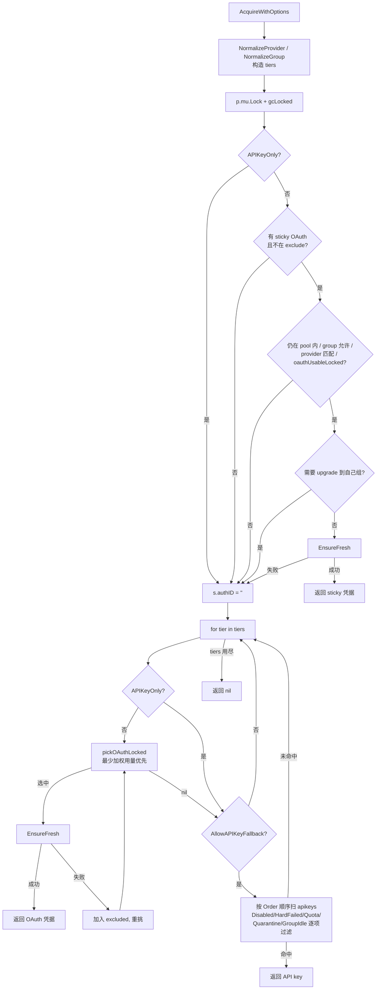
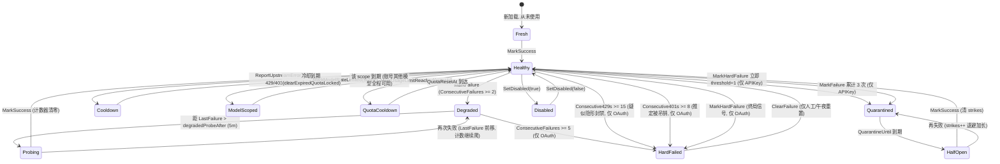

# auth —— 凭据调度与健康状态机

> [← Wiki 首页](Home) · [架构总览](Architecture)

> 本页基于 cc-core 仓库 `auth/` 包的真实源码整理（`pool.go` / `types.go` / `schedule.go` / `provider.go` / `retry.go` 及相关测试）。所有行号均对应当前 `main` 分支的实际代码。

---

## 概览

`auth` 包是 cc-core 中最"承重"的子系统：它同时负责

1. **凭据调度**——把一次客户端请求分配到某个上游凭据（Anthropic / OpenAI 的 OAuth 订阅账号，或 API key 渠道）；
2. **健康状态机**——记录每个凭据的成功/失败/限流/封禁信号，决定它何时该退出轮转、何时该被重新探测、何时该被永久拉黑等待人工介入；
3. **瞬时错误分类**——区分"网线抖了一下"和"这个凭据坏了"，前者在**同一凭据**上原地重放，后者才允许触发 failover。

三者耦合极紧：一次错误分类失误（把 h2 连接死亡当成凭据失败）就会在一秒内打出一串 `MarkFailure`，把整个 provider 的凭据池打黑。本页把每条规则连同它的**回归测试**一起列出，作为规范而非启发式来对待。

核心对象关系：

```
Pool  (auth/pool.go:36)
 ├── oauths  []*Auth      并发受限（MaxConcurrent），按加权用量最少优先
 ├── apikeys []*Auth      不限并发，按 Order 优先级顺序扫描
 └── sessions map[slotKey]*session   粘性会话槽位
       slotKey = provider + "|" + clientToken + "|" + sessionID   (auth/pool.go:73)

Auth  (auth/types.go:44)  单个上游凭据 + 它自己的健康状态机
```

---

## 核心类型

### `Kind`（auth/types.go:34-39）

| 值 | 含义 |
|---|---|
| `KindOAuth`（iota = 0） | OAuth 订阅凭据，受 `MaxConcurrent` 槽位约束，会自动 hard-fail |
| `KindAPIKey`（= 1） | API key / BYOK / 中转渠道，不限并发，**永不**被自动 sticky 拉黑，改用熔断器 |

### `Provider`（auth/provider.go:10-13）

| 常量 | 值 | 别名（`NormalizeProvider`，auth/provider.go:20） |
|---|---|---|
| `ProviderAnthropic` | `"anthropic"` | `""`（legacy 空值）、`"claude"` |
| `ProviderOpenAI` | `"openai"` | `"codex"`、`"chatgpt"` |

`IsKnownProvider`（auth/provider.go:33）判定是否是这两个规范值之一；未知非空值被 case-fold 后保留，但系统其余部分不认识。

### `Group`（auth/types.go:18 `NormalizeGroup`）

- `""` 与 `"public"`（不区分大小写）→ 规范化为 `""`，即公共池；
- `"new"`（不区分大小写）→ 规范化为小写 `"new"`，是内置保留组（有定时休眠，见下）；
- 其余值 trim 后**区分大小写**保留。

### `Auth` 字段全表（auth/types.go:44-213）

| 字段 | 行 | 说明 |
|---|---|---|
| `mu sync.RWMutex` | 45 | 保护所有可变字段 |
| `refreshMu sync.Mutex` | 46 | 串行化 OAuth refresh，防止并发烧掉轮转的 refresh_token |
| `ID string` | 48 | 稳定标识（OAuth: 文件 basename；APIKey: `apikey:<label-or-prefix>`） |
| `Kind Kind` | 49 | 见上 |
| `Provider string` | 50 | 路由 + per-provider token endpoint |
| `Label`, `Email` | 51-52 | 展示用 |
| `AccessToken` | 55 | OAuth: 访问令牌；APIKey: 字面 key |
| `RefreshToken` | 56 | 仅 OAuth |
| `ExpiresAt time.Time` | 57 | 访问令牌过期时间 |
| `IDToken` | 62 | Codex：携带 ChatGPT 账号 claims |
| `AccountID` | 63 | Codex：驱动上游请求头 |
| `PlanType` | 64 | Codex：per-plan 模型可见性 |
| `AccountUUID` | 72 | Anthropic OAuth token-exchange 返回；body mimicry 用于 `metadata.user_id.account_uuid` |
| `OrganizationUUID` | 73 | 同上，来自 token-exchange |
| `OrganizationType` | 85 | 来自 `/api/claude_cli/bootstrap`，如 `claude_max` / `claude_pro` / `claude_team` |
| `OrganizationRateLimitTier` | 86 | 如 `default_claude_max_20x`；GrowthBook sidecar 用 |
| `HostProfile HostProfile` | 95 | per-account 合成 Linux 主机画像（hostprofile.go） |
| `ProxyURL` | 98 | per-credential 上游代理（空 = 直连/用默认） |
| `BaseURL` | 99 | per-credential base URL 覆盖（**仅 API-key**） |
| `MaxConcurrent int` | 100 | OAuth: 最大并发客户端会话数，`0 = 不限`；APIKey: **忽略** |
| `Group string` | 106 | 组门控，`"" = public` |
| `ModelMap map[string]string` | 116 | **仅 API-key**，纯**改写表**，**不是白名单**（见 `ResolveUpstreamModel` / `AcceptsModel`） |
| `StripThinking bool` | 126 | 前置清洗历史 `thinking` 签名；首次签名错误恢复成功后自动置位并持久化 |
| `Order int` | 135 | **仅 API-key** 的选择优先级，越小越先；0 = 未排名 |
| `PriceMultiplier float64` | 144 | **仅 API-key** 计费覆盖；`>0` 时按 `official_price × PriceMultiplier` 计费，绕过 pricing-group 倍率 |
| `FilePath` | 147 | 凭据文件来源 |
| **健康相关** | | |
| `Disabled bool` | 150 | 人工禁用；`IsHealthy` 独立尊重此位 |
| `QuotaExceededAt time.Time` | 151 | 非零 = 处于配额/冷却状态 |
| `QuotaResetAt time.Time` | 152 | 冷却到期时间；零值 = 只能人工清除（但 `clearExpiredQuotaLocked` 会在 1h 后兜底清除） |
| `ModelRateLimits map[string]time.Time` | 163 | **按模型族**限流，key 如 `"anthropic:fable"`。**永不**让凭据全局不可调度 |
| `LastFailure time.Time` | 164 | 最近一次失败 |
| `LastFailureReason string` | 165 | |
| `LastSuccess time.Time` | 166 | 每次 `<400` 上游响应时设置 |
| `ConsecutiveFailures int` | 167 | 成功即清零；驱动自动 hard-fail 与 quarantine |
| `Consecutive429s int` | 168 | 成功即清零；驱动 429 专属 hard-fail（疑似隐形封禁） |
| `Consecutive401s int` | 169 | 成功即清零；驱动 401 专属 hard-fail（见 `MarkAuthRejection`） |
| `HardFailureAt time.Time` | 170 | **粘性**不健康，只有 `ClearFailure` 能清 |
| `HardFailureReason string` | 171 | |
| `QuarantineUntil time.Time` | 178 | **API-key 熔断器**的暂停截止时间（是 deadline，不是粘性标志） |
| `QuarantineStrikes int` | 179 | 连续熔断轮数，驱动指数退避 |
| `LastClientCancel time.Time` | 184 | 客户端主动断开；**仅**管理面可见，绝不影响健康 |
| `LastClientCancelReason string` | 185 | |
| `CodexRateLimits map[string]string` | 193 | 从 `/responses` 响应头逐字捕获的 `x-codex-*` |
| `CodexRateLimitsAt time.Time` | 194 | |
| `CodexUsage *CodexUsageInfo` | 202 | wham/usage 主动探测快照（"还剩多少额度"） |
| `CodexUsageAt time.Time` | 203 | |
| `CodexSubscription *CodexSubscriptionInfo` | 211 | 订阅/账单探测（"买了什么、何时续期、是否欠费"） |
| `CodexSubscriptionAt time.Time` | 212 | |

### `AuthInfo`（auth/types.go:378-411）

`Auth.Snapshot()`（auth/types.go:329）返回的只读快照。注意它**不包含** `ConsecutiveFailures` / `HardFailureAt` 等——那些通过 `HealthSnapshot()` 单独取。快照过程中会顺带调用 `clearExpiredQuotaLocked` 和 `quarantinedLocked`，所以管理面永远看不到过期的 quota badge 或过期的 pause。

### `Pool` 与 `session`（auth/pool.go:36-75）

- `Pool.sessions` 的 key 是 `slotKey(provider, clientToken, sessionID)`（auth/pool.go:73）。
- `sessionID` 非空 → 每个客户端窗口（一个 Claude Code CLI session）是**独立槽位**，同一用户多开窗口会被分散到不同凭据上；
- `sessionID` 为空 → 退化为"每 (provider, clientToken) 一个槽位"，供不发送窗口标识的裸 API 调用方使用。

`Status`（auth/pool.go:595）、`AuthLabelInfo`（auth/pool.go:635）、`AcquireOptions`（auth/pool.go:148）是配套的导出结构。

---

## 公开 API 速查表

### `Pool` 方法

| 签名 | 位置 | 一句话 |
|---|---|---|
| `NewPool(oauths, apikeys []*Auth, activeWindow time.Duration, useUTLS bool, defaultProxy string) *Pool` | pool.go:77 | 构造池；给未设代理的 OAuth 套默认代理，并按 `Order` 稳定排序 API keys |
| `(p *Pool) UseUTLS() bool` | pool.go:109 | 是否使用 uTLS Chrome 指纹传输 |
| `(p *Pool) ActiveWindow() time.Duration` | pool.go:110 | 会话活跃窗口时长 |
| `(p *Pool) SetUsageLoadFunc(fn func(authID string) int64)` | pool.go:117 | 装载负载均衡回调（返回滚动窗口内的加权 token 用量） |
| `(p *Pool) Acquire(ctx, provider, clientToken, clientGroup, clientModel, sessionID string, excludeIDs ...string) *Auth` | pool.go:171 | 向后兼容入口：等价于 `AcquireWithOptions` 且 `AllowAPIKeyFallback: true` |
| `(p *Pool) AcquireWithOptions(ctx, provider, clientToken, clientGroup, clientModel, sessionID string, opts AcquireOptions) *Auth` | pool.go:200 | 真正的调度实现（sticky → 分层 OAuth → 分层 API key） |
| `(p *Pool) AcquireMulti(ctx, provider, clientToken string, clientGroups []string, clientModel, sessionID string, excludeIDs ...string) (string, *Auth)` | pool.go:380 | 按优先级遍历多个 group，返回**实际服务的 group** + 凭据 |
| `(p *Pool) AcquireMultiWithOptions(ctx, provider, clientToken string, clientGroups []string, clientModel, sessionID string, opts AcquireOptions) (string, *Auth)` | pool.go:408 | 同上，带 `AcquireOptions` 门控 |
| `(p *Pool) Release(provider, clientToken, sessionID string)` | pool.go:436 | 把会话的 `lastSeen` 打成"现在"，延长活跃窗口（请求结束时调用） |
| `(p *Pool) SessionsHeld(provider, clientToken, sessionID string) (held int, already bool)` | pool.go:462 | 该 client token 在此 provider 上占了多少活跃槽位；`already` 区分"新槽位"与"已持有" |
| `(p *Pool) Unstick(provider, clientToken, sessionID string)` | pool.go:486 | 清除粘性绑定，让下次 `Acquire` 重新选凭据 |
| `(p *Pool) Status() []Status` | pool.go:601 | 全量快照：每个凭据 + 当前活跃会话数 + 原始 client token 列表 |
| `(p *Pool) LabelIndex() map[string]AuthLabelInfo` | pool.go:643 | authID → 当前 (Label, Kind)，供请求日志回填改名 |
| `(p *Pool) HasAPIKeyFor(provider, clientGroup, model string) bool` | pool.go:672 | 是否存在可用 API key 能服务该 (provider, group, model)——用于 fail-fast |
| `(p *Pool) FindByID(id string) *Auth` | pool.go:709 | 按 ID 查找（OAuth 或 API key） |
| `(p *Pool) AddOAuth(a *Auth) error` | pool.go:727 | 注册 OAuth；校验代理、拒绝重复 Anthropic account_uuid、同 ID 替换 |
| `(p *Pool) AddAPIKey(a *Auth)` | pool.go:775 | 注册 API key，同 ID 替换并重排序 |
| `(p *Pool) ReorderAPIKeys(orderedIDs []string) error` | pool.go:802 | 按给定 ID 序列重排优先级并持久化；未列出的 key 保持相对顺序排在后面 |
| `(p *Pool) RemoveOAuth(id string) *Auth` | pool.go:841 | 摘除 OAuth 并删除指向它的粘性会话 |
| `(p *Pool) RemoveAuth(id string) *Auth` | pool.go:859 | 按 ID 摘除任意凭据（先查 API key，再回落到 `RemoveOAuth`） |
| `(p *Pool) RefreshExpiring(ctx, leeway time.Duration)` | pool.go:881 | 主动刷新 `leeway` 内将过期的 OAuth；跳过 disabled / hard-failed |
| `(p *Pool) RunRefresher(ctx, interval, leeway time.Duration)` | pool.go:900 | 定时器循环调用上者；启动时先立刻跑一次 |
| `(p *Pool) ResetUnhealthyAnthropicAPIKeys() int` | pool.go:931 | 清除所有**不健康的 Anthropic API key**的失败/配额状态（跳过人工 disabled），返回条数 |
| `(p *Pool) RunDailyAnthropicAPIKeyReset(ctx)` | pool.go:963 | 每本地午夜跑一次上者 |
| `(p *Pool) ReportUpstreamError(a *Auth, status int, resetAt time.Time)` | pool.go:993 | 把上游 HTTP 状态码映射成健康状态迁移（见下表） |

包级辅助：`MaskToken(t string) string`（pool.go:658）——`前4...后4`，长度 ≤8 时返回 `"***"`。

导出错误：`ErrDuplicateClaudeAccountUUID`、`ErrCredentialFileAccountMismatch`（pool.go:16-17）。

### `AcquireOptions`（auth/pool.go:148-166）

| 字段 | 行 | 语义 |
|---|---|---|
| `AllowAPIKeyFallback bool` | 157 | 是否允许在某 tier 内回落到 API key。**也门控 API-key-only 模型**（如 fable）：为 false 时这些模型直接返回 nil，而不是违反调用方的计费 opt-in |
| `APIKeyOnly bool` | 162 | 完全跳过 OAuth 选择（用于本地请求准备失败后、用原始 body 重放）。**仍然要求** `AllowAPIKeyFallback`，调用方不能借此绕过计费 opt-in |
| `ExcludeIDs []string` | 165 | 本次请求已试过并失败的凭据 ID |

### `Auth` 健康与调度相关方法

| 签名 | 位置 | 一句话 |
|---|---|---|
| `Snapshot() AuthInfo` | types.go:329 | 只读快照，顺带清除过期 quota / quarantine |
| `IsQuotaExceeded(now) bool` | types.go:417 | 是否处于账号级冷却；顺带自动清除已过期状态 |
| `MarkQuotaExceeded(resetAt)` | types.go:424 | 打上账号级冷却 |
| `IsQuarantined(now) bool` | types.go:439 | API-key 熔断器是否打开（过期自动清除 deadline，但**不清 strikes**） |
| `QuarantineSnapshot() (until time.Time, strikes int)` | types.go:491 | 管理面用的熔断快照 |
| `MarkFailure(reason string)` | types.go:498 | 通用失败：`ConsecutiveFailures++`；OAuth 达阈值 → sticky hard-fail；API key → 触发 quarantine |
| `MarkRateLimited(reason string) int` | types.go:531 | 429：`Consecutive429s++`，**不动** `ConsecutiveFailures` / `LastFailure`；返回新计数供调用方算退避 |
| `MarkAuthRejection(reason string) int` | types.go:567 | 明确的 401 authentication_error：`Consecutive401s++`，同样不动通用计数器；返回新计数 |
| `MarkUsageLimitReached(resetAt)` | types.go:590 | Claude 订阅 5h/周额度 429：设真实冷却，**显式不动** `Consecutive429s` |
| `MarkModelRateLimited(scope string, resetAt)` | types.go:633 | 按模型族打冷却，**不影响账号级健康**，也不动 `Consecutive429s` |
| `IsModelRateLimited(scope string, now) bool` | types.go:648 | 该模型族是否在冷却；过期条目顺带删除 |
| `MarkClientCancel(reason string)` | types.go:670 | **只记时间戳和原因**，绝不触碰任何健康字段 |
| `ClientCancelSnapshot() (time.Time, string)` | types.go:682 | 管理面读取 |
| `MarkHardFailure(reason string)` | types.go:706 | 终局信号：OAuth → 直接 sticky hard-fail；API key → `ConsecutiveFailures++` 且 **threshold=1** 立即熔断 |
| `MarkSuccess()` | types.go:722 | 三个连续计数器全部清零，并**关闭熔断器**（清 `QuarantineUntil` 与 `QuarantineStrikes`） |
| `ClearFailure()` | types.go:743 | 管理面手动复位：清空全部失败/硬失败/熔断状态，并把 `LastSuccess` 设为现在 |
| `IsHealthy() bool` | types.go:762 | 调度器用的健康判定（见下） |
| `HealthSnapshot() (healthy, hardFailure bool, reason string, consecutive int)` | types.go:812 | 管理面用的健康判定，**逻辑与 `IsHealthy` 重复实现**（不重复加锁） |
| `IsHardFailed() bool` | types.go:904 | 是否已 sticky 拉黑 |
| `ClearQuota()` | types.go:910 | 清账号级冷却 **并把 `ModelRateLimits` 整个置 nil** |
| `Credentials() (accessToken string, kind Kind)` | types.go:858 | 取鉴权所需字段 |
| `CodexIdentity() (accountID, planType string)` | types.go:867 | Codex 身份字段 |
| `CaptureCodexRateLimits(h map[string][]string)` | types.go:879 | 逐字捕获 `x-codex-*` 响应头（任何状态码都捕获） |
| `SetDisabled(v bool)` | types.go:919 | 人工启停 |
| `SetMaxConcurrent(n int)` | types.go:926 | 负数归零 |
| `SetProxyURL / SetBaseURL / SetOrder / SetPriceMultiplier / SetGroup / SetModelMap` | types.go:936 / 944 / 953 / 969 / 988 / 1004 | 各字段写入器 |
| `OrderValue() / PriceMultiplierValue() / GroupName()` | types.go:960 / 980 / 995 | 加锁读取器 |
| `ResolveUpstreamModel(clientModel string) (upstream string, ok bool)` | types.go:1029 | 按 `ModelMap` 改写模型名；**`ok` 恒为 true**（保留只为调用点对称） |
| `AcceptsModel(clientModel string) bool` | types.go:1046 | **恒返回 true**——`ModelMap` 是改写表不是白名单 |
| `EnsureFresh(ctx, leeway, useUTLS) error` | oauth.go:704 | 必要时刷新 access token；有效 leeway = `max(leeway, MinRefreshLeeway())` |
| `MinRefreshLeeway() time.Duration` | oauth.go:724 | per-provider 最小刷新提前量 |
| `Persist() error` | oauth.go:586 | 写回凭据文件 |
| `AccountKey() / AccountUUIDValue()` | oauth.go:207 / 220 | 身份锚点（供 mimicry 派生内容寻址标识） |

包级模型辅助（types.go）：

| 标识 | 位置 | 值/语义 |
|---|---|---|
| `ModelScopeAnthropicFable` | types.go:602 | 常量，`"anthropic:fable"` |
| `AnthropicModelScope(model string) string` | types.go:609 | 归一化后匹配 `claude-fable-5` / `claude-fable-5-*` / `claude-fable-5[*`（先剥 `anthropic/` 前缀、转小写），命中返回 fable scope，否则 `""` |
| `AnthropicModelRequiresAPIKey(model string) bool` | types.go:623 | `AnthropicModelScope(model) == ModelScopeAnthropicFable` |

---

## 调度算法

### `AcquireWithOptions` 的真实分支（auth/pool.go:200-364）

**第 0 步：归一化与分层（pool.go:201-227）**

```
provider    = NormalizeProvider(provider)
clientGroup = NormalizeGroup(clientGroup)
sessionKey  = slotKey(provider, clientToken, sessionID)
```

tiers 按优先级构造：

1. 若 `clientGroup != "" && clientGroup != "new"` → 第一层 = `{clientGroup}`；
2. **总是**追加共享层 = `{"new", ""}`（NEW 与 public **同优先级**，由负载均衡器在两者之间统一挑最轻的）。

也就是说：已经在 `"new"` 或 public 的客户端**只有一层**。

**第 1 步：sticky 复用（pool.go:229-285）**

在 `p.mu` 下先 `gcLocked(now)` 淘汰 `lastSeen` 早于 `now - activeWindow` 的会话（pool.go:125）。

sticky 复用需要**同时**满足：

- `!opts.APIKeyOnly`
- `s.authID != ""` 且 `s.kind == KindOAuth`
- `!excluded[s.authID]`
- `findOAuthLocked(s.authID) != nil`
- `allowed(a.Group)`（属于任一 tier）
- `NormalizeProvider(a.Provider) == provider`
- `p.oauthUsableLocked(a, now, clientModel)`
- **且不需要 upgrade**：当客户端是具名非共享组、当前 sticky 落在别的组、且 `pickOAuthLocked` 在自己组里能挑到人时，`upgrade = true`，强制解绑重选。这条是为了避免"组客户端被钉死在 public 一整个活跃窗口"。

复用成功后先 `s.lastSeen = now`，**解锁再** `EnsureFresh(ctx, 5*time.Minute, p.useUTLS)`；刷新失败则把该 ID 加入 `excluded`、清 `s.authID`、重新加锁落入挑选循环。

三个"清 stickiness"的旁路分支：

- `opts.APIKeyOnly` → 清 `s.authID`，直奔 API key（pool.go:276-280）；
- `excluded[s.authID]` → 清（pool.go:281-285）；
- sticky 凭据不健康/消失/组不允许 → 清（pool.go:272-275）。

**第 2 步：逐 tier 挑选（pool.go:291-360）**

对每个 tier：

1. 若非 `APIKeyOnly`，循环调用 `pickOAuthLocked`：选中 → 写 `s.authID/s.kind/s.lastSeen` → 解锁 → `EnsureFresh`；失败则加入 `excluded`、清 `s.authID`、`continue` 继续在同一 tier 内挑下一个。`pickOAuthLocked` 返回 nil 时 `break`。
2. 若 `!opts.AllowAPIKeyFallback` → **`continue` 到下一 tier**（注意不是 `break`：下一 tier 的 OAuth 仍会被尝试，但 API key 门控在那里同样生效）。
3. 顺序扫描 `p.apikeys`（已按 `Order` 升序稳定排序），第一个通过下列全部检查的即返回：
   - `NormalizeProvider(k.Provider) == provider`
   - `tier[k.Group]`
   - `!excluded[k.ID]`
   - `!k.Disabled`
   - `!k.IsHardFailed()`
   - `!k.IsQuotaExceeded(now)`
   - `!k.IsQuarantined(now)` ← 熔断器
   - `!isGroupIdleNow(k.Group, now)` ← 组定时休眠
   - `k.AcceptsModel(clientModel)`（恒 true，保留占位）

全部 tier 走完仍无 → 返回 `nil`。

### `oauthUsableLocked`（auth/pool.go:504-535）

按顺序：

1. **fable 强制走 API key**：`NormalizeProvider(a.Provider) == ProviderAnthropic && AnthropicModelRequiresAPIKey(clientModel)` → false（pool.go:509）。这是 fable 绕开订阅 OAuth 的**唯一**落点。
2. `a.Disabled` → false
3. `a.IsHardFailed()` → false
4. `a.IsQuotaExceeded(now)` → false
5. `scope := AnthropicModelScope(clientModel); scope != "" && a.IsModelRateLimited(scope, now)` → false（**只**屏蔽该模型族，账号继续服务其他模型）
6. `isGroupIdleNow(a.Group, now)` → false

> ⚠️ **`oauthUsableLocked` 刻意不是 `IsHealthy()`。** 它只排除"这次请求必然失败或不许发"的状态（disabled / hard-failed / 冷却中 / 该模型族限流 / 组休眠），而放行**仅仅 degraded**（`ConsecutiveFailures ≥ 2` 但未到 hard-fail 阈值）的凭据。
>
> 这个不对称是有意的：`IsHealthy` 的 degraded 窗口是**管理面口径**，把它变成路由过滤器正是 2026-07-14 事故的成因 —— 一次上游抖动在同一分钟内把整池打成 degraded，`Acquire` 无人可返，所有客户端拿到 503。跳过一个 degraded 凭据只有在"还有别人可用"时才安全，而调度器在这一层无从判断；在 degraded 凭据上失败一次的代价是一次重试，返回 nil 的代价是客户端 503。
>
> degraded 状态并没有失效：它喂给 `HealthSnapshot`，并且持续失败会把 `ConsecutiveFailures` 推到 `hardFailureThreshold` —— 那个状态本函数是**认**的。`IsHealthy()` 在池内只被 `ResetUnhealthyAnthropicAPIKeys`（pool.go:949）使用。理由已写进 `auth/pool.go` 的函数注释。

### `pickOAuthLocked`（auth/pool.go:550-590）

候选筛选（对每个 `p.oauths` 元素）：

```
allowedGroups[a.Group]                        // 精确匹配 tier 集合
NormalizeProvider(a.Provider) == provider
!excluded[a.ID]
p.oauthUsableLocked(a, now, clientModel)
capN := a.MaxConcurrent; !(capN > 0 && activeCountLocked(a.ID, now) >= capN)   // capN == 0 = 无限
```

排序（`sort.SliceStable`，pool.go:583）：

1. `usageLoad(a.ID)` **升序**——即"最近加权 token 用量最少者优先"；`usageLoad == nil` 时全为 0；
2. 平手时按 `a.ID` 字典序，保证确定性。

> 关键：**不是 spare-slot-first**。只要还有空位就是合法候选，排序键是加权用量（input 1× / cache_create 1.25× / cache_read 0.1× / output 5×），这样 cache 重的客户端不会靠近乎免费的 cache_read 把某个凭据饿死。

### `activeCountLocked`（auth/pool.go:136-145）

只统计 `s.authID == authID && s.kind == KindOAuth && !s.lastSeen.Before(now - activeWindow)` 的**不同会话**。因此 sticky 复用不会把自己重复计数。

### 流程图



### 组定时休眠（auth/schedule.go）

- 仅 `"new"` 组有排班（schedule.go:35）。
- `groupNewIdleHoursPerDay = 10`（schedule.go:24）：每个本地日随机抽 **10 个整点小时**停止路由。
- 种子由**日期 + 组名**决定（schedule.go:46-51），因此同一天所有服务实例算出同一组小时，无需共享状态。
- 缓存 key = `"group|YYYY-MM-DD"`，超过 32 条时清空其他项（schedule.go:60-66）。
- `isGroupIdleNow(group, now)`（schedule.go:73）：`group == ""` 恒 false。
- 强制点：`oauthUsableLocked`（pool.go:530）、`Acquire` 的 API-key 循环（pool.go:345）、`HasAPIKeyFor`（pool.go:696）。

### `AcquireMulti` 的 exclude 传播（auth/pool.go:380-）

`excludeIDs` **原样**传给每个 group 的 `Acquire`，逐个 group 尝试，第一个拿到凭据的 group 即返回。

早期版本用一个 `tried` map 包装它，注释声称"边走边收集失败的凭据"，但循环体内从不往里加元素 —— `Acquire` 返回 nil 时确实无从得知它考虑过谁。该 map 已删除，注释同步为实际语义。

`AcquireMultiWithOptions` 曾在扇出时重建 `AcquireOptions` 而**漏传 `APIKeyOnly`**：调用方在身份改写失败后想用原始 body 只走 API key，却拿回一个 OAuth 凭据。已修复，回归测试 `TestAcquireMultiWithOptionsPropagatesAPIKeyOnly`。

---

## 健康状态机

### 阈值常量表

| 常量 | 值 | 位置 | 作用 |
|---|---|---|---|
| `healthGrace` | `2 * time.Minute` | types.go:218 | 孤立失败的乐观恢复窗口：`ConsecutiveFailures < 2` 且距 `LastFailure` 超过它 → 判健康 |
| `degradedProbeAfter` | `5 * time.Minute` | types.go:233 | degraded 自恢复探测间隔：连续失败被隔离的凭据每隔它放一个请求进去重新探测 |
| `hardFailureThreshold` | `5` | types.go:238 | 连续非冷却失败达此数 → OAuth 自动 sticky hard-fail |
| `rateLimit429HardFailureThreshold` | `15` | types.go:244 | 连续 429 达此数 → 推定隐形封禁，OAuth sticky hard-fail |
| `auth401HardFailureThreshold` | `8` | types.go:307 | 连续明确 401（且 refresh 仍成功）达此数 → 推定 entitlement 被剥夺，OAuth sticky hard-fail |
| `apiKeyQuarantineThreshold` | `3` | types.go:261 | API-key 连续失败达此数 → 打开熔断（暂停，非退休） |
| `apiKeyQuarantineBackoff(n)` | `10s / 30s / 2m / 5m / 15m` | types.go:272-285 | 第 n 轮熔断的暂停时长（n≤1→10s，2→30s，3→2m，4→5m，≥5→15m），实际再叠 ±20% jitter（types.go:482） |
| `rateLimit429Cooldown(n)` | `30s / 1m / 2m / 5m / 10m` | pool.go:1053-1066 | 第 n 次连续 429 的冷却时长，上限 10 分钟；**仅在上游未给 Retry-After 时使用** |
| `transientRetryBackoffs` | `300ms, 700ms, 1400ms, 2500ms` | retry.go:22-27 | 瞬时错误在**同一凭据**上的重放退避基值；`len()` 即最大重试次数（4），总额外延迟 ≈5s |
| `groupNewIdleHoursPerDay` | `10` | schedule.go:24 | `"new"` 组每日随机休眠整点数 |
| quota 未知 reset 的兜底 | `1 * time.Hour` | types.go:319 | `QuotaResetAt` 为零时，`QuotaExceededAt + 1h` 后自动清除 |
| `EnsureFresh` 的 leeway（调度路径） | `5 * time.Minute` | pool.go:260, pool.go:302 | `Acquire` 内刷新 token 的提前量 |

### 状态迁移图



### `IsHealthy` 的判定顺序（auth/types.go:762-806）

```
clearExpiredQuotaLocked(now)
1. Disabled                        → false
2. HardFailureAt 非零              → false
3. QuotaExceededAt 非零            → false
4. Kind == KindAPIKey              → return !quarantinedLocked(now)   ← 提前返回，下面全部不适用
5. LastFailure 为零                → true
6. LastSuccess.After(LastFailure)  → true
7. ConsecutiveFailures < 2 && since(LastFailure) > healthGrace(2m)  → true
8. since(LastFailure) > degradedProbeAfter(5m)                      → true   ← degraded 自恢复探测
9. 否则                             → false
```

**第 4 条是关键**：API-key 渠道**不参与** OAuth 那套开放式 degraded 启发式，只受**有界的**熔断器管辖。理由写在 types.go:775-784：一个中转渠道跑出一串 500，如果按 OAuth 规则会在跨过阈值后掉出轮转且**再也回不来**（若它是该模型唯一渠道）。

**第 8 条是另一个关键**：没有它，`ConsecutiveFailures >= 2` 就是**终态**——不健康 → 永不被 Acquire → 永远没有成功来清零计数器 → 永久变黑。一次让某 provider 每个凭据都吃到两次失败的上游抖动，会把整个池打黑直到人工清理。探测闭环要么成功（`MarkSuccess` 清零，完全恢复），要么失败（`LastFailure` 前移，再隔离一轮，计数向 `hardFailureThreshold` 爬——那才是真正死掉的凭据该去的终态）。

### `HealthSnapshot` 的双份逻辑（auth/types.go:812-854）

`HealthSnapshot` 面向管理面，**不重新加锁**，因此把 `IsHealthy` 的判定**逐条复刻**了一遍（types.go:831-852）：

| `IsHealthy` 分支 | `HealthSnapshot` 对应行 |
|---|---|
| `Disabled` | types.go:833 |
| `hardFailure` | types.go:835 |
| `QuotaExceededAt` 非零 | types.go:837 |
| `Kind == KindAPIKey` → `!quarantined` | types.go:842-843 |
| `LastFailure` 零 或 `LastSuccess.After(LastFailure)` | types.go:844-845 |
| `ConsecutiveFailures < 2 && since > healthGrace` | types.go:846-847 |
| `since > degradedProbeAfter` | types.go:848-849 |
| default | types.go:850-851 |

它额外返回 `reason`（types.go:820-828）：hard-fail → `HardFailureReason`；quarantined → `"paused until <RFC3339> (strike N): <LastFailureReason>"`；否则若有未被成功覆盖的失败 → `LastFailureReason`。

> **改一处必须同步改另一处。** 历史上 API-key 那条 case（types.go:842）就是因为漏在管理面这一份里，导致一个正在正常服务流量的 key 在面板上显示红色（注释见 types.go:838-841）。

### `ReportUpstreamError` 的状态码映射（auth/pool.go:993-1040）

| 状态 | 行 | 行为 |
|---|---|---|
| `429` | 1007-1025 | `MarkRateLimited(...)` → 取返回计数 n → `setCooldown(rateLimit429Cooldown(n))`（30s→1m→2m→5m→10m 封顶）。若 `resetAt` 非零则**优先用 Retry-After** |
| `403` | 1026-1027 | `setCooldown(1m)`，尊重传入的 `resetAt` |
| `401` | 1028-1032 | **显式丢弃 `resetAt`**（`resetAt = time.Time{}`），再 `setCooldown(1m)`。理由：401 的 Retry-After 通常是与凭据无关的限流提示 |
| `529` | 1033-1036 | 仅 `MarkFailure("upstream 529 (overloaded)")`，**不设冷却** |
| `>= 500` | 1037-1038 | 仅 `MarkFailure("upstream N")`，**不设冷却** |
| 其他 | — | 无动作 |

注意 `setCooldown` 走的是 `MarkQuotaExceeded`（pool.go:1003），因此 401/403/429 **不会**递增 `ConsecutiveFailures`。

---

## 瞬时错误 vs 凭据错误

### `IsTransientNetErr`（auth/retry.go:76-90）

先查 sentinel（retry.go:80）：

- `errors.Is(err, syscall.ECONNRESET)`
- `errors.Is(err, syscall.EPIPE)`
- `errors.Is(err, io.EOF)`

再对 `err.Error()` 做**纯子串**匹配（retry.go:83-89）。之所以是子串而非类型断言：h2 栈会把这些包好几层（`"stream error: stream ID 23; PROTOCOL_ERROR; received from peer"`），而握手层的 RST 会以 `"utls handshake chatgpt.com: read tcp ...: read: connection reset by peer"` 的形式到达。

### `transientErrFragments` 完整清单（auth/retry.go:35-67）

| # | 字符串 | 行 | 出处 / 语义 |
|---|---|---|---|
| 1 | `connection reset by peer` | 37 | TCP RST；CF edge 对 VPS/代理 IP 的新连接限速，常在 TLS 握手中途 |
| 2 | `broken pipe` | 38 | 写侧对端已关 |
| 3 | `unexpected EOF` | 39 | 连接在响应完成前被截断 |
| 4 | `http2: server sent GOAWAY` | 40 | 服务端主动收摊 |
| 5 | `PROTOCOL_ERROR` | 44 | CF 拆流时返回的 h2 stream error；**服务端未处理请求**，重放安全 |
| 6 | `REFUSED_STREAM` | 45 | h2 明确的"没开始处理"码 |
| 7 | `http2: client conn not usable` | 52 | 池化 ClientConn 的底层 SOCKS5 隧道静默死亡；在 h2 **保留连接阶段**返回，请求字节尚未上线 |
| 8 | `http2: no cached connection` | 53 | 同上，同一竞态的另一面 |
| 9 | `http2: client connection lost` | 66 | ClientConn 已发出、请求已写、隧道随后死亡；h2 用它**一次性失败该连接上所有 in-flight stream** |

> **第 9 条是最贵的一课**（注释见 retry.go:60-66；测试注释标注了生产日期 2026-07-14，见 retry_test.go:27-30）：一条死掉的池化连接会在同一瞬间让所有骑在它上面的请求失败。若不归类为瞬时错误，就是同一秒内一串 `MarkFailure`——这正是把一个本来健康的账号推过 degraded 阈值、进而把整个 Codex 池打黑的机制。**新增字符串时必须把逐字错误串加进 `retry_test.go` 的回归用例。**

### `retryRoundTripper`（auth/retry.go:104-139）

安装位置：`ClientFor` 在构造完 uTLS/标准 transport 后统一包一层（auth/utls.go:98），并按 `(proxyURL, useUTLS)` 缓存。注意 `NewPlainHTTPClient`（utls.go:112）**不包**这一层。

重试条件（刻意保守）：

1. **只在拿到响应之前**：一旦 base `RoundTrip` 返回了 `*http.Response`（哪怕是流式的），原样交给调用方，**绝不中途重试**（retry.go:109-111）；
2. **只在请求可重放时**：`replayableRequest`（retry.go:143）= `Body == nil || Body == http.NoBody || GetBody != nil`。`http.NewRequest*` 对 `bytes.Reader` / `strings.Reader` / `bytes.Buffer` 自动设置 `GetBody`；裸流式 body（`GetBody == nil`）永不重试；
3. **只在 `IsTransientNetErr(err)` 为真时**（retry.go:114）；
4. **ctx 一取消立刻结束**（retry.go:114 与 retry.go:121-125）。

退避：`base ± 25%` jitter，`delay = base - base/4 + rand.Int64N(base/2 + 1)`（retry.go:119）。每次重放前用 `req.GetBody()` 回卷 body（retry.go:129-135）。

---

## 常见陷阱与生产事故教训

1. **h2 连接死亡级联**（retry.go:60-66）。一条池化 h2 连接死亡 → 所有 in-flight stream 同时失败 → 一串 `MarkFailure` → 跨过 `hardFailureThreshold` → 整个 Codex 池变黑。修复方式是把逐字错误串加进 `transientErrFragments`，而非调高阈值。

2. **degraded 死锁**（types.go:220-232）。缺少 `degradedProbeAfter` 时，`ConsecutiveFailures >= 2` 是终态：不健康 → 不被选中 → 没有成功 → 永远不健康。任何"跳过不健康凭据"的新增判定都必须配套一条自恢复路径。

3. **`IsHealthy` 与 `HealthSnapshot` 漂移**（types.go:838-841）。两份逻辑分别服务路由与面板；漏同步的直接后果是面板对正在服务流量的凭据显示红色（API-key case 就出过这个问题）。**改一处必改另一处。**

4. **API key 绝不能被自动 sticky 退休**（types.go:504-513、706-718）。它们是运维自管的 BYOK/中转渠道，被钉死离线只能等人工。取而代之的是**有界**熔断器：`MarkFailure` 用 threshold=3，`MarkHardFailure`（明确的凭据拒绝）用 **threshold=1** 立即暂停——重复出示一把已吊销的 key 只会白白多买一次上游往返。

5. **熔断退避必须带 jitter**（types.go:464-466、482）。一批被同一上游故障打倒的 key 若在同一瞬间回来，会一起撞上仍然坏的上游、一起再熔断——把一次故障变成周期性踩踏。

6. **熔断到期只清 deadline，不清 strikes**（types.go:436-438、452-457）。只有 `MarkSuccess` 能清 `QuarantineStrikes`，这样探测失败的渠道退避会继续加长，而不是永远以最短间隔重试。

7. **客户端断开绝不能碰健康计数器**（types.go:666-678）。`MarkClientCancel` 只写 `LastClientCancel` / `LastClientCancelReason`。凭据本身没做错任何事。

8. **订阅额度 429 与隐形封禁 429 必须分开**（types.go:584-595）。`MarkUsageLimitReached` **显式不动** `Consecutive429s`——否则一个完全正常、只是用满 5h 窗口的账号会稳步走向 15 连击的隐形封禁 hard-fail。同理 `MarkModelRateLimited` 也不动它（types.go:628-632）。

9. **单次 401 几乎总是 token 轮转竞态**（types.go:293-306）。`EnsureFresh` 铸出新 token 的瞬间 Anthropic 就作废旧的，任何还在线上、握着旧 bearer 的请求都会 401。繁忙账号每次主动刷新都会孤儿化几个请求。因此阈值定在 **8** 且必须"中间没有任何成功"。真正被吊销的 refresh token 会更早、更权威地被 refresh 路径的 `invalid_grant` hard-fail 抓住；这个计数器只兜底"refresh 正常但每个 `/v1/messages` 都 401"的罕见情形。

10. **`ModelMap` 是改写表，不是白名单**（types.go:108-116、1029-1048）。`ResolveUpstreamModel` 的 `ok` 恒 true，`AcceptsModel` 恒 true。任何"这个 key 只支持这些模型"的直觉都是错的。

11. **fable 只有一条绕开点**（pool.go:509）。Anthropic 订阅 OAuth 对 fable 返回 `credits_required`，哪怕包含额度分毫未动。判定落在 `oauthUsableLocked` 的**第一行**，因此对 sticky 复用路径同样生效——fable 请求会**打断**已有的 sticky OAuth 绑定（见 `TestFableBreaksStickyOAuthAssignment`）。而当调用方 `AllowAPIKeyFallback: false` 时，fable 返回 `nil` 而不是退回 OAuth（`TestFableRespectsDisabledAPIKeyFallback`）。

12. **`ClearQuota` 会连带清空 `ModelRateLimits`**（types.go:910-916）。管理面点一次"清除配额"，所有按模型族的冷却也一起没了。

13. **组 upgrade 检查不能省**（pool.go:249-255）。没有它，一个具名组客户端一旦 sticky 落到 public，就会被钉在 public 上直到整个活跃窗口过期，哪怕自己组的凭据早已恢复容量。

14. **`AllowAPIKeyFallback == false` 用的是 `continue` 不是 `break`**（pool.go:314-318）。这样下一 tier 的 OAuth 仍会被尝试，而 API-key 门控在那里也照样生效。

15. **代理配置失败必须 fail closed**（utls.go:30-32、64-68）。非法代理 URL 返回一个恒报错的 `invalidProxyRoundTripper`，绝不静默降级成直连——这是隔离边界。

---

## 相关测试索引

| 规则 | 测试文件:测试名 |
|---|---|
| API key 永不自动 hard-fail（连续失败只累计计数） | `auth/health_apikey_test.go:19` `TestAPIKeyNeverAutoHardFails` |
| OAuth 连续 5 次失败仍自动 hard-fail | `auth/health_apikey_test.go:68` `TestOAuthStillAutoHardFails` |
| degraded OAuth 无需人工清理即可自恢复（`degradedProbeAfter`） | `auth/health_degraded_test.go:18` `TestDegradedOAuthRecoversWithoutManualClear` |
| 探测持续失败仍会升级为 hard-fail | `auth/health_degraded_test.go:62` `TestFailedProbesStillEscalateToHardFail` |
| 单次 401 不 hard-fail | `auth/auth_rejection_test.go:9` `TestSingle401DoesNotHardFail` |
| 401 与成功交替时永不 hard-fail | `auth/auth_rejection_test.go:29` `TestInterleaved401sNeverHardFail` |
| 持续 401（≥8，无中间成功）→ hard-fail | `auth/auth_rejection_test.go:43` `TestSustained401sHardFail` |
| API key 的 401 永不 hard-fail | `auth/auth_rejection_test.go:59` `TestAPIKey401NeverHardFails` |
| 熔断器只在达到 threshold=3 时打开 | `auth/quarantine_test.go:22` `TestAPIKeyQuarantineOpensOnlyAtThreshold` |
| 熔断到期后半开、放一个探测 | `auth/quarantine_test.go:52` `TestAPIKeyQuarantineExpiresAndProbes` |
| 熔断退避指数增长 | `auth/quarantine_test.go:78` `TestAPIKeyQuarantineBacksOffExponentially` |
| 熔断退避有上限（15m） | `auth/quarantine_test.go:109` `TestAPIKeyQuarantineBackoffIsCapped` |
| `MarkSuccess` 关闭熔断并清 strikes | `auth/quarantine_test.go:124` `TestAPIKeySuccessClosesCircuit` |
| 明确凭据拒绝 → threshold=1 立即暂停 | `auth/quarantine_test.go:150` `TestAPIKeyCredentialRejectionPausesImmediately` |
| OAuth 不受熔断器影响 | `auth/quarantine_test.go:170` `TestOAuthUnaffectedByQuarantine` |
| 调度器跳过被熔断的 API key | `auth/quarantine_test.go:189` `TestPoolSkipsQuarantinedAPIKey` |
| `transientErrFragments` 全量分类（含逐字生产错误串） | `auth/retry_test.go:13` `TestIsTransientNetErr` |
| 瞬时错误重放 + `GetBody` 回卷 | `auth/retry_test.go:69` `TestRetryRoundTripper_ReplaysTransientWithRewind` |
| 非瞬时错误不重试 | `auth/retry_test.go:91` `TestRetryRoundTripper_NoRetryOnNonTransient` |
| ctx 取消立即停止重试 | `auth/retry_test.go:103` `TestRetryRoundTripper_StopsOnCanceledContext` |
| `AnthropicModelScope` 的 fable 变体匹配（dated / `[1m]` / 大小写） | `auth/model_rate_limit_test.go:9` `TestAnthropicModelScope` |
| `AnthropicModelRequiresAPIKey` | `auth/model_rate_limit_test.go:29` `TestAnthropicModelRequiresAPIKey` |
| 按模型族限流的打标与过期 | `auth/model_rate_limit_test.go:47` `TestModelRateLimitMarkAndExpiry` |
| `ClearQuota` 连带清空模型族冷却 | `auth/model_rate_limit_test.go:81` `TestClearQuotaClearsModelScopes` |
| **fable 只走 API key，其他模型不受影响**（端到端） | `auth/model_rate_limit_test.go:93` `TestScheduleRoutesFableOnlyToAPIKey` |
| fable 请求打断已有 sticky OAuth 绑定 | `auth/model_rate_limit_test.go:117` `TestFableBreaksStickyOAuthAssignment` |
| `AllowAPIKeyFallback: false` 时 fable 返回 nil 而非退回 OAuth | `auth/model_rate_limit_test.go:131` `TestFableRespectsDisabledAPIKeyFallback` |
| `ModelMap` 是改写表而非白名单 | `auth/modelmap_test.go:7` `TestModelMapRewriteOnly` |
| OAuth 忽略 `ModelMap`（默认行为） | `auth/model_map_default_test.go:12` `TestOAuthModelMapDefault` |
| `SessionsHeld` 按 (token, provider) 计数 | `auth/sessions_held_test.go:13` `TestSessionsHeldCountsPerTokenPerProvider` |
| API key 按 `Order` 优先级被选中 | `auth/apikey_order_test.go:45` `TestAPIKeyAcquireFollowsOrder` |
| 默认 Order（全 0）保留加载顺序（稳定排序） | `auth/apikey_order_test.go:69` `TestAPIKeyDefaultOrderPreservesLoadOrder` |
| `ReorderAPIKeys` 持久化到凭据文件 | `auth/apikey_order_test.go:81` `TestReorderAPIKeysPersists` |
| 未列出的 key 保持相对顺序排在后面 | `auth/apikey_order_test.go:118` `TestReorderAPIKeysUnlistedKeepRelativeOrder` |
| `AcquireMulti` 单组等价于 `Acquire` | `auth/acquiremulti_test.go:11` `TestAcquireMultiSingleGroup` |
| `AcquireMulti` 逐组回落 | `auth/acquiremulti_test.go:23` `TestAcquireMultiFallthrough` |
| 全部组耗尽 → `("", nil)` | `auth/acquiremulti_test.go:34` `TestAcquireMultiAllExhausted` |
| 空 groups 视为 public | `auth/acquiremulti_test.go:43` `TestAcquireMultiEmptyGroupsTreatedAsPublic` |
| API-key fallback 门控（`AllowAPIKeyFallback`） | `auth/apikey_pricing_test.go:14` `TestAcquireAPIKeyFallbackGate` |
| `APIKeyOnly` 跳过健康的 sticky OAuth | `auth/apikey_pricing_test.go:39` `TestAcquireAPIKeyOnlySkipsHealthyStickyOAuth` |
| `PriceMultiplier` 持久化 | `auth/apikey_pricing_test.go:73` `TestPriceMultiplierPersists` |
| `StripThinking` 持久化 | `auth/strip_thinking_test.go:13` `TestStripThinkingPersistence` |
| `ValidateProxyURL` 的接受/拒绝集合 | `auth/proxy_validation_test.go:14` `TestValidateProxyURL` |
| 凭据解析与登录拒绝非法代理 | `auth/proxy_validation_test.go:27` `TestCredentialParsingAndLoginRejectInvalidProxy` |
| 非法代理配置**绝不**降级为直连 | `auth/proxy_validation_test.go:37` `TestInvalidConfiguredProxyNeverDialsDirect` |
| 代理连接失败**绝不**改连目标站 | `auth/proxy_validation_test.go:61` `TestConfiguredProxyConnectionFailureNeverDialsTarget` |
| 代理鉴权失败**绝不**改连目标站 | `auth/proxy_validation_test.go:86` `TestConfiguredProxyAuthenticationFailureNeverDialsTarget` |
| 重复 Anthropic account_uuid 在加载与 `AddOAuth` 时被拒 | `auth/claude_account_policy_test.go:108` `TestDuplicateClaudeAccountUUIDRejectedOnLoadAndAdd` |
| 重新登录不得覆盖到不同账号的凭据文件 | `auth/claude_account_policy_test.go:76` `TestAnthropicReloginRejectsDifferentAccountOverwrite` |
| 已废弃的 `claude_identity_mode` 键被忽略并在写回时移除 | `auth/claude_account_policy_test.go:12` `TestRetiredClaudeIdentityModeIsIgnoredAndRemovedOnInstall` / `:39` `TestAnthropicReloginRemovesRetiredIdentityMode` |

---

## 相关文件清单

**调度核心**

- `auth/pool.go:36` — `Pool` 结构体与并发模型注释
- `auth/pool.go:73` — `slotKey`（会话槽位 key 构造）
- `auth/pool.go:77` — `NewPool`
- `auth/pool.go:103` — `sortAPIKeysLocked`
- `auth/pool.go:125` — `gcLocked`（活跃窗口淘汰）
- `auth/pool.go:136` — `activeCountLocked`
- `auth/pool.go:148` — `AcquireOptions`
- `auth/pool.go:171` — `Acquire`
- `auth/pool.go:200` — `AcquireWithOptions`（真正的调度实现）
- `auth/pool.go:246` — sticky 复用判定
- `auth/pool.go:291` — 逐 tier 挑选循环
- `auth/pool.go:319` — API-key 回落扫描
- `auth/pool.go:380` — `AcquireMulti`
- `auth/pool.go:408` — `AcquireMultiWithOptions`
- `auth/pool.go:436` — `Release`
- `auth/pool.go:462` — `SessionsHeld`
- `auth/pool.go:486` — `Unstick`
- `auth/pool.go:504` — `oauthUsableLocked`（含 fable 绕行、模型族限流、组休眠）
- `auth/pool.go:550` — `pickOAuthLocked`（最少加权用量优先）
- `auth/pool.go:672` — `HasAPIKeyFor`
- `auth/pool.go:802` — `ReorderAPIKeys`
- `auth/pool.go:931` — `ResetUnhealthyAnthropicAPIKeys`
- `auth/pool.go:993` — `ReportUpstreamError`
- `auth/pool.go:1053` — `rateLimit429Cooldown`

**类型与健康状态机**

- `auth/types.go:18` — `NormalizeGroup`
- `auth/types.go:34` — `Kind`
- `auth/types.go:44` — `Auth`
- `auth/types.go:218` — `healthGrace = 2m`
- `auth/types.go:233` — `degradedProbeAfter = 5m`
- `auth/types.go:238` — `hardFailureThreshold = 5`
- `auth/types.go:244` — `rateLimit429HardFailureThreshold = 15`
- `auth/types.go:261` — `apiKeyQuarantineThreshold = 3`
- `auth/types.go:272` — `apiKeyQuarantineBackoff`
- `auth/types.go:307` — `auth401HardFailureThreshold = 8`
- `auth/types.go:314` — `clearExpiredQuotaLocked`
- `auth/types.go:329` — `Snapshot` / `auth/types.go:378` — `AuthInfo`
- `auth/types.go:445` — `quarantinedLocked`（半开逻辑）
- `auth/types.go:470` — `tripQuarantineLocked`（含 ±20% jitter）
- `auth/types.go:498` — `MarkFailure`
- `auth/types.go:531` — `MarkRateLimited`
- `auth/types.go:567` — `MarkAuthRejection`
- `auth/types.go:590` — `MarkUsageLimitReached`
- `auth/types.go:602` — `ModelScopeAnthropicFable`
- `auth/types.go:609` — `AnthropicModelScope`
- `auth/types.go:623` — `AnthropicModelRequiresAPIKey`
- `auth/types.go:633` — `MarkModelRateLimited` / `auth/types.go:648` — `IsModelRateLimited`
- `auth/types.go:670` — `MarkClientCancel`
- `auth/types.go:706` — `MarkHardFailure`
- `auth/types.go:722` — `MarkSuccess` / `auth/types.go:743` — `ClearFailure`
- `auth/types.go:762` — `IsHealthy`
- `auth/types.go:812` — `HealthSnapshot`（双份逻辑）
- `auth/types.go:1029` — `ResolveUpstreamModel` / `auth/types.go:1046` — `AcceptsModel`

**Provider / 排班 / 重试 / 传输**

- `auth/provider.go:10` — provider 常量
- `auth/provider.go:20` — `NormalizeProvider`
- `auth/schedule.go:24` — `groupNewIdleHoursPerDay = 10`
- `auth/schedule.go:34` — `groupIdleHoursForDate`
- `auth/schedule.go:73` — `isGroupIdleNow`
- `auth/retry.go:22` — `transientRetryBackoffs`
- `auth/retry.go:35` — `transientErrFragments`
- `auth/retry.go:76` — `IsTransientNetErr`
- `auth/retry.go:104` — `retryRoundTripper` / `auth/retry.go:108` — `RoundTrip`
- `auth/retry.go:143` — `replayableRequest`
- `auth/utls.go:33` — `ValidateProxyURL`
- `auth/utls.go:64` — `invalidProxyRoundTripper`（fail closed）
- `auth/utls.go:98` — `retryRoundTripper` 的安装点
- `auth/oauth.go:704` — `EnsureFresh` / `auth/oauth.go:724` — `MinRefreshLeeway`
- `auth/oauth.go:586` — `Persist`

**测试**

- `auth/acquiremulti_test.go`、`auth/apikey_order_test.go`、`auth/apikey_pricing_test.go`、`auth/auth_rejection_test.go`、`auth/claude_account_policy_test.go`、`auth/health_apikey_test.go`、`auth/health_degraded_test.go`、`auth/model_map_default_test.go`、`auth/model_rate_limit_test.go`、`auth/modelmap_test.go`、`auth/proxy_validation_test.go`、`auth/quarantine_test.go`、`auth/retry_test.go`、`auth/sessions_held_test.go`、`auth/strip_thinking_test.go`

---

## 相关页面

[Auth-Login-Codex](Auth-Login-Codex) · [Transports](Transports) · [Billing](Billing)
