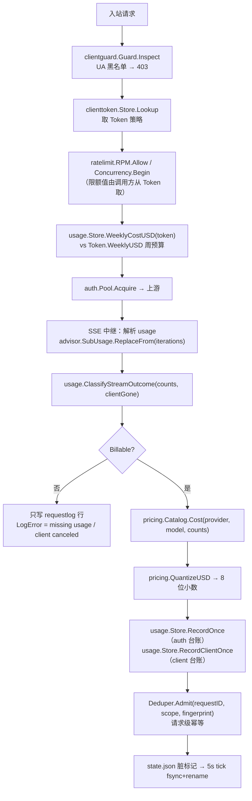
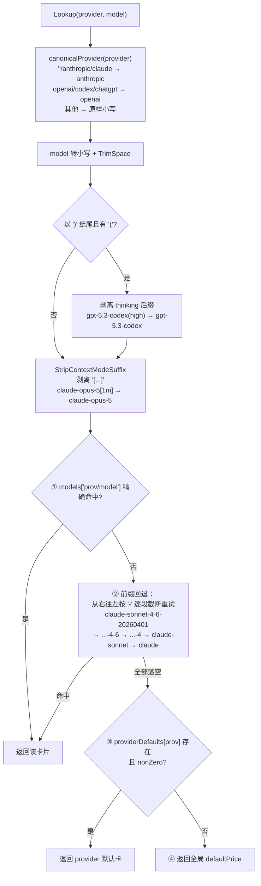

# 计费、配额与网关闸门

> [← Wiki 首页](Home) · [架构总览](Architecture)

本页覆盖 cc-core 中把「一次上游请求」变成「token 计数 → 美元 → 限流/封禁决策」的六个叶子包：
`usage/`、`pricing/`、`ratelimit/`、`clienttoken/`、`clientguard/`、`advisor/`。

这些包被 CPA-Claude 与 hypitoken 两个 fork 同时消费，**改动这里的常量会同时改变两边的生产行为**。

---

## 概览：一次请求如何从 token 计数走到美元与限流



两条关键分界线：

1. **只有被观测到的用量才会计费**（`usage/billing_guard.go`）——估算器已被永久移除。
2. **负载均衡的「忙碌度」与「账单」是两套权重**：`Counts.WeightedTotal()` 是整数加权信号，只喂 OAuth 调度；美元由 `pricing` 独立计算。

---

## usage.Counts 与权重

`Counts` 全字段（`usage/usage.go:66-91`）：

| 字段 | JSON | 说明 |
| --- | --- | --- |
| `InputTokens` | `input_tokens` | 未命中缓存的输入 |
| `OutputTokens` | `output_tokens` | 输出 |
| `CacheCreateTokens` | `cache_create_tokens` | 缓存写入**总量** |
| `CacheReadTokens` | `cache_read_tokens` | 缓存命中读取 |
| `Requests` | `requests` | 请求数（`0` 即「无用量」，见幂等章节） |
| `Errors` | `errors` | 错误数 |
| `CacheCreate1hTokens` | `cache_create_1h_tokens,omitempty` | `CacheCreateTokens` 的**子集**：TTL=1h 的那部分，取自 Anthropic `usage.cache_creation.ephemeral_1h_input_tokens` |

关于 `CacheCreate1hTokens`（`usage/usage.go:74-90`）：

- 它**不是独立轴**。`CacheCreateTokens` 仍是缓存写入全量，所有旧消费者在该字段为 0 时行为完全不变。
- 派生量 `CacheCreate5mTokens()`（`usage/usage.go:106-112`）= 总量 − 1h 子集，**下限截断到 0**，防止上游给出畸形拆分（1h > total）时产生负计费。
- 单独填充它**不改变任何金额**——必须同时把 `ModelPrice.CacheCreate1hPer1M` 设为非零，拆分费率才生效。默认它是纯观测字段。

`Add`（`usage/usage.go:93-101`）逐字段相加，包含 `CacheCreate1hTokens`。

### WeightedTotal 的真实系数

`usage/usage.go:125-127`：

```go
func (c Counts) WeightedTotal() int64 {
	return c.InputTokens*100 + c.CacheCreateTokens*125 + c.CacheReadTokens*10 + c.OutputTokens*500
}
```

| 轴 | 代码里的乘数 | 等效比例 |
| --- | --- | --- |
| input | `*100` | 1× |
| cache_create | `*125` | 1.25× |
| cache_read | `*10` | 0.1× |
| output | `*500` | 5× |

即文档常说的 `1 / 1.25 / 0.1 / 5`，实现上统一 **×100 后用 int64 返回**，让调用方保持整数比较（负载相同时再按 auth ID 破平）。

⚠️ **`CacheCreate1hTokens` 被刻意排除在 `WeightedTotal` 之外**：它是 `CacheCreateTokens` 的子集，加进去会把同一批 token 记两遍，使负载均衡器错误地回避缓存密集的凭证。

这些系数是**行为常量**，没有命名常量包装——它们以字面量形式写死在 `WeightedTotal` 里。`Errors` 与 `Requests` 不参与加权。

---

## usage.Store API 表

`Store`（`usage/usage.go:219-229`）单结构同时持有内存状态与后台 flush goroutine。

| 方法 | 位置 | 语义 |
| --- | --- | --- |
| `Open(path)` | `usage/usage.go:250` | 建目录 → **探针写 `path+".probe"`**（配错 state_dir 立刻失败，而不是整个进程生命周期静默丢弃 flush）→ 读 `state.json` → 起 `loop()` |
| `OpenInMemory()` | `usage/usage.go:234` | 无文件、无 goroutine，API 等价；`Close` 是 no-op |
| `Close()` | `usage/usage.go:287` | 关 `stopCh`、等 `doneCh`、再做一次 `Flush` |
| `Flush()` | `usage/usage.go:321` | 仅在 `dirty` 时写；**任一步出错都把 `dirty` 恢复为 true**，下个 tick 重试 |
| `Record(authID, label, c)` | `usage/usage.go:383` | 累加 Daily + Hourly 桶，更新 `LastUsed`，触发两个保留裁剪 |
| `RecordClient(token, label, counts, costUSD)` | `usage/usage.go:504` | 累加 `Total` 与当前 ISO 周桶，`Requests` 固定 +1 |
| `RecordOnce(requestID, authID, label, c)` | `usage/dedup.go:212` | `Record` + 请求级幂等，返回 `(applied, err)` |
| `RecordClientOnce(requestID, token, label, counts, costUSD)` | `usage/dedup.go:231` | 同上，独立 dedup scope |
| `EnableDedup(d)` | `usage/dedup.go:199` | 装入 `*Deduper`；传 nil 即禁用 |
| `Sum5h(authID)` | `usage/usage.go:662` | 汇总起始小时落在 `[now-5h, now]` 的 Hourly 桶——实际跨度 5~6 小时，喂 OAuth 负载均衡 |
| `Sum24h(authID)` | `usage/usage.go:683` | **近似**：今天 + 昨天两个 Daily 桶相加，不是严格滚动窗口 |
| `WeeklyCostUSD(token)` | `usage/usage.go:552` | 当前 ISO 周该 client token 的美元花费，未知返回 0 |
| `Snapshot()` | `usage/usage.go:445` | per-auth 深拷贝 |
| `SnapshotClients()` | `usage/usage.go:633` | per-client 深拷贝 |
| `MergeClient(src, dst)` | `usage/usage.go:570` | 周桶按 key 相加、总量累加、`LastUsed` 取较晚者，删除 src |
| `RenameClient(src, dst)` | `usage/usage.go:609` | 改键；dst 已存在则拒绝（应改用 Merge）；src 无记录时静默 no-op |
| `CurrentWeekKey()` | `usage/usage.go:652` | 当前 ISO 周 key，供 UI 卡片标注 |
| `SetBucketLocation(l)` / `BucketLocation()` | `usage/usage.go:57` / `:64` | 全局桶时区，默认 UTC，**启动时设一次**，无并发保护 |

### 持久化：fsync + rename

`writeAtomic`（`usage/usage.go:354-379`）：写 `path+".tmp"` → `f.Sync()` → `Close` → `os.Rename` → 再打开重命名后的文件 `Sync()` 一次（尽力而为，依赖文件系统）。

`Flush` 用 `json.Marshal` 而非 `MarshalIndent`，且**持锁期间序列化**——紧凑编码把请求路径上 `Record`/`RecordClient` 的停顿和磁盘体积都大致减半（`usage/usage.go:330-334`）。

### flush tick 与保留裁剪

| 常量 | 值 | 位置 |
| --- | --- | --- |
| `flushInt` | `5 * time.Second` | `usage/usage.go:264` |
| `dailyRetentionDays` | `90` | `usage/usage.go:34` |
| `hourlyRetentionHours` | `24` | `usage/usage.go:38` |
| `weeklyRetentionWeeks` | `26` | `usage/usage.go:44` |
| `hourKeyFormat` | `"2006-01-02T15"` | `usage/usage.go:41` |

裁剪是**惰性**的：`trimDailyLocked` / `trimHourlyLocked`（`usage/usage.go:431` / `:419`）先判 `len(...) <= 保留数` 直接返回，超出才按 cutoff 字符串比较删除；`trimWeeklyLocked`（`usage/usage.go:536`）排序后砍最旧的。桶键与 cutoff 都走 `bucketLoc`，因此改时区不会让键和截止时间对不上。

ISO 周键 `isoWeekKey`（`usage/usage.go:469`）**固定用 UTC**（`t.UTC().ISOWeek()`），与 Daily/Hourly 的 `bucketLoc` 不同——这是刻意的不对称，周账单不随展示时区漂移。

---

## 计费幂等与去重

### 只计已观测用量（`usage/billing_guard.go`）

| 符号 | 位置 | 说明 |
| --- | --- | --- |
| `MissingUsageError = "missing usage"` | `usage/billing_guard.go:8` | 请求日志的稳定标记 |
| `ClientCanceledError = "client canceled mid-stream"` | `usage/billing_guard.go:14` | **不是** missing-usage 故障 |
| `MissingUsage(c)` | `usage/billing_guard.go:80` | 就是 `c.Requests == 0` |
| `EnsureOpenAIStreamUsage(body)` | `usage/billing_guard.go:28` | 只对含 `messages` 字段的 Chat Completions 注入 `stream_options.include_usage=true`；Responses API 原样返回（严格网关会因未知参数返回 400） |

`StreamOutcome`（`usage/billing_guard.go:88-104`）三态与其策略：

| 取值 | `Billable(c)` | `CredentialFault()` | `LogError()` |
| --- | --- | --- | --- |
| `StreamComplete` | 有用量则 true | false | `""` |
| `StreamClientCanceled` | 有部分用量就计（可能为 0） | **false** | `ClientCanceledError` |
| `StreamUpstreamNoUsage` | **false** | **true** | `MissingUsageError` |

`ClassifyStreamOutcome(c, clientGone)`（`usage/billing_guard.go:110`）：`clientGone` 优先，其次 `MissingUsage`。注释明确要求 `clientGone` 来自 **request context / 写侧错误**，不能只看读侧错误——上游 RST 与客户端挂断在 reader 处表现完全一致。

**为什么没有估算器**（`usage/billing_guard.go:53-79`，值得完整读一遍）：旧版 `MissingUsageFallbackCounts` 按 `len(body)/4` 估 input、output 固定 1000、双双下限 1000。对 825,929 行请求日志的审计显示其中 233 行被计费共 $170.28，单笔最高 $11.32，估算 input 中位数 140,712、最大 2,258,861。它同时在两个方向出错（Codex 流量约 92% 缓存命中却按未缓存全价计，output 固定 1000 在长生成上低估 86%），且无法区分「中继丢了 usage 帧」与「用户按了 Ctrl-C」。`usage/billing_guard_test.go:138` 的 `TestNoUsageEstimatorRemains` 是防止它被重新引入的回归测试。

### 请求级计费幂等（`usage/dedup.go`）

被防的两种重复：`retryRoundTripper` 在**同一凭证**上重放（`auth/retry.go`），以及**换凭证**故障转移——上游可能在第一次失败前就已计费。

| 符号 | 位置 | 值/语义 |
| --- | --- | --- |
| `DefaultDedupTTL` | `usage/dedup.go:51` | `10 * time.Minute` |
| `DefaultDedupMaxEntries` | `usage/dedup.go:56` | `32768`（约每条 64 字节，几 MB；驱逐是兜底而非常态） |
| `ErrRequestConflict` | `usage/dedup.go:46` | id 被复用但内容指纹不同 |
| `NewDeduper(ttl, max)` | `usage/dedup.go:80` | 非正值回落到默认 |
| `Deduper.Admit(requestID, scope, fingerprint)` | `usage/dedup.go:104` | 见下 |
| `Fingerprint(c, costUSD, extra...)` | `usage/dedup.go:175` | FNV-64a，覆盖 4 个 token 轴 + `Requests` + `%.10f` 的 costUSD，再逐个以 `\x00` 分隔拼 extra |
| `dedupScopeAuth` / `dedupScopeClient` | `usage/dedup.go:192-193` | `"auth"` / `"client"` |

`Admit` 返回三态：

- `(true, nil)` 首次出现，计费；
- `(false, nil)` 精确重复，静默跳过；
- `(false, ErrRequestConflict)` id 复用但指纹不同，**第一条为准**，调用方应大声记日志并跳过。

**空 `requestID` 一律放行**（`usage/dedup.go:105-107`）：无 id 就无从去重，拒绝计费等于静默丢收入——这是刻意的 fail-open。同理，未装 `Deduper` 时 `RecordOnce` 退化为 `Record` 并返回 true（`usage/dedup.go:216-219`）。

键是 `requestID + "\x00" + scope`（`usage/dedup.go:108`），**不是 requestID 单独**：一次请求合法地写两个独立台账（per-credential 与 per-client-token），分 scope 才不互相抵消。

驱逐用 FIFO `order` 切片做摊还 O(1)（`usage/dedup.go:137-159`）。注意 `Admit` 在**插入后再扫一次**（`usage/dedup.go:129-131`）：只在入口清扫会让 map 永远超出 max 一条。

刻意**不持久化**（`usage/dedup.go:35-39`）：需要防的重复都在数秒内到达，而持久化每个 request id 会让 state 文件无界增长；重启丢窗口是正确的——跨重启的在途请求本就没完成。

### USD 量化（`pricing/pricing.go:449-465`）

`QuantizeUSD(v)` 把金额按 `MonetaryScale = 8` 位小数取整。

- 用 `strconv.FormatFloat(v, 'f', 8, 64)` 再 `ParseFloat`，**不是** `math.Round(v*1e8)/1e8`——后者乘 1e8 会引入自身的二进制误差，把边界值推到错误一侧。
- `0`、`NaN`、`±Inf` 原样穿透——它们是上游 bug，静默变 0 会掩盖 bug 同时仍然弄坏余额。
- 存在理由：一笔扣费要写两处（钱包余额与账本行），未量化的 float64 会让两者落在不同值并持续累积。2026-08 对 576,049 行生产账本的审计已见到 workspace 105 余额 `815.18275431` vs 账本 `815.18275432` 这类偏差。

---

## pricing 目录与 fallback

### 结构

```go
type ModelPrice struct {           // pricing/pricing.go:50
    InputPer1M       float64
    OutputPer1M      float64
    CacheReadPer1M   float64
    CacheCreatePer1M float64
    CacheCreate1hPer1M float64    // 0 = 不区分 1h/5m
}

type Config struct {               // pricing/pricing.go:108
    Default          ModelPrice
    ProviderDefaults map[string]ModelPrice
    Models           map[string]ModelPrice
}

type Catalog struct {              // pricing/pricing.go:116
    defaultPrice     ModelPrice
    providerDefaults map[string]ModelPrice
    models           map[string]ModelPrice  // key = "provider/model"（小写）
}
```

`NewCatalog(c)`（`pricing/pricing.go:124`）：先铺内置 `builtInProviderDefaults` + `builtIn`，再让用户配置覆盖（用户键经 `normalizeModelKey` 归一），最后 `nonZero(c.Default)` 才替换全局默认。

`Cost`（`pricing/pricing.go:94-104`）：

```
cost = (input*P_in + output*P_out + cacheRead*P_cr + cacheCreate部分) / 1e6
```

缓存写入只有在**卡片有非零 `CacheCreate1hPer1M` 且上游报了 1h 拆分**时才二分计价，否则全量走 `CacheCreatePer1M`。

其余公开方法：`Lookup`（`:187`）、`Catalog.Cost`（`:219`）、`Models()`（`:225`，返回拷贝）、`Default()`（`:234`）、`ProviderDefaults()`（`:237`，拷贝）、`StripContextModeSuffix`（`:171`）。

### 四级 fallback 精确规则



要点：

- **model 为空串时直接跳过 ①②**（`pricing/pricing.go:199`），落到 provider 默认。
- 前缀回退只按 `-` 截断，**不识别 `[` 与 `(`**——这正是必须先剥后缀的原因。
- `StripContextModeSuffix`（`pricing/pricing.go:171-181`）保留大小写，只处理 `]` 结尾且 `[` 位置 `> 0` 的情形，其余原样返回；导出是为了让调用方在请求解析层就归一（幂等，`Lookup` 内部也会再调一次）。
- **`[1m]` 与 `(high)` 处理不对称是刻意的**（`pricing/pricing.go:166-170`）：`[1m]` 是纯遥测标签，Anthropic 对 1M 窗口按标准价计，不选任何价格档；而 `(high)` 编码 reasoning effort，是真实的路由参数，**只有 pricing 可以忽略它**，因此不放进 `StripContextModeSuffix`。
- 如果 `claude-opus-5` 没有自己的条目，前缀回退找不到任何 `claude-opus*` 键，会一路掉到 anthropic 的 provider 默认（即 Sonnet 卡），**每笔 opus-5 请求少收 40%**（比例 5/3，四个计数器同比例缩放，与 token 组合无关）——注释里写死了这个教训。
- 用户配置的裸模型键（无 `/`）在 `normalizeModelKey`（`pricing/pricing.go:248`）里默认归到 `anthropic/`，兼容多 provider 之前的旧配置。

### 内置价格表

**全局默认** `defaultModelPrice()`（`pricing/pricing.go:274`）：`3.00 / 15.00 / 0.30 / 3.75`（即 Sonnet 卡）。

**Provider 默认** `builtInProviderDefaults`（`pricing/pricing.go:286`）：

| provider | input | output | cache_read | cache_create |
| --- | --- | --- | --- | --- |
| `anthropic` | 3.00 | 15.00 | 0.30 | 3.75 |
| `openai` | 1.25 | 10.00 | 0.125 | 0 |

（openai 用 gpt-5 旗舰价，避免未知 Codex 模型少收。）

**`builtIn` 全量目录**（`pricing/pricing.go:309-418`，单位 USD / 1M tokens；`CacheCreate1hPer1M` 全部为 0）：

| key | input | output | cache_read | cache_create | 行号 |
| --- | --- | --- | --- | --- | --- |
| `anthropic/claude-haiku-4-5-20251001` | 1.00 | 5.00 | 0.10 | 1.25 | `:311` |
| `anthropic/claude-haiku-4-5` | 1.00 | 5.00 | 0.10 | 1.25 | `:317` |
| `anthropic/claude-opus-4-6` | 5.00 | 25.00 | 0.50 | 6.25 | `:323` |
| `anthropic/claude-opus-4-7` | 5.00 | 25.00 | 0.50 | 6.25 | `:329` |
| `anthropic/claude-opus-4-8` | 5.00 | 25.00 | 0.50 | 6.25 | `:335` |
| `anthropic/claude-opus-5` | 5.00 | 25.00 | 0.50 | 6.25 | `:347` |
| `anthropic/claude-fable-5` | 10.00 | 50.00 | 1.00 | 12.50 | `:357` |
| `anthropic/claude-sonnet-4-6` | 3.00 | 15.00 | 0.30 | 3.75 | `:363` |
| `anthropic/claude-sonnet-5` ⚠️ | 2.00 | 10.00 | 0.20 | 2.50 | `:381` |
| `openai/gpt-5.6` (sol 别名) ⚠️ | 5.00 | 30.00 | 0.50 | 6.25 | `:439` |
| `openai/gpt-5.6-sol` ⚠️ | 5.00 | 30.00 | 0.50 | 6.25 | `:440` |
| `openai/gpt-5.6-terra` | 2.00 | 12.00 | 0.20 | 2.50 | `:441` |
| `openai/gpt-5.6-luna` | 0.20 | 1.20 | 0.02 | 0.25 | `:442` |
| `openai/gpt-5.6-cyber` | 12.50 | 75.00 | 1.25 | 15.625 | `:443` |
| `openai/gpt-5.5` | 5.00 | 30.00 | 0.50 | — | `:447` |
| `openai/gpt-5.5-pro` | 30.00 | 180.00 | — | — | `:448` |
| `openai/gpt-5.5-cyber` | 12.50 | 75.00 | 1.25 | — | `:449` |
| `openai/gpt-5.4` | 2.50 | 15.00 | 0.25 | — | `:450` |
| `openai/gpt-5.4-mini` | 0.75 | 4.50 | 0.075 | — | `:451` |
| `openai/gpt-5.4-nano` | 0.20 | 1.25 | 0.02 | — | `:452` |
| `openai/gpt-5.4-pro` | 30.00 | 180.00 | — | — | `:453` |
| `openai/gpt-5.2` | 1.75 | 14.00 | 0.175 | — | `:454` |
| `openai/gpt-5.2-pro` | 21.00 | 168.00 | — | — | `:455` |
| `openai/gpt-5.1` | 1.25 | 10.00 | 0.125 | — | `:456` |
| `openai/gpt-5.3-codex` | 1.75 | 14.00 | 0.175 | — | `:462` |
| `openai/gpt-5.3-codex-spark` | 1.75 | 14.00 | 0.175 | — | `:463` |
| `openai/daybreak-blue-latest` | 5.00 | 30.00 | 0.50 | 6.25 | `:469` |
| `openai/daybreak-red-latest` | 12.50 | 75.00 | 1.25 | 15.625 | `:470` |
| `openai/gpt-5` | 1.25 | 10.00 | 0.125 | — | `:473` |
| `openai/gpt-5-mini` | 0.25 | 2.00 | 0.025 | — | `:474` |
| `openai/gpt-5-nano` | 0.05 | 0.40 | 0.005 | — | `:475` |
| `openai/gpt-5-pro` | 15.00 | 120.00 | — | — | `:476` |
| `openai/gpt-5-search-api` | 1.25 | 10.00 | 0.125 | — | `:477` |
| `openai/chat-latest` | 5.00 | 30.00 | 0.50 | — | `:478` |
| `openai/gpt-4.1` | 2.00 | 8.00 | 0.50 | — | `:479` |
| `openai/gpt-4.1-mini` | 0.40 | 1.60 | 0.10 | — | `:480` |
| `openai/gpt-4.1-nano` | 0.10 | 0.40 | 0.025 | — | `:481` |
| `openai/gpt-4o` | 2.50 | 10.00 | 1.25 | — | `:482` |
| `openai/gpt-4o-mini` | 0.15 | 0.60 | 0.075 | — | `:483` |
| `openai/o4-mini` | 1.10 | 4.40 | 0.275 | — | `:489` |
| `openai/o3` | 2.00 | 8.00 | 0.50 | — | `:490` |
| `openai/o3-mini` | 1.10 | 4.40 | 0.55 | — | `:491` |
| `openai/o3-pro` | 20.00 | 80.00 | — | — | `:492` |
| `openai/o1` | 15.00 | 60.00 | 7.50 | — | `:493` |
| `openai/o1-pro` | 150.00 | 600.00 | — | — | `:494` |

「—」表示未设置（值为 0），即该模型的缓存写入不单独计价。

**⚠️ `claude-sonnet-5` 是引导期价格，2026-08-31 到期**（`pricing/pricing.go:374-377`）。其**标价**与 sonnet-4-6 相同（3/15），当前卡片是标价的 2/3。自 2026-09-01 起 Anthropic 按标价出账；届时不改这张卡，每笔 sonnet-5 请求少收 33%。到期动作：把四个值改成 `3.00 / 15.00 / 0.30 / 3.75`，删掉该注释，并从 `pricing/intro_expiry_test.go` 的 `introductoryRates` 里移除这一条。

> 这条到期日不再靠人记：`TestIntroductoryRatesHaveNotLapsed` 会在 2026-09-01 当天开始失败，直到卡片被改成标价；`TestIntroductoryRatesAreBelowList` 反向兜底，防止引导价被误改到高于标价。新增任何限时折扣卡片时，往 `introductoryRates` 里加一行即可获得同样的保护。

**⚠️ `gpt-5.6` / `gpt-5.6-sol` / `daybreak-blue-latest` 是全表唯一故意偏离官网数值的卡片。** 官网把 sol 标为 $4.00/$20.00 的限时价（"至少到 2026-11-21"），但**那个促销只发生在 API 侧，ChatGPT 订阅计划不适用**，订阅侧仍按上代旗舰的价钱走。这份目录同时服务两种凭据 —— OAuth 订阅凭据（名义成本，驱动周限额）与 BYOK API key（真实成本）—— 而 `ModelPrice` 只有一个数字，必须二选一，**选的是订阅价**：生产实际路由的是 OAuth 池，而促销是暂时的、计划价不是。

代价说清楚：促销期内，走 BYOK API key 的 sol 请求会**超收 25%**。这是这笔交易被接受的一侧；反过来选促销价，则会在流量大得多的订阅池上**少收 25%**。以 BYOK 为主的部署应当在 `config.yaml` 里覆盖这张卡。

因为卡片本身就是非促销价，sol **不在** `introductoryRates` 里 —— 没有会到期的促销。`TestGPT56SolPricesTheSubscriptionPlanNotThePromo` 钉住这一点：日后有人照着官网重抄这张表时，它会拦下把卡片"改正"回促销价的那次提交。注意 terra / luna 没有这种双轨，它们的公布价两侧都是真价，**不要**跟着 sol 一起抬上去。

#### OpenAI 卡片的三个坑

1. **这张表是 standard 服务档 + 短上下文。** OpenAI 现在公布四个服务档（standard / batch / flex / fast，"fast" 是 2026-07-30 由 "priority" 改名而来），并且 5.4 及以上的前沿线还有第二条价带，**在 272K 上下文长度处切换**：越过之后各项费率大致翻倍（`gpt-5.6-sol` input 4→8、output 20→30）。`ModelPrice` 只承载一条价带，所以**超过 272K 的请求按短上下文价出账，少收**。这是已知缺口，不是 bug —— 见下节。
2. **缓存写入是 5.6 线独有的概念。** OpenAI 只对 `gpt-5.6-{sol,terra,luna,cyber}` 公布 `cache writes`（干净的 1.25× input）；更早的卡片 `CacheCreatePer1M` 留零是**正确**的，那些模型只计缓存读取。
3. **卡片缺失不等于零收费，等于按最近的短名字收费。** `Lookup` 的前缀回退按 `-` 逐段裁剪，所以没有自己卡片的尺寸/档位变体会静默按基础模型出账。`gpt-5.4-nano` 曾按 `gpt-5.4` 出账（**超收 12.5 倍**），`gpt-5.5-pro` 曾按 `gpt-5.5` 出账（**少收 6 倍**）。回退在两个方向上都会错，所以每个已公布 SKU 都得有自己的一行 —— `TestOpenAISKUsDoNotInheritAShorterCard` 钉住这一点。

> 2026-08-25 对 developers.openai.com/api/docs/pricing 全表重核时发现：GPT-5.6 三档当初是按 5.5/5.4 的阶梯**推断**出来的，而非抄自官网 —— `luna` 实收 $0.20/$1.20，卡片却写 $1.00/$6.00，**每笔请求超收 5 倍**，且运行时无任何迹象。看起来合理的目录值和正确的目录值在运行时无法区分，只有对着页面逐行核表才抓得住。`TestOpenAICatalogMatchesPublishedRates` 现在把整张 OpenAI 表钉在官网数值上，改价时两边一起动。

#### 已知缺口：272K 长上下文价带

`ModelPrice` 是单价带结构，`Cost()` 不看请求规模。OpenAI 对 `gpt-5.6-{sol,terra,luna}`、`gpt-5.5(-pro)`、`gpt-5.4(-pro)` 在 **≥272K 上下文**时切换到第二条价带（约 2× input / 1.5× output）。当前实现对这类请求按短上下文价出账，**少收**。

补齐它需要给 `ModelPrice` 加一组长上下文费率 + 阈值字段，并让 `Cost()` 依据 `Counts` 的 input 总量（`InputTokens + CacheReadTokens + CacheCreateTokens`）选带 —— 沿用 `CacheCreate1hPer1M` 的"零值即不区分"惯例即可保持向后兼容。尚未实施：这是计费行为变更而不是数值修正，需要单独决定并公告。

**dated variant 靠前缀回退覆盖**：`claude-fable-5-2026…`、`claude-sonnet-5-2026…` 都回落到各自的无日期条目，因此只需要维护一条（`pricing/pricing.go:354-356`、`:379-380`）。`claude-haiku-4-5` 例外地同时写了有日期和无日期两条。

**目录是 append-only**：新模型不加进来就走 provider 默认或全局默认，价格几乎必然是错的；OpenAI 那些没有 `CacheCreatePer1M` 的卡，缓存写入会按 **0 计费**。

### 1h 缓存写入拆分

`CacheCreate1hPer1M`（`pricing/pricing.go:56-86`）默认 0，**所有内置卡都是 0**，因此这个字段的加入本身不改任何账单，是 per-deployment 的 config.yaml opt-in。

Anthropic 公开阶梯（与 LiteLLM `cache_creation_input_token_cost_above_1hr` 交叉验证）：`cache read = 0.10 × input`、`5m write = 1.25 × input`、`1h write = 2.00 × input`。若运营方选择启用，标定值为：

| 模型 | `CacheCreate1hPer1M` |
| --- | --- |
| haiku-4-5 | 2.00 |
| sonnet-4-6 | 6.00 |
| sonnet-5（引导价） | 4.00 |
| opus-* | 10.00 |
| fable-5 | 20.00 |

⚠️ 启用它是**调价，不是修 bug**：当前流量结构下缓存写入约占官方成本基数的 54%，整个目录从 1.25× 切到 2.00× 会把计费成本抬高约三分之一。要按 provider 逐个审慎决定并对外公告。

---

## ratelimit

包文档（`ratelimit/rpm.go:1-18`）：两个闸门都与框架无关（无 HTTP 类型、无 logger），**都不做 GC**——每个 key 的状态活到进程结束。这是刻意的：key 数量受 `(provider, client-token)` 组合数约束，对反代部署来说很小；若 key 空间无界，调用方自行包一层 LRU。

约定的 key 形如 `<provider> + "|" + <clientToken>`，让同一 token 的 Claude 与 Codex 流量各有独立计数器。

### RPM（`ratelimit/rpm.go`）

```go
const Window = time.Minute       // ratelimit/rpm.go:27

type RPM struct {                // ratelimit/rpm.go:31
    buckets sync.Map             // map[string]*rpmBucket
}

type rpmBucket struct {          // ratelimit/rpm.go:35
    mu     sync.Mutex
    stamps []time.Time           // 最旧在前
}
```

`Allow(key, limit) (allowed bool, retryAfterSec int)`（`ratelimit/rpm.go:46`）：

- **`limit <= 0` 直接放行**（关闭检查），返回 `(true, 0)`。
- 滑动窗口：先从头丢弃早于 `now-Window` 的时间戳，再判 `len(stamps) >= limit`。
- 拒绝时 `retryAfterSec` = 最旧的窗口内时间戳老化所需的**整秒（向上取整，最小 1）**。
- 允许时追加 `now`。

`Window` 被导出，就是为了让调用方在 UI 里写清「每 `<Window>` 多少请求」。

### Concurrency（`ratelimit/concurrency.go`）

```go
type Concurrency struct {        // ratelimit/concurrency.go:28
    counters sync.Map            // map[string]*int32
}
```

`Begin(key) (current int32, end func())`（`ratelimit/concurrency.go:35`）：原子 +1 返回**新值（恒 ≥ 1）**加一个释放闭包；闭包用 `CompareAndSwapInt32` 保证**多次调用无害**。

`Snapshot(key)`（`ratelimit/concurrency.go:49`）返回当前在途数，未见过的 key 返回 0，供遥测/管理面板用。

**该 API 刻意只做「计数」不做「策略」**（`ratelimit/concurrency.go:26-27`）：上限由调用方持有，标准用法是

```go
cur, end := lim.Begin(key)
defer end()
if cur > max { /* reject */ return }
```

——注意**接受与拒绝两种情况都必须调 `end()`**，否则计数器只增不减。

**两个类型的零值都可直接使用**（`sync.Map` 零值可用，无需构造函数）。

---

## clienttoken

`Token`（`clienttoken/store.go:49-64`）全字段：

| 字段 | JSON | 策略含义 |
| --- | --- | --- |
| `Token string` | `token` | bearer 串本身，也是 map 的键 |
| `Name string` | `name` | 展示名 |
| `WeeklyUSD float64` | `weekly_usd,omitempty` | 周美元预算，**0 = 无上限**；负值在 `Open`/`Add`/`Update` 中被夹到 0 |
| `MaxConcurrent int` | `max_concurrent,omitempty` | 并发上限，**0 = 用全局默认** |
| `RPM int` | `rpm,omitempty` | 每分钟上限，**0 = 用全局默认** |
| `Group string` | `group,omitempty` | 旧版单组标量，空 = public |
| `Groups []string` | `groups,omitempty` | 优先级有序的组回落列表，供 `Pool.AcquireMulti` 依次尝试 |
| `Providers []string` | `providers,omitempty` | 允许使用的规范 provider 白名单，**空 = 不限制** |
| `UpstreamFallback *bool` | `upstream_fallback,omitempty` | 三态指针：`nil` = 未设 = **默认开启**；`&true` 显式开；`&false` 用户主动关。SaaS 才生效（非 SaaS 一律回落） |
| `CreatedAt time.Time` | `created_at,omitempty` | `Add` 时若为零值则填 `time.Now()` |

方法：

- `UpstreamFallbackEnabled()`（`clienttoken/store.go:69`）——nil 视为 true。
- `AllowsProvider(p)`（`clienttoken/store.go:80`）——空列表 = 不限制；比较经 `auth.NormalizeProvider`，所以 `claude`/`codex` 等别名能匹配规范 id。
- `EffectiveGroups()`（`clienttoken/store.go:96`）——`Groups` 非空则原样返回；否则 `Group` 提升为单元素切片；否则 `[]string{""}`（公共池）。

`View`（`clienttoken/store.go:107`）是给管理面板的 API 表示，差别在于 `UpstreamFallback` 被展平成 `bool`（无 omitempty，总是输出）。

`Store`（`clienttoken/store.go:120`）用 `sync.RWMutex` + 切片（线性查找）。方法：`Open`（`:134`，path 为空则纯内存）、`OpenInMemory`（`:128`）、`Lookup`（`:218`，返回**值拷贝**）、`RPM`（`:231`）、`Empty`（`:248`）、`List`（`:256`）、`Add`（`:274`）、`Update`（`:304`，nil 参数 = 不改；传 `groups`/`providers` 非 nil 会**整体替换**，传 `[]string{}` 表示清空）、`SetUpstreamFallback`（`:353`）、`Reset`（`:370`，换 token 串保留其余字段，拒绝覆盖已存在的）、`Delete`（`:397`）、`Generate`（`:431`，`sk-` + 48 位 crypto/rand 字母数字）。

⚠️ **`Empty()` 是纯存储查询，不是授权策略**（`clienttoken/store.go:242-247`）：调用方**绝不能**把空 store 当作「开放模式」（不鉴权放行任意 bearer），必须 fail closed。历史上的 open-mode 便利已从两个代理里移除——一旦 client token 搬到 SaaS 数据库，空的遗留 store 会把代理变成不计费的开放中继。

持久化 `saveLocked`（`clienttoken/store.go:409`）：`MarshalIndent` → 写 `.tmp` → `os.Rename`。注意这里**没有 fsync**（与 `usage` 的 `writeAtomic` 不同）。

加载时（`clienttoken/store.go:153-165`）会跳过空 token、归一 Group/Groups/Providers、夹住负 `WeeklyUSD`。`normalizeGroups`（`:171`）与 `normalizeProviders`（`:193`）都**保序去重**，后者还会用 `auth.IsKnownProvider` 丢弃未知 provider；全被丢完则返回 nil（= 不限制）。

---

## clientguard

`clientguard/clientguard.go:1-17` 说清了定位：它是**黑名单不是白名单**——UA 未命中任何滥用片段就放行。这样对没有指纹的合法客户端（Claude Desktop、Cursor、未来的新入口）无需逐个加规则。代价是它只挡**低成本滥用**，任何人都能伪造 UA，所以它是**访问策略层，不是安全边界**。

官方交互客户端家族（都不含下列片段）：

- Claude Code CLI → `claude-cli/<v> (external, cli)`
- Claude Code IDE/Web → `claude-code/<v>`
- Claude Desktop → Electron/app UA
- Cursor → app UA

`DefaultBlockedUASubstrings`（`clientguard/clientguard.go:38-72`），全部**小写子串、大小写不敏感匹配**：

| 分组 | 片段 |
| --- | --- |
| Python 生态 | `python-requests/`、`python-httpx/`、`python-urllib`、`urllib3/`、`aiohttp/`、`scrapy/` |
| 厂商 SDK 默认 UA | `anthropic/python`、`anthropic/js`、`openai/python`、`openai/nodejs`、`openai-python/`、`litellm` |
| 通用 HTTP 客户端 / CLI / API 工具 | `curl/`、`wget/`、`go-http-client/`、`okhttp/`、`java/`、`apache-httpclient/`、`postmanruntime/`、`insomnia/`、`httpie/`、`apifox/`、`restsharp/`、`guzzlehttp/` |

⚠️ **JS 运行时片段（`axios/`、`node-fetch`）被刻意排除**（`clientguard/clientguard.go:35-37`）：Electron 应用（Cursor、Claude Desktop）可能带上它们，误伤风险大于收益。运营方若确实观察到此类滥用，可通过 `New` 的 extra 参数按部署添加。

类型：

- `Guard`（`:76`）持 `substrings []string` 与 `blockEmptyUA bool`；**零值不可用**。
- `Decision`（`:86`）：`Blocked bool` / `Reason string`（进 403 body 与日志）/ `Matched string`（命中的片段，缺 UA 时为空，供遥测）。
- `New(extra, blockEmptyUA)`（`:100`）默认表 + extra，两者都 `ToLower`+`TrimSpace`，extra 中的空串被丢弃。
- `NewDefault()`（`:114`）= `New(nil, true)`，即**默认拒绝空 UA**。
- `Inspect(h http.Header)`（`:120`）只读 `User-Agent`；`InspectUA(ua)`（`:125`）给已持有 UA 串的调用方。

空 UA 规则（`:127-132`）：TrimSpace 后为空时，`blockEmptyUA` 为真则 `Reason = "missing User-Agent header"`、`Matched` 留空；否则放行。没有任何合法交互客户端会省略 UA。

---

## advisor

解析 Anthropic `advisor-tool-2026-03-01` beta 引入的 `usage.iterations[]`（`advisor/subusage.go:1-29`）。每个 iteration 是一次 `/v1/messages` 响应内部的可计费子调用：

| `type` | 含义 | 是否需要额外计费 |
| --- | --- | --- |
| `"message"` | 编排者（客户端点名的模型）。**顶层 usage 就是这些的和** | 否，已被顶层计入 |
| `"advisor_message"` | 服务端 advisor 调用，按**自己的模型**计费（实测常为 `claude-opus-4-7`），**不滚入顶层总量** | **是** |

`IterationUsage` 线上结构（`advisor/subusage.go:39-46`）：

| 字段 | JSON tag |
| --- | --- |
| `Type string` | `type` |
| `Model string` | `model` |
| `InputTokens int64` | `input_tokens` |
| `OutputTokens int64` | `output_tokens` |
| `CacheCreationInputTokens int64` | `cache_creation_input_tokens` |
| `CacheReadInputTokens int64` | `cache_read_input_tokens` |

注意 JSON 字段名是 Anthropic 的 `cache_creation_input_tokens` / `cache_read_input_tokens`，映射到 `usage.Counts` 时改名为 `CacheCreateTokens` / `CacheReadTokens`（`advisor/subusage.go:54-61`），且 **`Requests` 留 0**——计数由调用方负责。

真实抓包中 advisor 子调用**总是 cache-cold**（两个缓存计数器为 0）；四计数器解析是为将来 Anthropic 开启 advisor 缓存预留的。

API：

- `IsAdvisor()`（`:50`）：`Type == "advisor_message"`。
- `SubUsage`（`:74`）按子模型名聚合，**非并发安全**，假定单流消费。
- `Merge(it)`（`:80`）：非 advisor 直接 no-op；`Model` 空白时用 `FallbackModel = "advisor-unknown"`（`:67`）作哨兵，让成本在看板上可见而不是静默丢弃。
- `ReplaceFrom(its)`（`:102`）：**SSE 语义的正确入口**。`message_delta.usage.iterations` 是**累积**的（切片随子调用完成而增长），所以每次观测都要用 `ReplaceFrom` 覆盖快照；若同时看到 `message_start` 与 `message_delta` 还用 `Merge` 就会重复计数。注意它对**空切片 no-op**（`:103-105`），不会清掉已有快照。
- `IsEmpty()`（`:113`）、`Snapshot()`（`:117`，返回拷贝，可在后续 SSE 解析继续修改底层时安全持有）。

**范围**（`advisor/subusage.go:22-28`）：本包只做解析 + 聚合。把计数记到凭证台账、发 per-model requestlog 行、把 advisor 成本滚进 per-client 周账单，都是**留在 fork 里**的计费层职责。

---

## 修改这些常量的风险提示

| 改动 | 风险 |
| --- | --- |
| `WeightedTotal` 的 `100/125/10/500`（`usage/usage.go:126`） | 直接改变两个 fork 的 OAuth 负载均衡分配；把 `CacheCreate1hTokens` 加进去会双重计数同一批 token |
| `dailyRetentionDays` / `hourlyRetentionHours` / `weeklyRetentionWeeks` | 缩小 `hourlyRetentionHours` 会削掉 `Sum5h` 的输入，负载均衡瞬间失真；`hourlyRetentionHours=24` 是给 5h 窗口留余量的 |
| `flushInt = 5s` | 拉长会加大崩溃丢失窗口；缩短会加大持锁 `json.Marshal` 对请求路径的停顿 |
| `SetBucketLocation` | 只能在启动时设一次，**无并发保护**；改时区会改变 Daily/Hourly 键（ISO 周键不受影响，它固定 UTC） |
| 任何 `builtIn` 价格卡 | 目录 **append-only**；漏加新模型 → 走 provider 默认或全局默认；OpenAI 卡缺 `CacheCreatePer1M` → 缓存写入按 **0** 计费 |
| `claude-sonnet-5` 引导价 | **2026-08-31 到期**，逾期不改少收 33% |
| 给任何卡设 `CacheCreate1hPer1M` | 这是**调价**：整目录 1.25×→2.00× 约抬高计费成本三分之一 |
| `MonetaryScale = 8` | 改它会让钱包余额与账本行的历史值与新值不在同一量化格上；请求日志 UI 与服务端的算术比对容差也依赖它 |
| 重新引入 usage 估算器 | `TestNoUsageEstimatorRemains` 会失败；历史数据见 `usage/billing_guard.go:53-79` |
| `DefaultDedupTTL` / `DefaultDedupMaxEntries` | TTL 过短会让故障转移重放变成二次计费；过长会放大内存与「同 id 新请求被误判重复」的窗口 |
| 往 `DefaultBlockedUASubstrings` 加 `axios/`、`node-fetch` | 会误伤 Electron 客户端（Cursor、Claude Desktop）——要加请走 `New` 的 extra，按部署生效 |
| 把 `Store.Empty()` 当开放模式 | 会把代理变成不计费的开放中继，见 `clienttoken/store.go:242-247` |

修改上述任一项，都应按 CLAUDE.md 的约定**同时补一条测试**，并走「cc-core 打 tag → 两个 fork `go get` 升级 → 重新部署」的发布回路。

---

## 相关测试索引

| 关注点 | 测试 |
| --- | --- |
| 权重系数与 Add | `usage/usage_test.go:11` `TestCountsAddAndWeightedTotal` |
| 内存 Store 不落盘 | `usage/usage_test.go:23` `TestOpenInMemoryNoDisk` |
| 持久化往返 | `usage/usage_test.go:40` `TestOpenPersistsAndReloads` |
| 探针写失败 | `usage/usage_test.go:64` `TestOpenProbeFailsForBadPath` |
| Flush 出错恢复 dirty | `usage/usage_test.go:75` `TestFlushRestoresDirtyOnError` |
| 周桶 | `usage/usage_test.go:113` `TestRecordClientWeekly` |
| Merge/Rename | `usage/usage_test.go:128` `TestMergeAndRenameClient` |
| state.json 线上格式 | `usage/usage_test.go:161` `TestStateJSONShape` |
| 桶时区 | `usage/usage_test.go:178` `TestBucketLocationDailyKey` |
| include_usage 注入 | `usage/billing_guard_test.go:8`、`:24` |
| Responses API 不注入 | `usage/billing_guard_test.go:49` `TestEnsureOpenAIStreamUsageSkipsResponsesAPI` |
| 三态计费/健康策略 | `usage/billing_guard_test.go:73` `TestStreamOutcomeBillingPolicy` |
| 估算器不得回归 | `usage/billing_guard_test.go:138` `TestNoUsageEstimatorRemains` |
| 幂等：只计一次 | `usage/dedup_test.go:16` `TestDeduperAdmitsOnce` |
| 幂等：内容冲突 | `usage/dedup_test.go:35`、`:226` |
| 幂等：scope 独立 | `usage/dedup_test.go:52` `TestDeduperScopesAreIndependent` |
| 幂等：空 id fail-open | `usage/dedup_test.go:68` |
| 幂等：TTL / 容量驱逐 / 并发 | `usage/dedup_test.go:82`、`:102`、`:122` |
| 重试与双台账 | `usage/dedup_test.go:153`、`:180` |
| 无 Deduper 时透传 | `usage/dedup_test.go:206` |
| 指纹区分度 | `usage/dedup_test.go:248` `TestFingerprintDiscriminates` |
| 成本公式 | `pricing/pricing_test.go:9` `TestCostFormula` |
| 精确/日期后缀/thinking 后缀/别名/provider 默认 | `pricing/pricing_test.go:24`、`:71`、`:80`、`:88`、`:103` |
| Opus 各卡一致 | `pricing/pricing_test.go:46` `TestOpusTierCardsAreIdentical` |
| Sonnet-5 引导价 | `pricing/pricing_test.go:63` `TestSonnet5IntroPrice` |
| 引导价到期即构建失败 | `pricing/intro_expiry_test.go` `TestIntroductoryRatesHaveNotLapsed` / `TestIntroductoryRatesAreBelowList` |
| OpenAI 全表对齐官网数值 | `pricing/pricing_test.go:294` `TestOpenAICatalogMatchesPublishedRates` |
| sol 用订阅价而非 API 促销价 | `pricing/pricing_test.go:354` `TestGPT56SolPricesTheSubscriptionPlanNotThePromo` |
| OpenAI SKU 不得继承短名字卡片 | `pricing/pricing_test.go:344` `TestOpenAISKUsDoNotInheritAShorterCard` |
| OpenAI 日期变体仍回退到基础卡 | `pricing/pricing_test.go:364` `TestOpenAIDatedVariantsStillResolve` |
| 用户配置覆盖 / 裸键归 Anthropic | `pricing/pricing_test.go:112`、`:124` |
| `[1m]` 后缀剥离 | `pricing/pricing_test.go:151`、`:177` |
| 1h 拆分默认关闭 / 启用 / 可配 | `pricing/pricing_test.go:214`、`:242`、`:266` |
| RPM 窗口 / 0 关闭 / key 独立 | `ratelimit/ratelimit_test.go:9`、`:26`、`:36` |
| 并发计数 / end 幂等 / 并发安全 | `ratelimit/ratelimit_test.go:50`、`:73`、`:84` |
| upstream_fallback 持久化 | `clienttoken/store_test.go:11` |
| CRUD / Update nil 语义 / Reset / 重载 | `clienttoken/store_test.go:52`、`:82`、`:108`、`:129` |
| Groups 语义与持久化 | `clienttoken/store_test.go:148`、`:169`、`:178`、`:206` |
| Providers 白名单 | `clienttoken/store_test.go:218`、`:239`、`:252`、`:272` |
| token 生成唯一性 | `clienttoken/store_test.go:284` |
| 放行交互客户端 / 拦截滥用 / 空 UA / extra / 读 header | `clientguard/clientguard_test.go:8`、`:27`、`:58`、`:70`、`:84` |
| advisor 判别 / 累加 / 覆盖 / 兜底模型 / 快照 / 空判 / 计数转换 | `advisor/subusage_test.go:7`、`:19`、`:34`、`:48`、`:56`、`:69`、`:84` |

运行：

```bash
go test ./usage/ ./pricing/ ./ratelimit/ ./clienttoken/ ./clientguard/ ./advisor/
go test ./pricing/ -run TestSonnet5IntroPrice -v
```

---

## 文件清单

| 路径:行号 | 内容 |
| --- | --- |
| `usage/usage.go:34` | `dailyRetentionDays = 90` |
| `usage/usage.go:38` | `hourlyRetentionHours = 24` |
| `usage/usage.go:41` | `hourKeyFormat = "2006-01-02T15"` |
| `usage/usage.go:44` | `weeklyRetentionWeeks = 26` |
| `usage/usage.go:53` | `bucketLoc`（默认 UTC） |
| `usage/usage.go:57` | `SetBucketLocation` |
| `usage/usage.go:66` | `type Counts` |
| `usage/usage.go:93` | `Counts.Add` |
| `usage/usage.go:106` | `Counts.CacheCreate5mTokens` |
| `usage/usage.go:125` | `Counts.WeightedTotal`（权重系数所在） |
| `usage/usage.go:139` | `type PerAuth` |
| `usage/usage.go:169` | `type PerClient` |
| `usage/usage.go:177` | `type ClientCost` |
| `usage/usage.go:214` | `type State` |
| `usage/usage.go:219` | `type Store` |
| `usage/usage.go:234` | `OpenInMemory` |
| `usage/usage.go:250` | `Open`（含探针写） |
| `usage/usage.go:301` | `Store.loop`（flush ticker） |
| `usage/usage.go:321` | `Store.Flush` |
| `usage/usage.go:354` | `writeAtomic`（tmp+fsync+rename+再 fsync） |
| `usage/usage.go:383` | `Store.Record` |
| `usage/usage.go:419` | `trimHourlyLocked` |
| `usage/usage.go:431` | `trimDailyLocked` |
| `usage/usage.go:469` | `isoWeekKey`（固定 UTC） |
| `usage/usage.go:504` | `Store.RecordClient` |
| `usage/usage.go:536` | `trimWeeklyLocked` |
| `usage/usage.go:552` | `Store.WeeklyCostUSD` |
| `usage/usage.go:570` | `Store.MergeClient` |
| `usage/usage.go:609` | `Store.RenameClient` |
| `usage/usage.go:662` | `Store.Sum5h` |
| `usage/usage.go:683` | `Store.Sum24h` |
| `usage/billing_guard.go:8` | `MissingUsageError` |
| `usage/billing_guard.go:14` | `ClientCanceledError` |
| `usage/billing_guard.go:28` | `EnsureOpenAIStreamUsage` |
| `usage/billing_guard.go:53` | 移除估算器的生产审计数据 |
| `usage/billing_guard.go:80` | `MissingUsage` |
| `usage/billing_guard.go:88` | `type StreamOutcome` 三态 |
| `usage/billing_guard.go:110` | `ClassifyStreamOutcome` |
| `usage/billing_guard.go:123` | `StreamOutcome.Billable` |
| `usage/billing_guard.go:129` | `StreamOutcome.CredentialFault` |
| `usage/billing_guard.go:133` | `StreamOutcome.LogError` |
| `usage/dedup.go:46` | `ErrRequestConflict` |
| `usage/dedup.go:51` | `DefaultDedupTTL = 10m` |
| `usage/dedup.go:56` | `DefaultDedupMaxEntries = 32768` |
| `usage/dedup.go:67` | `type Deduper` |
| `usage/dedup.go:104` | `Deduper.Admit` |
| `usage/dedup.go:137` | `evictLocked`（FIFO） |
| `usage/dedup.go:175` | `Fingerprint`（FNV-64a） |
| `usage/dedup.go:192` | `dedupScopeAuth` / `dedupScopeClient` |
| `usage/dedup.go:199` | `Store.EnableDedup` |
| `usage/dedup.go:212` | `Store.RecordOnce` |
| `usage/dedup.go:231` | `Store.RecordClientOnce` |
| `pricing/pricing.go:39` | `ProviderAnthropic` / `ProviderOpenAI` |
| `pricing/pricing.go:50` | `type ModelPrice` |
| `pricing/pricing.go:56` | `CacheCreate1hPer1M` 及标定值 |
| `pricing/pricing.go:94` | `ModelPrice.Cost` |
| `pricing/pricing.go:108` | `type Config` |
| `pricing/pricing.go:116` | `type Catalog` |
| `pricing/pricing.go:124` | `NewCatalog` |
| `pricing/pricing.go:171` | `StripContextModeSuffix` |
| `pricing/pricing.go:187` | `Catalog.Lookup`（四级 fallback） |
| `pricing/pricing.go:219` | `Catalog.Cost` |
| `pricing/pricing.go:248` | `normalizeModelKey` |
| `pricing/pricing.go:259` | `canonicalProvider` |
| `pricing/pricing.go:274` | `defaultModelPrice`（3/15/0.30/3.75） |
| `pricing/pricing.go:286` | `builtInProviderDefaults` |
| `pricing/pricing.go:309` | `builtIn` 目录起点 |
| `pricing/pricing.go:374` | sonnet-5 引导价到期告警 |
| `pricing/pricing.go:449` | `QuantizeUSD` |
| `pricing/pricing.go:465` | `MonetaryScale = 8` |
| `ratelimit/rpm.go:27` | `Window = time.Minute` |
| `ratelimit/rpm.go:31` | `type RPM`（零值可用） |
| `ratelimit/rpm.go:46` | `RPM.Allow` |
| `ratelimit/concurrency.go:28` | `type Concurrency`（零值可用） |
| `ratelimit/concurrency.go:35` | `Concurrency.Begin` |
| `ratelimit/concurrency.go:49` | `Concurrency.Snapshot` |
| `clienttoken/store.go:49` | `type Token` |
| `clienttoken/store.go:69` | `UpstreamFallbackEnabled` |
| `clienttoken/store.go:80` | `AllowsProvider` |
| `clienttoken/store.go:96` | `EffectiveGroups` |
| `clienttoken/store.go:107` | `type View` |
| `clienttoken/store.go:134` | `Open` |
| `clienttoken/store.go:171` | `normalizeGroups` |
| `clienttoken/store.go:193` | `normalizeProviders` |
| `clienttoken/store.go:218` | `Store.Lookup` |
| `clienttoken/store.go:242` | `Empty` 不等于开放模式的告警 |
| `clienttoken/store.go:304` | `Store.Update`（nil 语义） |
| `clienttoken/store.go:353` | `SetUpstreamFallback` |
| `clienttoken/store.go:370` | `Store.Reset` |
| `clienttoken/store.go:409` | `saveLocked`（tmp+rename，无 fsync） |
| `clienttoken/store.go:431` | `Generate`（`sk-` + 48 位） |
| `clientguard/clientguard.go:38` | `DefaultBlockedUASubstrings` |
| `clientguard/clientguard.go:76` | `type Guard` |
| `clientguard/clientguard.go:86` | `type Decision` |
| `clientguard/clientguard.go:100` | `New` |
| `clientguard/clientguard.go:114` | `NewDefault` |
| `clientguard/clientguard.go:120` | `Guard.Inspect` |
| `clientguard/clientguard.go:125` | `Guard.InspectUA` |
| `advisor/subusage.go:39` | `type IterationUsage` |
| `advisor/subusage.go:50` | `IsAdvisor` |
| `advisor/subusage.go:54` | `IterationUsage.Counts` |
| `advisor/subusage.go:67` | `FallbackModel = "advisor-unknown"` |
| `advisor/subusage.go:74` | `type SubUsage` |
| `advisor/subusage.go:80` | `SubUsage.Merge` |
| `advisor/subusage.go:102` | `SubUsage.ReplaceFrom`（SSE 累积语义） |
| `advisor/subusage.go:113` | `IsEmpty` |
| `advisor/subusage.go:117` | `Snapshot` |

---

## 相关页面

[Requestlog](Requestlog) · [Auth-Pool](Auth-Pool)
