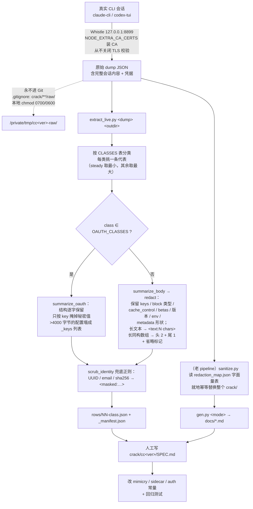

# crack/ —— 抓包档案与指纹事实来源

> [← Wiki 首页](Home) · [架构总览](Architecture)

## 概览：为什么它是 ground truth

`crack/` 是 cc-core 里唯一的**实测客户端流量档案**。`mimicry/`、`sidecar/`、
`auth/codex_*` 中的每一个指纹常量（User-Agent、`anthropic-beta` 列表、
`x-anthropic-billing-header` 版式、body 块布局与 `cache_control`、启动 sidecar
的端点/UA 序列、Codex 的 `originator`/`version`/WS 握手头）都必须能在
`crack/` 的某一行 row 里找到出处。

它在 2026-06-10 从两个下游 app 仓库（hypitoken、CPA-Claude）合并进来，此后
**cc-core 是唯一事实来源**，两个 fork 不再各自维护 `crack/`
（见 CHANGELOG `v0.8.19 — apikey beta list + unified crack/ archive`）。

三条推论，直接决定日常工作方式：

1. **常量不是拍脑袋写的**：改一个 UA / beta / body 形状之前，必须先有 capture；
   没有 capture 的修改就是在给上游边缘制造 tell。
2. **"改多了"和"改少了"一样危险**。claudev2.1.220 的 §3 抓到两处"过度保真"：
   `/mcp-registry/v0/servers` 真实客户端**不带** `Authorization`，cc-core 却在带；
   `anthropic-mcp-client-capabilities` 真实值是 `{"roots":{"listChanged":true},"elicitation":{}}`，
   cc-core 发的是 `{"roots":{},"elicitation":{}}` 的 base64 —— 一个真客户端从不
   advertise 的能力集。
3. **capture 会推翻旧结论**。2.1.220 的第二次抓包（Linux）证明请求 beta 列表是
   **上下文模式相关**的（非 1M 13 项 / 1M 15 项），而此前从 2.1.211 继承下来的
   14 项常量**两边都不匹配**。

### 2026-08-14 的 Codex Desktop 抓包推翻了什么

`crack/codexapp0.147.0/` 一次性纠正了四条曾经写在代码注释和本 wiki 里的结论。**每一条都保留了"曾经这样说、抓包证明不是、依据是哪一行 row"**，因为被删掉的错误结论会被后人重新发明：

| 曾经的表述 | 抓包证据 | 现状 |
|---|---|---|
| 会话头是 `Session_id` | `rows/10`（Desktop 握手）与 `crack/codexv0.135.0/rows/01`（CLI 握手）都是 **`session-id`**，连字符、全小写 | 改为 `mimicry.CodexSessionIDHeader`，用裸 map 键写入 |
| `x-codex-routing-hint` 在 **HTTP 与 WS 两条路径**都必发（依据 codex-rs `build_websocket_headers` 的源码阅读） | 两代握手各 18 个头，**都没有这个头**；CLIProxyAPI 也不发 | WS 侧移除；HTTP 侧保留（那边的源码阅读未被反证，且两个被抓到的客户端都不走 HTTP） |
| `x-codex-turn-metadata` 等五个头**不能发**，因为里面有代理伪造不了的 workspace/git 状态 | **0.135.0 上这句是对的**（`workspaces` map 含 cwd / git remote / commit hash / dirty）；`rows/10` 显示 0.147.0 Desktop **删掉了该 map**，握手变体只剩 id | 五个头改为在 WS 握手上发送；turn 变体里的 `code_mode_tool_names`（71 个用户已装工具）仍然不碰 |
| `auth/codex_reset.go` 的头集"复刻 Codex Desktop" | 真实 Desktop 0.147.0 在**任何** `/backend-api/*` 调用上都不发 `browserUA` / `Sec-Fetch-*` / `Priority`，只发自己的 UA + `originator` + `oai-product-sku` | 代码**未改**（该端点本次没被触发，可能来自另一个版本的抓包），但已在 SPEC §6 与 [Auth-Login-Codex](Auth-Login-Codex) 中标注为存疑，**不得当作 Desktop 参考** |

同一份抓包还确立了三条新事实：Codex 的辅助流量**全部直连 `chatgpt.com`、从不经过中继**（这是"不做 Codex sidecar"的核心论据，SPEC §6）；`/oauth/token` 请求**一个 User-Agent 都不发**（SPEC §5）；以及回程的 `codex.rate_limits` 帧是 Codex 版的"十二个 unified 限流头"，落在任何 header 白名单都够不着的地方（SPEC §3）。

---

## 目录地图

| 路径 | 内容 | 覆盖场景 / 状态 |
|---|---|---|
| `crack/README.md` | 档案总览、layout 表、脱敏政策、版本升级 5 步 | 入口文件 |
| `crack/COMPARE.md` | 中文长文：同机、同 `claude-cli/2.1.126`、同 `device_id` 下 OAuth（32 请求）vs 三方 API Key（26 请求）的**逐条出口流量对比**。**停留在 2.1.126，此后从未复核** —— 当前目标下的 OAuth vs 自定义 base URL 差异改看 `claudev2.1.226-inbound/SPEC.md` | 解释两条路径的差异来源（OAuth 独有 `eval/sdk`、`oauth/account/settings`、`claude_code_grove`、quota 探测；apikey 独有 `/v1/models`），以及为什么 apikey 路径没有 `cch` |
| `crack/claudev2.1.224/` | **当前 Claude 目标 `claude-cli/2.1.224`**（2026-08-07，Arch Linux），首个覆盖完整 login→对话链路的抓包 | 先读 `SPEC.md` |
| `crack/claudev2.1.224/SPEC.md` | 权威 diff：2.1.220→224 为纯版本串 bump（版本、`ccBuildTime`、遥测上报模型），其余逐项未变 | 含「Unresolved」：非 1M 主请求与 `count_tokens` 本次未捕获 |
| `crack/claudev2.1.226-inbound/` | **入站形态基线**：`claude-cli/2.1.226` 经 `ANTHROPIC_BASE_URL` 指向第三方网关（2026-08-09），2 行 rows（主对话 + 标题） | 其余目录记录我们要**产出**什么，这个记录我们要**修复**什么 —— 两个 fork 收到的正是这种请求。先读 `SPEC.md` |
| `crack/claudev2.1.226-inbound/SPEC.md` | 逐类 beta 向量、header/body/响应头差异表；确立 5 项 OAuth-only 差集、空 `account_uuid`、裸 `ephemeral` 断点、缺失的 `x-client-request-id`，以及**真实客户端在自定义 base URL 下完全不发 sidecar 流量** | `mimicry/beta.go` 与 `mimicry/cachecontrol.go` 的直接依据 |
| `crack/claudev2.1.220/` | 前一个 Claude 目标 `claude-cli/2.1.220`，两次独立抓包 | 仍是 beta 向量与多轮链路的主要证据来源 |
| `crack/claudev2.1.220/SPEC.md` | 权威 diff + cc-core 编辑清单（335 行） | 见下文"模板说明" |
| `crack/claudev2.1.220/ANALYSIS.md` | 验证方法学与计数：完备性边界、导出核对、请求分类规则、cch 验证步骤 | 支撑 SPEC 的证据链，不重复结论 |
| `crack/claudev2.1.220/chain-redacted.json` | 37 条 billing 请求的**哈希化链路**：`cc_version`/`cch` 原值 + `cc_prev_req_hash` ↔ `response_request_hash` 的多轮链接 | 唯一保留全部 37 条的地方 |
| `crack/claudev2.1.220/rows/` | 第一次抓包（macOS x64，Sonnet 5，2026-07-30），29 文件 | 启动 quota 探针 + 完整 10 轮连续对话的 main/title/prompt_suggestion + telemetry + auxiliary |
| `crack/claudev2.1.220/rows-2026-07-31/` | 第二次抓包（Arch Linux，opus-4-8 + opus-5 1M，2026-07-31），16 文件 | **完整全新 OAuth 登录** + 启动 bootstrap + 非 1M/1M 两种上下文模式 + `count_tokens` |
| `crack/claudev2.1.214/` | `claude-cli/2.1.214`（2026-07-18），`SPEC.md` + 19 行 rows | 已被 claudev2.1.220 取代，但**保留为登录流程基线**：唯一带 `oauth_hello` / `api_hello` / `oauth_account_settings` 探针行的 in-tree capture |
| `crack/codexapp0.147.0/` | **当前 Codex 默认身份**：`Codex Desktop/0.147.0-alpha.6.6`（2026-08-14，Arch Linux，ChatGPT **Plus**），293 个 HTTP session + 541 个 WS 帧，12 分钟内含一次完整登录 | 先读 `SPEC.md`，再读 `README.md`（后者列出这次**没抓到**什么） |
| `crack/codexapp0.147.0/SPEC.md` | 身份常量与 Desktop-vs-CLI 对照（§1）、WebSocket 协议与握手头顺序（§2）、回程泄漏清单（§3）、models 目录（§4）、OAuth 与 JWT claims（§5）、六套互不兼容的辅助流量头集与"**不做 Codex sidecar**"的论证（§6）、已知未对齐项（§7） | `mimicry/codex_identity.go`、`codexws/`、`downstream/codex.go`、`sidecar` provider 守卫的直接依据 |
| `crack/codexapp0.147.0/rows/` | `01`–`03` OAuth/token/JWT，`10`–`14` WS `/codex/responses` 与 `/codex/models`，`20`–`33` 辅助流量（plugins / MCP / analytics / telemetry） | |
| `crack/codexv0.135.0/` | `codex-tui/0.135.0`（2026-05-30，ChatGPT **Pro**），5 行 rows | Codex **CLI** 侧：WS 握手头、`wham/usage` 响应形状、analytics-events、`wham/apps`、`ps/plugins/installed`；CLI 身份已按源码滚到 `0.147.0` |
| `crack/codexv0.135.0/SPEC.md` | 含 4 段增量记录（0.135.0→0.144.1→0.144.4→0.147.0）、gpt-5.6 分层定价、Responses-Lite 两条硬约束 | 无新 capture 的"纯身份 bump"也写在这里；0.147.0 一节以 codex-rs 源码为依据 |
| `crack/claudev2.1.126/` | `rows/` 33 + `docs/` 32，2.1.126 时代的良性 OAuth 会话 | beta 列表 / body 形状的**历史 provenance** |
| `crack/claudev2.1.126-apikey/` | `rows/` 27 + `docs/` 26，经三方网关的 `x-api-key` 路径 | `ClaudeAnthropicBetaApikey` 的出处（严格网关会拒绝未知 beta） |
| `crack/claudev2.1.126-login/` | `README.md`（中文 PKCE 流程总览）+ `rows/` 13 + `docs/` 12，`claude-cli/2.1.126` 时代（与 `claudev2.1.126/`、`claudev2.1.126-apikey/` 同一客户端版本、不同鉴权链路） | 登录路径指纹；登录 sidecar 的 UA 是 **axios** |
| `crack/scripts/` | `extract_live.py`（结构化脱敏抽取器）、`sanitize.py`（就地字面量脱敏）、`gen.py`（rows→docs）、`README.md`、`redaction_map.example.json` | 工具，与数据分离 |

> **`codexapp0.147.0/` 与 `codexv0.135.0/` 是两个不同的客户端，不是同一客户端的新旧版本。**
> 前者是 **Codex Desktop 应用**，后者是 **codex-tui 终端 CLI**。两者的 `originator` / `user-agent` / `version` 三元组各不相同，而后端会交叉校验它们，所以**混用常量会 404**：
>
> | | Codex Desktop（`codexapp0.147.0/`） | codex-tui（`codexv0.135.0/`） |
> |---|---|---|
> | `originator` | `Codex Desktop`（**中间有空格**） | `codex-tui` |
> | `version` | `0.147.0-alpha.6.6`（pre-release，不可"清理"） | `0.147.0` |
> | UA 末尾括号 | `(Codex Desktop; 26.803.81509)` —— **构建号** | `(codex-tui; 0.147.0)` —— 版本号本身 |
> | `x-codex-beta-features` | `remote_compaction_v2` | `terminal_resize_reflow`（0.135.0 值） |
> | `openai-beta`（仅 WS） | `responses_websockets=2026-02-06` | 同左 |
>
> `codexv0.135.0/` **没有过时**：它仍是 CLI profile（`mimicry.CodexTUIClientProfile`）的 ground truth。Desktop 之所以成为默认，是因为装机量更大；代价是我们把身份钉在了一个 **pre-release 版本串**上，它比稳定的 CLI tag 漂移得更快。

### rows/ 的三种命名约定

| 约定 | 出现在 | 形如 | 说明 |
|---|---|---|---|
| `NN-<class>.json` | `claudev2.1.214/rows/`、`claudev2.1.220/rows-2026-07-31/` | `08-v1_messages.json`、`09-count_tokens.json` | `extract_live.py` 自动生成，`<class>` 来自脚本里的 `CLASSES` 表，序号即 manifest 顺序 |
| `NNN-<group>-<round>-<class>.json` | `claudev2.1.220/rows/` | `031-multiturn-01-main.json`、`049-auxiliary.json` | 多轮抓包专用，`group ∈ {bootstrap, multiturn, telemetry, auxiliary}`，`round` 为对话轮次 |
| `NN-<METHOD>-<host>_<path>.json` | `oauth/`、`apikey/`、`login/` | `06-POST-api.anthropic.com_v1_messages.json` | 老 pipeline（split/sanitize/gen）产物，URL 直接编码进文件名 |

每个 rows 目录都有 `_manifest.json`。`extract_live.py` 版本记 `{idx, class, file, url, status, reqSize}`；
`claudev2.1.220/rows/` 版本记 `{file, class, group, round, status}`。

`docs/`（仅 `oauth/`、`apikey/`、`login/` 有）是 `gen.py` 把每条 row 渲染成的
per-request markdown，与 `rows/` 一一对应，方便肉眼 diff；新的 `<客户端>v<版本>/` 目录
不再生成 docs，改用 SPEC.md 集中叙述。

---

## 采集与脱敏流程



### 保留什么 / `<masked>` 什么

`extract_live.py` 的立场是：**形状全留，内容全去**。

**逐字保留（指纹承载）**
- 请求 URL、method、status、`reqSize`/`resSize`；全部非敏感 header（UA、
  `anthropic-beta`、`anthropic-version`、`x-stainless-*`、`accept`、
  `content-type`、`accept-encoding`…）。
- body 的 key 集合与嵌套结构、block `type`、`cache_control`（含 `ttl`/`scope`）、
  版本号、beta 列表、env/机器轴、`metadata` 形状。
- 以 `x-anthropic-billing-header:` 或 `You are Claude Code, Anthropic's official CLI for Claude.`
  开头的字符串（`KEEP_TEXT_PREFIXES`）—— 计费块和 CC 规范开场白本身就是指纹。
- 公开常量：Claude Code 的 `client_id` `9d1c250a-e61b-44d9-88ed-5944d1962f5e`
  （`KEEP_UUIDS` 白名单）、Datadog 的客户端侧公开 key
  `pubea5604404508cdd34afb69e6f42a05bc`、OAuth 响应里的 `scope` / `token_type` /
  `expires_in` / `has_claude_max` / `organization_type` / `rate_limit_tier` /
  `billing_type`、`application` 子树。
- `event_logging` 批次不留原文，只留 `event_histogram`（事件名 → 次数）。

**掩掉**
- header：`authorization`、`x-api-key`、`cookie`/`set-cookie`、
  `x-claude-code-session-id`、`x-client-request-id`、`request-id`、
  各种 organization uuid、`cf-ray` → `<masked>`。
- body key：`device_id`、`account_uuid`、`organization_uuid`、`email`、
  `session_id`、`user_id`、`event_id`、`rh`、`previous_message_id`，以及任何
  以 `_session_id`/`_uuid` 结尾、含 `email`、等于 `organization_name` 的 key
  → `<masked:key>`。
- `metadata.user_id` 是一个 **JSON 字符串**，`redact_user_id` 专门解析它、
  把内层每个字段替换成 `<masked:…>` 后再序列化回去 —— 保留 key 顺序与形状。
- OAuth body：`code`、`code_verifier`、`code_challenge`、`state`、
  `access_token`、`refresh_token`、各类 `*_uuid`/`name`/`email`/`created_at`。
- 散文/代码/工具描述：超过 80 字符 → `<text:N chars>`；长同构数组塌成
  `头 2 项 + "<… N more items redacted …>" + 尾 1 项`。
- 兜底正则（defense-in-depth，作用于**每一条**输出的 header/url/body）：
  任意 UUID → `<masked:uuid>`，email → `<masked:email>`，64 位 hex → `<masked:hash>`。

### chain-redacted.json 是什么

claudev2.1.220 特有。`rows/` 为了体积只保留"每类一条代表 + 全部 10 条多轮 main"，
但 **37 条 billing 请求的链路关系不能丢**，于是单独存成一份哈希表：

```json
{"capture_version": "2.1.220", "billing_request_count": 37,
 "billing_requests": [{"group","round","type","row_hash","model","message_count",
   "cc_version","cch","cc_prev_req_hash","response_request_hash",
   "session_header_hash","body_identity_hashes":{...},"client_request_hash"}]}
```

`cc_version` 与 `cch` 是**原值**（它们是待破解的算法输出，不是身份）；
`cc_prev_req` 和上游响应 `request-id` 用同一个哈希函数处理，因此
"第 N 轮的 `cc_prev_req` == 第 N−1 轮响应的 `request-id`" 这个结论可以在
不泄露任何 request-id 的前提下被复核 —— main 链 9/9、prompt-suggestion 6/6。
它同时是 cch 研究的语料：37 个值全部非零、全部互不相同、cc-core 现有
seeded-xxhash 猜测命中 0/37。

---

## SPEC.md 模板说明

`<客户端>v<版本>/SPEC.md` 是一个版本目标的**权威文件**，写法固定为下面这个骨架
（以 `claudev2.1.220/SPEC.md` 335 行为范本，`claudev2.1.214/SPEC.md` 是精简版）：

1. **标题 + 采集环境交代**
   `# Claude Code <ver> — OAuth fingerprint ground truth`，随后一段说明：
   抓包日期、平台、代理端口、CA 注入方式、以及"TLS 校验从未关闭"。
   明确区分**受控变量**（如"模型是用户显式设置的 sonnet-5，不是版本默认值变化"）。
2. **Capture set and redaction**：样本计数（几个独立首轮、几轮连续对话、
   多少条 200）、原始 dump 的本地路径与权限、脱敏范围。
3. **Client environment**：`version`/`version_base`/`build_time`/`node_version`/
   SDK/axios/stainless OS-arch/terminal/shell 的代码块，并注明哪些是
   **抓包主机属性、不得抄进 `auth.HostProfile`**。
4. **按请求类分节**：main `/v1/messages?beta=true`、`count_tokens`、title/Haiku、
   quota 探针、OAuth 登录流、telemetry、startup/bootstrap。每节给出
   **精确 header 集合 + 逐字 beta 列表（标明项数与顺序）+ body key 列表与块布局**。
   请求类之间**不可互换**，这是反复强调的规则。
5. **增补节（§1a/§1b/§2/§3 这类编号）**：后续补抓包的修正就地追加为新的编号小节，
   并回头把上文的"未解"划掉改成"Resolved by …"（claudev2.1.220 的 `~~删除线~~` 用法）。
6. **Confirmed <old> → <new> wire changes**：只列真正的线上差异（版本号、build_time…）。
7. **Newly established by the expanded capture**：这次新确立、但不能归因为版本变化的事实。
8. **Unresolved**：明确写清哪些没抓到、为什么、以及"absence of evidence, not
   evidence of absence"的边界（claudev2.1.220 §2 对 `/v1/oauth/hello` 就是这么处理的）。
9. **cc-core edit checklist**：逐文件列出这次 bump 实际改了什么
   （`mimicry/fingerprint.go` 改哪几个常量、`sidecar/sidecar.go` 的 `ccBuildTime`、
   `auth/login_probes.go`…）+ 配套测试文件 + 明确写"哪些观察值**没有**被抄进代码"。

`ANALYSIS.md`（可选）承接方法学：完备性边界、导出去重键、请求分类判据、
某个未解问题的穷举过程（claudev2.1.220 用它记录了对 2.1.220 bundle 的静态穷举，
以否定结论关闭了"cch 怎么算"的问题）。

---

## 版本升级操作手册

以把 Claude 目标从 `2.1.220` 升到 `2.1.<new>` 为例。全部命令在
`/home/wjs/Documents/project/Go/cc-core` 下执行。

```bash
# 0. 准备：Whistle 起在 127.0.0.1:8899，用它的 CA
export NODE_EXTRA_CA_CERTS=/path/to/whistle-root-ca.crt
mkdir -p -m 0700 /tmp/cc<new>-raw          # 原始 dump 只能待在这里

# 1. 跑一遍真实 CLI：全新登录 + 启动 bootstrap + 若干独立首轮 + 一段连续多轮对话
#    （1M 模式也要各跑一次，beta 列表是上下文模式相关的）
#    然后从 Whistle 导出 dump JSON 到 /tmp/cc<new>-raw/dump.json

# 2. 结构化脱敏抽取
python3 crack/scripts/extract_live.py /tmp/cc<new>-raw/dump.json crack/claudev<new>/rows

# 3. 与上一版逐类比对（rows 里 class 名一致，可直接 diff）
diff -u crack/claudev2.1.220/rows-2026-07-31/08-v1_messages.json crack/claudev<new>/rows/08-v1_messages.json
git diff --stat crack/                      # 确认没有意外文件

# 4. 写 crack/claudev<new>/SPEC.md（按上一节的 9 段骨架，作为 vs 2.1.220 的 diff）

# 5. 改常量：mimicry/fingerprint.go（CLICurrentVersion、ClaudeCLIUserAgent、
#    ClaudeAnthropicBetaFull / …1M / …CountTokens / ClaudeReportedBetas）、
#    mimicry/body.go、mimicry/headers.go、sidecar/sidecar.go（ccBuildTime、
#    bootstrap 步骤 UA/端点）、必要时 auth/login_probes.go
#    —— 这些常量必须一起动，否则 UA 会和 body 里的 cc_version 打架

# 6. 回归
go build ./...
go vet ./...
go test ./mimicry/ ./sidecar/ ./auth/ -v
go test ./...                               # sidecar 有 ~23s 真实计时

# 7. 提交 + 打 tag（只提交自己动过的文件）
git status
git add crack/claudev<new> mimicry sidecar CHANGELOG.md
git commit -m "feat(mimicry): bump Claude fingerprint 2.1.220 -> 2.1.<new>"
git tag v0.8.NN && git push origin main v0.8.NN

# 8. 两个 fork 各自 bump（详见《发布流程与下游集成》）
```

Codex 侧同理，但**先确认在升哪一个客户端**：

- **Codex Desktop（默认身份）**——目录 `crack/codexapp<ver>/`，常量在 `mimicry/codex_identity.go`
  （`CodexDesktopVersion` / `CodexDesktopBuild` / `CodexDesktopUserAgent` / `CodexDesktopBetaFeatures` /
  `CodexDesktopModelsClientVersion`）。后两个**不可推导**，没有新抓包不要动。
  同时要复核 `codexws/headers.go` 的 `handshakeHeaderOrder`（顺序也是形状）。
- **codex-tui（CLI profile）**——目录 `crack/codexv<ver>/`，常量在 `mimicry/codex.go`
  （`CodexCLIVersion` / `CodexCLIUserAgent` / `CodexCLIBetaFeatures`）与 `auth/codex_*.go`。
  `crack/codexv0.135.0/SPEC.md` 已经示范了**没有新 capture 的纯身份 bump**怎么记：
  写清"No fresh capture"、变更为何是 wire-neutral、以及依据（上游 release tag、其他实现的 pin）。

**两套常量永远不能互相借用**——后端会交叉校验 originator / UA / version。

重新渲染老档案（`oauth`/`apikey`/`login` 三套）用老 pipeline：

```bash
cp crack/scripts/redaction_map.example.json crack/scripts/redaction_map.json  # 填入本地真实秘密→占位符
python3 crack/scripts/sanitize.py           # 幂等；没有 map 会拒跑
python3 crack/scripts/gen.py oauth          # rows → docs（oauth|apikey|login）
```

所有脚本都以自身位置定位路径（`os.path.dirname(__file__)/..`），可在任意 cwd 执行。

---

## 红线

1. **原始 dump 永不入库。** `.gitignore` 已挡住 `crack/**/raw/` 和
   `crack/scripts/redaction_map.json`。合并前的历史 raw 只存在于 hypitoken 的
   git 历史里；本机 dump 放 `/tmp/cc<ver>-raw/`，权限 0700/0600。
2. **`redaction_map.json` 永不入库**（里面是真实 token）。只提交
   `redaction_map.example.json`。
3. **不得手改常量。** 任何 User-Agent / beta / body 形状的改动都必须有 capture
   支撑，且 diff 要写进 `crack/claudev<ver>/SPEC.md`。这是 CLAUDE.md 明列的约定。
4. **不得"修正"样本去迎合猜测。** claudev2.1.220 的 37 个 `cch` 全部保留原值，
   哪怕 cc-core 的签名算法命中 0/37 —— 记录事实，不记录期望。
5. **不得把抓包主机属性抄进合成身份。** macOS/x64、`linux_kernel 7.1.2-arch3-1`、
   `konsole`、`zsh` 都是抓包机的，`auth.HostProfile` 必须保持**每账号合成**。
6. **不得把请求类混为一谈。** main / title / quota / `count_tokens` /
   telemetry 的 beta 列表和 body 形状互不相同，也不能用一个全局 telemetry
   常量替代（`tengu_api_*` 事件的 `event_data.betas` 回声的是对应请求类的列表）。
7. **不得从一个列表推导另一个列表。** 自 2.1.170 起请求 header 的 beta 列表
   与 telemetry 的 `ClaudeReportedBetas` 已经**分叉**，不再是"前 9 项"。
8. **过度保真也是 tell。** 该不带 `Authorization` 的公开端点就别带，
   该只 advertise 的能力集就别多 advertise。
9. 抓包时**不要关闭 TLS 校验**，靠 CA 注入（`NODE_EXTRA_CA_CERTS`）拿明文。

---

## 文件清单

```
crack/
├── README.md                        档案总览 / layout / 脱敏政策 / 升级 5 步
├── COMPARE.md                       OAuth vs ApiKey 逐条流量对比（中文，205 行）
├── claudev2.1.220/                          前一目标 2.1.220（beta/多轮链路证据）
│   ├── SPEC.md                      权威 diff + edit checklist（335 行）
│   ├── ANALYSIS.md                  验证方法学与计数（98 行）
│   ├── chain-redacted.json          37 条 billing 请求的哈希化链路
│   ├── rows/                        2026-07-30 macOS/Sonnet5，29 文件
│   │   ├── 001-bootstrap-00-quota.json
│   │   ├── 030-multiturn-01-title.json … 045-multiturn-10-main.json
│   │   ├── 047-telemetry-api.json / 048-telemetry-process.json
│   │   ├── 049…061-auxiliary.json
│   │   └── _manifest.json
│   └── rows-2026-07-31/             2026-07-31 Linux/opus，16 文件
│       ├── 01-oauth_token / 02-oauth_profile / 03-oauth_roles
│       ├── 04-startup_eval_sdk / 05-startup_bootstrap
│       ├── 06-mcp_registry / 07-mcp_servers
│       ├── 08-v1_messages / 09-count_tokens / 15-v1_messages_1m
│       ├── 10-event_logging_startup / 11-event_logging_steady / 12-datadog
│       ├── 13-releases / 14-plugins_latest
│       └── _manifest.json
├── claudev2.1.214/                          2.1.214，登录流程基线
│   ├── SPEC.md                      （121 行）
│   └── rows/                        19 文件，含 oauth_hello / api_hello /
│                                    oauth_account_settings（claudev2.1.220 缺这三条）
├── claudev2.1.226-inbound/          入站形态基线（自定义 base URL）
│   ├── SPEC.md                      （250 行）
│   └── rows/                        2 文件：主对话 + 标题
├── codexapp0.147.0/                 **Codex Desktop 应用**（当前默认身份）
│   ├── README.md                    档案说明 + 本次抓包的 4 个已知缺口
│   ├── SPEC.md                      （336 行，7 节）
│   └── rows/                        22 文件：01-03 OAuth/JWT，10-14 WS + models，
│                                    20-33 plugins / MCP / analytics / OTLP
├── codexv0.135.0/                   **codex-tui CLI**（另一个客户端，非旧版本）
│   ├── README.md / SPEC.md          （287 行，含 4 段增量记录）
│   └── rows/                        5 文件：WS 握手 / wham-usage /
│                                    analytics-events / wham-apps / ps-plugins
├── claudev2.1.126/                  2.1.126 良性 OAuth 会话：rows 33 + docs 32
├── claudev2.1.126-apikey/           三方网关 x-api-key 路径：rows 27 + docs 26
├── claudev2.1.126-login/            PKCE 登录流：README.md + rows 13 + docs 12
└── scripts/
    ├── README.md
    ├── extract_live.py              结构化脱敏抽取器（321 行，当前主力）
    ├── sanitize.py                  字面量就地脱敏（老 pipeline）
    ├── gen.py                       rows → docs/*.md（oauth|apikey|login）
    └── redaction_map.example.json   本地映射表模板（真表 gitignored）
```

---

## 相关页面

[Mimicry](Mimicry) · [Sidecar](Sidecar) · [Release](Release)
