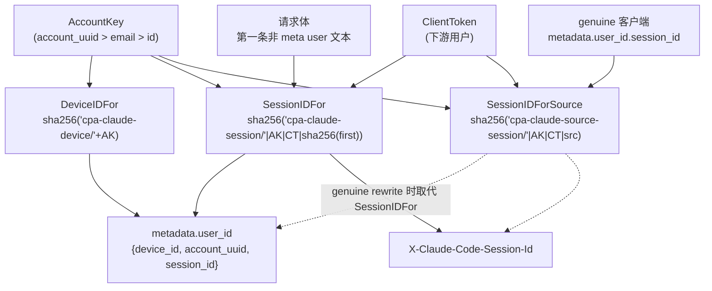
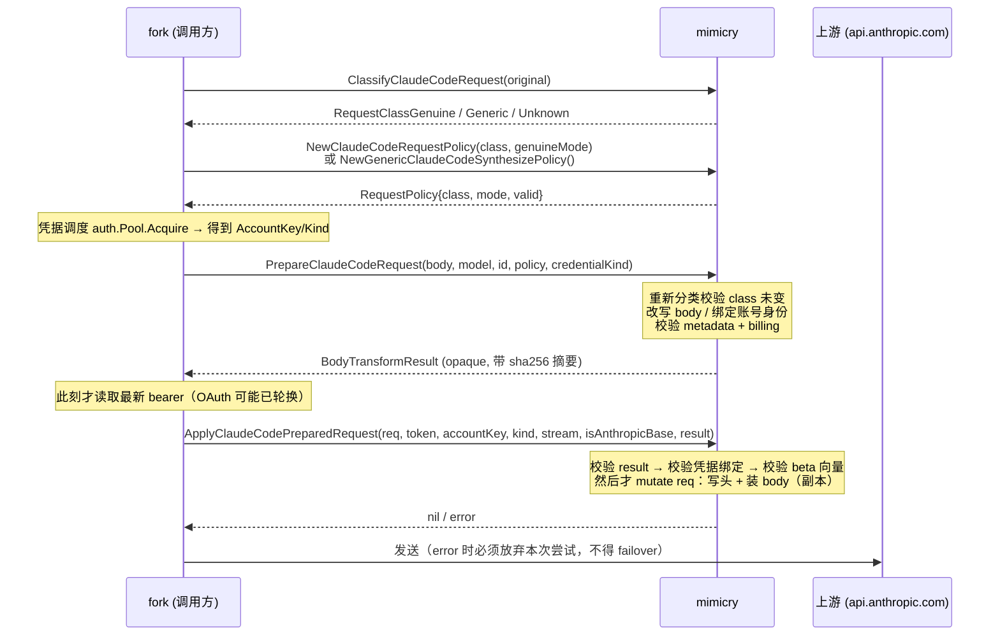

# mimicry —— Claude Code / Codex 客户端指纹

> [← Wiki 首页](Home) · [架构总览](Architecture)

> 本页所有行号对应 `cc-core` 仓库 `main` 分支当前源码（Claude 目标 `2.1.224`；Codex 默认目标 **Codex Desktop `0.147.0-alpha.6.6`**，CLI profile `codex-tui/0.147.0` 仍可选）。

## 概览

`mimicry` 包负责把一个"任意来源"的 HTTP 请求改造成**看起来由真实客户端发出**的请求。它是纯函数库：不发请求、不管 TLS（TLS 指纹在 `auth/utls.go`）、不碰凭据健康状态。

两层指纹（`mimicry/fingerprint.go:1-19` 包注释）：

1. **请求头层** —— `User-Agent` / `X-Stainless-*` / `Anthropic-Beta` / `X-App` / `X-Claude-Code-Session-Id` / `x-client-request-id`，由 `ApplyClaudeCodeHeaders` 写入（`mimicry/headers.go:38`）。
2. **请求体层** —— `system[0]` 计费归因块、`system[1]` Claude Code 引导语、`cache_control` 断点、`metadata.user_id`，由 `ApplyClaudeCodeBodyMimicry` 写入（`mimicry/body.go:99`）。

任何一层缺失，OAuth 订阅凭据上的请求都会被降级为"第三方应用"计费。

包内四条相对独立的主线：

| 主线 | 文件 | 入口 |
|---|---|---|
| 常量与工具 | `fingerprint.go` | 版本/beta/UA 常量、`NewRequestUUID`、`UUIDFromBytes` |
| 通用改写路径（旧路径） | `headers.go` + `body.go` | `ApplyClaudeCodeHeaders`、`ApplyClaudeCodeBodyMimicry` |
| prepared-request 管线（新路径，fail-closed） | `request_policy.go` | `ClassifyClaudeCodeRequest` → `NewClaudeCodeRequestPolicy` → `PrepareClaudeCodeRequest` → `ApplyClaudeCodePreparedRequest` |
| 身份派生 | `identity.go` | `SimIdentity`、`DeviceIDFor`、`SessionIDFor`、`SessionIDForSource` |

另有两个横切件：`dateline.go`（抹除 Claude Code 在非官方 base URL 下埋入日期句的 3 bit 隐写信标）、`codex_identity.go` + `codex.go` + `codex_body.go`（Codex 侧的身份 profile / 头 / 体）。

---

## 指纹常量表

**核心纪律：同一次版本升级里，下表 `fingerprint.go` 的版本相关常量必须"一起改"。**`CLICurrentVersion` 与 `ClaudeCLIUserAgent` 里烘焙的版本号一旦漂移，请求体计费块中的 `cc_version=X.Y.Z.{fp}` 就会和 `User-Agent` 互相矛盾，直接触发 Anthropic 边缘的第三方检测（`fingerprint.go:36-38`）。

### Claude 侧（`mimicry/fingerprint.go`）

| 常量 | 值 | 出处 capture | 行号 |
|---|---|---|---|
| `CLICurrentVersion` | `2.1.224` | `crack/claudev2.1.224/SPEC.md`（2026-08-07 Linux，完整 login→对话链路） | `fingerprint.go:48` |
| `ClaudeCLIUserAgent` | `claude-cli/2.1.224 (external, cli)` | 同上 | `fingerprint.go:49` |
| `ClaudeStainlessLang` | `js` | claudev2.1.224 SPEC §1（2.1.220→224 未变） | `fingerprint.go:50` |
| `ClaudeStainlessRuntime` | `node` | 同上 | `fingerprint.go:43` |
| `ClaudeStainlessRuntimeV` | `v26.3.0` | 2.1.191 起（Node v24.3.0→v26.3.0），claudev2.1.224 复核未变；同时喂给 sidecar 遥测 `env.node_version` | `fingerprint.go:58` |
| `ClaudeStainlessPackageV` | `0.94.0` | claudev2.1.224 SPEC（@anthropic-ai/sdk 0.94.0，未变） | `fingerprint.go:59` |
| `ClaudeStainlessOS` | `Linux` | **刻意不取自 capture**：claudev2.1.220 抓包主机是 `MacOS`（claudev2.1.224 恰好是 Linux，但这不构成新约束），SPEC 明确要求不要把抓包主机属性写进合成 host profile | `fingerprint.go:67` |
| `ClaudeStainlessArch` | `x64` | claudev2.1.224 SPEC | `fingerprint.go:68` |
| `ClaudeStainlessTimeout` | `600` | claudev2.1.224 SPEC（main 有；`count_tokens` **无**，后者 2.1.224 未复核） | `fingerprint.go:69` |
| `ClaudeStainlessRetryCnt` | `0` | claudev2.1.224 SPEC | `fingerprint.go:70` |
| `ClaudeAnthropicVersion` | `2023-06-01` | claudev2.1.224 / COMPARE.md（OAuth 与 apikey 相同） | `fingerprint.go:71` |
| `ClaudeAnthropicBetaFull` | 13 项，`claude-code-20250219,oauth-2025-04-20,interleaved-thinking-…,…,extended-cache-ttl-2025-04-11,cache-diagnosis-2026-04-07` | `crack/claudev2.1.220/SPEC.md` §1 + §1a 非 1M 列表（macOS Sonnet 5 20 条 + Linux opus-4-8 5 条，跨两主机两 OS）。**claudev2.1.224 未复核**（该次抓包全程 1M，无非 1M 主请求） | `fingerprint.go:102` |
| `ClaudeAnthropicBeta1M` | 15 项（第 3 位插 `context-1m-2025-08-07`，`effort` 与 `extended-cache-ttl` 之间插 `fallback-credit-2026-06-01`） | `crack/claudev2.1.220/SPEC.md` §1a + `crack/claudev2.1.224/SPEC.md` §1（opus-5 1M）逐项复核，**两版本两抓包** | `fingerprint.go:116` |
| `ClaudeAnthropicBetaCountTokens` | 5 项，含独有的 `token-counting-2024-11-01` | `crack/claudev2.1.220/SPEC.md` §1b（4 个样本完全一致）。**claudev2.1.224 未复核**（无 count_tokens 请求） | `fingerprint.go:125` |
| `ClaudeReportedBetas` | 9 项，止于 `mid-conversation-system-2026-04-07` | 遥测体（event_logging / datadog），`crack/claudev2.1.224/SPEC.md` §3 逐字节复核，2.1.156→2.1.224 未变 | `fingerprint.go:144` |
| `ClaudeAnthropicBetaApikey` | 8 项，无 `oauth-*` / `advanced-tool-use-*` / `cache-diagnosis-*`，含 `context-1m-2025-08-07` | `crack/claudev2.1.126-apikey/rows/*-POST-…v1_messages`；差集分析见 `crack/COMPARE.md` §3.2 | `fingerprint.go:154` |
| `ClaudeDefaultCacheTTL` | `1h` | claudev2.1.224 主体 system 块（未变） | `fingerprint.go:162` |
| `ClaudeDefaultCacheScope` | `global` | 同上（倒数第二块） | `fingerprint.go:163` |
| `ClaudeCodeSystemPrompt` | `You are Claude Code, Anthropic's official CLI for Claude.` | claudev2.1.220 system[1]（57B，无 cache_control） | `fingerprint.go:140` |
| `ClaudeCodePromptPrefixes` | 4 条前缀（Claude Code / Claude Agent SDK / file search specialist / summarizing conversations） | 官方各请求类前缀族 | `fingerprint.go:144-149` |
| `fingerprintSalt` | `59cf53e54c78`（非导出） | 2.1.198 bundle 静态提取的 `awo`，claudev2.1.220 静态分析再确认 | `body.go:49` |
| `cchSeed` | `0x6E52736AC806831E`（非导出） | **不是真实算法**：claudev2.1.220 37/37 样本 0 命中，legacy best-effort | `body.go:53` |
| `claudeBillingHeaderPrefix` | `x-anthropic-billing-header` | claudev2.1.220「Billing…」节 | `body.go:74` |
| `claudeEntrypointMarker` | `cc_entrypoint=` | 同上；值可为 `cli` / `sdk-cli` | `body.go:75` |

关于 beta 列表还有两条容易踩的规则：

- **1M 列表不会被自动选中。** 请求体里没有任何 1M 标记（`[1m]` 只出现在遥测的 `event_data.model`），所以 cc-core 无法推断上下文模式；导出 `ClaudeAnthropicBeta1M` 只是让 fork 在提供显式 "1M 模式" 时不必手搓（`fingerprint.go:88-93`）。
- **`ClaudeReportedBetas` 与 `ClaudeAnthropicBetaFull` 语义分离**，即便某个版本上前者恰好是后者的前缀，也不要合并——请求 beta 与遥测 beta 沿不同轴变化（`fingerprint.go:113-115`）。

### Codex 侧

**Codex 有两个真实客户端，不是同一客户端的两个版本。** `CodexClientProfile`（`codex_identity.go:75`）把 `Originator` / `UserAgent` / `Version` / `BetaFeatures` / `ModelsClientVersion` / `SendsTurnMetadata` 绑成一个整体：后端会交叉校验 originator 与 UA 的首段，**跨 profile 混字段会 404**。

| profile | 变量 | 出处 |
|---|---|---|
| **Codex Desktop（默认）** | `CodexDesktopClientProfile`（`codex_identity.go:95`），由 `DefaultCodexProfile()`（`codex_identity.go:118`）返回 | `crack/codexapp0.147.0/`（2026-08-14 实抓，293 HTTP session + 541 WS 帧，含完整登录） |
| codex-tui（CLI） | `CodexTUIClientProfile`（`codex_identity.go:106`） | `crack/codexv0.135.0/`（2026-05-30 实抓）+ codex-rs 0.147.0 源码核对 |

#### Desktop 常量（`mimicry/codex_identity.go`）

| 常量 | 值 | 出处 / 陷阱 | 行号 |
|---|---|---|---|
| `CodexDesktopVersion` | `0.147.0-alpha.6.6` | `crack/codexapp0.147.0/SPEC.md` §1。**是 pre-release 串，不要"清理"成 `0.147.0`**：后端会解析该字段（低于版本下限直接 404），且 version 与 UA 不一致本身就是一个单头破绽 | `codex_identity.go:41` |
| `CodexDesktopBuild` | `26.803.81509` | 只出现在 UA 末尾括号里与 analytics-events 的 `app_server_client.client_version`；**不是 semver，也不等于 `CodexDesktopVersion`**（后者是 codex-rs core 版本，同一 body 里报为 `runtime.codex_rs_version`） | `codex_identity.go:48` |
| `CodexDesktopOriginator` | `Codex Desktop`（**中间有空格**，不是 `codex-desktop`） | SPEC §1 陷阱 1 | `codex_identity.go:50` |
| `CodexDesktopUserAgent` | `Codex Desktop/0.147.0-alpha.6.6 (Arch Linux Rolling Release; x86_64) Konsole/260403 (Codex Desktop; 26.803.81509)` | 模板同 codex-rs 的 `get_codex_user_agent()`；OS/终端段是我们的合成身份 | `codex_identity.go:56` |
| `CodexDesktopBetaFeatures` | `remote_compaction_v2` | `x-codex-beta-features` 的值。**每个 release 都漂移且不可推导**（0.135.0 CLI 是 `terminal_resize_reflow`），bump 必须重抓 | `codex_identity.go:62` |
| `CodexDesktopModelsClientVersion` | `0.147.0` | `GET /backend-api/codex/models?client_version=` 用的是**基础版本**，而同一请求的 `version` 头带完整 pre-release 串。这是真实客户端自己的不一致，SPEC §1 明确要求**复现而不是调和** | `codex_identity.go:69` |

#### CLI / 共享常量（`mimicry/codex.go`）

| 常量 | 值 | 出处 capture | 行号 |
|---|---|---|---|
| `CodexCLIVersion` | `0.147.0` | `crack/codexv0.135.0/SPEC.md`「2026-08-08」节：0.135.0 实抓模板 + codex-rs 0.147.0 源码核对 | `codex.go:57` |
| `CodexCLIUserAgent` | `codex-tui/0.147.0 (Arch Linux Rolling Release; x86_64) Konsole/260401 (codex-tui; 0.147.0)` | 同上 | `codex.go:58` |
| `CodexOriginator` | `codex-tui` | `crack/codexv0.135.0/rows/01`（WS 握手头） | `codex.go:59` |
| `CodexCLIBetaFeatures` | `terminal_resize_reflow` | 0.135.0 的 CLI 值，**0.147.0 未复核**；Desktop 在同版本发的是另一个值，所以它只对 CLI profile 成立 | `codex.go:66` |
| `CodexSessionIDHeader` | `session-id` | **连字符、全小写**。cc-core 曾连续两代抓包都发 `Session_id`（Go 的 header canonicalization 不动下划线，于是原样上线）；`crack/codexv0.135.0/rows/01` 与 `crack/codexapp0.147.0/rows/10` 都显示真实值是 `session-id` | `codex.go:76` |
| `CodexRoutingHintHeader` | `x-codex-routing-hint` | 值为 `model=<上游模型>[;tier=priority\|flex]`；缺失会导致部分模型解析失败（openai/codex#31967）。**仅 HTTP 路径**，见下 | `codex.go:95` |
| ~~`CodexOpenAIBeta`~~ | **已删除** | 0.147.0 源码中 `responses=experimental` 不存在；HTTP 路径不发 `OpenAI-Beta`，只有 WS 握手发 `responses_websockets=2026-02-06`（`codexws.CodexOpenAIBetaWS`） | — |
| `CodexUsageUserAgent` | `= CodexCLIUserAgent` | `crack/codexv0.135.0/SPEC.md`「GET /backend-api/wham/usage」：CLI 用自己的 UA，不是浏览器 UA。该探针是 CLI 自己调用的，所以保持 CLI UA | `codex.go:244` |

> **被新抓包推翻的旧表述**：本页此前写"`x-codex-routing-hint` 真实 Codex 在 **HTTP 与 WS both** 必发"。那是对 codex-rs `build_websocket_headers` 的源码阅读，**两代抓包都不支持**：`crack/codexv0.135.0/rows/01` 与 `crack/codexapp0.147.0/rows/10` 的 upgrade 各发 18 个头，routing hint 不在其中，CLIProxyAPI 也从不发它。`codexws` 已停发；HTTP 路径保留（那边源码阅读没有被反证，而且两个被抓到的客户端都走 WebSocket，HTTP 路径根本没有抓包）。

---

## 请求头构造

### `ApplyClaudeCodeHeaders`

```go
func ApplyClaudeCodeHeaders(req *http.Request, token, kind string, stream, isAnthropicBase bool, id SimIdentity, body []byte)
```
（`mimicry/headers.go:38`；`kind` 取 `KindOAuth = "oauth"` / `KindAPIKey = "apikey"`，`headers.go:11-14`）

总体规则：**客户端已带的值优先**（通过 `ensureHeader`，`fingerprint.go:180`），只有凭据头和少数几个是无条件覆盖。

实际写入的头，按代码顺序：

| Header | 值 | 覆盖策略 | 行号 |
|---|---|---|---|
| `Authorization` / `x-api-key` | `Bearer <token>` 或裸 token（互斥，另一个 `Del`） | **强制覆盖** | `headers.go:40-46` |
| `Content-Type` | `application/json` | **强制** | `headers.go:47` |
| `Anthropic-Version` | `ClaudeAnthropicVersion` | ensure | `headers.go:56` |
| `Anthropic-Beta` | 见下表 | 客户端已有则保留；OAuth + first-party 时做**加法修补**（见下） | `headers.go:57-84` |
| `Anthropic-Dangerous-Direct-Browser-Access` | `true` | ensure，**仅 `isAnthropicBase`** | `headers.go:76-78` |
| `X-App` | `cli` | ensure | `headers.go:81` |
| `X-Stainless-Retry-Count` | `0` | ensure | `headers.go:82` |
| `X-Stainless-Lang` | `js` | ensure | `headers.go:83` |
| `X-Stainless-Runtime` | `node` | ensure | `headers.go:84` |
| `X-Stainless-Runtime-Version` | `v26.3.0` | ensure | `headers.go:85` |
| `X-Stainless-Package-Version` | `0.94.0` | ensure | `headers.go:86` |
| `X-Stainless-Os` | `Linux` | ensure | `headers.go:87` |
| `X-Stainless-Arch` | `x64` | ensure | `headers.go:88` |
| `X-Stainless-Timeout` | `600` | ensure，**`count_tokens` 上不写** | `headers.go:89-92` |
| `X-Claude-Code-Session-Id` | `SessionIDFor(id, body)` | ensure | `headers.go:96` |
| `x-client-request-id` | 每请求新 UUIDv4 | ensure，**仅 `isAnthropicBase`** | `headers.go:97-99` |
| `User-Agent` | `ClaudeCLIUserAgent` | 仅当现值不以 `claude-cli/` 开头时覆盖 | `headers.go:103-106` |
| `Connection` | `keep-alive` | **强制** | `headers.go:108` |
| `Accept-Encoding` | `gzip, br` | **强制**（有意偏离；需配 `cc-core/stream.Decompress`） | `headers.go:109` |
| `Accept` | `text/event-stream`（stream）/ `application/json` | stream 强制；非 stream ensure | `headers.go:110-114` |

`Anthropic-Beta` 的分支（`headers.go:57-84`）：

| 条件 | 使用的列表 |
|---|---|
| 客户端自带 beta + OAuth + `isAnthropicBase` | `UpgradeClaudeBetaVectorForOAuth(客户端向量)` —— 加法修补，见下节 |
| 客户端自带 beta + OAuth + 非 first-party | 保留客户端的；不含 `oauth` 时追加 `,oauth-2025-04-20` |
| `kind == KindAPIKey` | `ClaudeAnthropicBetaApikey` |
| 路径以 `/v1/messages/count_tokens` 结尾（`headers.go:49`） | `ClaudeAnthropicBetaCountTokens` |
| 其余（OAuth 主请求） | `ClaudeAnthropicBetaFull` |

> `count_tokens` 是独立请求类：短 beta 列表 **且** 无 `X-Stainless-Timeout`，两个差异必须同时复现（claudev2.1.220 SPEC §1b 称之为"最容易搞错的一处"）。判定统一走 `isCountTokensRequest`（`headers.go:22-26`），`forcePinnedClaudeCodeProfile` 也用它——否则 pin 阶段会把刚刚故意省略的 timeout 又加回来。apikey 路径不受此影响（没有 apikey 的 `count_tokens` capture）。

### beta 向量的加法修补（`mimicry/beta.go`）

反代收到的是**自定义 base URL 形态**的请求（`crack/claudev2.1.226-inbound/SPEC.md`），它的 beta 向量结构性地少了 5 项——客户端没有 Anthropic 账号，声明不了：

```
oauth-2025-04-20 · advisor-tool-2026-03-01 · advanced-tool-use-2025-11-20
extended-cache-ttl-2025-04-11 · cache-diagnosis-2026-04-07
```

抓包实测：第三方 8 项 = `ClaudeAnthropicBetaFull` 13 项**精确减去**这 5 项，存活项顺序不变。所以修补是确定性插入，不是猜测。

`UpgradeClaudeBetaVectorForOAuth`（`beta.go:87`）的契约：

- **只加不减。** 客户端声明过的一律保留，包括 cc-core 没有常量的新 beta（放在末尾，保持调用方相对顺序）——丢掉一个 beta 是功能回归（结构化输出解析失败、1M 静默缩水），比它想补的指纹缺口更严重。
- **已含 `oauth-2025-04-20` 的向量原样返回。** 那要么是 first-party 客户端（它自己的列表才权威），要么已经修补过——两种情况下再动都是错的。这也让整个变换幂等。
- **按 canonical 顺序输出**，取自 `ClaudeAnthropicBeta1M`（最宽的观测向量，其余捕获列表都是它的子序列）。
- **不注入 `context-1m` / `fallback-credit`。** 这两个是上下文模式配对项而非凭据门控，第三方那次抓包不在 1M 模式，无法区分二者。声明一个无法验证的 1M 窗口比不声明更糟。反之，客户端若自己声明了 `context-1m`，则补上它的配对项（两次抓包中二者从未单独出现）。

不变量由 `TestOAuthOnlyBetasMatchCapturedDelta`（`beta_test.go:22`）从两个常量重新推导——改了任一个而不改另一个会 fail build。

### cache_control 修补（`mimicry/cachecontrol.go`）

同一个原因：`ttl` 和 `scope` 各需要一个客户端声明不了的 beta，所以自定义 base URL 只能发裸 `{"type":"ephemeral"}`。

| capture | blocks | 断点形态 |
|---|---|---|
| OAuth 主请求（`claudev2.1.224/rows/13`） | 4 | `[-, -, ephemeral+1h+global, ephemeral+1h]` |
| 第三方主请求（`claudev2.1.226-inbound/rows/01`） | 3 | `[-, ephemeral, ephemeral]` |
| 第三方标题请求（`claudev2.1.226-inbound/rows/02`） | 3 | 全无断点 |

两侧**断点位置规则相同**（最后两块），块数差异来自内容（OAuth 那次多一段追加的 system），不是模式差异。所以修补规则是：

- 只升级**已经带 `cache_control` 的**块，且只看最后两块；
- 只升级形态恰为 `{"type":"ephemeral"}` 的（`isBareEphemeral`，`cachecontrol.go:52`）——客户端显式写了 `ttl:5m` 是它的选择，覆盖它是功能变更伪装成指纹修复；
- **绝不新增、绝不删除**断点。标题请求两侧都没有断点，凭空造一个是新的偏差。

必须与 beta 修补一起上线（`extended-cache-ttl` 得先回到 header 里）。除指纹外还是钱的问题：不修则每条转发请求写的是 5 分钟缓存而非 1 小时 global。

> **key 顺序也是形状。** 抓包是 `{"type","ttl","scope"}`，而 map 往返会按字母序重排成 `{"scope","ttl","type"}`。所以块编辑走 `setJSONObjectMember` / `deleteJSONObjectMember`（`cachecontrol.go`）做原地字节手术，保留客户端自己的 key 顺序并把 `cache_control` 追加在末尾——与 capture 一致。`RewriteModelFieldPreservingBytes`（`mimicry/model.go`）出于同样理由存在。

### `forcePinnedClaudeCodeProfile`

`request_policy.go:931-943`。prepared 管线在两条"必须抹掉下游身份"的路径上调用：把 `User-Agent`、`Anthropic-Version`、`X-App`、全部 7 个 `X-Stainless-*` 加 `X-Stainless-Timeout` 一律 `Set`（不是 ensure），彻底覆盖客户端值。

---

## 请求体构造

### `ApplyClaudeCodeBodyMimicry`

```go
func ApplyClaudeCodeBodyMimicry(body []byte, model string, id SimIdentity) []byte
```
（`mimicry/body.go:99`）尽力而为：任一步失败即原样返回。

**跳过条件（特例）：**

| 条件 | 行为 | 行号 |
|---|---|---|
| `len(body) == 0` | 原样返回 | `body.go:100` |
| `strings.Contains(strings.ToLower(model), "haiku")` | 原样返回（Anthropic 不对 Haiku 做第三方检测） | `body.go:100` |
| body 不是 JSON object（含 `null`） | 原样返回 | `body.go:103-106` |
| `system` 已含计费归因块，**或**已以某个 `ClaudeCodePromptPrefixes` 开头 | **只重签 cch**，不改写 —— 改写会毁掉客户端的 prompt-cache 前缀（`cache_read` 掉底、`cache_creation` 每轮增长、单请求成本涨 10–20×） | `body.go:115-117` |

计费块识别只认"存在"，不校验 `cc_entrypoint` 的具体值（值会在 `cli` / `claude-vscode` / `jetbrains` / `sdk` 间漂移，不是防伪边界），见 `body.go:184-199`。

**改写四步（`body.go:119-146`）：**

1. `rewriteSystemForOAuth`（`body.go:215`）重建 `system`：
   - `system[0]` = 计费块（`buildBillingBlock`，`body.go:320`），文本 `x-anthropic-billing-header: cc_version=2.1.224.{3hex}; cc_entrypoint=cli; cch=00000;`
   - `system[1]` = `ClaudeCodeSystemPrompt`，**裸块，无 cache_control**
   - `system[2..]` = 客户端原 system（先 `stripCacheControlFromBlocks`，再 `applySystemCacheBreakpoints`）。客户端 prompt **留在 system 里**，不搬进 messages —— 真实 CC 从不搬，`message[0..1]` 出现杂散 user/assistant 对本身就是第三方工具指纹（`body.go:212-214`）。
2. `stripMessageCacheControl`（`body.go:432`）+ `addMessageCacheBreakpoints`（`body.go:485`）：只在**最后一条 message 的最后一个 block** 打 `{ephemeral, ttl:1h}`；若客户端已设 ttl 则尊重客户端（`body.go:543-547`）。
3. `ensureMetadataUserID`（`body.go:566`）：写 JSON 字符串形态的 `metadata.user_id`；**已有非空 user_id 则拒绝覆盖**（`body.go:579-581`）。
4. `signBillingHeaderCCH`（`body.go:422`）：把 `cch=00000` 占位替换为 `xxhash64(seed=cchSeed, 最终 body)` 低 20 bit 的 5 位十六进制。**必须是最后一步**，之后任何改动都会让 hash 失效。

**system cache 断点布局**（`applySystemCacheBreakpoints`，`body.go:272-284`）：倒数第二块 `{ephemeral, ttl:1h, scope:global}`，最后一块 `{ephemeral, ttl:1h}`。早期代码把两者装反过。

**有意不注入的字段**（`body.go:132-142`）：`thinking`、`output_config`、`context_management`（beta 门控 + 改变响应语义，凭据 beta 列表不匹配时上游 400）、`diagnostics`（语义中性，但没有可信的 `previous_message_id` 可填，纯粹为了缩小注入面）。

### `cc_version` 三位指纹

`computeClaudeCodeFingerprint`（`body.go:351`）复刻真实 CLI 的 `xtf`/`awo`：

1. 取**第一条非 meta user 消息**的第一个 text（`extractFirstUserText`，`body.go:372`；以 `<system-reminder>` 开头的 block 被跳过，对应 CLI 的 `!isMeta`，`body.go:370`、`body.go:406-408`）。
2. 按 **JavaScript UTF-16 code unit** 取下标 `[4, 7, 20]`，不足补 `'0'`（`body.go:353-362`）。emoji 场景下 rune 索引会算错，claudev2.1.220 SPEC 明确验证过这点。
3. `sha256(fingerprintSalt + chars + version)`，取 hex 前 3 位。

### `cch` 的现状

claudev2.1.220 对 2.1.220 bundle 做了穷尽静态搜索：JS 层只发字面占位 `cch=00000`，全 bundle 里 `cc_version=` 和 `cc_prev_req` 各出现 **1** 次（同一个 builder `k7n`），没有任何替换代码，也没有对应的 native 符号——真正的替换发生在 JS 之下的私有请求栈。

结论落到代码上（`body.go:36-45`）：

- **不要**把实现"修正"成发 `00000`。43/43 真实样本全为非零且互不相同，占位值是真客户端永远不会上线的形态。`TestCCHIsNeverPlaceholder`（`body_test.go:375`）守着这条。
- 现有 seeded-xxhash 是 **legacy best-effort**：算法错、形状对（5 hex、非零、每请求唯一）。claudev2.1.220 上 0/37 命中。
- `cch` 与 `cc_prev_req` 只在 endpoint 解析为 `firstParty`/`vertex` 时出现——这正是 `crack/claudev2.1.126-apikey/` 路径看不到 `cch` 的原因。

---

## 身份派生

全部内容寻址，无随机 UUID（唯一的随机来源是 `x-client-request-id` 与 sidecar 内部 `event_id`）。

```
SimIdentity{ AccountKey, AccountUUID, ClientToken }        // identity.go:23
```

- `AccountKey`：最稳定的账号锚（`account_uuid` > email > id），凭据文件轮换后依然存活。
- `AccountUUID`：OAuth 下发的真 UUID，原样写进 `metadata.user_id.account_uuid`；空串合法（对应刚登录、bootstrap 尚未回填的真实 CC 行为）。
- `ClientToken`：下游调用方身份。每个不同的 ClientToken 表现为同一台机器上的另一个并发 CC 窗口。

派生公式：

```
DeviceIDFor(accountKey)   = hex( sha256( "cpa-claude-device/" + accountKey ) )                      // identity.go:33-36  → 64 hex

SessionIDFor(id, body)    = uuidv4Shape( sha256( "cpa-claude-session/" ‖ AccountKey ‖ "|" ‖ ClientToken
                                                 ‖ "|" ‖ sha256(extractFirstUserText(body)) )[:16] ) // identity.go:47-59

SessionIDForSource(id, s) = uuidv4Shape( sha256( "cpa-claude-source-session/" ‖ AccountKey ‖ "|"
                                                 ‖ ClientToken ‖ "|" ‖ s )[:16] )                    // identity.go:66-76

HashClaudeAccountKey(v)   = hex( sha256( "claude-account-key/v1\x00" + trim(v) )[:8] )               // request_policy.go:158-165
```

`uuidv4Shape` = `uuidFromBytes`（`fingerprint.go:168`）：强制 version=4 / variant=RFC4122 的 nibble，再格式化成 8-4-4-4-12。



两条派生的分工（`identity.go:61-65`）：官方 Claude Code 在 main / title / prompt-suggestion 三类请求上**复用同一个 source session**，尽管它们的首条 user 消息不同；所以这些请求类不能走 `SessionIDFor` 的首消息派生，必须走 `SessionIDForSource`。

`metadata.user_id` 是一个**被 JSON 字符串包起来的 JSON**：字段顺序固定为 `device_id, account_uuid, session_id`（`buildJSONUserID`，`body.go:605-616`；导出版 `BuildJSONUserID`，`body.go:601`，供 sidecar 复用同一取值）。顺序由 `TestBuildJSONUserIDUsesClaudeCodeFieldOrder`（`body_test.go:396`）守护。

---

## prepared-request 管线

旧路径（`ApplyClaudeCodeBodyMimicry` + `ApplyClaudeCodeHeaders`）是"尽力而为"：失败就发原文。真实 Claude Code 流量经 Anthropic OAuth 转发时不能这样——身份绑定错了比不发更糟。prepared 管线因此把"分类 → 定策 → 准备 → 应用"拆成四步，**任何一步出错都 fail-closed**。

### 数据流



**为什么 bearer 在 Apply 阶段才传**：`PrepareClaudeCodeRequest` 与实际发送之间可能隔着 sidecar bootstrap 的等待，期间 OAuth token 可能被刷新（`request_policy.go:197-200`）。

**准备错误绝不触发凭据 failover**（`request_policy.go:209-211`）：那是本地准备错误，不是凭据的问题；也不允许"退化成 preserve 把原文发出去"。

### 类与模式

| 类型 | 取值 | 含义 | 行号 |
|---|---|---|---|
| `RequestClass` | `Unknown` / `Generic` / `Genuine` | **仅从 body 判定，不信任任何请求头** | `request_policy.go:19-23`、`171-180` |
| `GenuineRequestMode` | `Unspecified` / `Preserve` / `Rewrite` | `GenuineRequestRewriteStripCCH` 是 `Rewrite` 的兼容别名（Deprecated） | `request_policy.go:41-50` |
| `GenericRequestMode` | `Legacy` / `Synthesize` | `Legacy` 走老 `ApplyClaudeCodeBodyMimicry`；`Synthesize` 是 fail-closed 账号绑定路径 | `request_policy.go:69-72` |

分类判据（`ClassifyClaudeCodeRequest`，`request_policy.go:171`）：body 能解析成非 null JSON object 且（`systemHasBillingBlock` 或 `hasClaudeCodeSystemPrefix`）→ `Genuine`；能解析但不匹配 → `Generic`；解析失败 → `Unknown`。

`RequestPolicy` 字段全私有（`request_policy.go:83-88`），调用方无法伪造 class/mode 组合；只能通过 `NewClaudeCodeRequestPolicy`（`:90`）或 `NewGenericClaudeCodeSynthesizePolicy`（`:113`）构造。

`BodyTransformResult`（`request_policy.go:129-141`）同样全私有 + 带 `bodyDigest [sha256.Size]byte`，Apply 时重算比对，防止调用方在两步之间改了 body。

### 四条处理路径

| policy | 行为 | 行号 |
|---|---|---|
| Generic + Legacy | `ApplyClaudeCodeBodyMimicry`，`accountIdentityApplied=false` | `request_policy.go:232-233` |
| Generic + Synthesize | 重建 system（外部计费块 + CC 引导语 + 原 blocks）、强制写 `metadata.user_id`、cache 断点、双重校验 | `request_policy.go:277-347` |
| Genuine + Preserve | **返回原始字节**，只读出 source session | `request_policy.go:236-238` |
| Genuine + Rewrite | 字节手术：替换 `metadata.user_id`、`system[0].text`，以及最后两块裸 `cache_control` 的值 | `request_policy.go:249-275`、`519-600` |

**Generic Synthesize 的计费块**（`buildExternalBillingBlock`，`request_policy.go:352-357`）刻意是 custom-base-url 形态：`cc_version=…; cc_entrypoint=cli;` —— **没有 `cch`，没有 `cc_prev_req`**，因为中继无法重新生成或重新绑定这两个一方字段。

**Genuine Rewrite 的字节手术**（`rewriteGenuineIdentity`，`request_policy.go:519`）：用 `requireJSONObjectMemberSpan` / `requireJSONArrayElementSpan`（`:624` / `:665`）定位 `metadata.user_id` 与 `system[0].text` 的原始字节区间，再 `applyByteReplacements`（`:719`）拼接。好处是**除这两处外整个 body 逐字节不变**（`TestGenuineRewriteChangesOnlyIdentityAndBillingTextValues`，`request_policy_test.go:324`）。计费文本只重写 `cc_version` 的值（`billingHeader.rewritten`，`:838`），`cc_entrypoint` 保留来源值。

### fail-closed 条件表

**`PrepareClaudeCodeRequest`（`request_policy.go:212`）**

| 触发条件 | 错误 | 行号 |
|---|---|---|
| `policy.valid == false` | `invalid Claude request policy` | `:213-215` |
| `id.AccountKey` 为空白 | `empty upstream credential account key` | `:216-218` |
| `credentialKind` 不是 `oauth`/`apikey` | `unsupported upstream credential kind %q` | `:219-221` |
| 重新分类结果 ≠ policy.class（body 在定策后被改） | `claude request class changed: policy=… body=…` | `:222-225` |
| Genuine 模式不是 Preserve/Rewrite | `unsupported genuine request mode` | `:241-242` |
| class 为 Unknown | `cannot transform an unknown Claude request class` | `:244-245` |

**`transformGenuineRewrite`（`:249`）**

| 触发条件 | 错误 | 行号 |
|---|---|---|
| `credentialKind != KindOAuth` | `rewrite requires an OAuth credential` | `:250-252` |
| `AccountKey` 空 | `rewrite requires a non-empty account key` | `:253-255` |
| `AccountUUID` 空 | `rewrite requires the OAuth account UUID` | `:256-258` |
| `ClientToken` 空 | `rewrite requires a downstream client token` | `:259-261` |
| body 的 `metadata.user_id.session_id` 缺失/为空 | `rewrite requires a genuine source session: …` | `:262-268` |

**`rewriteGenuineIdentity`（`:519`）**

| 触发条件 | 错误 | 行号 |
|---|---|---|
| body 非合法 JSON | `genuine body is not a JSON object` | `:520-522` |
| 无 `metadata` / `metadata.user_id` / `system` 字段 | `JSON object has no %q field` | `:524-537`（经 `:657`） |
| 上述字段**重复出现** | `JSON object has duplicate %q fields` | `:660-661` |
| `system` 不是数组或无 element 0 | `JSON array has no element 0` | `:540-543` |
| `system[0]` 非 object / 非 text 块 / `text` 非字符串 | `system[0] is not a …` | `:862-872` |
| `system[0]` 不是计费块 | `system[0] is not a billing block` | `:877-879` |
| 计费文本不以 `;` 结尾 / 有空字段 / 字段无 `=` / 键或值为空 / 字段重复 | 见 `parseBillingText` | `:776-813` |
| 计费块缺 `cc_version` 或 `cc_entrypoint` | `billing header has no … field` | `:815-820` |
| `cc_entrypoint` 不是 `cli` 或 `sdk-cli` | `unsupported cc_entrypoint %q` | `:830-832` |
| **计费块含 `cch` 或 `cc_prev_req`** | `genuine rewrite does not accept first-party billing field %q` | `:556-560` |
| `system[1..]` 里还有第二个计费块 | `genuine system contains multiple billing blocks` | `:893-895` |
| 替换后 metadata 与身份不符 | `refusing partial identity rewrite: metadata verification failed` | `:582-584` |
| 替换后 billing 校验失败 | `refusing partial identity rewrite: …` | `:585-587` |

> `cch` / `cc_prev_req` 拒收的理由（`request_policy.go:205-207`、`fingerprint`/`body.go` 注释）：custom-base-url 的 Claude Code **本来就不发这两个字段**；如果它们意外出现，说明这是一路 first-party 流量，而代理既无法重新生成 `cch`（真算法未知），也无法重新绑定 `cc_prev_req`（需要保留上游 response request-id 的状态）。宁可失败也不转发一个无法安全再生的值。

**`transformGenericSynthesize`（`:277`）**

| 触发条件 | 错误 | 行号 |
|---|---|---|
| 非 OAuth 凭据 | `generic synthesis requires an OAuth credential` | `:278-280` |
| `AccountKey` / `AccountUUID` / `ClientToken` 任一为空 | 对应 `generic synthesis requires …` | `:281-289` |
| body 非 JSON object | `generic body is not a JSON object` | `:291-294` |
| 无 `messages` 数组（或不是 `[` 开头） | `generic body requires a messages array` | `:295-300` |
| 合成后 metadata 不匹配身份 | `refusing partial generic synthesis: metadata verification failed` | `:340-342` |
| 合成后 billing 校验失败 | `refusing partial generic synthesis: …` | `:343-345` |

**`ApplyClaudeCodePreparedRequest`（`:390`）—— 全部校验在 mutate `req` 之前完成**

| 触发条件 | 错误 | 行号 |
|---|---|---|
| `req == nil` | `nil upstream request` | `:391-393` |
| result/policy 无效、`body == nil`、`credentialAccountKey` 空 | `unprepared Claude request` | `:467-469` |
| result 的 kind 非法 | `prepared Claude request has an invalid credential kind` | `:470-472` |
| **body 摘要与 `bodyDigest` 不符**（两步之间被改） | `prepared Claude request body was mutated` | `:473-475` |
| 重新分类与 policy.class 不符 | `prepared Claude request class no longer matches its body` | `:481-483` |
| Generic Synthesize 的产物分类不是 Genuine | `prepared generic synthesis is not a Claude Code body` | `:477-480` |
| Generic Synthesize 无 OAuth 身份 / 无 sessionID | `prepared generic synthesis has no OAuth account identity` | `:484-487` |
| Generic Synthesize metadata / billing 复核失败 | 对应 `prepared generic synthesis …` | `:488-493` |
| Genuine Rewrite 无身份 / 无 sessionID | `prepared rewrite has no account identity` | `:495-498` |
| Genuine Rewrite metadata / billing 复核失败 | 对应 `prepared rewrite …` | `:499-504` |
| `credentialToken` 空白 | `empty upstream credential` | `:397-399` |
| `credentialAccountKey`/`credentialKind` 与 result 绑定不符 | `prepared request credential binding mismatch` | `:400-402` |
| **Genuine Rewrite 且下游未提供 `Anthropic-Beta`** | `genuine rewrite requires the downstream Anthropic-Beta feature vector` | `:403-410` |
| Genuine 非 Preserve 且非合法 Rewrite | `invalid prepared genuine rewrite` | `:442-443` |
| class 非法 | `invalid prepared request class` | `:450-451` |

> **beta 向量为什么必须由下游提供**（`:405-409`）：真实 CC 的请求 beta 是"请求类 + 上下文模式"的特征向量——main、1M、title 三者不同——不是一个全局版本常量。缺了下游向量就无法安全合成正确的 2.1.224 列表，于是 fail-closed，而不是把所有请求默认成 `Full`。

### Apply 阶段各路径写的头

| policy | 头处理 | 行号 |
|---|---|---|
| Generic + Legacy | `ApplyClaudeCodeHeaders`（客户端值优先） | `:417` |
| Generic + Synthesize | `ApplyClaudeCodeHeaders` → `forcePinnedClaudeCodeProfile` → 强制 `Anthropic-Beta`（`count_tokens` 用 `…BetaCountTokens`，否则 `…BetaFull`）、`Accept: application/json`、`X-Claude-Code-Session-Id=result.sessionID`、（first-party 时）新 `x-client-request-id` | `:418-436` |
| Genuine + Preserve | **保留客户端自己的版本/profile 头**；只 `applyCredentialHeader`、补 `Content-Type`、以 body 的 session 覆盖 `X-Claude-Code-Session-Id` | `:438-448` |
| Genuine + Rewrite | `ApplyClaudeCodeHeaders`（其中已完成 beta 加法修补）→ `forcePinnedClaudeCodeProfile` → `Accept: application/json`、`X-Claude-Code-Session-Id=result.sessionID` | `:452-459` |

> Generic 侧是**整体替换**（generic 入站不构成任何可信的特征向量，直接选该请求类的 capture 列表）；Genuine 侧是**加法修补**（下游向量携带请求类信息，必须保留）。`forcePinnedClaudeCodeProfile` 两侧都不碰 `Anthropic-Beta`。

body 装载走 `installPreparedBody`（`:457-464`）：`bytes.Clone` 后同时设置 `req.Body`、`req.ContentLength` 与 `req.GetBody`（重试/重定向必需）。

### 辅助导出

`ClaudeCodeSourceSessionID(body) (string, bool)`（`request_policy.go:186`）：仅对 Genuine 请求返回客户端 metadata 里的 session。CLAUDE.md 的建议是——sticky slot 的 key 应优先用它，而不是可能冲突的 ingress 头，因为 prepared 头层也把 body 当作权威。

---

## Codex 指纹

Codex 侧和 Claude 侧结构相似但**没有 prepared 管线**，也没有计费块 / 身份派生这一套。

### 头（HTTP 路径：`ApplyCodexCLIHeaders` / `ApplyCodexHeadersWithProfile`）

```go
func ApplyCodexCLIHeaders(req *http.Request, accessToken, accountID string, isCompact bool, model, serviceTier string)   // codex.go:191
func ApplyCodexHeadersWithProfile(req *http.Request, p CodexClientProfile, accessToken, accountID string,
                                  isCompact bool, model, serviceTier string)                                             // codex.go:198
```

`ApplyCodexCLIHeaders` 保留原名与原签名（两个 fork 按位置调用），现在只是**带着 `DefaultCodexProfile()`（Desktop）委托**给 `ApplyCodexHeadersWithProfile`。名字里的 "CLI" 已经是历史遗留。

| Header | 值 | 备注 | 行号 |
|---|---|---|---|
| `Authorization` | `Bearer <accessToken>` | 强制 | `codex.go:199` |
| `Content-Type` | `application/json` | | `codex.go:200` |
| `Accept` | `application/json`（compact）/ `text/event-stream` | | `codex.go:201-205` |
| `OpenAI-Beta` | **不发送** | HTTP 路径不设；客户端自带的值原样保留。WS 用 `responses_websockets=2026-02-06` | — |
| `x-codex-routing-hint` | `model=<模型>[;tier=…]` | 仅在有模型名时设置，设置前先 `Del` 以免重试残留上一次的模型 | `codex.go:208-211` |
| `Accept-Encoding` | `identity` | **传输必要性，非 capture 指纹** —— 保证 SSE 与 4xx 错误体端到端可读 | `codex.go:212` |
| `Connection` | `Keep-Alive` | | `codex.go:213` |
| **`session-id`** | 每请求新 UUID | 先 `Del("Session_id")` 清掉历史拼写，再用**非规范 map 键**写入（`setCodexHeader`，`codex.go:236`）。`Header.Set` 会把它重新规范成 `Session-Id` | `codex.go:216-217` |
| `Version` | `p.Version`（默认 `0.147.0-alpha.6.6`） | | `codex.go:218` |
| `Originator` | `p.Originator`（默认 `Codex Desktop`） | | `codex.go:219` |
| `User-Agent` | `p.UserAgent` | **强制覆盖**——转发 `curl/8.x` 会被 Cloudflare 边缘 403 | `codex.go:220` |
| `Chatgpt-Account-Id` | `accountID`（非空时） | | `codex.go:221-223` |

> **`Session_id` → `session-id` 是本轮最便宜也最重要的修复。** Go 只在 `Header.Set` 时做规范化，而下划线不在规范化范围内，所以旧代码把一个**没有任何真实客户端会发的头名**原样送上了线。写要走 `setCodexHeader`（裸 map 赋值），**断言也必须用原始 map 键**（`req.Header["session-id"]`）而不是 `Header.Get`——后者会把两种拼写都命中，测试会假绿（回归测试 `TestApplyCodexCLIHeadersSessionIDHeaderName`，`codex_headers_test.go:46`）。

> **被新抓包推翻的旧表述**：本页此前写"`x-codex-turn-metadata` / `x-codex-window-id` / `x-codex-beta-features` / `thread-id` 是 WS/TUI-only，代理没有真实 workspace/window，伪造比省略更像假的"。**在 0.135.0 上这句是对的**——那一代的 `x-codex-turn-metadata` 带一个 `workspaces` map，内含用户 cwd、git remote URL、commit hash 与 dirty 标志，代理确实伪造不了。`crack/codexapp0.147.0/rows/10` 显示 0.147.0 Desktop **已经删掉了那个 map**（workspace 状态搬到了 turn 变体上的一个 `workspace_kind` 字符串），握手变体里只剩代理本就合法拥有的 id。于是这五个头**在 WS 握手上改为发送**（HTTP 路径仍不发，那边没有任何抓包支持）。

### Codex WS 客户端帧改写（`mimicry/codex_frame.go`）

WS 中继会把下游客户端的 `response.create` 帧转发给上游。逐字转发是错的：帧里的 `client_metadata` 带的是**下游客户端自己的** installation / session / thread / turn / window id，于是一个池账号上会出现 N 个 installation；更要命的是这些值与我们握手时发的 id **对不上**，而真实客户端两处必然相同。

| 签名 | 位置 | 说明 |
|---|---|---|
| `type CodexFrameIdentity struct { AccountKey, SessionID, ThreadID, InstallationID string; WindowIndex int }` | `mimicry/codex_frame.go:75` | `codexws.UpstreamHeaderOptions.Identity` 吃同一个类型 |
| `func (id CodexFrameIdentity) Normalized() (CodexFrameIdentity, error)` | `mimicry/codex_frame.go:103` | 填默认值并校验；`SessionID` 必须是规范 UUID |
| `func RewriteCodexClientFrame(frame []byte, id CodexFrameIdentity) ([]byte, error)` | `mimicry/codex_frame.go:184` | 主入口 |
| `func CodexTurnIDFor(accountKey, clientTurnID string) string` | `mimicry/codex_frame.go:141` | 把下游 turn id 映射进我们的域；源是 v7 时保留其时间戳 |
| `func RemoveCodexPreviousResponseID(frame []byte) []byte` | `mimicry/codex_frame.go:282` | **字节级**删除，见下 |
| `func CodexPreviousResponseID(frame []byte) string` | `mimicry/codex_frame.go:319` | 顶层扫描读取，不会被 prompt 里的同名字符串骗到 |

**为什么是 token 替换而不是重新编码**：顶层键序在每一个抓包帧里都稳定，是形状的一部分，map 往返会被 Go 排序毁掉。而要改的 id 都是 UUID，且同一个 turn id 会同时出现在 `client_metadata.turn_id`、内嵌的 `x-codex-turn-metadata` 字符串、以及 `input[].internal_chat_message_metadata_passthrough.turn_id` 三处 —— 结构化改写就得走 `input`（帧里最大最多变的部分）。改成**单遍字面 token 替换**，三处自动一致，其余字节一个不动。

三条硬约束（都有回归测试）：
- **只替换规范 36 字符 UUID**（`looksLikeUUID`）。`from` 完全由下游控制，一个单字符的 "session id" 会把帧里每一个该字符都换成 36 字符 UUID —— JSON 语法和用户正文一起遭殃。
- **帧类型走真解析**，不是子串匹配。客户端在 prompt 里讨论协议时会写出 `"response.create"`，子串门控会把它的 cancel 帧误改。
- **`prompt_cache_key` 显式重绑**。真实客户端它恒等于 session_id（替换会顺带命中），但第三方客户端发自己的值时会原样泄漏上游、且与我们宣告的 session 矛盾。

**`RemoveCodexPreviousResponseID` 为什么是字节级**：中继在 `previous_response_id` 属于另一凭据服务的响应时必须删掉它。两个 fork 原本都是 `unmarshal → delete → marshal`，而 Go 输出 map 键是**排序**的，帧回来时顶层键序已被重写 —— 悄悄抵消了本文件其余部分维护的字节保真。


### Codex 身份派生（`mimicry/codex_identity.go`）

与 Claude 侧一样是内容寻址的，但换了一套 ID 形态：

| 函数 | 语义 | 行号 |
|---|---|---|
| `CodexInstallationIDFor(accountKey)` | `sha256("cc-core-codex-installation/" + accountKey)` → UUID。真实 Codex 装机时随机一次并终身复用；我们按**账号**派生，**绝不按 client token** —— 后者会把一个 ChatGPT 账号呈现成 N 台机器，正好是真实形态的反面 | `codex_identity.go:142` |
| `NewCodexSessionUUID()` | 现铸一个 **UUIDv7** | `codex_identity.go:153` |
| `CodexSessionUUIDFor(anchor, startedAt)` | 稳定的 UUIDv7：前 48 bit 是 `startedAt` 的 Unix 毫秒，随机尾部由 anchor 派生。`startedAt` 必须是调用方能对同一会话复现的时刻——传 `time.Now()` 会每请求换 id 而毁掉粘性 | `codex_identity.go:174` |
| `CodexWindowID(sessionID)` | `"<session>:0"`，代理每会话只有一个逻辑窗口 | `codex_identity.go:268` |
| `NewCodexHandshakeMetadata(installationID, sessionID, threadID)` | 握手（`prewarm`）变体的 `x-codex-turn-metadata` | `codex_identity.go:249` |
| `CodexTurnMetadata.Encode()` | 按抓包顺序**逐字段**写 JSON（`installation_id, session_id, thread_id, turn_id, window_id, request_kind, thread_source, sandbox`），不 marshal map——map 会被 Go 按字母序重排，而 key 顺序是形状的一部分。`turn_id` **存在且为空串**，不是缺席 | `codex_identity.go:284` |

两条必须记住的不变式（`crack/codexapp0.147.0/SPEC.md` §2.1）：

- **全部是 UUIDv7，不是 v4。** 版本 nibble 在字符串里肉眼可见，铸 v4 是一个能穿透其余所有伪装层的破绽。
- `x-client-request-id == session-id == thread-id`（全新 thread 上），`x-codex-window-id == "<session-id>:0"`。它们**不是四个独立值**。

### WS 握手（见 [Transports](Transports) → codexws）

握手头由 `codexws.BuildUpstreamHeadersWithOptions` 构造，本包只提供 profile 与 id 派生。要点：18 个头、固定顺序、`session-id` 连字符、无 `x-codex-routing-hint`、`openai-beta: responses_websockets=2026-02-06`。

### 体（`SanitizeCodexRequestBody`，`codex_body.go:97`）

与 Claude 侧"加东西"的逻辑相反，Codex 侧主要是**收窄到后端接受的子集**：

| 动作 | 细节 | 行号 |
|---|---|---|
| 剥 thinking 后缀 | `gpt-5.3-codex(high)` → `gpt-5.3-codex`（`StripThinkingSuffix`，`:322`） | `:110-113` |
| 强制 `stream=true` | 后端只用 SSE 发 completed；非流式客户端在我们这侧聚合 | `:117` |
| 强制 `store=false` | | `:120` |
| 强制 `include=["reasoning.encrypted_content"]` | | `:127` |
| **`parallel_tool_calls` 原样透传** | 曾硬编码 `true`，会打掉 gpt-5.6 需要的 `false` → Responses-Lite 报 invalid_request_error（`crack/codexv0.135.0/SPEC.md` §5） | `:121-126` |
| 删字段 | `prompt_cache_retention`、`safety_identifier`、`stream_options`、`max_output_tokens`、`max_completion_tokens`、`temperature`、`top_p`、`truncation`、`user`、`context_management` | `:135-148` |
| **保留 `previous_response_id`** | Codex CLI 靠它串多轮；剥掉会让每轮冷启动并可能触发 CF 限流突刺 | `:130-134` |
| `service_tier` | 只留 `priority`，其余删 | `:151-153` |
| `input` 字符串 → 规范 message 形态 | | `:157-166` |
| `role: system` → `developer` | Codex 在 input 里拒绝 `system` | `:170-178` |
| reasoning item 修复 | 删服务端 `id`（store=false 下回放会 404 `Item with id 'rs_…' not found`），缺失 `summary` 补 `[]`（`filterCodexInputItems`，`:265`） | `:178` |
| 内置工具别名归一 | `web_search_preview{,_2025_03_11}` → `web_search`（`:284`、`:311`） | `:181` |
| `instructions` 兜底为 `""` | 后端要求键存在 | `:184-187` |
| `image_generation` 工具注入 | `ensureImageGenerationTool`（`:352`）：`*spark` 与 gpt-5.6 家族（`codexResponsesLiteModel`，`:340`）**跳过**，其余补齐 | `:191` |

`/v1/responses/compact` 是另一套更严的白名单（`sanitizeCodexCompactRequestBody`，`:207`），只保留 8 个字段：`model, input, instructions, tools, parallel_tool_calls, reasoning, text, previous_response_id`。

路由辅助：`CodexOAuthPath`（`:73`）把 `/v1/responses/compact` 映到 `/responses/compact`，其余一律 `/responses`；`JoinCodexAPIKeyUpstreamURL`（`:46`）解决两个 fork 长期不一致的 BaseURL 拼接（带 path 的 BaseURL 权威，剥掉入站 `/v1`；裸 origin 则保留完整入站 path）。

### Claude 与 Codex 的差异速查

| 维度 | Claude | Codex |
|---|---|---|
| 身份锚 | `SimIdentity` → device/session 内容寻址 | `Chatgpt-Account-Id` + `CodexInstallationIDFor`（按账号）+ UUIDv7 session/thread/window（HTTP 路径上 `session-id` 仍是每请求现铸） |
| 计费块 | `system[0]` 的 `x-anthropic-billing-header` | 无 |
| beta | `Anthropic-Beta`，随请求类/上下文模式变化 | HTTP 路径**不发** `OpenAI-Beta`；只有 WS 握手发单值常量，另有 `x-codex-beta-features` 随 release 漂移 |
| `Accept-Encoding` | `gzip, br`（复刻 capture） | `identity`（传输需要，非指纹） |
| body 策略 | **注入**（system、cache 断点、metadata） | **收窄**（删字段、白名单、归一） |
| fail-closed 管线 | 有（prepared-request） | 无 |

---

## 与 `crack/` 的对应关系

| capture 目录 | 锚定的常量 / 行为 |
|---|---|
| `crack/claudev2.1.220/SPEC.md` §「Client environment」+「Main /v1/messages request」 | `CLICurrentVersion`、`ClaudeCLIUserAgent`、`ClaudeStainless{Lang,Runtime,RuntimeV,PackageV,Arch,Timeout,RetryCnt}`、`ClaudeAnthropicVersion` |
| `crack/claudev2.1.220/SPEC.md` §1a（2026-07-31 Linux，双模式同会话） | `ClaudeAnthropicBetaFull`（13 项非 1M）、`ClaudeAnthropicBeta1M`（15 项，单样本） |
| `crack/claudev2.1.220/SPEC.md` §1b（4 个 count_tokens 样本） | `ClaudeAnthropicBetaCountTokens`、`headers.go:52` 的路径判定、`headers.go:89-92` 的 timeout 省略 |
| `crack/claudev2.1.220/SPEC.md` §「Billing, fingerprint suffix, and cch」+「cch 穷尽静态分析」 | `fingerprintSalt`、`computeClaudeCodeFingerprint` 的 UTF-16 `[4,7,20]` 语义、`cchSeed` 被标注为 legacy、`cch`/`cc_prev_req` 仅 firstParty 出现（→ prepared 管线的拒收规则） |
| `crack/claudev2.1.220/SPEC.md` §「Identity and session invariants」 | 头 `X-Claude-Code-Session-Id` 与 `metadata.user_id.session_id` 必须 37/37 一致 → `ApplyClaudeCodePreparedRequest` 用同一个 `result.sessionID` 同时写头与体 |
| `crack/claudev2.1.220/SPEC.md` §「Multi-turn cc_prev_req」+ `chain-redacted.json` | 证明 `cc_prev_req` = 上一条 main 响应的 `request-id`（main 9/9、prompt-suggestion 6/6）→ 代理无状态、不合成 |
| `crack/claudev2.1.220/SPEC.md` §「Title/Haiku request」 | Haiku/title 是独立请求类（9 项 beta、三块 system、`thinking:disabled`）→ `body.go:100` 对 haiku 整体跳过，代理不合成 title 调用 |
| `crack/claudev2.1.220/ANALYSIS.md` | capture 的完整性、cch 验证（0/37）、指纹后缀验证（UTF-16 通过 / rune 在 emoji 上失败）、多轮链验证的原始结论 |
| `crack/claudev2.1.214/SPEC.md` §3 | `ClaudeReportedBetas` 的 9 项 1M 变体（sidecar 遥测用） |
| `crack/claudev2.1.126-apikey/rows/*-POST-…v1_messages` | `ClaudeAnthropicBetaApikey` |
| `crack/COMPARE.md` §3.2–3.5 | OAuth vs apikey 的 beta 三项差集（`oauth-2025-04-20` / `advanced-tool-use-2025-11-20` / `cache-diagnosis-2026-04-07`）、system 块数差异（4 vs 3）、cache_control 分层差异 —— 解释了 `headers.go:63-68` 为什么必须分 kind 选表 |
| `crack/codexv0.135.0/SPEC.md`「Original 0.135.0 capture」 | `CodexOriginator`、`CodexCLIBetaFeatures`、UA/Version 头格式、`CodexUsageUserAgent` |
| `crack/codexv0.135.0/SPEC.md` 2026-08-08 节 | `CodexCLIVersion`/`CodexCLIUserAgent` 提升到 `0.147.0`，删除 HTTP 的 `OpenAI-Beta`，新增 `x-codex-routing-hint`（依据 codex-rs 0.147.0 源码；WS 侧的那一半已被 codexapp0.147.0 推翻） |
| `crack/codexv0.135.0/SPEC.md` §5 | `parallel_tool_calls` 透传、`/compact` 白名单 4→8 字段、`codexResponsesLiteModel` 跳过 `image_generation` |
| `crack/codexapp0.147.0/SPEC.md` §1 | 全部 `CodexDesktop*` 常量、`DefaultCodexProfile()` 返回 Desktop、`ModelsClientVersion` 与 `version` 头的刻意不一致 |
| `crack/codexapp0.147.0/SPEC.md` §2.1 + `rows/10` | `CodexSessionIDHeader = "session-id"`、握手 18 头与固定顺序、UUIDv7 三 id 相等、握手上**没有** `x-codex-routing-hint` |
| `crack/codexapp0.147.0/SPEC.md` §2.2 + `rows/10` | `CodexTurnMetadata` 字段与顺序、`turn_id` 存在且为空、0.135.0 的 `workspaces` map 已消失（五个握手头得以放行的直接依据） |
| `crack/codexapp0.147.0/SPEC.md` §5 | `auth.applyCodexTokenEndpointHeaders`（`accept: */*`、无 User-Agent）、access_token claims 回退 |
| `crack/codexapp0.147.0/SPEC.md` §2.3 | **两条尚未对齐的 body 规则**：`codex_body.go` 仍删 `stream_options`、仍把 `instructions` 兜底成 `""`，而真实 lite 帧发前者、无后者。未改动，因为抓包丢失了 turn 首帧（README §2） |
| `crack/codexapp0.147.0/SPEC.md` §4 | `use_responses_lite` 才是权威判据；`codex_body.go` 现在按 `gpt-5.6` 前缀推断，`codex-auto-review` 已是反例 |
| （无 capture，来自 2.1.197 bundle 反编译） | `dateline.go` 的 `rdp`/`odp`/`qla` 三函数语义与四种撇号码点 |

---

## 版本升级 checklist

以下步骤对应 `crack/README.md`「Bumping a fingerprint target」与 `crack/claudev2.1.220/SPEC.md`「cc-core edit checklist」，是**可直接执行**的顺序。

### A. Claude Code 版本升级（如 2.1.220 → 2.1.2xx）

1. **抓包**：whistle 起代理，`NODE_EXTRA_CA_CERTS` 指向 whistle CA（**不要**关 TLS 校验），跑一次完整会话：全新登录 → bootstrap → ≥10 个独立首轮 → 一段 ≥10 轮的连续对话。导出 dump JSON。
2. **抽取**：`python3 crack/scripts/extract_live.py <dump.json> crack/claudev<ver>/rows`。原始 dump 永不入库。
3. **写 SPEC**：`crack/claudev<ver>/SPEC.md`，以"相对上一目标的 diff + cc-core 编辑清单"格式撰写。至少覆盖：client environment、main 请求头/beta/body、`count_tokens` 类、title/quota 类、billing/cch、identity 不变式、telemetry、startup 面。
4. **改常量（一次性全改，不要分批）**——`mimicry/fingerprint.go`：
   - `CLICurrentVersion`（`:40`）与 `ClaudeCLIUserAgent`（`:41`）**必须同版本号**。
   - `ClaudeStainlessRuntimeV`（`:48`）/ `ClaudeStainlessPackageV`（`:49`）如 capture 有变则同步；注意 `RuntimeV` 同时喂 sidecar 遥测 `env.node_version`。
   - `ClaudeAnthropicBetaFull`（`:81`）以**非 1M**样本为准；`ClaudeAnthropicBeta1M`（`:94`）以 1M-active 样本为准；`ClaudeAnthropicBetaCountTokens`（`:100`）以 `count_tokens` 样本为准。逐字复制，**顺序不能改**。
   - `ClaudeReportedBetas`（`:116`）只在遥测体样本变化时改，与请求 beta 分开判断。
   - `ClaudeAnthropicBetaApikey`（`:126`）只有拿到新的 apikey 路径 capture 才改。
   - 不要把抓包主机的 OS/终端/shell 写进 `ClaudeStainlessOS`（`:50`）或 `auth.HostProfile`。
5. **改 body/header 形状**（如 capture 显示布局变了）：`body.go:272` 的 system 断点分层、`body.go:485` 的 message 断点位置、`headers.go` 的请求类分支。
6. **同步 sidecar**：`sidecar/sidecar.go` 的 `ccBuildTime`（capture 的 `build_time`）、各 endpoint 的 UA 族（`claude-cli/` vs `claude-code/` vs `axios/`）、bootstrap 步骤与鉴权标志。
7. **补测试**：beta 列表逐字断言进 `mimicry/headers_test.go`；指纹算法变化补 `body_test.go` 的 UTF-16 向量。
7b. **同时重抓自定义 base URL 侧**并刷新 `crack/claudev2.1.226-inbound/SPEC.md`。入站形态是每个变换的另一半，且按自己的节奏移动：一个 CC 版本可以只给 custom-base-url 向量加 beta 而不动 OAuth 向量，那会悄悄扩大 §1a 的 OAuth-only 差集。
8. `go build ./... && go test ./... && go vet ./...`（`sidecar` 套件约 23s 真实计时）。
9. **打 tag**：`git tag v0.8.NN && git push origin main v0.8.NN`（tag 号被占就用下一个空号；打 tag 前 `git status` 确认只提交自己的文件）。
10. **两个 fork 各自** `go get github.com/wjsoj/cc-core@v0.8.NN && go mod tidy`，重新构建部署。

### B. Codex 版本升级

**先确认在升哪一个客户端**：Desktop 的常量在 `mimicry/codex_identity.go`，CLI 的在 `mimicry/codex.go`；两套常量**永远不能互相借用**。

- **Desktop（默认身份）**：`CodexDesktopVersion` / `CodexDesktopBuild` / `CodexDesktopUserAgent` 必须同时改，且三者互相一致；`CodexDesktopBetaFeatures` 与 `CodexDesktopModelsClientVersion` **不可推导**，没有新抓包就不要动。抓包目录按 `crack/codexapp<ver>/` 新建，SPEC 用 `crack/codexapp0.147.0/SPEC.md` 的骨架。
- **CLI**：若只是版本号推进（无新 capture、wire 中立），只改 `mimicry/codex.go:57-58` 两个常量，并在 `crack/codexv0.135.0/SPEC.md` 顶部追加一节说明"无新 capture + 为什么 wire 中立"。
- 有新 capture 时再评估：WS 握手头集与顺序（`codexws/headers.go` 的 `handshakeHeaderOrder`）、body 白名单、`auth/codex_models.go` 的模型目录、`pricing` 目录（新模型不加会按 0 计费）。

### C. 硬性红线

- 没有 capture 支撑，**不要手改**任何 UA / beta / body 形状；diff 必须落到 `crack/claudev<ver>/SPEC.md`。
- 不要把 `cch` "修正"成 `00000`（`TestCCHIsNeverPlaceholder` 会挂）。
- 不要为了让 Genuine Rewrite "能跑"而放宽 `cch`/`cc_prev_req` 或 beta 向量的拒收条件。

---

## 相关测试索引

| 测试 | 守护的行为 | 位置 |
|---|---|---|
| `TestClaudeBetaListsMatchCapture` | 三条 beta 列表逐字匹配 capture | `headers_test.go:13` |
| `TestDefaultBetaListOmits1MOnlyBetas` | 默认列表不含 `context-1m` / `fallback-credit` | `headers_test.go:77` |
| `TestCountTokensHeaderClass` | `count_tokens` 用短列表且无 `X-Stainless-Timeout` | `headers_test.go:99` |
| `TestMainMessagesKeepsTimeoutAndFullBetas` | 主请求两者都有 | `headers_test.go:117` |
| `TestClientSuppliedBetasWinOnCountTokens` | 客户端 beta 优先 | `headers_test.go:134` |
| `TestAPIKeyPathUnaffectedByCountTokens` | apikey 路径不受 count_tokens 分支影响 | `headers_test.go:152` |
| `TestMimicrySmoke` | 端到端 body 改写形状 | `body_test.go:23` |
| `TestPerAccountStability` | 同账号 device_id 恒定 | `body_test.go:180` |
| `TestSessionStableAcrossTurns` | 多轮同会话 session_id 稳定 | `body_test.go:207` |
| `TestHaikuSkip` | Haiku 完全跳过 body mimicry | `body_test.go:226` |
| `TestAlreadyClaudeCode` | CC prompt 前缀命中即不改写 | `body_test.go:236` |
| `TestBillingBlockSkipsRewrite` | 计费块命中即不改写（缓存前缀保护） | `body_test.go:261` |
| `TestNoBetaGatedFieldInjection` | 不注入 `thinking`/`output_config`/`context_management`/`diagnostics` | `body_test.go:297` |
| `TestClientBetaGatedFieldsPassThrough` | 客户端自带的这些字段原样透传 | `body_test.go:313` |
| `TestCCHSigning` | cch 占位被替换且随 body 变化 | `body_test.go:327` |
| `TestClaudeCodeFingerprintUTF16Vectors` | ASCII / BMP / emoji 三类向量下的 `[4,7,20]` 语义 | `body_test.go:344` |
| `TestCCHIsNeverPlaceholder` | 永不发出 `cch=00000` | `body_test.go:375` |
| `TestBuildJSONUserIDUsesClaudeCodeFieldOrder` | user_id 字段顺序 | `body_test.go:396` |
| `TestClassifyClaudeCodeRequestFromBodyOnly` | 分类只看 body | `request_policy_test.go:62` |
| `TestLegacyBodyMimicryRejectsJSONNullWithoutPanic` | JSON `null` 不 panic | `request_policy_test.go:90` |
| `TestGenericSynthesizeIsStrictAccountBoundForEveryModel` | 合成路径对每个模型都账号绑定 | `request_policy_test.go:97` |
| `TestGenericSynthesizeFailsClosed` | 合成路径 fail-closed | `request_policy_test.go:148` |
| `TestGenuinePreserveIsByteExactAndKeepsClientProfile` | Preserve 逐字节不变、保留客户端 profile | `request_policy_test.go:175` |
| `TestGenuineRewriteIsAtomicAndConsistent` | Rewrite 原子性与头体一致 | `request_policy_test.go:237` |
| `TestGenuineRewriteAcceptsOfficialSDKCLIEntrypoint` | `cc_entrypoint=sdk-cli` 合法 | `request_policy_test.go:303` |
| `TestHashClaudeAccountKeyIsStableAndOpaque` | 审计哈希稳定且不泄露身份 | `request_policy_test.go:314` |
| `TestGenuineRewriteChangesOnlyIdentityAndBillingTextValues` | 字节手术只动两处 | `request_policy_test.go:324` |
| `TestGenuineRewriteRejectsDuplicateTargetKeys` | 重复 key 拒绝 | `request_policy_test.go:364` |
| `TestGenuineRewriteRetainsRequestSpecificBetaVector` | 保留下游 beta 向量 | `request_policy_test.go:383` |
| `TestGenuineRewriteRejectsMissingBetaWithoutMutation` | 缺 beta 时拒绝且不改 req | `request_policy_test.go:418` |
| `TestGenuineRewriteUsesSourceSessionAcrossRequestClasses` | main/title/suggestion 共享 source session | `request_policy_test.go:440` |
| `TestGenuineRewriteRejectsFirstPartyChainFields` | `cch`/`cc_prev_req` 拒收 | `request_policy_test.go:465` |
| `TestGenuineRewriteFailuresAreFailClosed` | 各类失败均 fail-closed | `request_policy_test.go:476` |
| `TestPreparedHeaderApplicationRejectsInvalidResultWithoutMutation` | 无效 result 不改 req | `request_policy_test.go:518` |
| `TestPreparedRequestRejectsCredentialBindingMismatchWithoutMutation` | 凭据绑定不符不改 req | `request_policy_test.go:531` |
| `TestPreparedRequestInitializesHeadersAndOwnsBodyCopy` | header 初始化 + body 副本所有权 | `request_policy_test.go:555` |
| `TestPrepareRejectsMissingCredentialBinding` | 缺凭据绑定即拒 | `request_policy_test.go:572` |
| `TestOAuthOnlyBetasMatchCapturedDelta` | OAuth-only 集合 = Full 减去抓包向量，且入站是纯子集 | `beta_test.go:22` |
| `TestOAuthOnlyBetasExcludeContextModePair` | 1M 配对项不得混进 OAuth-only 集合 | `beta_test.go:57` |
| `TestUpgradeClaudeBetaVectorForOAuth` | 抓包入站 → 抓包出站；标题类保留 `structured-outputs` | `beta_test.go:74` |
| `TestUpgradeClaudeBetaVectorIsIdempotent` / `…NeverDrops` | 幂等；绝不丢弃已声明 beta | `beta_test.go:130,145` |
| `TestGenuineRewriteRestoresCacheBreakpoints` | 裸 ephemeral → `1h+global` / `1h`，字段顺序对齐 capture | `cachecontrol_test.go:66` |
| `TestGenuineRewriteLeavesNonBareCacheControlAlone` | 客户端显式 ttl 不被覆盖 | `cachecontrol_test.go:84` |
| `TestGenuineRewriteDoesNotAddCacheBreakpoints` | 无断点则不凭空新增 | `cachecontrol_test.go:99` |
| `TestSetJSONObjectMemberPreservesOrder` / `TestDeleteJSONObjectMember` | 保序字节编辑的首/中/末/空/空白各位置 | `cachecontrol_test.go:110,140` |
| `TestClaudeVersionConsistency` | UA 版本号 == `CLICurrentVersion` == 计费块 `cc_version` | `fingerprint_test.go:15` |
| `TestStainlessOSStaysLinux` | 挡住把 `ClaudeStainlessOS` "修"成 capture 的 macOS | `fingerprint_test.go:44` |
| `TestClientRequestIDGeneratedOnlyForAnthropicBase` | first-party 才发、每请求新值 | `fingerprint_test.go:73` |
| `TestForcePinnedProfileRespectsCountTokens` | pin 阶段不给 count_tokens 加回 timeout | `fingerprint_test.go:110` |
| `TestAddMessageCacheBreakpoints` | message 断点位置/尊重客户端 ttl/畸形输入原样返回 | `fingerprint_test.go:143` |
| `TestRewriteModelFieldPreservingBytes*` | model 改写不重排 key、拒绝缺失/重复/非字符串 | `model_test.go:9,23,49` |
| `TestNormalizeDateline_AllBeaconVariants` | 四种撇号 × 两种分隔符 | `dateline_test.go:5` |
| `TestNormalizeDateline_NoOpAndBytePreserving` | 规范形态返回原 slice | `dateline_test.go:36` |
| `TestNormalizeDateline_MixedSeparatorNotMatched` | 混合分隔符不误伤用户文本 | `dateline_test.go:54` |
| `TestSanitizeCodexRequestBody_*`（5 个） | Codex 主/compact/system→developer/reasoning-id/Responses-Lite | `codex_body_test.go:61,135,167,213,356` |
| `TestEnsureImageGenerationTool` | spark / gpt-5.6 跳过注入 | `codex_body_test.go:262` |
| `TestJoinCodexAPIKeyUpstreamURL` | BaseURL 拼接两种形态 | `codex_body_test.go:383` |
| `TestStripThinkingSuffix` / `TestCodexOAuthPath` | 模型名与路径映射 | `codex_body_test.go:8,32` |
| `TestDefaultCodexProfileIsDesktop` | 默认身份是 Desktop（改默认会同时影响两个 fork 的生产流量） | `codex_identity_test.go:130` |
| `TestCodexProfilesAreSelfConsistent` | 每个 profile 内 originator / UA 首段 / version 三者一致 | `codex_headers_test.go:35` |
| `TestApplyCodexCLIHeadersSessionIDHeaderName` | 头名是 `session-id`（按**原始 map 键**断言）、且不再出现 `Session_id` | `codex_headers_test.go:46` |
| `TestApplyCodexHeadersWithProfile` | 显式 profile 生效且不与默认混字段 | `codex_headers_test.go:64` |
| `TestApplyCodexCLIHeadersSendsNoLegacyBeta` | HTTP 路径不发 `OpenAI-Beta` | `codex_headers_test.go:13` |
| `TestApplyCodexCLIHeadersRoutingHint` / `…ClearsStaleHint` / `TestCodexRoutingHintRejectsUnsafeModel` | routing hint 的设置、重试清理与注入防护 | `codex_headers_test.go:91,117,134` |
| `TestNewCodexSessionUUIDIsV7` / `TestCodexSessionUUIDEncodesTimestamp` / `…ForIsStable` | id 是 v7、时间戳位正确、同 anchor 稳定 | `codex_identity_test.go:13,38,56` |
| `TestCodexInstallationIDForIsStablePerAccount` | installation id 按账号稳定 | `codex_identity_test.go:73` |
| `TestCodexTurnMetadataEncodeOrder` / `…KeepsEmptyTurnID` / `…Escapes` | turn-metadata 的 key 顺序、空 `turn_id` 保留、转义 | `codex_identity_test.go:88,101,108` |
| `TestCodexWindowID` | `"<session>:0"` | `codex_identity_test.go:119` |

---

## 文件清单

| 文件 | 行数 | 职责 |
|---|---|---|
| `mimicry/fingerprint.go` | 212 | 全部 Claude 版本/UA/beta/cache 常量、`NewRequestUUID`、`UUIDFromBytes`、`ensureHeader` |
| `mimicry/headers.go` | 134 | `ApplyClaudeCodeHeaders`、`KindOAuth`/`KindAPIKey`、`isCountTokensRequest` 请求类分支 |
| `mimicry/beta.go` | 159 | `UpgradeClaudeBetaVectorForOAuth` —— 自定义 base URL 向量的加法修补、canonical 顺序 |
| `mimicry/cachecontrol.go` | 269 | 裸 `ephemeral` 断点的 ttl/scope 修补；`setJSONObjectMember`/`deleteJSONObjectMember` 保序字节编辑 |
| `mimicry/model.go` | 49 | `RewriteModelFieldPreservingBytes` —— 不重排顶层 key 的 model 改写 |
| `mimicry/body.go` | 604 | `ApplyClaudeCodeBodyMimicry` 与全部 body 变换、`computeClaudeCodeFingerprint`、`signBillingHeaderCCH`、`BuildJSONUserID` |
| `mimicry/identity.go` | 76 | `SimIdentity`、`DeviceIDFor`、`SessionIDFor`、`SessionIDForSource` |
| `mimicry/request_policy.go` | 974 | prepared-request 全管线：分类、策略、准备、应用、JSON span 字节手术、billing 解析与校验 |
| `mimicry/dateline.go` | 91 | `NormalizeDateline` —— 抹除日期句 3 bit 隐写信标 |
| `mimicry/codex_identity.go` | 308 | **新增**：`CodexClientProfile` 与 Desktop/TUI 两套 profile、`DefaultCodexProfile`、`CodexInstallationIDFor`、UUIDv7 session 派生、`CodexTurnMetadata` |
| `mimicry/codex.go` | 244 | CLI/共享 Codex 常量（含 `CodexSessionIDHeader`、`CodexCLIBetaFeatures`）+ `ApplyCodexCLIHeaders` / `ApplyCodexHeadersWithProfile` / `setCodexHeader` |
| `mimicry/codex_body.go` | 372 | `SanitizeCodexRequestBody`、compact 白名单、`CodexOAuthPath`、`JoinCodexAPIKeyUpstreamURL`、工具归一 |
| `mimicry/headers_test.go` | 183 | beta 列表与请求类断言 |
| `mimicry/body_test.go` | 402 | body 改写、跳过条件、指纹向量、cch |
| `mimicry/request_policy_test.go` | 602 | 管线各条 fail-closed 路径 |
| `mimicry/dateline_test.go` | 71 | 信标变体与不误伤 |
| `mimicry/codex_identity_test.go` | 135 | profile 一致性、UUIDv7、installation id、turn-metadata 形状 |
| `mimicry/codex_headers_test.go` | 177 | Codex 头集、`session-id` 拼写、routing hint |
| `mimicry/codex_body_test.go` | 407 | Codex body 各分支 |

**包外消费者**（`mimicry.` 引用统计）：`sidecar/sidecar.go`（遥测/bootstrap 复用版本、UA、`ClaudeReportedBetas`、`BuildJSONUserID`、`DeviceIDFor`）、`codexws/headers.go`（profile、`NewCodexSessionUUID`、`CodexInstallationIDFor`、`CodexWindowID`、`NewCodexHandshakeMetadata`）、`auth/login_probes.go`、`auth/codex_usage.go`。改任何一个导出常量前先看这几处。

---

## 相关页面

[Crack](Crack) · [Sidecar](Sidecar) · [Auth-Pool](Auth-Pool)
