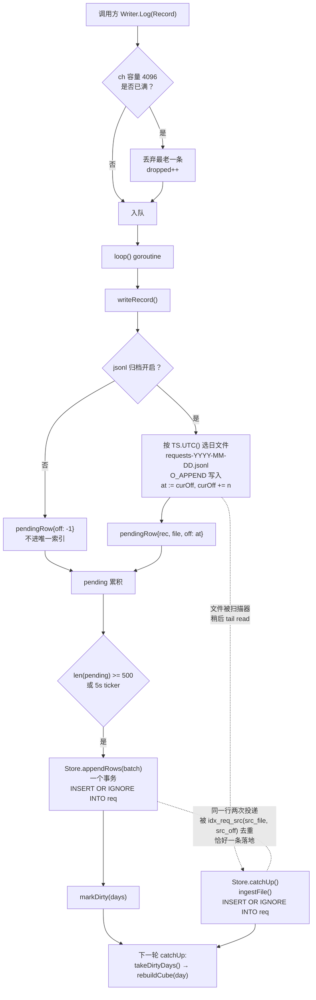

# requestlog —— 请求账本与 SQLite 索引

> [← Wiki 首页](Home) · [架构总览](Architecture)

> 本页对应 `github.com/wjsoj/cc-core` 的 `requestlog/` 包。所有行号引用自仓库当前 `main`（提交 `74aa66c` 时的工作树），标识符一律保留英文。

## 概览：JSONL 是真相源，索引是派生

`requestlog` 为每一个**终态请求**（terminal request）写一行 JSON 到按天轮转的文件 `requests-YYYY-MM-DD.jsonl`（`requestlog.go:357`），文件名与 `Record` 的 JSON 形状自最初的 CPA-Claude 实现起逐字节保持兼容，老目录可以原地升级，不需要迁移（`requestlog.go:12-18`）。

在同一个目录里还有一个 SQLite 索引 `requests.db`（`store.go:58` `IndexFileName`）。它的定位写在 `store.go:19-31`：

- **默认是派生状态**。写入方追加 JSONL，索引随时可以被删除，下次 `OpenStore` 会从这些文件自我重建。正是这一点授权了 `synchronous=NORMAL`（`store.go:154-160`）——掉电丢掉最后一次 commit 只意味着下次开机重扫一天的尾巴，而不是丢钱。
- **`listLogFiles` 只匹配 `requests-*.jsonl`**（`query.go:457`），所以 `requests.db` 及其 `-wal` / `-shm` 兄弟文件对扫描路径是不可见的。
- **索引坏了/没开只损失速度**。`Query` / `AggregateByAuth` / `AggregateHourly` 三个入口各自先问 `indexFor(dir)`，拿不到就退回原来的 JSONL 扫描（`query.go:129`、`query.go:199`、`query.go:262`）。因此**没有任何调用点需要改动**。

为什么要有索引：在 ~1M 条记录的归档上，面板渲染的每一个聚合都意味着重新解析整个日志目录，纯 `json.Unmarshal` 就要 ~20s（磁盘无关，文件都在 page cache 里）。面板定时轮询，于是运维看到的是 15–30s 的加载，同时这些扫描还在和真实代理流量抢那台机器的两个核（`store.go:5-13`）。

唯一改变这个"派生"性质的开关是 `Options{JSONLArchive: false}`——见下文[无归档模式](#无归档模式jsonlarchive-false)。

---

## Record 字段表

`Record` 定义于 `requestlog.go:35-86`。它是 CPA-Claude（单用户）与 hypitoken（多租户 SaaS）**共用的统一线格式**；SaaS-only 字段带 `omitempty`，所以单用户部署产出的 JSONL 与从前逐字节一致（`requestlog.go:7-10`）。

| 字段 | JSON tag | 类型 | omitempty | SaaS-only | 含义 |
|---|---|---|---|---|---|
| `TS` | `ts` | `time.Time` | 否 | 否 | 记录时间戳；`Log` 在为零值时填 `time.Now()`（`requestlog.go:213`） |
| `Client` | `client` | `string` | 是 | 否 | token 的友好名称 |
| `ClientToken` | `client_token` | `string` | 否 | 否 | 已掩码的客户端 token；`RewriteClientMask` 改写的就是这一列 |
| `Provider` | `provider` | `string` | 是 | 否 | `"anthropic"` / `"openai"`；**历史记录为空**，查询时按 anthropic 处理 |
| `AuthID` | `auth_id` | `string` | 否 | 否 | 凭证 ID（通常是凭证文件名） |
| `AuthLabel` | `auth_label` | `string` | 是 | 否 | 凭证展示名 |
| `AuthKind` | `auth_kind` | `string` | 否 | 否 | `"oauth"` 或 `"apikey"` |
| `Model` | `model` | `string` | 否 | 否 | 模型名 |
| `Input` | `input_tokens` | `int64` | 否 | 否 | 输入 token |
| `Output` | `output_tokens` | `int64` | 否 | 否 | 输出 token |
| `CacheRead` | `cache_read_tokens` | `int64` | 否 | 否 | 缓存读取 token |
| `CacheCreate` | `cache_create_tokens` | `int64` | 否 | 否 | 缓存写入 token（**始终是全量**） |
| `CacheCreate1h` | `cache_create_1h_tokens` | `int64` | 是 | 否 | `CacheCreate` 中 1 小时 TTL 的**子集**，见下方注意 |
| `CostUSD` | `cost_usd` | `float64` | 否 | 否 | 目录价成本 |
| `Status` | `status` | `int` | 否 | 否 | 终态 HTTP 状态码 |
| `DurationMs` | `duration_ms` | `int64` | 否 | 否 | 耗时（毫秒） |
| `Stream` | `stream` | `bool` | 否 | 否 | 是否流式 |
| `Path` | `path` | `string` | 是 | 否 | 请求路径 |
| `Attempts` | `attempts` | `int` | 是 | 否 | 到达终态前尝试过的凭证数 |
| `Error` | `error` | `string` | 是 | 否 | 错误串；**非空即计入 errors，哪怕状态是 2xx** |
| `AttemptOnly` | `attempt_only` | `bool` | 是 | 否 | 标记一条"被扣下未返回给客户端、随后 failover"的凭证尝试审计行 |
| `ClaudeAudit` | `claude_audit` | `*ClaudeAudit` | 是 | 否 | 隐私安全的准备/身份映射证据 |
| `BilledUSD` | `billed_usd` | `float64` | 是 | **是** | 真正从客户钱包扣掉的金额，通常是 `CostUSD × Multiplier` |
| `Multiplier` | `multiplier` | `float64` | 是 | **是** | 产生 `BilledUSD` 的定价组系数，随行存档以便审计不受后续组配置变更影响 |
| `UserID` | `user_id` | `int64` | 是 | **是** | SaaS 账户 ID，供面向客户的面板过滤 |

**`CacheCreate1h` 的规则**（`requestlog.go:48-55`）：它是 Anthropic `usage.cache_creation.ephemeral_1h_input_tokens` 的直接映射，是 `CacheCreate` 的子集而**不是加数**。1h 写入按 2× input 计价、5m 写入按 1.25×，而 mimicry 在每个 breakpoint 都设 `ttl:"1h"`，所以这一列是审计中把两者分开的唯一依据。**永远不要从 `CacheCreate` 里把它减掉。**

### `ClaudeAudit`（`requestlog.go:90-110`）

只存策略结果与做过域分离的账号摘要；**从不存**账号 UUID、邮箱、prompt、bearer 或客户端 token。字段：`account_hash`、`request_class`、`identity_mode`、`account_identity_mapped`、`credential_hard_failed`、`preparation_failed`、`preparation_error`、`fallback`、`body_bytes`、`body_sha256`、`session_binding`、`billing_validation`、`beta_hash`、`profile_hash`、`proxy_config_hash`、`extra_metadata_count`、`extra_header_count`、`extra_metadata_keys`、`extra_header_names`。索引里整体序列化进 `req.audit` 一列（`store_ingest.go:329-334`）。

### `BilledOrCost()`（`requestlog.go:126-131`）

```go
func (r Record) BilledOrCost() float64 {
	if r.BilledUSD != 0 {
		return r.BilledUSD
	}
	return r.CostUSD
}
```

这是**两代日志共存**的兼容层（`requestlog.go:112-125`）：v0.8.61 之前，一个 fork 把已计费金额写进 `CostUSD` 而留空 `BilledUSD`，另一个把目录价写进 `CostUSD`、把实扣写进 `BilledUSD`——同一列在两个二进制下含义相反。现在都用第二种约定，但 90 天保留窗口意味着一个季度内目录里会混着两种。SQL 侧的等价写法在 `aggSelect` 里（`store_ingest.go:369`）：`SUM(CASE WHEN billed_usd != 0 THEN billed_usd ELSE cost_usd END)`。

---

## 写入路径

### `Writer` 生命周期

| API | 位置 | 说明 |
|---|---|---|
| `Open(dir, retentionDays)` | `requestlog.go:175` | 历史默认行为（`JSONLArchive: true`）的薄封装 |
| `OpenWithOptions(dir, Options)` | `requestlog.go:184` | 暴露归档开关 |
| `Log(Record)` | `requestlog.go:209` | 非阻塞入队 |
| `Dropped() int64` | `requestlog.go:237` | 因缓冲满而丢弃的累计条数 |
| `Close()` | `requestlog.go:246` | flush + fsync + close，可重复调用 |
| `RewriteClientMask(old, new)` | `requestlog.go:471` | token 轮换时迁移历史遥测 |

**`Open`**：`dir` 为空报错；目录不存在则以 `0700` 创建；若 `JSONLArchive == false` 而该目录还没有索引，直接拒绝启动（`requestlog.go:191-193`）——写入方无处安放记录，`OpenStore` 才是那个目的地。随后 `go w.loop()`。

**`Log` 的背压**（`requestlog.go:209-232`）：channel 容量 4096。满了不阻塞热路径，而是**丢掉最老的一条**腾位置并 `dropped++`。`Dropped()` 非零且在增长 = 磁盘跟不上请求速率（或缓冲需要调大）。

**批处理**（`requestlog.go:263-338`）：`dbBatch = 500` 条攒成一个事务插入索引；同时有 5s 的 `flushTicker` 兜住安静流的延迟。`flush()` 先 `curFile.Sync()` 再 `flushDB()`。`flushDB` 找不到索引时：归档开着 = 正常无害（扫描器稍后会从文件里捡回来）；归档关着 = 记录直接丢失，计入 `dropped` 并**每个 writer 只警告一次**（`noStoreWarned`，`requestlog.go:285-290`）。

**日切文件名**（`requestlog.go:344`、`requestlog.go:357`）：`day := r.TS.UTC().Format("2006-01-02")`，路径 `requests-<day>.jsonl`，以 `O_WRONLY|O_CREATE|O_APPEND`、`0600` 打开。日期变化即关旧开新，并 `go w.gc()`。

**`curOff` 恢复逻辑**（`requestlog.go:149-153`、`requestlog.go:364-372`）：`O_APPEND` 隐藏了文件位置，所以偏移自己跟踪。开文件时**从文件当前长度恢复**：

```go
off := int64(0)
if fi, err := f.Stat(); err == nil {
	off = fi.Size()
}
```

这是必须的——重启会往昨天或今天**已存在**的文件上追加，偏移若从 0 重来就会和上一轮已索引的行撞号，破坏 `(src_file, src_off)` 的幂等性。

写入短写（short write）时**不**把行交给索引（`requestlog.go:383-388`）：短写留下的是撕裂行，扫描器会跳过它，不能让索引持有一个指向垃圾字节的偏移。

**retention GC**（`requestlog.go:425-455`）：`retentionDays <= 0` 完全关闭。cutoff 为 `now.UTC().AddDate(0,0,-retentionDays)` 的日期串。先 `st.pruneBefore(cutoff)` 裁剪索引，再（仅在归档开启时）删除 `requests-*.jsonl` 中 `day < cutoff` 的文件。注意注释里的要点（`requestlog.go:421-424`）：索引裁剪**不只是**对扫描器缺文件处理的优化——归档关闭时根本没有"文件消失"这个信号，`pruneBefore` 是**唯一**执行保留期的东西。

无归档模式下没有文件轮转可挂 GC，改由 `maybeGC(day)` 在日变化时触发（`requestlog.go:394-402`）。

### `RewriteClientMask` 的等长原地重写

`requestlog.go:471-510`。流程：

1. 加锁关闭当前文件（下次 `Log()` 会重建）。
2. 归档开启时：遍历目录内所有 `.jsonl`，逐个 `rewriteMaskFile`（`requestlog.go:512-562`）——读入、逐条 `Decode`/`Encode`（`SetEscapeHTML(false)`）到 `path + ".rewrite.tmp"`，`Sync` + `Close` 后**原子 rename**。`hits == 0` 则删临时文件不动原文件。崩溃中途绝不会留下半重写的日志。
3. 归档关闭时：从索引 `SELECT COUNT(*) FROM req WHERE client_token = ?` 取计数。
4. 调 `st.rewriteClientMask`（`store_write.go:138-159`），索引侧用**一条 `UPDATE`** 完成，而不是重读被重写的文件。

第 4 步的理由写在 `requestlog.go:467-470`：扫描器把轮转文件的任何变化都当成篡改，而刚被重写的每个文件都符合这个条件——不走 UPDATE 的话，改一个字段的代价是重新解析整个归档。

因为 token 掩码是**定宽**的，重写通常不改变文件大小，字节偏移得以保留。`reconcileIngestStats`（`store_write.go:187-210`）随后重新 stat 每个被跟踪的文件：大小未变 → 接受新的 `mtime_ns`，压制扫描器的重建；**大小变了 → 偏移（连同 `src_off`）失去意义，`dropDay` 掉那天重读**。

### 写入路径图



---

## 索引 schema

迁移列表 `storeMigrations`（`store.go:303-487`）是**只追加**的：每一项是一个完整的 schema delta，**永远不要重排或改写既有条目，只能追加**。`migrate()`（`store.go:489-513`）按 `PRAGMA user_version` 逐条在事务内执行并推进版本号。当前 v3。

### 连接参数（`store.go:154-170`）

```
file:<dir>/requests.db?_txlock=immediate
  &_pragma=busy_timeout(10000)
  &_pragma=journal_mode(WAL)
  &_pragma=synchronous(NORMAL)
  &_pragma=cache_size(-32768)
  &_pragma=auto_vacuum(INCREMENTAL)
```

`SetMaxOpenConns(4)` / `SetMaxIdleConns(2)`：一个写者加几个读者；WAL 允许并发读，而 ingest 路径无论如何由 `ingestMu` 单线程化。打开后对 `""` / `-wal` / `-shm` 三个文件 `Chmod(0600)`。

### 表 `req`（迁移 1，`store.go:315-344`；迁移 3 追加两列，`store.go:482-483`）

```sql
CREATE TABLE req (
    id              INTEGER PRIMARY KEY,
    ts              INTEGER NOT NULL,      -- unix 纳秒
    day             TEXT    NOT NULL,      -- 源文件的 UTC 日
    bday            TEXT    NOT NULL,      -- 同一瞬间在展示时区的日
    client          TEXT    NOT NULL DEFAULT '',
    client_token    TEXT    NOT NULL DEFAULT '',
    provider        TEXT    NOT NULL DEFAULT '',
    auth_id         TEXT    NOT NULL DEFAULT '',
    auth_label      TEXT    NOT NULL DEFAULT '',
    auth_kind       TEXT    NOT NULL DEFAULT '',
    model           TEXT    NOT NULL DEFAULT '',
    input           INTEGER NOT NULL DEFAULT 0,
    output          INTEGER NOT NULL DEFAULT 0,
    cache_read      INTEGER NOT NULL DEFAULT 0,
    cache_create    INTEGER NOT NULL DEFAULT 0,
    cache_create_1h INTEGER NOT NULL DEFAULT 0,
    cost_usd        REAL    NOT NULL DEFAULT 0,
    billed_usd      REAL    NOT NULL DEFAULT 0,
    multiplier      REAL    NOT NULL DEFAULT 0,
    status          INTEGER NOT NULL DEFAULT 0,
    duration_ms     INTEGER NOT NULL DEFAULT 0,
    stream          INTEGER NOT NULL DEFAULT 0,
    path            TEXT    NOT NULL DEFAULT '',
    attempts        INTEGER NOT NULL DEFAULT 0,
    error           TEXT    NOT NULL DEFAULT '',
    attempt_only    INTEGER NOT NULL DEFAULT 0,
    user_id         INTEGER NOT NULL DEFAULT 0,
    audit           TEXT
);
-- 迁移 3：
ALTER TABLE req ADD COLUMN src_file TEXT    NOT NULL DEFAULT '';
ALTER TABLE req ADD COLUMN src_off  INTEGER NOT NULL DEFAULT -1;
```

`ts` 用 unix 纳秒：整数排序与范围谓词，且分辨率足以**精确**而非近似地往返一个记录的时间戳（`store.go:306-313`）。`day` / `bday` 都存下来，是为了避免在 SQL 里做时区数学——Go 的时区规则（以及 DST）在那里拿不到。

### 表 `agg_cube`（迁移 3，`store.go:459-480`）

```sql
CREATE TABLE agg_cube (
    day             TEXT    NOT NULL,
    bday            TEXT    NOT NULL,
    model           TEXT    NOT NULL,
    client          TEXT    NOT NULL,
    client_token    TEXT    NOT NULL,
    provider        TEXT    NOT NULL,
    auth_id         TEXT    NOT NULL,
    status          INTEGER NOT NULL,
    user_id         INTEGER NOT NULL,
    count           INTEGER NOT NULL DEFAULT 0,
    input           INTEGER NOT NULL DEFAULT 0,
    output          INTEGER NOT NULL DEFAULT 0,
    cache_read      INTEGER NOT NULL DEFAULT 0,
    cache_create    INTEGER NOT NULL DEFAULT 0,
    cache_create_1h INTEGER NOT NULL DEFAULT 0,
    cost_usd        REAL    NOT NULL DEFAULT 0,
    billed_usd      REAL    NOT NULL DEFAULT 0,
    errors          INTEGER NOT NULL DEFAULT 0,
    duration_ms     INTEGER NOT NULL DEFAULT 0,
    PRIMARY KEY (day, bday, model, client, client_token, provider, auth_id, status, user_id)
) WITHOUT ROWID;
```

`errors` 是**存储的计数器**而不是对 `status` 的谓词，因为一行可以带着 2xx 状态却有错误串（headers 之后才死掉的流），这些必须仍然计为错误（`store.go:443-445`）。

### 表 `ingest` 与 `meta`（迁移 1，`store.go:382-393`）

```sql
CREATE TABLE ingest (
    file     TEXT    PRIMARY KEY,
    size     INTEGER NOT NULL DEFAULT 0,
    mtime_ns INTEGER NOT NULL DEFAULT 0,
    offset   INTEGER NOT NULL DEFAULT 0,   -- 最后一整行之后的字节位置
    rows     INTEGER NOT NULL DEFAULT 0
);

CREATE TABLE meta (
    key   TEXT PRIMARY KEY,
    value TEXT NOT NULL
);
```

`meta` 目前只有一个 key：`bucket_loc`（`store.go:522`）。

### 已废弃的 `agg_day`

迁移 1 建了 `agg_day`（`store.go:362-377`，kind ∈ `total|auth|model|client|day`），迁移 3 第一条语句就是 `DROP TABLE IF EXISTS agg_day`（`store.go:457`）。原因见下节。

### 索引清单

迁移 1 的索引全部在迁移 2 被 DROP 重建（`store.go:411-422`）。**当前生效的索引**：

| 索引名 | 定义 | 用途 | 位置 |
|---|---|---|---|
| `idx_req_day` | `ON req(day)` | 按 UTC 日剪枝；迁移 1 建立，未被替换 | `store.go:347` |
| `idx_req_ts` | `ON req(ts DESC, id DESC) WHERE attempt_only = 0` | 条目页默认排序 | `store.go:417` |
| `idx_req_auth` | `ON req(auth_id, ts DESC, id DESC) WHERE attempt_only = 0` | `Filter.AuthID` | `store.go:418` |
| `idx_req_ct` | `ON req(client_token, ts DESC, id DESC) WHERE attempt_only = 0` | `Filter.ClientToken` | `store.go:419` |
| `idx_req_model` | `ON req(model COLLATE NOCASE, ts DESC, id DESC) WHERE attempt_only = 0` | `Filter.Model` | `store.go:420` |
| `idx_req_client` | `ON req(client COLLATE NOCASE, ts DESC, id DESC) WHERE attempt_only = 0` | `Filter.Client` | `store.go:421` |
| `idx_req_user` | `ON req(user_id, ts DESC, id DESC) WHERE attempt_only = 0` | `Filter.UserID` | `store.go:422` |
| `idx_req_src` | `UNIQUE ON req(src_file, src_off) WHERE src_off >= 0` | 两个 producer 的幂等去重 | `store.go:485` |

迁移 2 的两个动机（`store.go:397-409`），都是在真实 1M 行归档上量出来的：

1. 条目页按 `(ts DESC, id DESC)` 排序以保证分页稳定，而**只建在 `ts` 上的索引无法满足两列排序**。SQLite 退化成 `SCAN req + TEMP B-TREE`，为了返回 50 行把每一行都排了一遍——**3.7s**，本该是一次索引 seek。
2. `Model` 和 `Client` 用 `COLLATE NOCASE` 比较（镜像扫描路径的 `strings.EqualFold`）。**BINARY 排序规则的索引对 NOCASE 比较不可用**，所以这两个过滤器也在全表扫。

所有谓词都带 `attempt_only = 0`，所以索引对它做 partial：更小，且 SQLite 仍能证明索引适用。

`idx_req_src` 的 partial 条件是 `src_off >= 0`（`store.go:485`）：迁移之前入库的行不知道偏移，默认 `-1`，因此**不参与去重**——这是安全的，因为它们的文件已被完整消费，只有在 `dropDay` 之后才会被重读（`store.go:452-455`）。无归档模式写入的行同样用 `off = -1`（`requestlog.go:346-350`），因为没有文件也就没有偏移可去重，而且这条记录永远不会被从任何地方重读。

---

## 增量 ingest 与自愈

`store_ingest.go` 开头的注释（`store_ingest.go:3-18`）就是这一节的规格：归档在常态下是 append-only，稳态是对一个文件的 tail read。它仍可能在我们脚下变化的三种方式，全部被检测并修复。**修复的单位是"天"，因为存储的单位就是天：一个文件、一个 `req.day` 值、一组 rollup 行。**

`catchUp(initial bool)`（`store_ingest.go:37-135`）持 `ingestMu` 全程；文件按**从旧到新**排序（`sort.Strings`，`store_ingest.go:48`）——半途死掉的 backfill 留下的是一段连续的历史前缀而不是空洞，而人们真正会看的近几天最后落地，也正是 `ready` 翻转的时刻。

### 三种自愈条件（`store_ingest.go:74-96`）

```go
prev, seen := state[name]
from := int64(0)
switch {
case !seen:
    // 新文件，from = 0 全量读
case size < prev.offset:
    // 截断：这一天记录的一切都可疑
    dropDay(day, name)
case day < todayUTC && (size != prev.size || mtime != prev.mtimeNS):
    // 轮转文件变了。它不可能被追加，所以这是一次重写 —— 重建这一天而不是信任偏移
    dropDay(day, name)
case size > prev.offset:
    from = prev.offset   // append：稳态
default:
    continue             // 未变化
}
```

| 场景 | 信号 | 处理 |
|---|---|---|
| **append**（今天的文件长大了） | `size > prev.offset` | 从记录的 offset 续读 |
| **truncate** | `size < prev.offset` | `dropDay` 后整天重读 |
| **等长原地重写**（`RewriteClientMask`） | `day < todayUTC` 且 `(size, mtime)` 任一漂移 | `dropDay` 后整天重读 |
| **保留期删除** | 文件在 `ingest` 表里但不在磁盘上（`store_ingest.go:112-119`） | `dropDay`，让 lifetime 总数与运维还能实际检视的内容一致 |

**掩码是定宽的，所以重写后大小通常不变，`mtime` 是唯一的信号**（`store_ingest.go:11-15`）。轮转文件绝不会合法地变化，所以对它们而言 `(size, mtime)` 的**任何**漂移都触发那天的重新入库。

`dropDay`（`store_ingest.go:164-180`）在一个事务里删三张表：`req WHERE day=?`、`agg_cube WHERE day=?`、`ingest WHERE file=?`。

### 部分行（partial line）

`ingestFile`（`store_ingest.go:213-303`）用 `bufio.NewReaderSize(fh, 256*1024)` + `ReadBytes('\n')`。**没有换行的 EOF 意味着一个半截行，丢弃并停止**——偏移停在它之前，下一轮重新完整读取（`store_ingest.go:211-212`、`store_ingest.go:248-252`）。回归测试是 `TestStorePartialLine`（`store_test.go:458`）。

畸形行被跳过（扫描路径也跳过），但**偏移照样前进**，所以不会反复重读（`store_ingest.go:260-263`）。

每 `backfillBatch = 5000` 条提交一次并**把偏移和批一起 checkpoint**（`store_ingest.go:275-294`），崩溃后从这里恢复而不是重放整个文件；`initial` 为真时每批之间 `time.Sleep(backfillPause)`（15ms）。`backfillBatch` + `backfillPause` 一起把 backfill 压在大约半个核以内：在 ~1M 记录归档上的首次运行不能饿死同一台机器上的代理（`store.go:70-74`）。

### `added` 计的是行不是插入

`store_ingest.go:267-272`：`added` 统计的是**折进来的行**，不是插入成功的行。在双写下大多数已经存在（写入方先到），插入变成 no-op，但这一行仍被计入——正是这一点让 `sum(ingest.rows)` 可以和文件行数比对，**这是这个索引上最便宜的健康检查**。

### 后台循环与按需 catch-up

- `loop()`（`store.go:235-281`）：`pass(initial)` 先 `ensureCube()` 再 `catchUp()`。首轮成功才 `ready.Store(true)` 并打印 `index ready at ...`；失败则保持 `ready == false`，查询继续走 JSONL 路径，并在每个 tick 重试完整首轮，避免一次失败的 backfill 把索引钉死。
- `catchUpInterval = 5s`（`store.go:63`）：面板 10s 轮询，明显更低没有意义。
- `catchUpMinGap = 1s`（`store.go:67`）：`maybeCatchUp()`（`store.go:287-299`）用 CAS 节流，一批并发面板请求最多触发一次 tail 扫描；抢输的那个立即返回，读到赢家刚提交的数据。三个 store 查询入口都以 `s.maybeCatchUp()` 开头。
- `ensureCube()` 只在 `!ready` 时跑（`store.go:246-252`）：它在 90 天生产归档上约 7s，所以放在 `loop()` 而不是 `OpenStore` 里；ready 之后 cube 已完整、由 catch-up 增量维护，再跑"哪些天缺"的探测纯属开销。

---

## `(src_file, src_off)`：两个 producer 的协调

**两个 producer 同时写 `req`**：

1. **writer**（`store_write.go` / `appendRows`）——追加 JSONL 的同时把这一批直接插进 `req`，让索引在**一个批次**内就是最新的，而不是等一个扫描间隔。
2. **file scanner**（`store_ingest.go` / `ingestFile`）——稍后 tail read 同一个文件，再次读到同一行。

协调靠的是唯一键 `(src_file, src_off)`：**一行被追加时所在的字节偏移**。插入语句是 `INSERT OR IGNORE`（`store_ingest.go:198-206`）：

```go
// insertReq is OR IGNORE against idx_req_src: the same JSONL line can be
// offered twice, once by the writer as it appends and once by the scanner as
// it re-reads the file, and exactly one of them must land.
```

谁第二个提供这一行，谁就是 no-op。此外 `appendRows` 也持 `ingestMu`（`store_write.go:43-44`）：两者都写 `req`，让它们交错就意味着两个事务在相同偏移上竞争。

这一幂等性正是 `Options{JSONLArchive: false}` 得以可能的前提（见下节）。

`markDirty` / `takeDirtyDays`（`store_write.go:67-88`）：writer 直插后把涉及的天标脏，下一轮 `catchUp` 从 `takeDirtyDays()` 取出并合进 `touched`，再 `rebuildCube(day)`（`store_ingest.go:123-132`）。归档开着时这些天本来也在 `touched` 里（文件也长大了）；归档关着时扫描器什么都看不见，**这是 cube 变陈旧的唯一信号**。

---

## `agg_cube` 与 `cubeEligible`

### 维度列

`cubeDims`（`store_ingest.go:378`），按 PRIMARY KEY 顺序，只写一次以保证 insert、它的 GROUP BY、以及查询侧的再聚合永不分歧：

```
day, bday, model, client, client_token, provider, auth_id, status, user_id
```

计数器列由 `aggCols` / `aggSelect` / `rollupSelect` 三个常量保持一致（`store_ingest.go:366-374`、`store_query.go:314-317`）。

### 为什么从 `agg_day` 换成 `agg_cube`（`store.go:427-446`）

`agg_day` 一次只预汇总**一个** grouping，因此只服务**无过滤**的聚合；任何带谓词的查询都掉回 `req`。在 **984k 行的生产归档**上量到：一个这样的查询（`?model=claude-opus-4-7`，匹配 116k 行）要 **~2.9s**，因为过滤索引覆盖了谓词但覆盖不了十一个计数器列——每个匹配行都是一次单独的表查找，而且每个 grouping 都要做一遍。

把每一个低基数维度放进同一个 key 里，让同一份归档塌缩成 **10,382 行**（最忙的一天约 **199 行**）：**95 倍**的缩减，却仍能对 model / client / provider / auth / status 的任意组合回答 Summary / ByModel / ByClient / ByDay。留在 `req` 上的是 cube 真正表达不了的东西：**亚日级的时间边界**，以及**条目页本身**。

> 出处：`requestlog/store.go:427-446`（迁移 3 的注释）与 `requestlog/store_query.go:172-175`（"~10k rows for a 90-day, 1M-record archive"）。CLAUDE.md 的 `requestlog` 段落引用同一组数字（"10.4k rows standing in for 984k records"、"the cube answers the same query in 10ms"）。

`rebuildCube(day)`（`store_ingest.go:388-405`）：过去的天只在入库时被碰一次；当天则在有新记录落地时重算，那是对当天切片的一次 grouped scan——生产上最忙的一天 26k 行，塌缩成约 199 个 cube 行。**`attempt_only` 行在这里被排除**，因为每一个消费者都排除它们。

### `cubeEligible`（`store_query.go:160-170`）

```go
func cubeEligible(f Filter) bool {
	return f.From.IsZero() && f.To.IsZero()
}
```

**这就是全部规则。** 面板过滤的每一个维度都是 cube 的列，所以唯一能取消资格的是**时间边界**：`Filter` 比较精确时间戳，而 cube 最细的时间粒度是"天"。与其去检测边界恰好落在日边界上的情形（那取决于调用方的时区，且一旦假设破裂就是错的），任何边界都把查询送到 `req`——那里 `day` 列本来就会剪枝。

`storeQuery`（`store_query.go:108-158`）的分派：

1. 先取条目页（永远走 `req`，`ORDER BY ts DESC, id DESC LIMIT ? OFFSET ?`）。
2. `PageOnly` 直接返回。
3. `cubeEligible(f)` → `aggregatesFromCube`（`store_query.go:176-211`），对 cube 做四次 GROUP BY（`''` / client / model / bday）。cube 足够小，四次 grouping 是微秒级，所以不像 `req` 路径那样需要先物化。
4. 否则 → `aggregatesFromReq`（`store_query.go:266-310`），**一次** `WITH m AS MATERIALIZED (...)` 物化过滤后的切片，再 `UNION ALL` 四种 grouping。

`aggregatesFromReq` 上的性能注释（`store_query.go:253-265`）：显而易见的写法——每个维度一个 grouped query——要付四趟；而这里一趟不便宜，过滤索引覆盖谓词但不覆盖那十一个计数器列，所以每个匹配行都是一次单独的表查找。生产数据上一个匹配 116k 行的过滤器**每个维度 0.54s**，面板的 model 过滤器于是花了 **~3.9s** 做四遍同样的工作。物化一次再分四种方式 group，总共 **0.57s**。`MATERIALIZED` 是显式写死的而不是交给 planner：SQLite 可能把被引用多次的 CTE 内联，那会悄悄把这里避免的四趟又恢复回来。

`cubeWhere`（`store_query.go:217-250`）逐条镜像 `filterWhere`——同样的排序规则、同样的 legacy provider 回退——只少了 `attempt_only`，因为 cube 在构建时就已经排除了它。

### 回退到扫描 JSONL 的路径

`indexFor(dir)`（`store.go:130-136`）在以下任一情况返回 `nil`，调用方即走 JSONL 扫描：

- 该目录**没有注册** `Store`（从未 `OpenStore`）；
- `Store` 存在但 **`ready == false`**（首轮 backfill 未完成或失败）。

三个入口对应的扫描实现：`AggregateHourly`（`query.go:132-189`）、`AggregateByAuth`（`query.go:200-247`）、`Query` + `scanFile`（`query.go:266-359`）。`Query` 的扫描路径用一个 `entryHeap` 最小堆（`query.go:382-394`）把内存限制在 `O(Offset+Limit)`，`PageOnly` 时按天从新到旧扫、凑够 `keep` 条就 `break`（`query.go:295-297`）。

---

## 三大陷阱

### 1. `day` vs `bday`（UTC 日 vs 展示时区日）

- `req.day` = **源文件的 UTC 日**（`store.go:307-309`）。它是 day 粒度的 `Filter` 边界所用的、也是 ingest 记账所 key 的东西。文件名、retention 全部在 UTC，不受展示时区影响（`query.go:17-20`）。
- `req.bday` = **同一瞬间在展示时区渲染出来的日**（`store_ingest.go:339`：`r.TS.In(bucketLoc).Format("2006-01-02")`）。`ByDay` 和 hourly 的标签用它。
- 生产在 **Asia/Shanghai** 分桶，与 UTC **不一致**。

两者都存，是为了避免在 SQL 里做时区数学——Go 的时区规则（以及 DST）在那里拿不到（`store.go:310-313`）。

**改时区 = drop & rebuild。** `bucketLoc` 由 `SetBucketLocation(*time.Location)`（`query.go:26-30`）设置，**必须在启动时设置一次，之后不再改动——它没有对并发变更做保护**（`query.go:21`）。`OpenStore` 里的 `reconcileBucketLocation()`（`store.go:519-534`）把 `bucketLoc.String()` 与 `meta` 表的 `bucket_loc` 比对，不一致就 `rebuildAll(want)`（`store.go:536-552`）：在一个事务里 `DELETE FROM req` / `DELETE FROM agg_cube` / `DELETE FROM ingest`，并更新 `meta`。JSONL 没有被动，所以**重建就是全部的修复**。日志里会看到 `display zone changed X -> Y; rebuilding index`。

回归测试：`TestStoreBucketLocationChange`（`store_test.go:520`）、`TestBucketLocationDayBoundary`（`requestlog_test.go:221`）。

> 注意：`scanRecord` 把 `r.TS` 渲染成展示时区（`store_query.go:346-349`），瞬间相同，但与扫描路径返回的时区标注不同。

### 2. `attempt_only` 行对查询不可见

`AttemptOnly` 行是**被扣下未返回给客户端、随后 failover** 的凭证尝试审计行（`requestlog.go:63-66`）。它们**被写入并持久化**，但对每一个查询消费者不可见：

| 位置 | 做法 |
|---|---|
| `matches()` | `if r.AttemptOnly { return false }` —— **第一条判断**（`query.go:397-399`） |
| `AggregateHourly` 扫描版 | `if r.AttemptOnly { continue }`（`query.go:163-165`） |
| `AggregateByAuth` 扫描版 | `if r.AttemptOnly { continue }`（`query.go:226-228`） |
| `filterWhere` | WHERE 体以 `attempt_only = 0` 开头（`store_query.go:385`） |
| `storeAggregateByAuth` | `WHERE attempt_only = 0 AND auth_id != ''`（`store_query.go:39`） |
| `storeAggregateHourly` | `WHERE attempt_only = 0 ...`（`store_query.go:79`） |
| `rebuildCube` | `WHERE day = ? AND attempt_only = 0`（`store_ingest.go:400`） |
| 全部 partial index | `WHERE attempt_only = 0`（`store.go:417-422`） |

`store_query.go:3-14` 把这条写成硬规则：**这里的每个函数必须返回与 `query.go` 中等价 JSONL 扫描完全一致的结果，`store_test.go` 逐字段断言。** 回归测试 `TestAttemptOnlyRowsArePersistedButExcludedFromQueries`（`requestlog_test.go:116`）。

**`Export` / `exportRange` 是例外**：它不带 `attempt_only` 谓词（`store_write.go:293`），导出的是全部行，这与"JSONL 是真相源"的语义一致。

### 3. Partial index 必须覆盖 `ORDER BY`

条目页排序是 `ORDER BY ts DESC, id DESC`（`store_query.go:126`），`id` 用来在时间戳相同的记录间打破平局，让分页稳定。**只建在 `ts` 上的索引无法满足两列排序**——SQLite 会静默退化成 `SCAN req + TEMP B-TREE`，为了返回 50 行把每一行都排一遍，实测 **3.7s**（`store.go:400-404`）。

因此每个过滤索引都必须同时携带排序列 `ts DESC, id DESC`，并对 `attempt_only = 0` 做 partial（因为每个谓词都带它，索引更小且 SQLite 仍能证明适用）。同理，`model` / `client` 的索引必须建成 `COLLATE NOCASE`，否则 BINARY 排序规则的索引对 NOCASE 比较不可用，那些过滤器也会全表扫（`store.go:405-407`；`store_query.go:378-381` 解释了为什么用 `COLLATE NOCASE` 而不是两边 `lower()`——后者会让索引失效）。

**新增任何过滤维度时，索引必须同时包含谓词列、排序列、以及 partial 条件，三者缺一就会静默退化成全表排序。**

---

## 无归档模式（`JSONLArchive: false`）

`Options`（`requestlog.go:162-170`）：

```go
type Options struct {
	RetentionDays int   // <= 0 关闭保留期
	JSONLArchive  bool  // 保留按天轮转的 .jsonl 文件
}
```

**语义**（`store.go:28-31`、`store_write.go:11-14`）：关掉归档后，SQLite 成为**唯一的副本**。schema 什么都不变，变的是一次写入失败的**后果**。

- `OpenWithOptions` 在归档关闭而目录尚无索引时**拒绝启动**（`requestlog.go:191-193`）——写入方无处安放记录。测试 `TestWriterArchiveOffNeedsIndex`（`store_write_test.go:218`）。
- `writeRecord` 走 `pendingRow{rec: r, off: -1}` 分支（`requestlog.go:345-351`）：没有文件也就没有偏移可去重，`src_off = -1` 让这行落在唯一索引之外，这是正确的——它永远不会被从任何地方重读。
- `flushDB` 找不到 store，或 `appendRows` 报错时，归档关闭下**直接计入 `dropped`**（`requestlog.go:285-297`）。这就是为什么 `appendRows` 上报错误而不是吞掉它。
- 保留期由 `pruneBefore`（`store_write.go:99-130`）**唯一**执行：归档开着时扫描器会因为文件消失而 `dropDay`，是冗余的；归档关着时没有文件可以消失。两种模式都跑它，是为了保持一条代码路径而不是两条。`pruneBefore` 在一个事务里 `DELETE FROM req WHERE day < ?`、`DELETE FROM agg_cube WHERE day < ?`、`DELETE FROM ingest WHERE file < 'requests-<cutoff>.jsonl'`（`ingest` 以文件名为 key，文件名里嵌着同一个日期，所以 cutoff 可以直接比较），提交后执行 `PRAGMA incremental_vacuum` —— **没有它，被裁剪的库尺寸不会变，只是攒下空闲页**。
- `RewriteClientMask` 塌缩成一条 `UPDATE`（`requestlog.go:503-508`），计数改从索引 `SELECT COUNT(*)` 取。

**风险**：没有归档就没有可重建的来源，一次失败的插入就是一条丢失的记录。**这是逐 host 显式开启的，默认关闭。**

**退路是 `Export`**（`store_write.go:264-279`）：把索引里的记录按**从旧到新**重新写成 JSONL，返回写出的条数。`fromDay` / `toDay` 是闭区间的 `'YYYY-MM-DD'` UTC 标签，空串表示无界。这是让"关掉归档"这件事可逆的逃生舱——运维随时可以把同样的文件格式再物化出来。测试 `TestExportRoundTrip`（`store_write_test.go:227`）。

---

## 运维手册

### 开启索引

```go
st, err := requestlog.OpenStore(dir)   // 注册到包级表，按 Filter.Dir 查找
if err != nil { log.Warn(err) }        // 失败也能继续跑：查询会退回扫描
defer st.Close()
```

`OpenStore`（`store.go:145-209`）只对调用方能处理的情况（坏路径、SQLite 不可用）返回错误；调用方应当记日志然后继续。**对同一目录再次 `OpenStore` 会替换注册并关闭前一个，所以重复调用是安全的。** 不变式：**每个目录至多一个 `Store`，启动时开一次，关停时关一次**（`store.go:33-40`）。

用 `st.Ready()`（`store.go:233`）判断首轮 pass 是否完成、是否已在服务查询。

### 重建索引

三种手段，按代价从小到大：

1. **单天**：`dropDay(day, file)`（内部）——或从外部：`touch` 一下那天的轮转 `.jsonl` 文件，扫描器会把 mtime 漂移当成重写并重建那一天。
2. **改展示时区**：调整 `SetBucketLocation` 后重启，`reconcileBucketLocation` 自动 drop & rebuild 全部派生行（`store.go:519-534`）。
3. **彻底重建**：停服 → 删除 `requests.db`（连同 `-wal` / `-shm`）→ 重启。索引会从 JSONL 全量 backfill；`backfillBatch=5000` + `backfillPause=15ms` 把速率压在约半个核，期间查询走 JSONL 扫描路径。**归档关闭时绝对不要这么做——那会删掉唯一的副本。**

> 从旧二进制升级上来、`req` 有行但 cube 是空的，不需要人工干预：`ensureCube()`（`store_ingest.go:412-441`）在 `ready` 翻转前补齐，日志打印 `building aggregate cube for N day(s)`。它从 `req` 重建，只需几秒，而不是重新解析归档。

### 导出

服务器仍在跑时，**用 `OpenStoreForRead`，不要用 `OpenStore`**（`store_write.go:212-256`）：

```go
st, err := requestlog.OpenStoreForRead(dir)   // 只读，不启动 ingest 循环
n, err := st.Export("2026-01-01", "2026-01-31", os.Stdout)
```

`OpenStore` 在这里是**积极错误**的：它会启动一个扫描器去写服务器正在写的同一个库，等于给一个归档挂了两个 ingester。插入是幂等的所以不会损坏数据，但逐文件的行数记账会重复计数，两个进程还会烧 CPU 重读同一段 tail。

`OpenStoreForRead` 会**拒绝**本二进制不认识的 schema（`version != len(storeMigrations)`）而不是迁移它：只读句柄无法迁移，而用旧查询代码读新 schema 正是拿到静默残缺答案的方式。

### 掩码重写（token 轮换）

```go
n, err := writer.RewriteClientMask("sk-...aaaa", "sk-...zzzz")
```

两个掩码必须非空且不同（`requestlog.go:472-474`）。归档开启时重写全部 `.jsonl`（temp + atomic rename），索引侧走一条 `UPDATE` + 受影响天的 `rebuildCube` + `reconcileIngestStats`。**掩码等长是这条快路径成立的前提**；某个文件大小真的变了，那天会被 drop 并重读（`store_write.go:178-186`）。测试：`TestRewriteClientMask`（`requestlog_test.go:160`）、`TestRewriteClientMaskIndex`（`store_write_test.go:270`）。

### 保留期

`Open(dir, retentionDays)`；`retentionDays <= 0` 完全关闭 GC。GC 在日轮转时触发（`requestlog.go:373`），或无归档模式下由 `maybeGC` 在日变化时触发（`requestlog.go:394-402`）。cutoff = `now.UTC() - retentionDays` 的日期串。测试 `TestPruneBefore`（`store_write_test.go:327`）。

### 健康检查

- `writer.Dropped()`：非零且增长 = 磁盘跟不上，或缓冲（4096）需要调大；**归档关闭时它同时统计索引写失败**。
- `sum(ingest.rows)` 对比归档文件总行数（`store_ingest.go:267-272` 明确把这条设计成"这个索引上最便宜的健康检查"）。
- `st.Ready() == false` 且持续不翻转 → 看日志里的 `index backfill failed` / `index catch-up`；查询此时仍然正确，只是慢。

---

## 相关测试索引

| 测试 | 位置 | 覆盖 |
|---|---|---|
| `TestWriterRoundTripAndQuery` | `requestlog_test.go:13` | Writer → JSONL → Query 端到端 |
| `TestClaudeAuditRoundTripContainsOnlyAccountDigest` | `requestlog_test.go:65` | `ClaudeAudit` 不泄露身份 |
| `TestAttemptOnlyRowsArePersistedButExcludedFromQueries` | `requestlog_test.go:116` | **陷阱 2** |
| `TestQueryFilterByUserIDAndAuthID` | `requestlog_test.go:143` | SaaS 维度过滤 |
| `TestRewriteClientMask` | `requestlog_test.go:160` | JSONL 侧掩码重写 |
| `TestAggregateHourlyEmptyDir` | `requestlog_test.go:192` | 空目录零填充 |
| `TestProviderLegacyTreatedAsAnthropic` | `requestlog_test.go:208` | 无 provider 的历史行 |
| `TestBucketLocationDayBoundary` | `requestlog_test.go:221` | **陷阱 1**（扫描路径） |
| `TestQueryBoundedPaginationAndPageOnly` | `requestlog_test.go:264` | 堆分页 + `PageOnly` 提前终止 |
| `TestStoreQueryMatchesScan` | `store_test.go:232` | 索引与扫描逐字段一致 |
| `TestStoreAggregateByAuthMatchesScan` | `store_test.go:271` | 同上 |
| `TestStoreAggregateHourlyMatchesScan` | `store_test.go:308` | 同上 |
| `TestStoreSelfHeal` | `store_test.go:364` | **四种自愈**：append / 等长原地重写（仅 mtime 变）/ truncate / 保留删除 |
| `TestStorePartialLine` | `store_test.go:458` | 半截行既不入库也不跳过 |
| `TestStoreBucketLocationChange` | `store_test.go:520` | **陷阱 1**（drop & rebuild） |
| `TestWriterDualWriteMatchesScan` | `store_write_test.go:41` | 双 producer 结果一致 |
| `TestWriterDualWriteDedup` | `store_write_test.go:94` | **`(src_file, src_off)` 幂等** |
| `TestWriterCrashBeforeIndexFlush` | `store_write_test.go:139` | 崩溃后由扫描器补回 |
| `TestWriterArchiveOff` | `store_write_test.go:173` | 无归档模式语义 |
| `TestWriterArchiveOffNeedsIndex` | `store_write_test.go:218` | 无索引时拒绝开启 |
| `TestExportRoundTrip` | `store_write_test.go:227` | `Export` 往返 |
| `TestRewriteClientMaskIndex` | `store_write_test.go:270` | 索引侧 `UPDATE` 路径 |
| `TestPruneBefore` | `store_write_test.go:327` | 保留期裁剪 |
| `TestCubeMatchesReqAggregates` | `store_write_test.go:370` | cube 与 `req` 聚合等价 |

`TestStoreSelfHeal` 里的重写用例（`store_test.go:405-420`）显式断言 `len(rewritten) == len(data)`，并把 mtime 改到未来——**"只有 mtime 动了"正是被测的那个信号**。

---

## API 速查

```go
// 写入
func Open(dir string, retentionDays int) (*Writer, error)
func OpenWithOptions(dir string, opt Options) (*Writer, error)
func (w *Writer) Log(r Record)
func (w *Writer) Dropped() int64
func (w *Writer) Close()
func (w *Writer) RewriteClientMask(oldMask, newMask string) (int, error)

// 查询（自动选择索引或扫描）
func Query(f Filter) (*Result, error)
func AggregateByAuth(dir string, from, to time.Time) (map[string]Aggregate, error)
func AggregateHourly(dir string, hours int) ([]HourBucket, error)

// 分桶时区（启动时设置一次）
func SetBucketLocation(l *time.Location)
func BucketLocation() *time.Location

// 索引
const IndexFileName = "requests.db"
func OpenStore(dir string) (*Store, error)          // 读写 + 后台 ingest
func OpenStoreForRead(dir string) (*Store, error)   // 只读，不启动 ingest
func (s *Store) Ready() bool
func (s *Store) Close()
func (s *Store) Export(fromDay, toDay string, out io.Writer) (int, error)

// 记账
func (r Record) BilledOrCost() float64
```

`Filter` 全字段（`query.go:73-97`）：`Dir`、`From`、`To`、`ClientToken`、`Client`、`Model`、`Provider`、`Status`、`AuthID`、`UserID`、`Limit`、`Offset`、`PageOnly`。空串与零时间表示"无约束"；`Limit <= 0` 默认 50（`query.go:256-258`）。

- `ClientToken` **优先于** `Client`（`Client` 只是孤儿记录的回退）。
- `Provider`：历史记录没有 provider 字段，`Provider == "anthropic"` 时会匹配它们，无需回填（`query.go:80`、`query.go:413-424`、`store_query.go:402-407`）。
- `PageOnly`（`query.go:88-96`）：把查询变成廉价的列表查找——**跳过 Summary/ByClient/ByModel/ByDay 聚合**，并且一旦从最新的日志文件里收集到 `Offset+Limit` 条匹配就停止扫描。**只给那些只渲染 `Entries`、永不读聚合映射或 `Summary.Count` 的调用方用**（设了它，这些字段是零值/空）。

`Result`（`query.go:100-107`）：`Summary`、`ByClient`、`ByModel`、`ByDay`、`Entries`、`Scanned`。索引路径下 `Scanned = Summary.Count`（`store_query.go:156`）。

`Aggregate`（`query.go:36-54`）：`Count`、`InputTokens`、`OutputTokens`、`CacheReadTokens`、`CacheCreateTokens`、`CacheCreate1hTokens`（子集，非加数）、`CostUSD`、`BilledUSD`（按行回退 `BilledOrCost`）、`Errors`、`TotalDurationMs`。

`HourBucket`（`query.go:110-119`）：`Hour`（截断到小时，标注在 `bucketLoc`）、`Count`、`InputTokens`、`OutputTokens`、`CacheReadTokens`、`CacheCreateTokens`、`CostUSD`、`Errors`。**注意它比 `Aggregate` 少了 1h-cache、billed 与 duration 三个轴**——索引版与扫描版一致，图表也只读这几个字段（`store_query.go:57-59`）。

---

## 文件清单

| 文件 | 行数 | 职责 |
|---|---|---|
| `requestlog/requestlog.go` | 562 | 包文档、`Record` / `ClaudeAudit` / `Options`、`Writer` 全生命周期、retention GC、`RewriteClientMask` 的 JSONL 侧 |
| `requestlog/query.go` | 480 | `bucketLoc` 与 `SetBucketLocation`、`Aggregate` / `Filter` / `Result` / `HourBucket`、三个公开查询入口的 **JSONL 扫描实现**、`matches()`、`entryHeap` |
| `requestlog/store.go` | 552 | `Store` 类型、按目录注册与查找（`lookupStore` / `indexFor`）、`OpenStore` / `Close` / `loop` / `maybeCatchUp`、**全部 schema 迁移**、`reconcileBucketLocation` / `rebuildAll` |
| `requestlog/store_ingest.go` | 441 | 增量 ingest 与三种自愈、`ingestFile` / `insertRecord`、`aggSelect` / `aggCols` / `cubeDims`、`rebuildCube` / `ensureCube` |
| `requestlog/store_query.go` | 420 | 三个入口的 **SQL 实现**、`cubeEligible`、`aggregatesFromCube` / `aggregatesFromReq`、`filterWhere` / `cubeWhere` / `timeWhere`、`scanRecord` |
| `requestlog/store_write.go` | 319 | `pendingRow` / `appendRows` / `markDirty`、`pruneBefore`、索引侧 `rewriteClientMask` / `reconcileIngestStats`、`OpenStoreForRead`、`Export` / `exportRange` |
| `requestlog/requestlog_test.go` | 326 | Writer + 扫描路径测试 |
| `requestlog/store_test.go` | 593 | 索引与扫描的一致性、自愈、部分行、时区变更 |
| `requestlog/store_write_test.go` | 401 | 双写、去重、无归档、导出、裁剪、cube 等价 |

依赖：`modernc.org/sqlite`（纯 Go，无 cgo）、`github.com/sirupsen/logrus`。

---

## `agg_day` 时代的遗留（已清理）

建立本页时发现、现已处理：

- `scanAggregateRow` 全包无调用点，是 `agg_day` 时代 `rollupSelect` 单行读取的残留（随迁移 3 失效）——**已删除**。
- `store_ingest.go` 的 "one set of `agg_day` rows" 与 `store_query.go` 的 "reads the daily rollups" 两处注释——**已改为 `agg_cube`**。

留作提醒：迁移把表换掉时，读取该表的辅助函数和描述它的注释是最容易漏掉的两处。

---

## 相关页面

[Billing](Billing) · [Architecture](Architecture)
