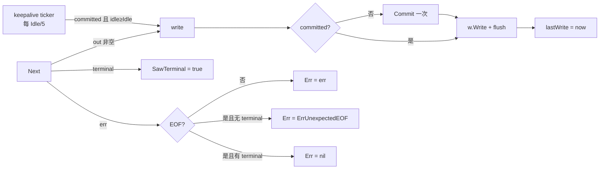
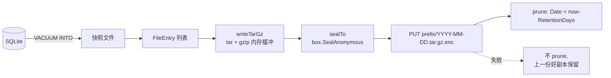

# 传输层与辅助工具（stream / codexws / thinkingsig / backup）

> [← Wiki 首页](Home) · [架构总览](Architecture)

四个互不依赖的小包，各自解决 fork 里一类重复出现的传输/恢复问题。它们都不含业务策略——策略留在调用方（两个 fork）。

---

## 1. `stream` —— 与框架无关的 SSE 中继

### 概览

包注释在 `stream/decompress.go:1-14`：反向代理为了像真实 CLI，必须在流式端点上也宣称 `Accept-Encoding: gzip, br`；但内部所有路径（用量解析、SSE 再流化、body 改写）都想要明文字节。`stream` 提供三件套：

- `Decompress` —— 透明解压 + 剥掉 `Content-Encoding`/`Content-Length`。
- `SSEScanner` —— 逐行 SSE 解析器，保留原始字节以便逐字节转发。
- `Relay` —— 中继核心：**懒提交响应头 + keepalive + 终止事件检测**。

两个 fork 的 streamer 都包在 `Relay` 外面。

### 公开 API 表

| 签名 | 位置 | 说明 |
|---|---|---|
| `func Decompress(resp *http.Response)` | `stream/decompress.go:33` | 支持 **`gzip`** 与 **`br`**（brotli）。`""` / `identity` / 未知编码（zstd、deflate）原样放行。可重复调用（首次后 `Content-Encoding` 已删除，后续为 no-op） |
| `type SSEScanner struct` | `stream/sse.go:25-32` | 非导出字段 |
| `func NewSSEScanner(r io.Reader, bufSize int) *SSEScanner` | `stream/sse.go:37` | `bufSize <= 0` → 默认 64 KiB |
| `func (s *SSEScanner) Scan() bool` | `stream/sse.go:50` | 读一行；返回 false 表示 EOF/错误 |
| `func (s *SSEScanner) Line() []byte` | `stream/sse.go:75` | 原始行，**保留结尾换行**，可逐字节重发 |
| `func (s *SSEScanner) Event() string` | `stream/sse.go:79` | 最近一次 `event:` 的值，跨行保持 |
| `func (s *SSEScanner) Data() []byte` | `stream/sse.go:84` | 当前行是 `data:` 时的 trim 后 payload，否则 nil |
| `func (s *SSEScanner) Err() error` | `stream/sse.go:89` | 遵循 `bufio.Scanner` 约定，`io.EOF` 归一为 `nil` |
| `type RelayResult struct { SawTerminal, WroteAny bool; Bytes int64; Err error }` | `stream/relay.go:13-18` | |
| `type RelayOptions struct { Next func() ([]byte, bool, error); Commit func(); KeepaliveIdle time.Duration; KeepalivePayload []byte }` | `stream/relay.go:23-49` | |
| `func Relay(w io.Writer, flush func(), opt RelayOptions) RelayResult` | `stream/relay.go:58` | |

### 关键机制

**懒提交（lazy commit）**：`Relay` 内部的 `write` 闭包（`stream/relay.go:64-80`）在**首字节写出前**、且在写锁内，恰好调用一次 `opt.Commit()`，然后置 `committed = true` / `res.WroteAny = true`。这样"还没写出任何字节就断流"的情形，调用方可以透明重试（换凭据重发）；一旦写过字节就只能记日志放弃。

**keepalive**：仅当 `KeepaliveIdle > 0` 且 `KeepalivePayload` 非空时启动 goroutine（`stream/relay.go:82-111`）。ticker 周期是 `KeepaliveIdle / 5`；每次 tick 在锁内读 `lastWrite` 与 `committed`，**只有 `committed == true`（首个真实字节之后）且空闲 ≥ `KeepaliveIdle`** 才写 keepalive。首字节前的窗口必须保持"零写入"，否则失效转移就不可能了。退出用 LIFO defer：`defer wg.Wait()` 先注册、`defer close(done)` 后注册，所以返回时先关 done 再等 goroutine 退出，保证不会有 keepalive 写与调用方的 `resp.Body.Close()` 竞态。

**终止检测**：`Next` 返回的 `terminal` 一旦为 true 就置位 `res.SawTerminal`（`stream/relay.go:118-120`）。收尾语义（`:121-127`）：

- `err` 非 `io.EOF` → `res.Err = err`；
- `err == io.EOF` 且**未见终止事件** → `res.Err = io.ErrUnexpectedEOF`（流被截断）；
- `err == io.EOF` 且已见终止事件 → `res.Err = nil`（干净结束）。

`Relay` 从不解析 payload：分帧、模型名改写、用量累计、终止判定全在调用方的 `Next` 闭包里。



**SSEScanner 的延迟错误**：`Scan` 里读到错误时**不立刻返回 false**，而是把错误存进 `scanErr` 留到下一次 `Scan`（`stream/sse.go:65-70`），这样"最后一行没有换行、与 `io.EOF` 一起返回"的情况仍会被调用方 emit 出去。

**decompressedBody**：`stream/decompress.go:64-73` 把解压器的 `Close` 链到原始 body 的 `Close`，`defer resp.Body.Close()` 不会漏掉底层 socket。

### 陷阱

- 只认 `gzip` 和 `br`。zstd/deflate 会**静默透传**（`stream/decompress.go:54-56`），调用方拿到的是压缩字节。
- gzip header 损坏时 `Decompress` 直接返回、不改 body 也不报错（`stream/decompress.go:45-49`）——刻意的 best-effort，让调用方在读取时自然失败。
- `KeepaliveIdle > 0` 但 `KeepalivePayload` 为空 → keepalive 整段被跳过，不会报错。
- `Commit` 可以为 nil（头已在上游提交），但 `WroteAny` 仍会在首字节时置位。
- `SSEScanner.Data()` **不会跨行清空**——每次 `Scan` 从当前行重写（非 data 行写成 nil），文档明确说明（`stream/sse.go:81-83`）。
- `Relay` 的 `w.Write` 返回的 error 被丢弃（`stream/relay.go:74`），下游断开靠 `Next` 侧或调用方的 ctx 感知。

### 测试索引

| 测试 | 位置 |
|---|---|
| `TestDecompressGzip` / `TestDecompressBrotli` / `TestDecompressIdentityNoOp` / `TestDecompressUnknownEncoding` | `stream/stream_test.go:16,44,65,83` |
| `TestSSEScannerBasic` / `TestSSEScannerReemitsLinesVerbatim` / `TestSSEScannerLastLineWithoutNewline` | `stream/stream_test.go:97,121,133` |
| `TestRelayNoCommitBeforeFirstByte` / `TestRelayCleanTerminal` / `TestRelayTruncatedAfterFirstByte` / `TestRelayKeepalive` | `stream/relay_test.go:26,50,74,95` |

### 文件清单

- `/home/wjs/Documents/project/Go/cc-core/stream/decompress.go`（73 行，含 package doc）
- `/home/wjs/Documents/project/Go/cc-core/stream/sse.go`（94 行）
- `/home/wjs/Documents/project/Go/cc-core/stream/relay.go`（130 行）
- `/home/wjs/Documents/project/Go/cc-core/stream/stream_test.go`（149 行）
- `/home/wjs/Documents/project/Go/cc-core/stream/relay_test.go`（149 行）

---

## 2. `codexws` —— Codex over WebSocket 上游传输

### 概览

包注释 `codexws/dial.go:1-16`：真实 codex-tui（注释写 0.144.1，`mimicry.CodexCLIVersion` 现为 **0.144.4**）不再走 HTTP `POST /responses` 的 SSE，而是把一整个 turn 通过 WebSocket 传输：

- URL：`wss://chatgpt.com/backend-api/codex/responses`
- `OpenAI-Beta: responses_websockets=2026-02-06`

选 WS 的理由是协议级 ping/pong 能撑过 reasoning→answer、工具思考之间数秒的静默间隙，而这些间隙会让空闲的 HTTP SSE 被中间层切断，向客户端表现为 "stream disconnected before completion"。

握手复用 cc-core 的 Chrome uTLS 指纹：`auth.DialTLSConn(ctx, host, addr, proxyURL, useUTLS, []string{"http/1.1"})`（`codexws/dial.go:109-111`）——**ALPN 强制 http/1.1**，因为 WebSocket Upgrade 不能跑在 h2 上。选 `gorilla/websocket` 而非 `coder/websocket`，唯一原因是前者的 `Dialer.NetDialTLSContext` 是把"已完成握手的 uTLS conn"交给 WS 客户端的唯一干净途径。

### 公开 API 表

| 签名 | 位置 | 说明 |
|---|---|---|
| `const CodexOpenAIBetaWS = "responses_websockets=2026-02-06"` | `codexws/headers.go:15` | v2，默认 |
| `const CodexOpenAIBetaWSV1 = "responses_websockets=2026-02-04"` | `codexws/headers.go:16` | v1 |
| `const TextMessage / BinaryMessage / CloseMessage / PingMessage / PongMessage` | `codexws/dial.go:42-48` | 转出 gorilla 常量，调用方不必直接依赖 gorilla |
| `func BuildUpstreamHeaders(accessToken, accountID, sessionID, betaValue string) http.Header` | `codexws/headers.go:30` | |
| `type DialConfig struct { URL string; Header http.Header; ProxyURL string; UseUTLS bool; Timeout time.Duration; ReadLimit int64 }` | `codexws/dial.go:51-58` | |
| `type Conn interface` | `codexws/dial.go:64-76` | `WriteJSON` / `WriteMessage` / `ReadMessage` / `Ping(deadline)` / `SetReadDeadline` / `SetWriteDeadline` / `HandshakeResponse() *http.Response` / `Close()` |
| `func Dial(ctx context.Context, cfg DialConfig) (Conn, *http.Response, error)` | `codexws/dial.go:82` | |
| `func IsUnexpectedClose(err error) bool` | `codexws/dial.go:129` | |

默认值：`Timeout` 0 → 10s（`defaultHandshakeTimeout` `:37`）；`ReadLimit` 0 → **16 MiB**（`defaultReadLimit` `:35`，gorilla 默认 32KB 撑不住 rate_limits 快照与大 delta）。

### 关键机制

**握手头**（`BuildUpstreamHeaders`，`codexws/headers.go:30-48`）：

| Header | 值 |
|---|---|
| `Authorization` | `Bearer <accessToken>` |
| `OpenAI-Beta` | `betaValue`，空则 `CodexOpenAIBetaWS` |
| `Originator` | `mimicry.CodexOriginator`（`codex-tui`） |
| `User-Agent` | `mimicry.CodexCLIUserAgent` |
| `Version` | `mimicry.CodexCLIVersion`（`0.144.4`） |
| `Session_id` | 传入值；空则 `mimicry.NewRequestUUID()` 现铸一个 |
| `Chatgpt-Account-Id` | 仅当 `accountID != ""` 时设置 |

**故意不设**：`Upgrade` / `Connection` / `Sec-WebSocket-*` 由 gorilla dialer 拥有；`x-codex-turn-metadata` / `x-codex-window-id` / `x-codex-beta-features` / thread-id 是 TUI 专属——代理没有真实的 workspace/window，伪造比省略更糟（与 `mimicry.ApplyCodexCLIHeaders` 同一理由，`codexws/headers.go:26-29`）。

**拨号流程**（`Dial`，`codexws/dial.go:82-124`）：解析 URL → 取 host，端口空则 443 → 组 `addr` → 建 `gorillaws.Dialer{HandshakeTimeout, ReadBufferSize:4096, WriteBufferSize:4096, EnableCompression:true, NetDialTLSContext:…}` → `dialer.DialContext(ctx, cfg.URL, cfg.Header)` → `ws.SetReadLimit(limit)`。

`EnableCompression: true` 是指纹考虑：真实 codex-tui 会协商 permessage-deflate。

`NetDialTLSContext` 忽略 gorilla 传入的 host:port，改用自己解析的值，确保 uTLS 的 SNI 正确；返回一个**已握手的 TLS conn**，等于告诉 gorilla 跳过它自己的 TLS。

**非 101 响应**：`Dial` 在出错时也把 `*http.Response` 一并返回（`codexws/dial.go:114-117`），调用方可以读错误 body 并做凭据分类（401/403/429 → `Pool.ReportUpstreamError`）。`Conn.HandshakeResponse()` 保留这份响应，用于日志与 `cf-ray`/`x-request-id`/`x-codex-*` 限额头。

**并发契约**（`codexws/dial.go:62-63`）：沿用 gorilla —— 至多一个并发 reader、一个并发 writer；`ReadMessage` 之间、写方法之间都必须由调用方串行化。`Ping` 与 `Close` 可以与读写并发。`Ping` 用 `WriteControl`（`codexws/dial.go:152-154`），这正是它能绕开写串行化要求的原因。

### 陷阱

- `CodexOpenAIBetaWS` 与 `mimicry.CodexOpenAIBeta`（`"responses=experimental"`，HTTP POST 用）是**两个不同的标记**，别混用。Codex 目标版本上移时两者要一起 bump（`codexws/headers.go:12-13`）。
- ALPN 必须是 `http/1.1`；给 h2 会让 Upgrade 失败。
- 包注释里的 "codex-tui 0.144.1" 与 `mimicry.CodexCLIVersion = "0.144.4"` 不一致——注释未随版本 bump 更新（**待确认**是否要修正注释）。
- `Dial` 的 `resp` 在 URL 解析失败时是 nil（`codexws/dial.go:85`），调用方要判空。
- 32KB 的 gorilla 默认 read limit 会直接砍断 rate_limits 快照；显式传 `ReadLimit` 或依赖默认 16 MiB，不要自己传一个小值。

### 测试索引

| 测试 | 断言 | 位置 |
|---|---|---|
| `TestBuildUpstreamHeaders` | 七个头的精确值 + 五个 forbidden 头（`Upgrade`/`Connection`/`Sec-WebSocket-Key`/`Content-Type`/`Accept`）必须为空 | `codexws/codexws_test.go:13-44` |
| `TestBuildUpstreamHeadersDefaults` | 空 sessionID 现铸 UUID；空 accountID 省略头；显式 v1 生效 | `:46-58` |
| `TestIsUnexpectedClose` | 1000 正常关闭 → false；abnormal → true | `:60-69` |
| `TestDialURLParseError` | 畸形 URL 返回错误 | `:71-77` |

无真实网络测试：拨号路径本身未被覆盖（**待确认**是否有 fork 侧的集成测试）。

### 文件清单

- `/home/wjs/Documents/project/Go/cc-core/codexws/dial.go`（154 行）
- `/home/wjs/Documents/project/Go/cc-core/codexws/headers.go`（48 行）
- `/home/wjs/Documents/project/Go/cc-core/codexws/codexws_test.go`（77 行）

---

## 3. `thinkingsig` —— 换号检测与 thinking 签名清理

### 概览

包注释 `thinkingsig/switch_tracker.go:1-13`：Anthropic 的 `thinking` 内容块带一个绑定到签发账号的密码学 `signature`。多轮会话从凭据 A 轮换到 B 后，`messages[]` 里回放的历史 assistant 轮次仍携带 A 的签名，B 的验证器返回 `400 signature in thinking`。

`SwitchTracker` 负责观测"每个 `(clientToken, conversation)` 上次由哪个凭据处理"，`SanitizeForSwitch` 负责在跨界之前把签名块摘掉。`DisableThinking` 是 sanitize 修不了那一类错误的兜底。

### 公开 API 表

| 签名 | 位置 | 说明 |
|---|---|---|
| `func IsSignatureError(body []byte) bool` | `thinkingsig/detect.go:25` | 可通过"剥离历史 thinking"修复的那一类 4xx |
| `func IsThinkingError(body []byte) bool` | `thinkingsig/detect.go:59` | 任何 thinking 块拒绝，含**不可通过剥离修复**的那一类 |
| `func SanitizeForSwitch(body []byte) []byte` | `thinkingsig/sanitize.go:31` | 一级修复 |
| `func DisableThinking(body []byte) []byte` | `thinkingsig/sanitize.go:131` | 二级兜底 |
| `type SwitchTracker struct` | `thinkingsig/switch_tracker.go:37-42` | 非导出字段；`now` 是测试钩子 |
| `const SwitchTrackerIdleTTL = 2 * time.Hour` | `thinkingsig/switch_tracker.go:52` | |
| `func NewSwitchTracker() *SwitchTracker` | `thinkingsig/switch_tracker.go:55` | 附带启动后台 GC goroutine |
| `func (t *SwitchTracker) Check(clientToken string, body []byte, currentAuthID string) bool` | `thinkingsig/switch_tracker.go:67` | 记录并返回"是否发生了换号" |

非导出但关键：`sourceSessionID(body)`（`thinkingsig/first_user.go:9`）、`firstUserText(body)`（`:35`）、`conversationKey(body)`（`switch_tracker.go:109`）。

### 关键机制

#### 换号检测键

`Check` 的 map key 是 **`clientToken + "|" + conversationKey(body)`**（`thinkingsig/switch_tracker.go:75`）。之所以不是单纯 per-clientToken：一个下游 token 可能并行跑多个会话，其中一个换号不该被另一个（还黏在旧账号上的）会话继承（`:33-36`）。

`conversationKey`（`thinkingsig/switch_tracker.go:109-121`）两级锚点，各带域分隔前缀，再 sha256 取 hex 前 16 字符：

| 优先级 | 锚点 | 域字符串 |
|---|---|---|
| 1 | `sourceSessionID(body)` —— `metadata.user_id`（CC 把它序列化成 **JSON 字符串**，需二次 unmarshal）里的 `session_id` | `"source-session/v1\x00"` |
| 2 | `firstUserText(body)` —— 首条 user 消息的文本（`content` 支持纯字符串或 typed block 数组） | `"first-user/v1\x00"` |
| — | 两者皆空 → 返回 `""`，`Check` 直接返回 false（无信号） | |

优先用 source session 的原因（`thinkingsig/switch_tracker.go:29-31`）：不同会话的首个 user block 常常是同一段生成的 system reminder，用文本会碰撞。

`Check` 的短路：`clientToken == ""` 或 `currentAuthID == ""` → false（`:68-70`）。首次触达返回 false（没有历史 thinking 块可言）。

GC：每 15 分钟扫一次，丢弃 `lastSeen` 早于 `now - 2h` 的条目（`thinkingsig/switch_tracker.go:92-105`）。

```mermaid
flowchart TD
  R[请求 body + clientToken + authID] --> K{conversationKey}
  K -->|metadata.user_id.session_id| K1[source-session/v1]
  K -->|回落: 首条 user 文本| K2[first-user/v1]
  K1 & K2 --> H[sha256 → hex[:16]]
  H --> M[map: clientToken 竖线 convKey]
  M --> D{prev.authID != current?}
  D -->|是| S[SanitizeForSwitch]
  D -->|否| P[原样发送]
  S --> U[上游]
  U -->|400 且 IsSignatureError| S
  U -->|400 且 IsThinkingError 但非签名类| DT[DisableThinking 重放]
```

#### sanitize 到底删了什么

`SanitizeForSwitch`（`thinkingsig/sanitize.go:31-112`）——只碰 `role == "assistant"` 且 `content` 是**数组**的消息（字符串 content 直接跳过，不可能有 thinking 块）：

1. **丢弃全部 `type == "thinking"` 块**。没有安全替代：空签名 400，伪造签名也 400，丢弃是唯一正确解。用户 prompt 与 tool 输出保留，模型继续所需的信息还在。
2. **删除 `type == "tool_use"` 块上的 `signature` 字段**。Anthropic 即使对原账号也不接受 tool_use 上的 signature；某些客户端/代理会防御性注入，同样 400。CLIProxyAPI 也做同样的防御性剥离。

**注意 `SanitizeForSwitch` 不处理 `redacted_thinking`**，也不动顶层 `thinking` 字段。

`DisableThinking`（`thinkingsig/sanitize.go:131-206`）在此之上多做两件事：

1. 丢弃 **所有** assistant 消息（包括最新一条）的 `thinking` **和 `redacted_thinking`** 块，同样剥离 tool_use 的 `signature`；
2. **删除顶层 `thinking` 字段**，本轮关闭 extended thinking。

代价是这一轮没有 extended thinking；`tool_use`/`tool_result` 连续性保留，进行中的工具循环不会断。

两者都是纯函数：解析失败或无改动时**原样返回 body**（`sanitize.go:29-30`、`:99-101`、`:198-200`）。就地复用切片 `kept := blocks[:0]` 是标准 filter-in-place 写法。

#### 错误分类

`IsSignatureError`（`thinkingsig/detect.go:25-39`）小写化后子串匹配，命中任一：

- 同时含 `signature` 和 `thinking`；
- 含 `expected` 且含 `` `thinking` `` 或 `redacted_thinking`（对应 "Expected \`thinking\` or \`redacted_thinking\`, but found \`text\`"）。

`IsThinkingError`（`thinkingsig/detect.go:59-70`）= `IsSignatureError` **或**（含 `thinking` 且含 `cannot be modified` / `must remain as they were` / `must be the same`）。后者对应"最新 assistant 消息里的 thinking 块不能被修改"——既不能删（最新轮次的 thinking 必须原样保留）也不能留（验证器拒签名），唯一出路是 `DisableThinking` 重放。

匹配刻意用小写子串以扛住 CC 版本间的措辞漂移；假阳性成本很低——最坏情况是对一个本来就会失败的 400 多重试一次（`detect.go:21-24`）。

### 陷阱

- **`conversationKey` 的两个锚点用不同域前缀**，所以同一段文本作为 session id 和作为首条 user 文本不会碰撞；改动这两个域字符串会让所有在途会话被视为新会话。
- **`SanitizeForSwitch` 不删 `redacted_thinking`**，只有 `DisableThinking` 删。想把 redacted 块也从历史里拿掉，必须走二级路径。
- `NewSwitchTracker` **无条件启动一个永不退出的 GC goroutine**（`thinkingsig/switch_tracker.go:55-59`）——它是进程级单例语义，不要在每个请求里 new。
- `Check` 有副作用：它同时**记录**当前 authID。同一请求不要调用两次，否则第二次一定返回 false。
- `firstUserText` 遇到第一条 user 消息就 return（哪怕解不出内容也 return `""`，`first_user.go:63`），不会继续往后找。
- 剥离历史 thinking 会削弱模型的推理连续性——这是已知代价，不是 bug。

### 测试索引

| 测试 | 位置 |
|---|---|
| `TestIsSignatureError` | `thinkingsig/detect_test.go:5` |
| `TestSanitizeThinkingForSwitch` | `thinkingsig/sanitize_test.go:8` |
| `TestSwitchTrackerDetection` | `thinkingsig/sanitize_test.go:186` |
| `TestSwitchTrackerSeparatesClaudeConversationsWithSameReminder` | `thinkingsig/sanitize_test.go:218` —— 锁死"用 source session 而非首条文本"这个设计 |
| `TestIsThinkingError` | `thinkingsig/disable_thinking_test.go:9` |
| `TestDisableThinking` / `TestDisableThinkingNoopWhenNothingToStrip` | `thinkingsig/disable_thinking_test.go:27,80` |

### 文件清单

- `/home/wjs/Documents/project/Go/cc-core/thinkingsig/detect.go`（70 行）
- `/home/wjs/Documents/project/Go/cc-core/thinkingsig/sanitize.go`（206 行）
- `/home/wjs/Documents/project/Go/cc-core/thinkingsig/first_user.go`（66 行）
- `/home/wjs/Documents/project/Go/cc-core/thinkingsig/switch_tracker.go`（121 行，含 package doc）
- 测试：`detect_test.go`（26）、`sanitize_test.go`（248）、`disable_thinking_test.go`（85）

---

## 4. `backup` —— 异地加密快照

### 概览

包注释 `backup/backup.go:1-19`：把一个 app 的关键持久状态打包送到 S3 兼容存储桶（Bitiful），**非对称加密**，对象按日期命名，滚动保留窗口。它是灾难恢复层——有项目代码 + 桶里最新对象，运维就能重建一台被抹掉的服务器。

管线：

```
files → tar.gz → seal(recipient pubkey) → PUT <prefix>YYYY-MM-DD.tar.gz.enc → prune > retention
```

两条关键设计：**prune 只在上传成功之后跑**，所以失败的备份永远不会删掉上一份好副本；归档只有几 MB，**全程在内存里缓冲**而不是流式。

### 公开 API 表

| 签名 | 位置 | 说明 |
|---|---|---|
| `type Options struct { S3 S3Config; RecipientPubKey string; RetentionDays int; Now time.Time }` | `backup/backup.go:40-45` | `Now` 零值 → `time.Now().UTC()`；`RetentionDays <= 0` 保留全部 |
| `type BackupObject struct { Key string; Date time.Time; Size int64 }` | `backup/backup.go:56-60` | |
| `func RunBackup(ctx, opt Options, entries []FileEntry) (string, error)` | `backup/backup.go:65` | 返回写入的 object key |
| `func ListBackups(ctx, cfg S3Config) ([]BackupObject, error)` | `backup/backup.go:104` | 按 Date **降序**（最新在前） |
| `func Restore(ctx, cfg S3Config, identityPriv, dateOrLatest, destDir string) error` | `backup/backup.go:153` | `dateOrLatest` 为 `"YYYY-MM-DD"` 或 `"latest"`（空串也当 latest） |
| `type FileEntry struct { Name, SourcePath string; Mode os.FileMode }` | `backup/archive.go:17-21` | `Name` 是 tar 内相对路径；`Mode` 为 0 时取源文件权限 |
| `type S3Config struct { Endpoint, Region, Bucket, AccessKeyID, SecretAccessKey, Prefix string; PlainHTTP bool }` | `backup/s3.go:14-26` | `Endpoint` 仅主机名不含 scheme |
| `func NewS3Client(cfg S3Config) (*minio.Client, error)` | `backup/s3.go:41` | SigV4 静态凭据；`Secure: !PlainHTTP` |
| `func GenerateKeypair() (pub, priv string, err error)` | `backup/crypt.go:28` | base64-std 的 32 字节 X25519 |
| `func SnapshotSQLite(ctx, src, dst string) error` | `backup/sqlite.go:22` | |

常量：`objectSuffix = ".tar.gz.enc"`、`dateLayout = "2006-01-02"`（`backup/backup.go:34-37`）。

### 关键机制

#### NaCl 加密方案

`backup/crypt.go` 用 **NaCl sealed box**（X25519 + XSalsa20-Poly1305，即 libsodium 的 `crypto_box_seal`）：

- `sealTo(plaintext, recipientPub)`（`:51-61`）→ `box.SealAnonymous(nil, plaintext, pub, rand.Reader)`。输出是自包含的：内嵌一次性发送方公钥 + 认证标签。
- `openFrom(sealed, identityPriv)`（`:64-82`）→ 先用 `curve25519.X25519(priv, Basepoint)` **从私钥推导出公钥**（`OpenAnonymous` 需要收件人公钥），再 `box.OpenAnonymous`。
- `parseKey32`（`:36-47`）：base64-std 解码后必须恰好 32 字节。

服务器只持有**收件人公钥**（config 里的 `backup.recipient_pubkey`）；匹配的私钥离线保存，只在 `restore` 时提供。所以服务器沦陷或桶凭据泄露都读不到历史备份。

选 `x/crypto` 而不是 `filippo.io/age` 的理由（`backup/crypt.go:18-20`）：同样的非对称保证，不多引一个 module，而且解密只会经由本二进制的 `restore` 子命令发生，age-CLI 互操作没有价值。



#### S3 / 归档流程

`RunBackup`（`backup/backup.go:65-101`）顺序：

1. `RecipientPubKey == ""` → 直接报错 "refusing to upload plaintext"；`len(entries) == 0` → 报错。
2. `NewS3Client` → key = `normPrefix() + now().Format("2006-01-02") + ".tar.gz.enc"`。
3. `writeTarGz(&tgz, entries)` → `sealTo` → `cli.PutObject(..., ContentType: "application/octet-stream")`。
4. `RetentionDays > 0` 时 `prune`。**prune 失败是非致命的**：函数返回已写入的 key **加上**一个错误（`:96-98`），下次运行会重试。调用方必须处理这种"key 非空但 err 非 nil"的组合。

`prune`（`:134-148`）依据的是 **object key 里嵌的日期**，不是 S3 的 mtime：`o.Date.Before(now.AddDate(0,0,-retentionDays))`。`parseKeyDate`（`:197-208`）只认 `path.Base` 以 `.tar.gz.enc` 结尾且前缀能被 `time.Parse` 成 `YYYY-MM-DD` 的对象——不匹配的对象被 `listBackups` 静默跳过（`:122-125`），因此同前缀下的其他文件不会被误删。

`normPrefix`（`backup/s3.go:30-37`）：trim 空白与两端 `/`，空则返回空，否则补正好一个尾部 `/`。

`Restore`（`backup/backup.go:153-179`）：`resolveKey` → `GetObject` → `io.ReadAll` → `openFrom` → `extractTarGz(bytes.NewReader(plain), destDir)`。

`extractTarGz`（`backup/archive.go:71-116`）**只解regular file**（`hdr.Typeflag != tar.TypeReg` 跳过），目录以 0700 创建，文件权限取 tar header 的 perm（为 0 时回落 0600）。路径经 `safeJoin`（`:120-139`）三重校验：拒绝空/`.`、拒绝绝对路径、拒绝含 `..` 段，最后再用 `filepath.Rel` 复核结果确实落在 base 内。

`writeTarGz`（`backup/archive.go:26-38`）用 `tar.FormatPAX`；**源文件缺失是错误**，调用方需自行预过滤可选文件（`:24-25`）。

#### SQLite 快照

`SnapshotSQLite(ctx, src, dst)`（`backup/sqlite.go:22-44`）：

- 先 `os.Remove(dst)`（`VACUUM INTO` 拒绝覆盖，清掉崩溃残留）；
- 以 `file:<src>?mode=ro&_pragma=busy_timeout(10000)` 只读打开（驱动为纯 Go 的 `modernc.org/sqlite`）；
- 执行 `VACUUM INTO '<dst>'`，dst 里的单引号做 `''` 转义；
- `os.Chmod(dst, 0600)`（`VACUUM INTO` 遵循 umask，之后手动收紧）。

相比裸文件复制，它是事务性的：活跃服务器可以继续读写，而我们拿到一个单一时间点的、自包含的快照，**没有 `-wal`/`-shm` 兄弟文件**要一起搬。实现镜像 hypitoken 的 `internal/saas/db.(*DB).SnapshotTo`。

### 陷阱

- **`RunBackup` 可能同时返回非空 key 和非 nil error**（prune 失败）——把它当"备份成功但清理待重试"，别当整体失败。
- 归档**全在内存**（`bytes.Buffer` + `sealed` 副本 + minio 读取），备份集变大时内存占用是 2–3 倍归档大小。
- `RecipientPubKey` 为空是硬失败，不是"退化为明文上传"。
- 保留窗口按 **key 里的日期**判定；同一天多次运行会**覆盖**同一个 key（`YYYY-MM-DD` 粒度），没有小时级版本。
- 私钥丢失 = 历史备份永久不可读。这是设计目标（`backup/crypt.go:13-16`），不是可以事后补救的配置。
- `parseKeyDate` 的注释写的是 `.tar.gz.age`（`backup/backup.go:196`），实际常量是 `.tar.gz.enc` —— 是 age→NaCl 迁移遗留的过时注释（**待确认**是否要修正）。
- `PlainHTTP` 只应用于本地测试服务器；Bitiful 要求 HTTPS。
- `SnapshotSQLite` 要求 `dst` 所在目录可写且 `dst` 不存在（它会先删）。

### 测试索引

| 测试 | 断言 | 位置 |
|---|---|---|
| `TestArchiveCryptRoundTrip` | tar.gz → seal → open → extract 全链路往返 | `backup/backup_test.go:16` |
| `TestSafeJoinRejectsTraversal` | 路径穿越被拒 | `:77` |
| `TestParseKeyDateAndPrefix` | key 日期解析 + `normPrefix` 归一 | `:89` |
| `TestSnapshotSQLite` | `VACUUM INTO` 快照可读 | `:104` |
| `TestParseKeyDateStableClock` | 解析结果不随时钟漂移 | `:134` |

无网络测试（S3 路径未覆盖；`ListBackups`/`prune`/`Restore` 的 minio 交互**待确认**是否有 fork 侧集成测试）。

### 文件清单

- `/home/wjs/Documents/project/Go/cc-core/backup/backup.go`（208 行，含 package doc + 管线编排 + 保留策略）
- `/home/wjs/Documents/project/Go/cc-core/backup/archive.go`（139 行，tar.gz 打包/解包 + `safeJoin`）
- `/home/wjs/Documents/project/Go/cc-core/backup/crypt.go`（82 行，NaCl sealed box）
- `/home/wjs/Documents/project/Go/cc-core/backup/s3.go`（47 行，minio 客户端与配置）
- `/home/wjs/Documents/project/Go/cc-core/backup/sqlite.go`（44 行，`VACUUM INTO` 快照）
- `/home/wjs/Documents/project/Go/cc-core/backup/backup_test.go`（140 行）

外部依赖：`github.com/minio/minio-go/v7`、`golang.org/x/crypto/{nacl/box,curve25519}`、`modernc.org/sqlite`。

---

## 相关页面

[Auth-Pool](Auth-Pool) · [Mimicry](Mimicry)
