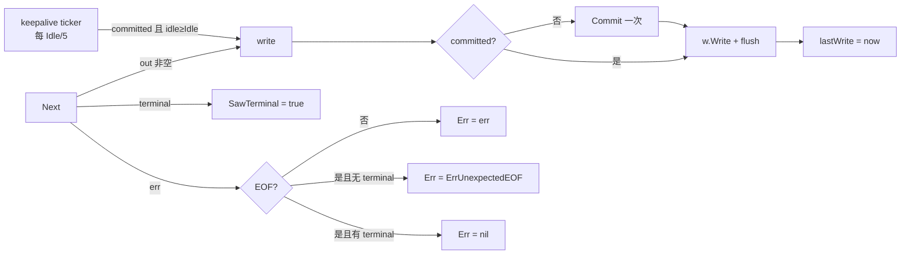
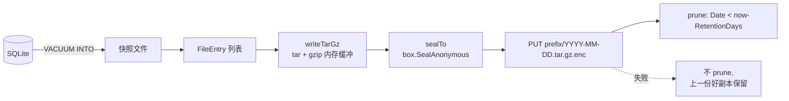

# 传输层与辅助工具（stream / codexws / thinkingsig / backup）

> [← Wiki 首页](Home) · [架构总览](Architecture)

四个互不依赖的小包，各自解决 fork 里一类重复出现的传输/恢复问题。它们都不含业务策略——策略留在调用方（两个 fork）。

---

## 1. `stream` —— 与框架无关的 SSE 中继

### 概览

包注释在 `stream/decompress.go:1-14`：反向代理为了像真实 CLI，必须在流式端点上也宣称 `Accept-Encoding: gzip, br`；但内部所有路径（用量解析、SSE 再流化、body 改写）都想要明文字节。`stream` 提供三件套：

- `Decompress` —— 透明解压 + 剥掉 `Content-Encoding`/`Content-Length`。
- `SSEScanner` —— 逐行 SSE 解析器，保留原始字节以便逐字节转发。
- `Relay` —— 中继核心：**懒提交响应头 + keepalive + 终止事件检测**。

两个 fork 的 streamer 都包在 `Relay` 外面。

### 公开 API 表

| 签名 | 位置 | 说明 |
|---|---|---|
| `func Decompress(resp *http.Response)` | `stream/decompress.go:33` | 支持 **`gzip`** 与 **`br`**（brotli）。`""` / `identity` / 未知编码（zstd、deflate）原样放行。可重复调用（首次后 `Content-Encoding` 已删除，后续为 no-op） |
| `type SSEScanner struct` | `stream/sse.go:25-32` | 非导出字段 |
| `func NewSSEScanner(r io.Reader, bufSize int) *SSEScanner` | `stream/sse.go:37` | `bufSize <= 0` → 默认 64 KiB |
| `func (s *SSEScanner) Scan() bool` | `stream/sse.go:50` | 读一行；返回 false 表示 EOF/错误 |
| `func (s *SSEScanner) Line() []byte` | `stream/sse.go:75` | 原始行，**保留结尾换行**，可逐字节重发 |
| `func (s *SSEScanner) Event() string` | `stream/sse.go:79` | 最近一次 `event:` 的值，跨行保持 |
| `func (s *SSEScanner) Data() []byte` | `stream/sse.go:84` | 当前行是 `data:` 时的 trim 后 payload，否则 nil |
| `func (s *SSEScanner) Err() error` | `stream/sse.go:89` | 遵循 `bufio.Scanner` 约定，`io.EOF` 归一为 `nil` |
| `type RelayResult struct { SawTerminal, WroteAny bool; Bytes int64; Err error }` | `stream/relay.go:13-18` | |
| `type RelayOptions struct { Next func() ([]byte, bool, error); Commit func(); KeepaliveIdle time.Duration; KeepalivePayload []byte }` | `stream/relay.go:23-49` | |
| `func Relay(w io.Writer, flush func(), opt RelayOptions) RelayResult` | `stream/relay.go:58` | |

### 关键机制

**懒提交（lazy commit）**：`Relay` 内部的 `write` 闭包（`stream/relay.go:64-80`）在**首字节写出前**、且在写锁内，恰好调用一次 `opt.Commit()`，然后置 `committed = true` / `res.WroteAny = true`。这样"还没写出任何字节就断流"的情形，调用方可以透明重试（换凭据重发）；一旦写过字节就只能记日志放弃。

**keepalive**：仅当 `KeepaliveIdle > 0` 且 `KeepalivePayload` 非空时启动 goroutine（`stream/relay.go:82-111`）。ticker 周期是 `KeepaliveIdle / 5`；每次 tick 在锁内读 `lastWrite` 与 `committed`，**只有 `committed == true`（首个真实字节之后）且空闲 ≥ `KeepaliveIdle`** 才写 keepalive。首字节前的窗口必须保持"零写入"，否则失效转移就不可能了。退出用 LIFO defer：`defer wg.Wait()` 先注册、`defer close(done)` 后注册，所以返回时先关 done 再等 goroutine 退出，保证不会有 keepalive 写与调用方的 `resp.Body.Close()` 竞态。

**终止检测**：`Next` 返回的 `terminal` 一旦为 true 就置位 `res.SawTerminal`（`stream/relay.go:118-120`）。收尾语义（`:121-127`）：

- `err` 非 `io.EOF` → `res.Err = err`；
- `err == io.EOF` 且**未见终止事件** → `res.Err = io.ErrUnexpectedEOF`（流被截断）；
- `err == io.EOF` 且已见终止事件 → `res.Err = nil`（干净结束）。

`Relay` 从不解析 payload：分帧、模型名改写、用量累计、终止判定全在调用方的 `Next` 闭包里。



**SSEScanner 的延迟错误**：`Scan` 里读到错误时**不立刻返回 false**，而是把错误存进 `scanErr` 留到下一次 `Scan`（`stream/sse.go:65-70`），这样"最后一行没有换行、与 `io.EOF` 一起返回"的情况仍会被调用方 emit 出去。

**decompressedBody**：`stream/decompress.go:64-73` 把解压器的 `Close` 链到原始 body 的 `Close`，`defer resp.Body.Close()` 不会漏掉底层 socket。

### 陷阱

- 只认 `gzip` 和 `br`。zstd/deflate 会**静默透传**（`stream/decompress.go:54-56`），调用方拿到的是压缩字节。
- gzip header 损坏时 `Decompress` 直接返回、不改 body 也不报错（`stream/decompress.go:45-49`）——刻意的 best-effort，让调用方在读取时自然失败。
- `KeepaliveIdle > 0` 但 `KeepalivePayload` 为空 → keepalive 整段被跳过，不会报错。
- `Commit` 可以为 nil（头已在上游提交），但 `WroteAny` 仍会在首字节时置位。
- `SSEScanner.Data()` **不会跨行清空**——每次 `Scan` 从当前行重写（非 data 行写成 nil），文档明确说明（`stream/sse.go:81-83`）。
- `Relay` 的 `w.Write` 返回的 error 被丢弃（`stream/relay.go:74`），下游断开靠 `Next` 侧或调用方的 ctx 感知。

### 测试索引

| 测试 | 位置 |
|---|---|
| `TestDecompressGzip` / `TestDecompressBrotli` / `TestDecompressIdentityNoOp` / `TestDecompressUnknownEncoding` | `stream/stream_test.go:16,44,65,83` |
| `TestSSEScannerBasic` / `TestSSEScannerReemitsLinesVerbatim` / `TestSSEScannerLastLineWithoutNewline` | `stream/stream_test.go:97,121,133` |
| `TestRelayNoCommitBeforeFirstByte` / `TestRelayCleanTerminal` / `TestRelayTruncatedAfterFirstByte` / `TestRelayKeepalive` | `stream/relay_test.go:26,50,74,95` |

### 文件清单

- `/home/wjs/Documents/project/Go/cc-core/stream/decompress.go`（73 行，含 package doc）
- `/home/wjs/Documents/project/Go/cc-core/stream/sse.go`（94 行）
- `/home/wjs/Documents/project/Go/cc-core/stream/relay.go`（130 行）
- `/home/wjs/Documents/project/Go/cc-core/stream/stream_test.go`（149 行）
- `/home/wjs/Documents/project/Go/cc-core/stream/relay_test.go`（149 行）

---

## 2. `codexws` —— Codex over WebSocket 上游传输

### 概览

包注释 `codexws/dial.go:1-16`：真实 Codex 不走 HTTP `POST /responses` 的 SSE，而是把一整个 turn 通过 WebSocket 传输：

- URL：`wss://chatgpt.com/backend-api/codex/responses`
- `OpenAI-Beta: responses_websockets=2026-02-06`

**这一点被 2026-08-14 的 Desktop 抓包彻底坐实**：`crack/codexapp0.147.0/` 的 293 个 HTTP session 里**一个 `POST /backend-api/codex/responses` 都没有**，全部 6 次 turn 都是 WS upgrade（其中 3 次是从不承载 turn 的 prewarm 连接）。cc-core 仍保留 HTTP 转发路径，因为后端依然接受它、而一个 HTTP API 代理需要它。

选 WS 的理由是协议级 ping/pong 能撑过 reasoning→answer、工具思考之间数秒的静默间隙，而这些间隙会让空闲的 HTTP SSE 被中间层切断，向客户端表现为 "stream disconnected before completion"。

握手复用 cc-core 的 Chrome uTLS 指纹：`auth.DialTLSConn(..., []string{"http/1.1"})`——**ALPN 强制 http/1.1**，因为 WebSocket Upgrade 不能跑在 h2 上（这也与抓包一致：Desktop 对 `chatgpt.com` 全程 HTTP/1.1 + `Connection: close`，根本不协商 h2）。选 `gorilla/websocket` 而非 `coder/websocket`，唯一原因是前者的 `Dialer.NetDialTLSContext` 是把"已完成握手的 uTLS conn"交给 WS 客户端的唯一干净途径。

### 公开 API 表

| 签名 | 位置 | 说明 |
|---|---|---|
| `const CodexOpenAIBetaWS = "responses_websockets=2026-02-06"` | `codexws/headers.go:17` | v2，默认。两代抓包同值 |
| `const CodexOpenAIBetaWSV1 = "responses_websockets=2026-02-04"` | `codexws/headers.go:18` | v1 |
| `const TextMessage / BinaryMessage / CloseMessage / PingMessage / PongMessage` | `codexws/dial.go:43-47` | 转出 gorilla 常量，调用方不必直接依赖 gorilla |
| `func HandshakeHeaderOrder() []string` | `codexws/headers.go:52` | 抓包中的握手头顺序副本 |
| `type UpstreamHeaderOptions struct { AccessToken, AccountID string; Identity *mimicry.CodexFrameIdentity; SessionID, ThreadID, InstallationID, BetaValue string; Profile *mimicry.CodexClientProfile }` | `codexws/headers.go:66` | **`Identity` 是首选入口**：它与 `mimicry.RewriteCodexClientFrame` 吃同一个类型，一个值喂两处才能保证握手头与帧内 `client_metadata` 不打架。松散字段是遗留路径，此时 installation id 从 `AccountID` 派生，与帧改写方（从 account key 派生）**不是同一个值** |
| `type SessionRegistry` / `NewSessionRegistry` / `SessionID` / `Identity` / `Forget` / `Len` | `codexws/session.go` | 见下方「会话注册表」 |
| `func BuildUpstreamHeadersWithOptions(opts UpstreamHeaderOptions) http.Header` | `codexws/headers.go:111` | **新入口** |
| `func BuildUpstreamHeaders(accessToken, accountID, sessionID, betaValue, model, serviceTier string) http.Header` | `codexws/headers.go:205` | 位置参数签名**冻结**（两个 fork 按位置调用），委托给上面那个 |
| `func SessionIDForAccount(anchor string, startedAt time.Time) string` | `codexws/headers.go:219` | 便捷包装 `mimicry.CodexSessionUUIDFor` |
| `type DialConfig struct { URL string; Header http.Header; ProxyURL string; UseUTLS bool; Timeout time.Duration; ReadLimit int64 }` | `codexws/dial.go:51-58` | |
| `type Conn interface` | `codexws/dial.go:64-76` | `WriteJSON` / `WriteMessage` / `ReadMessage` / `Ping(deadline)` / `SetReadDeadline` / `SetWriteDeadline` / `HandshakeResponse() *http.Response` / `Close()` |
| `func Dial(ctx context.Context, cfg DialConfig) (Conn, *http.Response, error)` | `codexws/dial.go:82` | |
| `func IsUnexpectedClose(err error) bool` | `codexws/dial.go:145` | |

默认值：`Timeout` 0 → 10s（`defaultHandshakeTimeout` `dial.go:37`）；`ReadLimit` 0 → **16 MiB**（`defaultReadLimit` `dial.go:35`，gorilla 默认 32KB 撑不住 rate_limits 快照与大 delta）。

### 握手头：18 个，顺序固定

`BuildUpstreamHeadersWithOptions`（`codexws/headers.go:111`）写出下表；`Host` / `Connection` / `Upgrade` / `Sec-WebSocket-Version` / `Sec-WebSocket-Key` 由 gorilla dialer 拥有，**不在这里设**。

| Header | 值 | 行号 |
|---|---|---|
| `chatgpt-account-id` | `opts.AccountID`（非空时） | `headers.go:150-152` |
| `authorization` | `Bearer <AccessToken>` | `headers.go:153` |
| `user-agent` | `profile.UserAgent`（默认 Desktop） | `headers.go:166-167` |
| `originator` | `profile.Originator`（默认 `Codex Desktop`） | `headers.go:168` |
| `openai-beta` | `BetaValue`，空则 `CodexOpenAIBetaWS` | `headers.go:169` |
| `version` | `profile.Version` | `headers.go:170` |
| `x-codex-beta-features` | `profile.BetaFeatures`（空则整头省略） | `headers.go:171-173` |
| `x-client-request-id` | `= sessionID` | `headers.go:177` |
| `session-id` | `opts.SessionID`，空则 `mimicry.NewCodexSessionUUID()`（UUIDv7） | `headers.go:178` |
| `thread-id` | `opts.ThreadID`，空则 `= sessionID` | `headers.go:179` |
| `x-codex-window-id` | `"<sessionID>:0"` | `headers.go:180` |
| `x-codex-turn-metadata` | `NewCodexHandshakeMetadata(...).Encode()` | `headers.go:181-182` |

后五项由 `profile.SendsTurnMetadata` 门控（`headers.go:174`）。`InstallationID` 为空且有 `AccountID` 时按账号派生（`mimicry.CodexInstallationIDFor`，`headers.go:139-144`）——**绝不发 `"installation_id":""`**，真实客户端总是有一个。

**头名是裸小写 map 键**（`set := func(name, value string) { h[name] = []string{value} }`，`headers.go:148`），不是 `Header.Set`：后者会把 `session-id` 规范成 `Session-Id`。**读回时也必须用同样的字面 key，不能用 `Header.Get`。**

#### 两处被新抓包改写的行为

1. **五个握手头从"刻意不发"改为"发"**（`x-codex-turn-metadata` / `x-codex-window-id` / `x-codex-beta-features` / `thread-id` / `x-client-request-id`）。
   旧理由在 0.135.0 上是**成立**的：那一代的 `x-codex-turn-metadata` 带 `workspaces` map，含用户 cwd、git remote URL、commit hash 与 dirty 标志，代理伪造不了。
   `crack/codexapp0.147.0/rows/10` 显示 0.147.0 Desktop 已删掉该 map，握手变体里只剩代理合法拥有的 id；此时**少发五个每个真实客户端都发的头**才是更大的破绽。
   注意 **turn 变体**（在 WS 帧体内、不是头）另加了 `code_mode_tool_names`——用户装的 71 个工具与 MCP server 名单，那仍然是代理没资格发明的用户侧指纹。
2. **`x-codex-routing-hint` 从握手上移除。** 它曾依据对 codex-rs `build_websocket_headers` 的源码阅读被设置在这里；`crack/codexv0.135.0/rows/01` 与 `crack/codexapp0.147.0/rows/10` 的 upgrade **各 18 个头都不含它**，CLIProxyAPI 也不发。因此 `BuildUpstreamHeaders` 的 `model` / `serviceTier` 两个位置参数**现在被接受但忽略**（`headers.go:205-206`）——签名不能改，两个 fork 按位置调用。HTTP 路径仍发（`mimicry.ApplyCodexCLIHeaders`），那里的源码阅读没有被反证。

### 头顺序重排（`codexws/handshake_order.go`）

Go 的 `req.Write` 先写 request line、Host、User-Agent，其余头**按字母序**输出——没有任何真实客户端是这个顺序，而 HTTP/1.1 的头顺序是成熟的客户端指纹信号。既然本包已经为此钉了 uTLS ClientHello，再发一个字母序头块等于两半自相矛盾。

`handshakeOrderConn`（`handshake_order.go:31`，由 `dial.go:126` 包在 TLS conn 外）只做一件事：缓冲**第一个**请求的头块，用 `reorderHeaderBlock`（`handshake_order.go:103`）按 `handshakeHeaderOrder`（`headers.go:30`）重排并**改写大小写**，然后把 `done` 置真、彻底让路。握手之后的每一帧零开销。

顺序（`crack/codexapp0.147.0/rows/10`，与 `crack/codexv0.135.0/rows/01` 完全一致，已经跨过一个 release 周期）：

```
Host / Connection / Upgrade / Sec-WebSocket-Version / Sec-WebSocket-Key
chatgpt-account-id / authorization / user-agent / originator / openai-beta
version / x-codex-beta-features / x-client-request-id / session-id / thread-id
x-codex-window-id / x-codex-turn-metadata / sec-websocket-extensions
```

前 5 个协议头首字母大写，13 个应用头**全小写**（Rust `reqwest` HeaderMap 的特征）；`sec-websocket-extensions` 既小写又排在**最后**，说明真实客户端是自己追加它、而不是让 WS 库输出。

三条实现约束：
- 不在 `order` 里的头**保持相对顺序、排在后面**——放错位置也好过丢掉一个未知的头。
- 重复同名头保持相对顺序。
- 畸形头块（无 request line、有行无冒号）**原样返回**；缓冲超过 `maxHandshakeBuffer`（64 KiB，`handshake_order.go:14`）就直接放行并退出干预——退化回旧行为好过损坏流。

### 会话注册表（`codexws/session.go`）

会话 id 不是装饰：它同时是握手的 `session-id`、`thread-id`、`x-codex-window-id` 前缀，而**最贵的是它就是帧里的 `prompt_cache_key`** —— 抓包那一轮 22735 个输入 token 里有 22272 个命中了上游缓存。每次 WS 连接现铸一个新 id，等于每次重连都按原价重付一遍。

`mimicry.CodexSessionUUIDFor(anchor, startedAt)` 是确定性的，所以缺的只是一个**跨重连稳定的 `startedAt`**。两种无状态方案都被否掉了，理由值得记住：

| 方案 | 为什么不行 |
|---|---|
| 用 anchor 哈希出时间戳 | UUIDv7 的前 48 位是真实 Unix 毫秒；哈希出来的落在任意年份，没有任何真实客户端会这样 |
| 把 `time.Now()` 截断到时间桶 | 比看起来糟得多：代理服务的**所有**会话会在同一瞬间集体轮换 id，**跨账号**同步轮换本身就是可关联信号 |

所以注册表记录每个会话**真正第一次出现**的时刻，那正是真实客户端的 session start。

| 签名 | 位置 | 说明 |
|---|---|---|
| `func NewSessionRegistry(ttl time.Duration) *SessionRegistry` | `codexws/session.go:75` | `ttl<=0` → `DefaultSessionTTL`（**6h**，长于工作会话的静默间隙、短于抓包报告的 24h `prompt_cache_retention`，条目绝不会活得比它要命中的缓存更久） |
| `func (r *SessionRegistry) SessionID(anchor string) string` | `codexws/session.go:95` | 首次铸造、之后复用；每次调用刷新空闲计时器 |
| `func (r *SessionRegistry) Identity(accountKey, anchor string) mimicry.CodexFrameIdentity` | `codexws/session.go:124` | **首选入口**——握手与帧改写拿到同一个值，从构造上杜绝两者不一致 |
| `func (r *SessionRegistry) Forget(anchor string)` / `Len()` | `codexws/session.go:132` / `:142` | |

**anchor 的选取是安全边界，不只是缓存键。** 它决定的 id 就是我们的上游 prompt-cache 命名空间，所以**绝不能是下游客户端能单独左右的值**——能操纵 anchor 的调用方就能瞄准另一个租户的缓存前缀。要用凭据 + 下游调用方复合，例如 `accountKey + "|" + clientToken + "|" + slot`。

`nil` 接收者会退化成每次现铸新 id 而不是 panic：丢缓存命中远好过丢掉这一轮请求（`session.go:96-98`）。

### 拨号流程

`Dial`（`codexws/dial.go:82`）：解析 URL → 取 host，端口空则 443 → 组 `addr` → 建 `gorillaws.Dialer{HandshakeTimeout, ReadBufferSize:4096, WriteBufferSize:4096, EnableCompression:true, NetDialTLSContext:…}` → `dialer.DialContext(ctx, cfg.URL, cfg.Header)` → `ws.SetReadLimit(limit)`。`NetDialTLSContext` 里先做 uTLS 握手，再用 `newHandshakeOrderConn` 包一层（`dial.go:126`）。

`NetDialTLSContext` 忽略 gorilla 传入的 host:port，改用自己解析的值，确保 uTLS 的 SNI 正确；返回一个**已握手的 TLS conn**，等于告诉 gorilla 跳过它自己的 TLS。

**非 101 响应**：`Dial` 在出错时也把 `*http.Response` 一并返回，调用方可以读错误 body 并做凭据分类（401/403/429 → `Pool.ReportUpstreamError`）。`Conn.HandshakeResponse()` 保留这份响应，用于日志与 `cf-ray`/`x-request-id`/`x-codex-*` 限额头。
**但这份响应绝不能原样转发给下游**——101 的响应头要先过 `downstream.ScrubWSHandshakeHeaders` / `CopyWSHandshakeHeaders`（见 [Downstream](Downstream)）。

**并发契约**（`codexws/dial.go:60-63`）：沿用 gorilla —— 至多一个并发 reader、一个并发 writer；`ReadMessage` 之间、写方法之间都必须由调用方串行化。`Ping` 与 `Close` 可以与读写并发。`Ping` 用 `WriteControl`（`codexws/dial.go:169`），这正是它能绕开写串行化要求的原因。

### 陷阱

- **`Sec-WebSocket-Extensions` 的取值是一处已知且刻意保留的不匹配。** `EnableCompression: true` 让 gorilla 宣告 `permessage-deflate; server_no_context_takeover; client_no_context_takeover`，而真实 Codex 发的是 `permessage-deflate; client_max_window_bits`。**不要去改这个字符串**：gorilla 只实现了 no-context-takeover 模式，一个没有被要求关闭 context takeover 的服务端可能保留 gorilla 的 inflater 解不了的压缩器状态——那是正确性 bug，不是指纹修复。要对齐得先换压缩实现（`crack/codexapp0.147.0/SPEC.md` §7）。
- **`session-id`（连字符）** 才是真实头名；cc-core 曾连续两代抓包都发 `Session_id`。断言必须读原始 map 键。
- **User-Agent 必须同时占两个键，那个 `nil` 不是冗余**（`headers.go:166-167`）。`Request.Write` 从一个专用槽位写 User-Agent，而它按**精确字符串** `"User-Agent"` 查表——小写键匹配不上，于是 Go 回落到默认值写出 `User-Agent: Go-http-client/1.1`；随后 `writeSubset` 只排除规范拼写，又把我们的小写键写了第二遍。结果是握手带**两个** User-Agent，其中一个自报是 Go 程序。把规范键赋成 `nil` 让那个槽位解析为空串（net/http 便不写），同时 `writeSubset` 仍然排除它，小写键成为线上唯一的值。`TestHandshakeOrderConnAgainstRealRequestWrite` 直接断言线上字节里没有 `Go-http-client` 且 `user-agent:` 恰好出现一次。
  同样的陷阱在 `auth` 侧以镜像形式出现：`/oauth/token` 要求**完全不发** User-Agent，而 `Header.Del` 与 `Set("User-Agent", "")` 都做不到，只有赋 `nil` 可以（见 [Auth-Login-Codex](Auth-Login-Codex)）。
- `CodexOpenAIBetaWS` 是 **WS 握手独有**的。HTTP 路径**不发任何 `OpenAI-Beta`**——旧的 `mimicry.CodexOpenAIBeta`（`"responses=experimental"`）已删除，0.147.0 的 codex-rs 里根本不存在这个字符串。
- ALPN 必须是 `http/1.1`；给 h2 会让 Upgrade 失败。
- `Dial` 的 `resp` 在 URL 解析失败时是 nil，调用方要判空。
- 32KB 的 gorilla 默认 read limit 会直接砍断 rate_limits 快照；显式传 `ReadLimit` 或依赖默认 16 MiB，不要自己传一个小值。
- **每个账号目前都宣告同一台合成机器**（Arch/Konsole）。这正是 `auth.HostProfile` 在 Anthropic 侧要消除的"很多用户共用一台稀有机器"信号，Codex 侧尚未做——因为按发行版/终端编造 `os_type`/`terminal_ua` 没有任何抓包背书，猜比统一更糟（SPEC §7）。

### 测试索引

| 测试 | 断言 | 位置 |
|---|---|---|
| `TestBuildUpstreamHeaders` | 全部头的精确值（含 `session-id` 拼写、三 id 相等、window id 形状）+ forbidden 头必须为空 | `codexws/codexws_test.go:25` |
| `TestBuildUpstreamHeadersDefaults` | 空 sessionID 现铸 UUIDv7；空 accountID 省略头；显式 v1 生效 | `:97` |
| `TestBuildUpstreamHeadersMatchesCapturedOrder` | 产出的头集与 `handshakeHeaderOrder` 对得上 | `:126` |
| `TestIsUnexpectedClose` | 1000 正常关闭 → false；abnormal → true | `:144` |
| `TestDialURLParseError` | 畸形 URL 返回错误 | `:155` |
| `TestHandshakeOrderConnReordersHeaders` | 重排到抓包顺序 + 大小写改写 | `codexws/handshake_order_test.go:28` |
| `TestHandshakeOrderConnAgainstRealRequestWrite` | 直接拿 `http.Request.Write` 的真实输出做输入 | `:84` |
| `TestHandshakeOrderConnPassesThroughAfterHandshake` | 握手后零干预 | `:149` |
| `TestHandshakeOrderConnHandlesSplitWrites` | 头块被拆成多次 `Write` 时仍正确 | `:169` |
| `TestHandshakeOrderConnGivesUpOnOversizedInput` | 超过 64 KiB 放弃干预、原样放行 | `:200` |
| `TestReorderHeaderBlockKeepsUnknownHeaders` / `…LeavesMalformedInputAlone` | 未知头不丢；畸形输入不改 | `:214,227` |
| `TestHandshakeOrderConnPropagatesWriteError` | 写错误向上传播 | `:250` |

无真实网络测试：拨号路径本身未被覆盖。

### 文件清单

- `/home/wjs/Documents/project/Go/cc-core/codexws/dial.go`（170 行）
- `/home/wjs/Documents/project/Go/cc-core/codexws/headers.go`（191 行）
- `/home/wjs/Documents/project/Go/cc-core/codexws/handshake_order.go`（153 行）
- `/home/wjs/Documents/project/Go/cc-core/codexws/codexws_test.go`（161 行）
- `/home/wjs/Documents/project/Go/cc-core/codexws/handshake_order_test.go`（272 行）

---

## 3. `thinkingsig` —— 换号检测与 thinking 签名清理

### 概览

包注释 `thinkingsig/switch_tracker.go:1-13`：Anthropic 的 `thinking` 内容块带一个绑定到签发账号的密码学 `signature`。多轮会话从凭据 A 轮换到 B 后，`messages[]` 里回放的历史 assistant 轮次仍携带 A 的签名，B 的验证器返回 `400 signature in thinking`。

`SwitchTracker` 负责观测"每个 `(clientToken, conversation)` 上次由哪个凭据处理"，`SanitizeForSwitch` 负责在跨界之前把签名块摘掉。`DisableThinking` 是 sanitize 修不了那一类错误的兜底。

### 公开 API 表

| 签名 | 位置 | 说明 |
|---|---|---|
| `func IsSignatureError(body []byte) bool` | `thinkingsig/detect.go:25` | 可通过"剥离历史 thinking"修复的那一类 4xx |
| `func IsThinkingError(body []byte) bool` | `thinkingsig/detect.go:59` | 任何 thinking 块拒绝，含**不可通过剥离修复**的那一类 |
| `func SanitizeForSwitch(body []byte) []byte` | `thinkingsig/sanitize.go:31` | 一级修复 |
| `func DisableThinking(body []byte) []byte` | `thinkingsig/sanitize.go:131` | 二级兜底 |
| `type SwitchTracker struct` | `thinkingsig/switch_tracker.go:37-42` | 非导出字段；`now` 是测试钩子 |
| `const SwitchTrackerIdleTTL = 2 * time.Hour` | `thinkingsig/switch_tracker.go:52` | |
| `func NewSwitchTracker() *SwitchTracker` | `thinkingsig/switch_tracker.go:55` | 附带启动后台 GC goroutine |
| `func (t *SwitchTracker) Check(clientToken string, body []byte, currentAuthID string) bool` | `thinkingsig/switch_tracker.go:67` | 记录并返回"是否发生了换号" |

非导出但关键：`sourceSessionID(body)`（`thinkingsig/first_user.go:9`）、`firstUserText(body)`（`:35`）、`conversationKey(body)`（`switch_tracker.go:109`）。

### 关键机制

#### 换号检测键

`Check` 的 map key 是 **`clientToken + "|" + conversationKey(body)`**（`thinkingsig/switch_tracker.go:75`）。之所以不是单纯 per-clientToken：一个下游 token 可能并行跑多个会话，其中一个换号不该被另一个（还黏在旧账号上的）会话继承（`:33-36`）。

`conversationKey`（`thinkingsig/switch_tracker.go:109-121`）两级锚点，各带域分隔前缀，再 sha256 取 hex 前 16 字符：

| 优先级 | 锚点 | 域字符串 |
|---|---|---|
| 1 | `sourceSessionID(body)` —— `metadata.user_id`（CC 把它序列化成 **JSON 字符串**，需二次 unmarshal）里的 `session_id` | `"source-session/v1\x00"` |
| 2 | `firstUserText(body)` —— 首条 user 消息的文本（`content` 支持纯字符串或 typed block 数组） | `"first-user/v1\x00"` |
| — | 两者皆空 → 返回 `""`，`Check` 直接返回 false（无信号） | |

优先用 source session 的原因（`thinkingsig/switch_tracker.go:29-31`）：不同会话的首个 user block 常常是同一段生成的 system reminder，用文本会碰撞。

`Check` 的短路：`clientToken == ""` 或 `currentAuthID == ""` → false（`:68-70`）。首次触达返回 false（没有历史 thinking 块可言）。

GC：每 15 分钟扫一次，丢弃 `lastSeen` 早于 `now - 2h` 的条目（`thinkingsig/switch_tracker.go:92-105`）。

```mermaid
flowchart TD
  R[请求 body + clientToken + authID] --> K{conversationKey}
  K -->|metadata.user_id.session_id| K1[source-session/v1]
  K -->|回落: 首条 user 文本| K2[first-user/v1]
  K1 & K2 --> H[sha256 → hex[:16]]
  H --> M[map: clientToken 竖线 convKey]
  M --> D{prev.authID != current?}
  D -->|是| S[SanitizeForSwitch]
  D -->|否| P[原样发送]
  S --> U[上游]
  U -->|400 且 IsSignatureError| S
  U -->|400 且 IsThinkingError 但非签名类| DT[DisableThinking 重放]
```

#### sanitize 到底删了什么

`SanitizeForSwitch`（`thinkingsig/sanitize.go:31-112`）——只碰 `role == "assistant"` 且 `content` 是**数组**的消息（字符串 content 直接跳过，不可能有 thinking 块）：

1. **丢弃全部 `type == "thinking"` 块**。没有安全替代：空签名 400，伪造签名也 400，丢弃是唯一正确解。用户 prompt 与 tool 输出保留，模型继续所需的信息还在。
2. **删除 `type == "tool_use"` 块上的 `signature` 字段**。Anthropic 即使对原账号也不接受 tool_use 上的 signature；某些客户端/代理会防御性注入，同样 400。CLIProxyAPI 也做同样的防御性剥离。

**注意 `SanitizeForSwitch` 不处理 `redacted_thinking`**，也不动顶层 `thinking` 字段。

`DisableThinking`（`thinkingsig/sanitize.go:131-206`）在此之上多做两件事：

1. 丢弃 **所有** assistant 消息（包括最新一条）的 `thinking` **和 `redacted_thinking`** 块，同样剥离 tool_use 的 `signature`；
2. **删除顶层 `thinking` 字段**，本轮关闭 extended thinking。

代价是这一轮没有 extended thinking；`tool_use`/`tool_result` 连续性保留，进行中的工具循环不会断。

两者都是纯函数：解析失败或无改动时**原样返回 body**（`sanitize.go:29-30`、`:99-101`、`:198-200`）。就地复用切片 `kept := blocks[:0]` 是标准 filter-in-place 写法。

#### 错误分类

`IsSignatureError`（`thinkingsig/detect.go:25-39`）小写化后子串匹配，命中任一：

- 同时含 `signature` 和 `thinking`；
- 含 `expected` 且含 `` `thinking` `` 或 `redacted_thinking`（对应 "Expected \`thinking\` or \`redacted_thinking\`, but found \`text\`"）。

`IsThinkingError`（`thinkingsig/detect.go:59-70`）= `IsSignatureError` **或**（含 `thinking` 且含 `cannot be modified` / `must remain as they were` / `must be the same`）。后者对应"最新 assistant 消息里的 thinking 块不能被修改"——既不能删（最新轮次的 thinking 必须原样保留）也不能留（验证器拒签名），唯一出路是 `DisableThinking` 重放。

匹配刻意用小写子串以扛住 CC 版本间的措辞漂移；假阳性成本很低——最坏情况是对一个本来就会失败的 400 多重试一次（`detect.go:21-24`）。

### 陷阱

- **`conversationKey` 的两个锚点用不同域前缀**，所以同一段文本作为 session id 和作为首条 user 文本不会碰撞；改动这两个域字符串会让所有在途会话被视为新会话。
- **`SanitizeForSwitch` 不删 `redacted_thinking`**，只有 `DisableThinking` 删。想把 redacted 块也从历史里拿掉，必须走二级路径。
- `NewSwitchTracker` **无条件启动一个永不退出的 GC goroutine**（`thinkingsig/switch_tracker.go:55-59`）——它是进程级单例语义，不要在每个请求里 new。
- `Check` 有副作用：它同时**记录**当前 authID。同一请求不要调用两次，否则第二次一定返回 false。
- `firstUserText` 遇到第一条 user 消息就 return（哪怕解不出内容也 return `""`，`first_user.go:63`），不会继续往后找。
- 剥离历史 thinking 会削弱模型的推理连续性——这是已知代价，不是 bug。

### 测试索引

| 测试 | 位置 |
|---|---|
| `TestIsSignatureError` | `thinkingsig/detect_test.go:5` |
| `TestSanitizeThinkingForSwitch` | `thinkingsig/sanitize_test.go:8` |
| `TestSwitchTrackerDetection` | `thinkingsig/sanitize_test.go:186` |
| `TestSwitchTrackerSeparatesClaudeConversationsWithSameReminder` | `thinkingsig/sanitize_test.go:218` —— 锁死"用 source session 而非首条文本"这个设计 |
| `TestIsThinkingError` | `thinkingsig/disable_thinking_test.go:9` |
| `TestDisableThinking` / `TestDisableThinkingNoopWhenNothingToStrip` | `thinkingsig/disable_thinking_test.go:27,80` |

### 文件清单

- `/home/wjs/Documents/project/Go/cc-core/thinkingsig/detect.go`（70 行）
- `/home/wjs/Documents/project/Go/cc-core/thinkingsig/sanitize.go`（206 行）
- `/home/wjs/Documents/project/Go/cc-core/thinkingsig/first_user.go`（66 行）
- `/home/wjs/Documents/project/Go/cc-core/thinkingsig/switch_tracker.go`（121 行，含 package doc）
- 测试：`detect_test.go`（26）、`sanitize_test.go`（248）、`disable_thinking_test.go`（85）

---

## 4. `backup` —— 异地加密快照

### 概览

包注释 `backup/backup.go:1-19`：把一个 app 的关键持久状态打包送到 S3 兼容存储桶（Bitiful），**非对称加密**，对象按日期命名，滚动保留窗口。它是灾难恢复层——有项目代码 + 桶里最新对象，运维就能重建一台被抹掉的服务器。

管线：

```
files → tar.gz → seal(recipient pubkey) → PUT <prefix>YYYY-MM-DD.tar.gz.enc → prune > retention
```

两条关键设计：**prune 只在上传成功之后跑**，所以失败的备份永远不会删掉上一份好副本；归档只有几 MB，**全程在内存里缓冲**而不是流式。

### 公开 API 表

| 签名 | 位置 | 说明 |
|---|---|---|
| `type Options struct { S3 S3Config; RecipientPubKey string; RetentionDays int; Now time.Time }` | `backup/backup.go:40-45` | `Now` 零值 → `time.Now().UTC()`；`RetentionDays <= 0` 保留全部 |
| `type BackupObject struct { Key string; Date time.Time; Size int64 }` | `backup/backup.go:56-60` | |
| `func RunBackup(ctx, opt Options, entries []FileEntry) (string, error)` | `backup/backup.go:65` | 返回写入的 object key |
| `func ListBackups(ctx, cfg S3Config) ([]BackupObject, error)` | `backup/backup.go:104` | 按 Date **降序**（最新在前） |
| `func Restore(ctx, cfg S3Config, identityPriv, dateOrLatest, destDir string) error` | `backup/backup.go:153` | `dateOrLatest` 为 `"YYYY-MM-DD"` 或 `"latest"`（空串也当 latest） |
| `type FileEntry struct { Name, SourcePath string; Mode os.FileMode }` | `backup/archive.go:17-21` | `Name` 是 tar 内相对路径；`Mode` 为 0 时取源文件权限 |
| `type S3Config struct { Endpoint, Region, Bucket, AccessKeyID, SecretAccessKey, Prefix string; PlainHTTP bool }` | `backup/s3.go:14-26` | `Endpoint` 仅主机名不含 scheme |
| `func NewS3Client(cfg S3Config) (*minio.Client, error)` | `backup/s3.go:41` | SigV4 静态凭据；`Secure: !PlainHTTP` |
| `func GenerateKeypair() (pub, priv string, err error)` | `backup/crypt.go:28` | base64-std 的 32 字节 X25519 |
| `func SnapshotSQLite(ctx, src, dst string) error` | `backup/sqlite.go:22` | |

常量：`objectSuffix = ".tar.gz.enc"`、`dateLayout = "2006-01-02"`（`backup/backup.go:34-37`）。

### 关键机制

#### NaCl 加密方案

`backup/crypt.go` 用 **NaCl sealed box**（X25519 + XSalsa20-Poly1305，即 libsodium 的 `crypto_box_seal`）：

- `sealTo(plaintext, recipientPub)`（`:51-61`）→ `box.SealAnonymous(nil, plaintext, pub, rand.Reader)`。输出是自包含的：内嵌一次性发送方公钥 + 认证标签。
- `openFrom(sealed, identityPriv)`（`:64-82`）→ 先用 `curve25519.X25519(priv, Basepoint)` **从私钥推导出公钥**（`OpenAnonymous` 需要收件人公钥），再 `box.OpenAnonymous`。
- `parseKey32`（`:36-47`）：base64-std 解码后必须恰好 32 字节。

服务器只持有**收件人公钥**（config 里的 `backup.recipient_pubkey`）；匹配的私钥离线保存，只在 `restore` 时提供。所以服务器沦陷或桶凭据泄露都读不到历史备份。

选 `x/crypto` 而不是 `filippo.io/age` 的理由（`backup/crypt.go:18-20`）：同样的非对称保证，不多引一个 module，而且解密只会经由本二进制的 `restore` 子命令发生，age-CLI 互操作没有价值。



#### S3 / 归档流程

`RunBackup`（`backup/backup.go:65-101`）顺序：

1. `RecipientPubKey == ""` → 直接报错 "refusing to upload plaintext"；`len(entries) == 0` → 报错。
2. `NewS3Client` → key = `normPrefix() + now().Format("2006-01-02") + ".tar.gz.enc"`。
3. `writeTarGz(&tgz, entries)` → `sealTo` → `cli.PutObject(..., ContentType: "application/octet-stream")`。
4. `RetentionDays > 0` 时 `prune`。**prune 失败是非致命的**：函数返回已写入的 key **加上**一个错误（`:96-98`），下次运行会重试。调用方必须处理这种"key 非空但 err 非 nil"的组合。

`prune`（`:134-148`）依据的是 **object key 里嵌的日期**，不是 S3 的 mtime：`o.Date.Before(now.AddDate(0,0,-retentionDays))`。`parseKeyDate`（`:197-208`）只认 `path.Base` 以 `.tar.gz.enc` 结尾且前缀能被 `time.Parse` 成 `YYYY-MM-DD` 的对象——不匹配的对象被 `listBackups` 静默跳过（`:122-125`），因此同前缀下的其他文件不会被误删。

`normPrefix`（`backup/s3.go:30-37`）：trim 空白与两端 `/`，空则返回空，否则补正好一个尾部 `/`。

`Restore`（`backup/backup.go:153-179`）：`resolveKey` → `GetObject` → `io.ReadAll` → `openFrom` → `extractTarGz(bytes.NewReader(plain), destDir)`。

`extractTarGz`（`backup/archive.go:71-116`）**只解regular file**（`hdr.Typeflag != tar.TypeReg` 跳过），目录以 0700 创建，文件权限取 tar header 的 perm（为 0 时回落 0600）。路径经 `safeJoin`（`:120-139`）三重校验：拒绝空/`.`、拒绝绝对路径、拒绝含 `..` 段，最后再用 `filepath.Rel` 复核结果确实落在 base 内。

`writeTarGz`（`backup/archive.go:26-38`）用 `tar.FormatPAX`；**源文件缺失是错误**，调用方需自行预过滤可选文件（`:24-25`）。

#### SQLite 快照

`SnapshotSQLite(ctx, src, dst)`（`backup/sqlite.go:22-44`）：

- 先 `os.Remove(dst)`（`VACUUM INTO` 拒绝覆盖，清掉崩溃残留）；
- 以 `file:<src>?mode=ro&_pragma=busy_timeout(10000)` 只读打开（驱动为纯 Go 的 `modernc.org/sqlite`）；
- 执行 `VACUUM INTO '<dst>'`，dst 里的单引号做 `''` 转义；
- `os.Chmod(dst, 0600)`（`VACUUM INTO` 遵循 umask，之后手动收紧）。

相比裸文件复制，它是事务性的：活跃服务器可以继续读写，而我们拿到一个单一时间点的、自包含的快照，**没有 `-wal`/`-shm` 兄弟文件**要一起搬。实现镜像 hypitoken 的 `internal/saas/db.(*DB).SnapshotTo`。

### 陷阱

- **`RunBackup` 可能同时返回非空 key 和非 nil error**（prune 失败）——把它当"备份成功但清理待重试"，别当整体失败。
- 归档**全在内存**（`bytes.Buffer` + `sealed` 副本 + minio 读取），备份集变大时内存占用是 2–3 倍归档大小。
- `RecipientPubKey` 为空是硬失败，不是"退化为明文上传"。
- 保留窗口按 **key 里的日期**判定；同一天多次运行会**覆盖**同一个 key（`YYYY-MM-DD` 粒度），没有小时级版本。
- 私钥丢失 = 历史备份永久不可读。这是设计目标（`backup/crypt.go:13-16`），不是可以事后补救的配置。
- `parseKeyDate` 的注释写的是 `.tar.gz.age`（`backup/backup.go:196`），实际常量是 `.tar.gz.enc` —— 是 age→NaCl 迁移遗留的过时注释（**待确认**是否要修正）。
- `PlainHTTP` 只应用于本地测试服务器；Bitiful 要求 HTTPS。
- `SnapshotSQLite` 要求 `dst` 所在目录可写且 `dst` 不存在（它会先删）。

### 测试索引

| 测试 | 断言 | 位置 |
|---|---|---|
| `TestArchiveCryptRoundTrip` | tar.gz → seal → open → extract 全链路往返 | `backup/backup_test.go:16` |
| `TestSafeJoinRejectsTraversal` | 路径穿越被拒 | `:77` |
| `TestParseKeyDateAndPrefix` | key 日期解析 + `normPrefix` 归一 | `:89` |
| `TestSnapshotSQLite` | `VACUUM INTO` 快照可读 | `:104` |
| `TestParseKeyDateStableClock` | 解析结果不随时钟漂移 | `:134` |

无网络测试（S3 路径未覆盖；`ListBackups`/`prune`/`Restore` 的 minio 交互**待确认**是否有 fork 侧集成测试）。

### 文件清单

- `/home/wjs/Documents/project/Go/cc-core/backup/backup.go`（208 行，含 package doc + 管线编排 + 保留策略）
- `/home/wjs/Documents/project/Go/cc-core/backup/archive.go`（139 行，tar.gz 打包/解包 + `safeJoin`）
- `/home/wjs/Documents/project/Go/cc-core/backup/crypt.go`（82 行，NaCl sealed box）
- `/home/wjs/Documents/project/Go/cc-core/backup/s3.go`（47 行，minio 客户端与配置）
- `/home/wjs/Documents/project/Go/cc-core/backup/sqlite.go`（44 行，`VACUUM INTO` 快照）
- `/home/wjs/Documents/project/Go/cc-core/backup/backup_test.go`（140 行）

外部依赖：`github.com/minio/minio-go/v7`、`golang.org/x/crypto/{nacl/box,curve25519}`、`modernc.org/sqlite`。

---

## 相关页面

[Auth-Pool](Auth-Pool) · [Mimicry](Mimicry)
